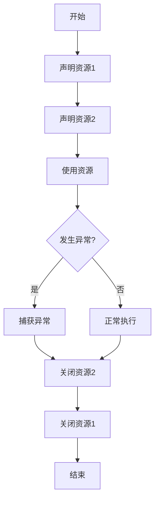

# Java Try-with-resources

## 什么是Try-with-resources？

Try-with-resources是Java 7引入的一个异常处理机制，它简化了资源管理代码。在使用需要手动关闭的资源（如文件、数据库连接、网络连接等）时，它提供了一种自动释放资源的方式，无论程序是正常结束还是发生异常。

:::tip 核心要点
Try-with-resources可以自动关闭实现了`java.lang.AutoCloseable`或`java.io.Closeable`接口的资源，减少了程序员手动管理资源的负担。
:::

## 为什么需要Try-with-resources？

在Java 7之前，我们通常这样管理资源：

```java
FileInputStream fileInputStream = null;
try {
    fileInputStream = new FileInputStream("example.txt");
    // 使用文件流进行操作
} catch (IOException e) {
    e.printStackTrace();
} finally {
    // 手动关闭资源
    if (fileInputStream != null) {
        try {
            fileInputStream.close();
        } catch (IOException e) {
            e.printStackTrace();
        }
    }
}
```

这种方式有几个问题：
1. 代码冗长且容易出错
2. 可能会忘记关闭资源
3. 如果关闭资源时发生异常，需要额外处理

## Try-with-resources的基本语法

```java
try (Resource resource = new Resource()) {
    // 使用资源的代码
} catch (Exception e) {
    // 异常处理
}
```

在`try`关键字后的括号中创建和初始化资源，资源会在`try`块结束时自动关闭。可以在括号中声明多个资源，用分号分隔。

## 使用Try-with-resources的简单示例

让我们看一个读取文件内容的例子：

```java
try (FileReader reader = new FileReader("example.txt");
     BufferedReader bufferedReader = new BufferedReader(reader)) {
    String line;
    while ((line = bufferedReader.readLine()) != null) {
        System.out.println(line);
    }
} catch (IOException e) {
    System.out.println("文件读取出错: " + e.getMessage());
}
```

**输出**：
```
文件的第一行内容
文件的第二行内容
...
```

无需在`finally`块中显式关闭`reader`和`bufferedReader`，Java会自动处理。

## 多个资源的管理

Try-with-resources允许同时管理多个资源：

```java
try (FileInputStream input = new FileInputStream("sourceFile.txt");
     FileOutputStream output = new FileOutputStream("targetFile.txt")) {
    // 从input读取并写入output
    byte[] buffer = new byte[1024];
    int bytesRead;
    while ((bytesRead = input.read(buffer)) != -1) {
        output.write(buffer, 0, bytesRead);
    }
} catch (IOException e) {
    e.printStackTrace();
}
```

在这个例子中，无论是正常执行还是发生异常，`input`和`output`都会自动关闭，并按照声明的**相反顺序**关闭（先关闭`output`，再关闭`input`）。

## 资源关闭的顺序

当多个资源被声明时，它们的关闭顺序与声明顺序相反。这是非常重要的，因为有些资源之间可能有依赖关系。



## 处理资源关闭时的异常

当资源关闭时发生异常，这些异常会被抑制（Suppressed），并添加到主异常中：

```java
try (AutoCloseableResource resource = new AutoCloseableResource()) {
    throw new Exception("try块中的异常");
} catch (Exception e) {
    System.out.println("捕获的主异常: " + e.getMessage());
    
    // 获取被抑制的异常
    Throwable[] suppressedExceptions = e.getSuppressed();
    for (Throwable exception : suppressedExceptions) {
        System.out.println("被抑制的异常: " + exception.getMessage());
    }
}
```

自定义实现`AutoCloseable`接口的类：

```java
class AutoCloseableResource implements AutoCloseable {
    @Override
    public void close() throws Exception {
        throw new Exception("关闭资源时的异常");
    }
}
```

**输出**：
```
捕获的主异常: try块中的异常
被抑制的异常: 关闭资源时的异常
```

## 自定义AutoCloseable资源

你可以创建自己的可自动关闭的资源，只需实现`AutoCloseable`或`Closeable`接口：

```java
public class MyResource implements AutoCloseable {
    private String name;
    
    public MyResource(String name) {
        this.name = name;
        System.out.println(name + " 资源已打开");
    }
    
    public void doSomething() {
        System.out.println("使用 " + name + " 资源");
    }
    
    @Override
    public void close() {
        System.out.println(name + " 资源已关闭");
    }
}
```

使用自定义资源：

```java
public static void main(String[] args) {
    try (MyResource resource1 = new MyResource("第一个");
         MyResource resource2 = new MyResource("第二个")) {
        
        resource1.doSomething();
        resource2.doSomething();
        
    } // 自动调用close()方法
    
    System.out.println("main方法结束");
}
```

**输出**：
```
第一个 资源已打开
第二个 资源已打开
使用 第一个 资源
使用 第二个 资源
第二个 资源已关闭
第一个 资源已关闭
main方法结束
```

## 实际应用场景

### 文件操作

```java
try (FileWriter writer = new FileWriter("output.txt")) {
    writer.write("Hello, Try-with-resources!");
} catch (IOException e) {
    e.printStackTrace();
}
```

### 数据库操作

```java
try (Connection conn = DriverManager.getConnection("jdbc:mysql://localhost:3306/mydb", "user", "password");
     PreparedStatement stmt = conn.prepareStatement("SELECT * FROM users WHERE id = ?")) {
    
    stmt.setInt(1, 1001);
    ResultSet rs = stmt.executeQuery();
    
    while (rs.next()) {
        System.out.println("User: " + rs.getString("name"));
    }
} catch (SQLException e) {
    e.printStackTrace();
}
```

### 网络连接

```java
try (Socket socket = new Socket("example.com", 80);
     PrintWriter out = new PrintWriter(socket.getOutputStream(), true);
     BufferedReader in = new BufferedReader(new InputStreamReader(socket.getInputStream()))) {
    
    out.println("GET / HTTP/1.1");
    out.println("Host: example.com");
    out.println();
    
    String response;
    while ((response = in.readLine()) != null) {
        System.out.println(response);
    }
} catch (IOException e) {
    e.printStackTrace();
}
```

## Java 9的增强

从Java 9开始，Try-with-resources语句得到了增强，允许在`try`语句中使用有效的`final`变量：

```java
// Java 9及以上版本
FileInputStream inputStream = new FileInputStream("file.txt");
try (inputStream) {  // 使用已声明的资源
    // 使用inputStream
} catch (IOException e) {
    e.printStackTrace();
}
```

:::caution 注意
要使用这种语法，变量必须是有效的`final`（即变量在初始化后没有被修改过）。
:::

## Try-with-resources vs. finally块

虽然`finally`块和Try-with-resources都可以用于资源清理，但Try-with-resources更加简洁和安全：

```java
// 使用finally块
FileInputStream fis = null;
try {
    fis = new FileInputStream("file.txt");
    // 使用fis
} catch (IOException e) {
    e.printStackTrace();
} finally {
    if (fis != null) {
        try {
            fis.close();
        } catch (IOException e) {
            e.printStackTrace();
        }
    }
}

// 使用Try-with-resources
try (FileInputStream fis = new FileInputStream("file.txt")) {
    // 使用fis
} catch (IOException e) {
    e.printStackTrace();
}
```

## 最佳实践

1. **优先使用Try-with-resources**：当处理需要关闭的资源时，总是首选Try-with-resources。
2. **合理分组资源**：将相关资源在一个Try-with-resources块中管理。
3. **注意资源声明顺序**：考虑资源之间的依赖关系，合理安排声明顺序。
4. **自定义资源实现AutoCloseable**：自定义类如需自动关闭功能，应实现AutoCloseable接口。

## 总结

Try-with-resources是Java 7引入的一项重要特性，它通过自动处理资源的关闭操作，简化了代码并减少了资源泄漏的风险。它特别适用于文件操作、数据库连接、网络通信等需要手动关闭资源的场景。

通过实现`AutoCloseable`或`Closeable`接口，你可以创建自己的可自动关闭资源。Java 9进一步增强了这一特性，使其更加灵活。

掌握Try-with-resources语句是编写健壮且简洁的Java代码的关键技能之一。

## 练习

1. 使用Try-with-resources创建一个程序，从一个文件读取内容，然后写入到另一个文件。
2. 创建一个自定义的资源类，实现`AutoCloseable`接口，并在Try-with-resources中使用它。
3. 编写一个程序，使用Try-with-resources连接数据库，执行查询，然后处理结果。
4. 比较使用Try-with-resources和传统的try-finally块在处理多个资源时的代码差异。

## 进一步阅读

- Java官方文档关于[Try-with-resources](https://docs.oracle.com/javase/tutorial/essential/exceptions/tryResourceClose.html)
- [AutoCloseable](https://docs.oracle.com/javase/8/docs/api/java/lang/AutoCloseable.html)接口文档
- [Closeable](https://docs.oracle.com/javase/8/docs/api/java/io/Closeable.html)接口文档