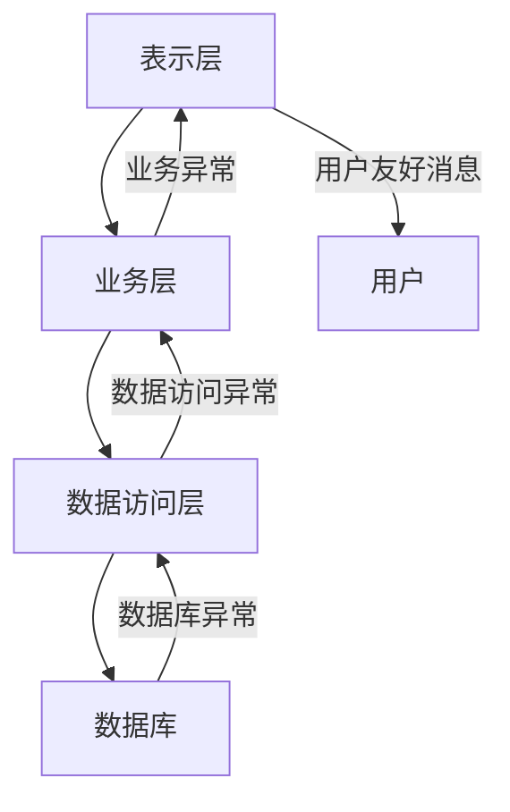

# Java 异常最佳实践

## 引言

在Java编程中，异常处理是确保程序稳定性和可靠性的关键环节。合理的异常处理机制不仅能帮助我们定位和修复错误，还能提升代码的可维护性和用户体验。本文将介绍Java异常处理的最佳实践，帮助初学者掌握如何编写健壮的异常处理代码。

## 为什么异常处理很重要？

异常处理对于Java程序至关重要，原因如下：

1. **防止程序崩溃**：妥善处理异常可以避免程序因意外情况而终止
2. **提高代码可靠性**：通过处理各种可能的错误情况，使程序更加稳定
3. **提升用户体验**：为用户提供有意义的错误信息，而非技术堆栈跟踪
4. **简化错误排查**：记录详细的异常信息，方便开发人员定位问题

## 异常处理的最佳实践

### 1. 只捕获你能处理的异常

一个常见的错误是捕获所有异常但不做任何处理。这种做法会掩盖真正的问题，导致难以排查Bug。

❌ **不推荐的做法**：

```java
try {
    // 一些可能抛出异常的代码
} catch (Exception e) {
    // 什么都不做，或者只是简单打印
    e.printStackTrace();
}
```

✅ **推荐的做法**：

```java
try {
    // 一些可能抛出异常的代码
} catch (FileNotFoundException e) {
    // 针对文件未找到异常的特定处理
    logger.error("配置文件未找到: " + e.getMessage());
    // 加载默认配置
    loadDefaultConfig();
} catch (IOException e) {
    // 针对IO异常的特定处理
    logger.error("读取配置文件时发生IO错误: " + e.getMessage());
    throw new ConfigurationException("无法加载配置", e);
}
```

### 2. 提供有意义的异常信息

当创建和抛出异常时，提供清晰、详细的错误消息非常重要。

❌ **不推荐的做法**：

```java
if (username == null) {
    throw new IllegalArgumentException();
}
```

✅ **推荐的做法**：

```java
if (username == null) {
    throw new IllegalArgumentException("用户名不能为空");
}
```

### 3. 使用自定义异常类

对于特定的业务场景，创建自定义异常可以更准确地表达错误的性质。

```java
// 自定义业务异常类
public class UserRegistrationException extends RuntimeException {
    public UserRegistrationException(String message) {
        super(message);
    }
    
    public UserRegistrationException(String message, Throwable cause) {
        super(message, cause);
    }
}

// 使用示例
public void registerUser(User user) {
    if (userRepository.existsByUsername(user.getUsername())) {
        throw new UserRegistrationException("用户名 '" + user.getUsername() + "' 已被注册");
    }
    // 继续注册流程
}
```

### 4. 合理使用受检异常和非受检异常

- **受检异常(Checked Exceptions)**：用于可恢复的条件，调用者预期并能够处理的情况
- **非受检异常(Unchecked Exceptions)**：通常用于编程错误，如空指针、参数无效等

:::tip
一般准则：如果调用者能够合理地恢复程序运行，使用受检异常；否则使用非受检异常。
:::

### 5. 不要吞掉异常

捕获异常后至少应当记录下来，否则会导致错误难以跟踪。

❌ **不推荐的做法**：

```java
try {
    openFile();
} catch (IOException e) {
    // 什么都不做，错误被"吞掉"
}
```

✅ **推荐的做法**：

```java
try {
    openFile();
} catch (IOException e) {
    logger.error("无法打开文件", e);
    // 根据需要进行恢复或重试
    throw new ServiceException("服务暂时不可用", e);
}
```

### 6. 合理使用finally块或try-with-resources

对于需要释放的资源，确保在`finally`块中关闭它们，或使用Java 7引入的`try-with-resources`语法。

❌ **不推荐的做法**：

```java
FileInputStream fis = null;
try {
    fis = new FileInputStream("file.txt");
    // 处理文件
} catch (IOException e) {
    logger.error("读取文件错误", e);
} 
// 没有关闭文件流，可能导致资源泄漏
```

✅ **推荐的做法(使用finally)**：

```java
FileInputStream fis = null;
try {
    fis = new FileInputStream("file.txt");
    // 处理文件
} catch (IOException e) {
    logger.error("读取文件错误", e);
} finally {
    if (fis != null) {
        try {
            fis.close();
        } catch (IOException e) {
            logger.error("关闭文件流错误", e);
        }
    }
}
```

✅ **推荐的做法(使用try-with-resources)**：

```java
try (FileInputStream fis = new FileInputStream("file.txt")) {
    // 处理文件
    // 文件流会自动关闭
} catch (IOException e) {
    logger.error("读取文件错误", e);
}
```

### 7. 包装异常保留根异常

当你需要转换异常类型时，请确保包含原始异常作为根因，这样可以保留完整的错误跟踪信息。

❌ **不推荐的做法**：

```java
try {
    // 数据库操作
} catch (SQLException e) {
    // 原始异常信息丢失
    throw new ServiceException("数据库操作失败");
}
```

✅ **推荐的做法**：

```java
try {
    // 数据库操作
} catch (SQLException e) {
    // 保留原始异常作为根因
    throw new ServiceException("数据库操作失败", e);
}
```

### 8. 在合适的层级处理异常

通常应该在能够适当处理异常的最低级别捕获异常，或者将其传递给上层能够处理的代码。



### 9. 不要在finally块中抛出异常

`finally`块中的异常会覆盖`try`或`catch`块中的异常，导致原始异常丢失。

❌ **不推荐的做法**：

```java
try {
    // 可能抛出异常的代码
    throw new SQLException("数据库错误");
} finally {
    // finally块中抛出的异常会覆盖try块中的异常
    throw new RuntimeException("资源清理错误");
}
```

✅ **推荐的做法**：

```java
try {
    // 可能抛出异常的代码
} finally {
    try {
        // 资源清理代码
    } catch (Exception e) {
        logger.error("资源清理错误", e);
        // 不重新抛出异常
    }
}
```

## 实际案例：文件处理系统

下面是一个文件处理系统的示例，展示了如何应用上述最佳实践：

```java
import java.io.*;
import java.util.logging.*;

public class FileProcessorDemo {
    
    private static final Logger logger = Logger.getLogger(FileProcessorDemo.class.getName());
    
    // 自定义异常类
    public static class FileProcessingException extends Exception {
        public FileProcessingException(String message) {
            super(message);
        }
        
        public FileProcessingException(String message, Throwable cause) {
            super(message, cause);
        }
    }
    
    public String readAndProcessFile(String filePath) throws FileProcessingException {
        // 检查参数合法性
        if (filePath == null || filePath.trim().isEmpty()) {
            throw new IllegalArgumentException("文件路径不能为空");
        }
        
        StringBuilder content = new StringBuilder();
        
        // 使用try-with-resources自动关闭资源
        try (BufferedReader reader = new BufferedReader(new FileReader(filePath))) {
            String line;
            while ((line = reader.readLine()) != null) {
                content.append(processLine(line)).append("\n");
            }
            return content.toString();
        } catch (FileNotFoundException e) {
            // 针对特定异常的处理
            logger.log(Level.WARNING, "文件未找到: " + filePath, e);
            throw new FileProcessingException("无法找到文件: " + filePath, e);
        } catch (IOException e) {
            // 包装异常并保留根因
            logger.log(Level.SEVERE, "读取文件时发生错误", e);
            throw new FileProcessingException("处理文件时发生错误: " + e.getMessage(), e);
        }
    }
    
    private String processLine(String line) {
        // 处理文件行的逻辑
        return line.toUpperCase();
    }
    
    public static void main(String[] args) {
        FileProcessorDemo processor = new FileProcessorDemo();
        try {
            String content = processor.readAndProcessFile("sample.txt");
            System.out.println("处理结果:");
            System.out.println(content);
        } catch (FileProcessingException e) {
            // 用户友好的错误消息
            System.err.println("无法处理文件: " + e.getMessage());
            // 在开发环境下，可能还需要记录详细错误
            logger.log(Level.SEVERE, "文件处理失败", e);
        } catch (IllegalArgumentException e) {
            System.err.println("参数错误: " + e.getMessage());
        }
    }
}
```

### 输入和输出

假设我们有一个`sample.txt`文件，内容如下：

```
Hello, world!
This is a test file.
Java exception handling is important.
```

**成功场景输出**：
```
处理结果:
HELLO, WORLD!
THIS IS A TEST FILE.
JAVA EXCEPTION HANDLING IS IMPORTANT.
```

**文件不存在的输出**：
```
无法处理文件: 无法找到文件: sample.txt
```

**参数错误的输出**：
```
参数错误: 文件路径不能为空
```

## 异常处理性能考虑

异常处理机制虽然强大，但也会带来一定的性能开销，主要表现在以下几个方面：

1. **创建异常对象的开销**：异常对象会捕获完整的堆栈跟踪，这需要花费时间
2. **异常堆栈跟踪的开销**：收集堆栈跟踪信息需要遍历整个调用堆栈
3. **JVM优化的影响**：异常会影响JVM的某些优化

因此，我们应该：

:::caution
不要将异常用于正常的控制流程。异常应当用于处理例外情况，而不是普通的业务逻辑。
:::

**示例**：

❌ **不推荐的做法**：

```java
public int findIndexInArray(int[] array, int value) {
    try {
        for (int i = 0; i < array.length; i++) {
            if (array[i] == value) {
                return i;
            }
        }
        throw new ElementNotFoundException();
    } catch (ElementNotFoundException e) {
        return -1; // 未找到元素时返回-1
    }
}
```

✅ **推荐的做法**：

```java
public int findIndexInArray(int[] array, int value) {
    for (int i = 0; i < array.length; i++) {
        if (array[i] == value) {
            return i;
        }
    }
    return -1; // 简单地返回-1表示未找到
}
```

## 总结

Java异常处理是一项重要的编程技能，可以帮助我们编写更健壮、更可靠的程序。通过遵循本文介绍的最佳实践，你可以：

1. 更有效地捕获和处理异常
2. 提供更清晰的错误信息
3. 确保资源正确释放
4. 避免常见的异常处理陷阱
5. 设计合理的异常处理架构

记住，好的异常处理不仅仅是捕获错误，还包括提供有意义的反馈、记录必要的信息以及确保程序在错误发生后能优雅地恢复或终止。

## 练习

为了巩固所学知识，试着完成以下练习：

1. 编写一个方法，读取用户输入的数字并计算其平方根，处理各种可能的异常（输入不是数字、负数等）
2. 为一个简单的银行账户系统设计异常类层次结构，包括余额不足、账户不存在、交易金额无效等异常
3. 修改现有代码，将普通的异常处理改为使用try-with-resources的方式
4. 为一个Web应用程序设计异常处理机制，包括如何在不同层次（数据访问层、服务层、控制器层）处理异常

## 扩展资源

- Java官方文档: [Exception Handling](https://docs.oracle.com/javase/tutorial/essential/exceptions/index.html)
- 《Effective Java》第3版 - 第10章：异常
- 《Clean Code》- 第7章：错误处理

通过正确应用这些最佳实践，你将能够编写出更健壮、更易于维护的Java程序。记住，良好的异常处理不仅仅是技术问题，也是提高软件质量和用户体验的重要环节。