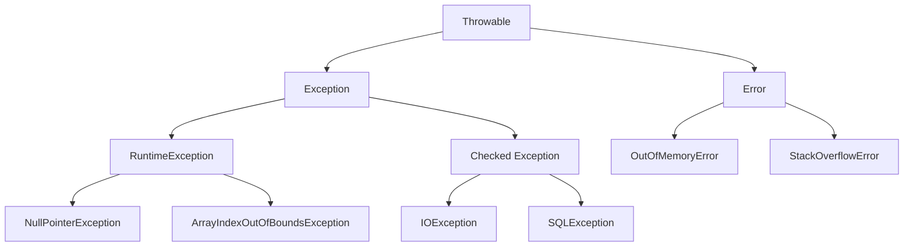

# Java 异常处理策略

## 引言

在Java编程中，异常处理是保证程序稳定性和健壮性的关键环节。合理的异常处理策略能够帮助程序在面对非预期情况时优雅地响应，而不是突然崩溃。本文将详细介绍Java中的异常处理策略，从基础概念到实际应用，帮助你建立系统化的异常处理思维。

## 什么是异常处理策略？

异常处理策略是指在软件开发过程中，针对可能出现的异常情况制定的一系列处理方案和原则。一个好的异常处理策略应该：

- 清晰区分正常流程和异常流程
- 提供有用的异常信息
- 合理处理不同类型的异常
- 避免资源泄漏
- 保持代码可读性和可维护性

## Java 异常分类回顾

在制定处理策略前，让我们回顾Java异常的分类：



- **Error**：严重问题，通常不需要程序处理
- **Checked Exception**：必须处理的异常
- **RuntimeException**：运行时异常，可以不显式处理

## 基本异常处理策略

### 1. try-catch-finally 基本策略

最基本的异常处理方式是使用try-catch-finally块：

```java
try {
    // 可能抛出异常的代码
    FileReader file = new FileReader("file.txt");
    // 处理文件...
} catch (FileNotFoundException e) {
    // 处理特定异常
    System.err.println("文件未找到: " + e.getMessage());
} catch (IOException e) {
    // 处理更一般的异常
    System.err.println("发生IO错误: " + e.getMessage());
} finally {
    // 无论是否发生异常都会执行的代码
    // 通常用于清理资源
    System.out.println("这部分代码总是会执行");
}
```

:::tip
按照从具体到一般的顺序捕获异常。错误的顺序可能导致某些catch块永远不会被执行。
:::

### 2. try-with-resources 策略

对于需要关闭的资源，推荐使用try-with-resources语句：

```java
try (FileReader reader = new FileReader("file.txt");
     BufferedReader bufferedReader = new BufferedReader(reader)) {
    // 使用资源
    String line = bufferedReader.readLine();
    System.out.println(line);
} catch (IOException e) {
    System.err.println("读取文件错误: " + e.getMessage());
}
// 资源会自动关闭，无需finally块
```

:::note
使用try-with-resources的前提是资源类必须实现AutoCloseable接口。这种方式可以有效避免资源泄漏问题。
:::

## 高级异常处理策略

### 1. 异常转译策略

将低层异常转换为对客户端更有意义的高层异常：

```java
public void readUserData(String userId) throws UserDataException {
    try {
        // 尝试读取用户数据
        File file = new File("user_" + userId + ".txt");
        FileReader reader = new FileReader(file);
        // 处理文件...
    } catch (FileNotFoundException e) {
        // 转译为业务相关的异常
        throw new UserDataException("用户数据不存在: " + userId, e);
    } catch (IOException e) {
        throw new UserDataException("读取用户数据时出错", e);
    }
}
```

:::caution
异常转译时，记得使用异常链（通过传递原始异常作为cause）保留原始异常信息，这对于调试非常重要。
:::

### 2. 异常分级处理策略

根据异常的严重程度采取不同的处理方式：

```java
try {
    // 可能抛出异常的业务逻辑
    processBusinessLogic();
} catch (CriticalException e) {
    // 严重异常：记录日志、通知管理员、可能终止程序
    logger.severe("发生严重错误: " + e.getMessage());
    notifyAdministrator(e);
    System.exit(1);
} catch (WarningException e) {
    // 警告级异常：记录日志，但程序可以继续
    logger.warning("警告: " + e.getMessage());
} catch (Exception e) {
    // 一般异常：记录并继续
    logger.info("发生异常: " + e.getMessage());
}
```

### 3. 自定义异常策略

为应用创建自定义异常层次结构：

```java
// 基础应用异常
public class ApplicationException extends Exception {
    public ApplicationException(String message) {
        super(message);
    }
    
    public ApplicationException(String message, Throwable cause) {
        super(message, cause);
    }
}

// 数据访问异常
public class DataAccessException extends ApplicationException {
    public DataAccessException(String message) {
        super(message);
    }
    
    public DataAccessException(String message, Throwable cause) {
        super(message, cause);
    }
}

// 业务逻辑异常
public class BusinessException extends ApplicationException {
    public BusinessException(String message) {
        super(message);
    }
    
    public BusinessException(String message, Throwable cause) {
        super(message, cause);
    }
}
```

使用示例：

```java
public void processOrder(Order order) throws BusinessException {
    try {
        validateOrder(order);
        saveOrder(order);
        notifyCustomer(order);
    } catch (ValidationException e) {
        throw new BusinessException("订单验证失败", e);
    } catch (DataAccessException e) {
        throw new BusinessException("订单保存失败", e);
    } catch (NotificationException e) {
        // 记录日志但不阻止订单处理
        logger.warning("客户通知失败，但订单已处理: " + e.getMessage());
    }
}
```

## 实用异常处理原则

### 1. 只捕获能处理的异常

不要捕获你无法恰当处理的异常。如果不确定如何处理，最好让它传播到能处理它的地方。

```java
// 不好的做法
try {
    // 一些代码
} catch (Exception e) {
    // 空catch块或只是打印堆栈
    e.printStackTrace();
}

// 好的做法
try {
    // 一些代码
} catch (SpecificException e) {
    // 有针对性地处理此异常
    recoverFromSpecificProblem();
}
```

### 2. 早失败策略

尽早验证参数和状态，在问题发生的地方抛出异常：

```java
public void processData(String data) {
    // 早失败：参数验证
    if (data == null) {
        throw new IllegalArgumentException("数据不能为null");
    }
    
    if (data.isEmpty()) {
        throw new IllegalArgumentException("数据不能为空");
    }
    
    // 处理有效数据...
}
```

### 3. 记录详细的异常信息

确保异常消息包含足够信息，帮助排查问题：

```java
try {
    int result = 10 / denominator;
} catch (ArithmeticException e) {
    // 不好的做法
    logger.error("计算错误");
    
    // 好的做法
    logger.error("除法运算错误，分母为: " + denominator, e);
}
```

## 实际应用案例

### 案例1：文件处理系统

下面是一个处理文件上传的服务，展示了综合异常处理策略：

```java
public class FileUploadService {
    private static final Logger logger = Logger.getLogger(FileUploadService.class.getName());
    
    public FileInfo uploadFile(InputStream fileStream, String fileName) throws FileUploadException {
        File tempFile = null;
        
        try {
            // 验证输入
            if (fileStream == null) {
                throw new IllegalArgumentException("文件流不能为null");
            }
            
            if (fileName == null || fileName.trim().isEmpty()) {
                throw new IllegalArgumentException("文件名不能为空");
            }
            
            // 创建临时文件
            tempFile = createTempFile(fileName);
            
            // 将上传内容写入临时文件
            writeToFile(fileStream, tempFile);
            
            // 病毒扫描
            scanForViruses(tempFile);
            
            // 保存到最终位置
            File finalFile = moveToFinalLocation(tempFile);
            
            // 记录元数据
            return recordFileMetadata(finalFile, fileName);
            
        } catch (IOException e) {
            logger.severe("文件IO错误: " + e.getMessage());
            throw new FileUploadException("上传过程中发生IO错误", e);
        } catch (VirusDetectedException e) {
            logger.warning("检测到病毒: " + e.getMessage());
            throw new FileUploadException("文件包含病毒", e);
        } catch (Exception e) {
            logger.severe("上传过程中发生未预期错误: " + e.getMessage());
            throw new FileUploadException("文件上传失败", e);
        } finally {
            // 清理临时文件
            if (tempFile != null && tempFile.exists()) {
                try {
                    tempFile.delete();
                } catch (Exception e) {
                    logger.warning("无法删除临时文件: " + tempFile.getPath());
                }
            }
            
            // 关闭输入流
            try {
                if (fileStream != null) {
                    fileStream.close();
                }
            } catch (IOException e) {
                logger.warning("关闭文件流失败: " + e.getMessage());
            }
        }
    }
    
    // 其他辅助方法...
}
```

### 案例2：多层应用中的异常处理

这是一个电子商务应用中订单处理的例子：

```java
// 控制器层（最外层）
@RestController
public class OrderController {
    
    private OrderService orderService;
    
    @PostMapping("/orders")
    public ResponseEntity<OrderResponse> createOrder(@RequestBody OrderRequest request) {
        try {
            Order order = orderService.createOrder(request);
            return ResponseEntity.ok(new OrderResponse(order));
        } catch (ValidationException e) {
            // 处理验证错误，返回400错误
            return ResponseEntity.badRequest()
                .body(new OrderResponse(e.getMessage()));
        } catch (OutOfStockException e) {
            // 处理库存不足，返回409冲突
            return ResponseEntity.status(HttpStatus.CONFLICT)
                .body(new OrderResponse("商品库存不足：" + e.getMessage()));
        } catch (PaymentException e) {
            // 处理支付错误，返回400错误
            return ResponseEntity.badRequest()
                .body(new OrderResponse("支付处理失败：" + e.getMessage()));
        } catch (Exception e) {
            // 处理未预期的错误，返回500错误
            logger.severe("创建订单时发生错误: " + e.getMessage(), e);
            return ResponseEntity.status(HttpStatus.INTERNAL_SERVER_ERROR)
                .body(new OrderResponse("服务器处理订单时出错"));
        }
    }
}

// 服务层
@Service
public class OrderServiceImpl implements OrderService {
    
    private ProductRepository productRepo;
    private PaymentService paymentService;
    private OrderRepository orderRepo;
    
    @Override
    @Transactional
    public Order createOrder(OrderRequest request) throws ValidationException, 
                                                      OutOfStockException,
                                                      PaymentException {
        try {
            // 验证请求
            validateOrderRequest(request);
            
            // 检查库存
            checkStock(request.getItems());
            
            // 创建订单记录
            Order order = createOrderRecord(request);
            
            // 处理支付
            try {
                processPayment(order, request.getPaymentDetails());
            } catch (PaymentException e) {
                // 支付失败，标记订单状态
                order.setStatus(OrderStatus.PAYMENT_FAILED);
                orderRepo.save(order);
                throw e;
            }
            
            // 减少库存
            updateInventory(request.getItems());
            
            // 设置订单已完成
            order.setStatus(OrderStatus.COMPLETED);
            return orderRepo.save(order);
            
        } catch (DataAccessException e) {
            // 转译数据访问异常
            throw new ServiceException("订单处理过程中数据访问错误", e);
        }
    }
    
    // 其他辅助方法...
}
```

## 异常处理最佳实践总结

1. **使用异常层次结构**：创建针对应用领域的异常类层次结构。
2. **区分受检异常和非受检异常**：
   - 使用受检异常表示可恢复的情况
   - 使用非受检异常表示编程错误或不可恢复的情况
3. **保留异常堆栈**：在重新抛出异常时，一定要包含原始异常作为cause。
4. **关闭资源**：优先使用try-with-resources语句自动关闭资源。
5. **避免过度捕获**：不要捕获你处理不了的异常。
6. **提供有意义的异常消息**：包含足够的上下文信息。
7. **集中处理**：在应用的顶层实现统一的异常处理机制。
8. **适当记录日志**：记录异常但避免重复记录。
9. **测试异常情况**：编写测试用例验证异常处理逻辑。
10. **文档化异常**：使用Javadoc的@throws标签记录方法可能抛出的异常。

## 练习题

1. 编写一个程序，使用try-with-resources读取文件内容并计算文件中数字的总和。
2. 设计一个异常层次结构，用于处理银行系统中的不同错误情况（如账户不存在、余额不足等）。
3. 修改下列代码，使其符合最佳异常处理实践：

```java
public void processData(String fileName) {
    try {
        FileReader fr = new FileReader(fileName);
        BufferedReader br = new BufferedReader(fr);
        String line;
        while ((line = br.readLine()) != null) {
            processLine(line);
        }
    } catch (Exception e) {
        e.printStackTrace();
    }
}
```

## 附加资源

1. Java官方文档：[Java异常处理](https://docs.oracle.com/javase/tutorial/essential/exceptions/)
2. 《Effective Java》第10章：异常
3. 《Clean Code》中关于异常处理的章节
4. 《Java核心技术》卷I中的异常处理章节

---

掌握良好的异常处理策略是成为一名专业Java开发者的必备技能。通过合理规划和实施异常处理策略，你可以显著提高代码的可靠性、可读性和可维护性。记住，好的异常处理不仅仅是捕获错误，更是提供清晰的错误信息和恢复机制，为用户提供更好的体验。