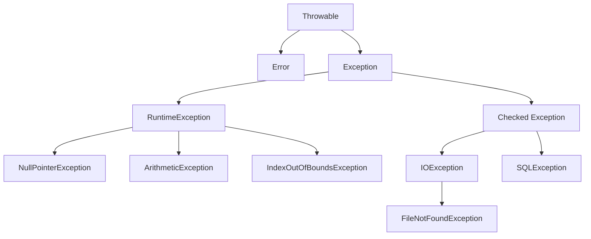

# Java Try Catch

## 什么是异常处理？

在Java程序执行过程中，各种异常情况可能会发生：文件找不到、网络连接中断、除以零等。如果不加处理，这些异常会导致程序崩溃。Java的异常处理机制允许我们优雅地处理这些问题，保证程序的健壮性。

`try-catch`是Java异常处理的核心机制，它允许我们：
- 尝试执行可能出错的代码
- 捕获可能发生的异常
- 采取适当的措施而不是让程序崩溃

## Try-Catch基本语法

```java
try {
    // 可能产生异常的代码
} catch (ExceptionType exceptionVariable) {
    // 处理特定类型异常的代码
}
```

### 基本示例

```java
public class DivisionExample {
    public static void main(String[] args) {
        try {
            // 尝试执行可能出错的代码
            int result = 10 / 0;  // 会抛出ArithmeticException
            System.out.println("结果是: " + result);  // 这行不会执行
        } catch (ArithmeticException e) {
            // 捕获并处理异常
            System.out.println("发生算术异常: " + e.getMessage());
        }
        
        // 程序继续执行
        System.out.println("程序正常结束");
    }
}
```

**输出：**
```
发生算术异常: / by zero
程序正常结束
```

:::note
如果没有try-catch，程序会在除以零的地方立即终止，不会输出"程序正常结束"。
:::

## Try-Catch-Finally结构

`finally`块用于包含无论异常是否发生都需要执行的代码，通常用于资源清理。

```java
try {
    // 可能产生异常的代码
} catch (ExceptionType e) {
    // 处理异常
} finally {
    // 无论是否发生异常都会执行的代码
}
```

### 示例：文件操作中的资源释放

```java
import java.io.*;

public class FileReadExample {
    public static void main(String[] args) {
        BufferedReader reader = null;
        try {
            reader = new BufferedReader(new FileReader("example.txt"));
            String firstLine = reader.readLine();
            System.out.println("文件第一行: " + firstLine);
        } catch (FileNotFoundException e) {
            System.out.println("找不到文件: " + e.getMessage());
        } catch (IOException e) {
            System.out.println("读取文件出错: " + e.getMessage());
        } finally {
            // 确保关闭文件，释放资源
            try {
                if (reader != null) {
                    reader.close();
                    System.out.println("文件已关闭");
                }
            } catch (IOException e) {
                System.out.println("关闭文件时出错");
            }
        }
    }
}
```

:::tip
从Java 7开始，可以使用try-with-resources语句自动管理资源，避免显式编写finally块进行资源释放。
:::

## 多重异常捕获

一个try块后面可以跟多个catch块，用于捕获不同类型的异常：

```java
try {
    // 可能产生多种异常的代码
} catch (ExceptionType1 e) {
    // 处理ExceptionType1
} catch (ExceptionType2 e) {
    // 处理ExceptionType2
} catch (ExceptionType3 e) {
    // 处理ExceptionType3
}
```

### 异常捕获顺序

捕获异常的顺序非常重要。因为Java会按照catch块的顺序尝试匹配异常，一旦找到匹配的异常类型，就不会继续检查后面的catch块。

```java
import java.io.*;

public class MultipleExceptionExample {
    public static void main(String[] args) {
        try {
            // 可能产生不同类型异常的代码
            File file = new File("nonexistent.txt");
            FileInputStream fis = new FileInputStream(file);
            int data = 10 / 0;  // 这行不会执行，因为上面已经抛出异常
        } catch (FileNotFoundException e) {
            System.out.println("文件不存在异常: " + e.getMessage());
        } catch (ArithmeticException e) {
            System.out.println("算术异常: " + e.getMessage());
        } catch (IOException e) {
            System.out.println("IO异常: " + e.getMessage());
        } catch (Exception e) {
            System.out.println("其他异常: " + e.getMessage());
        }
    }
}
```

**输出：**
```
文件不存在异常: nonexistent.txt (系统找不到指定的文件。)
```

:::caution
子类异常应该放在父类异常之前。例如，FileNotFoundException是IOException的子类，所以应该先捕获FileNotFoundException，再捕获IOException。
:::

## Java 7的多异常捕获

从Java 7开始，可以在一个catch块中捕获多种类型的异常：

```java
try {
    // 可能产生多种异常的代码
} catch (ExceptionType1 | ExceptionType2 | ExceptionType3 e) {
    // 处理多种类型的异常
}
```

### 示例

```java
import java.io.*;

public class MultiCatchExample {
    public static void main(String[] args) {
        try {
            // 可能产生不同类型异常的代码
            File file = new File("test.txt");
            FileInputStream fis = new FileInputStream(file);
            int result = 10 / 0;
        } catch (FileNotFoundException | ArithmeticException e) {
            System.out.println("捕获到文件不存在或算术异常: " + e.getMessage());
        } catch (IOException e) {
            System.out.println("IO异常: " + e.getMessage());
        }
    }
}
```

## Try-With-Resources (自动资源管理)

Java 7引入的`try-with-resources`语句可以自动关闭实现了`AutoCloseable`接口的资源。

```java
try (Resource resource = new Resource()) {
    // 使用资源
} catch (Exception e) {
    // 处理异常
}
```

### 示例：使用try-with-resources读取文件

```java
import java.io.*;

public class TryWithResourcesExample {
    public static void main(String[] args) {
        // 使用try-with-resources自动关闭BufferedReader
        try (BufferedReader reader = new BufferedReader(new FileReader("example.txt"))) {
            String firstLine = reader.readLine();
            System.out.println("文件第一行: " + firstLine);
        } catch (FileNotFoundException e) {
            System.out.println("找不到文件: " + e.getMessage());
        } catch (IOException e) {
            System.out.println("读取文件出错: " + e.getMessage());
        }
        // 不需要finally块来关闭reader
    }
}
```

:::tip
使用try-with-resources可以减少代码量并保证资源被正确关闭，甚至在异常发生时也能正确释放资源。
:::

## 异常的类型

Java中的异常分为三种主要类型：
1. **检查型异常(Checked Exception)**: 必须在代码中显式处理的异常，如IOException
2. **运行时异常(Runtime Exception)**: 不需要显式处理的异常，如NullPointerException
3. **错误(Error)**: 系统级的问题，通常无法恢复，如OutOfMemoryError

在编写try-catch时，我们主要关注前两种。



## 实际应用案例

### 案例1：用户输入验证

```java
import java.util.Scanner;

public class UserInputValidation {
    public static void main(String[] args) {
        Scanner scanner = new Scanner(System.in);
        
        System.out.println("请输入您的年龄:");
        
        try {
            String input = scanner.nextLine();
            int age = Integer.parseInt(input);
            
            if (age < 0 || age > 120) {
                throw new IllegalArgumentException("年龄必须在0到120之间");
            }
            
            System.out.println("您的年龄是: " + age);
        } catch (NumberFormatException e) {
            System.out.println("输入格式错误，请输入一个有效的数字");
        } catch (IllegalArgumentException e) {
            System.out.println(e.getMessage());
        } finally {
            scanner.close();
        }
        
        System.out.println("程序结束");
    }
}
```

**输入示例1:**
```
二十五
```

**输出1:**
```
请输入您的年龄:
输入格式错误，请输入一个有效的数字
程序结束
```

**输入示例2:**
```
150
```

**输出2:**
```
请输入您的年龄:
年龄必须在0到120之间
程序结束
```

### 案例2：数据库连接处理

```java
import java.sql.*;

public class DatabaseConnectionExample {
    public static void main(String[] args) {
        Connection conn = null;
        Statement stmt = null;
        ResultSet rs = null;
        
        try {
            // 注册JDBC驱动
            Class.forName("com.mysql.jdbc.Driver");
            
            // 建立连接
            String url = "jdbc:mysql://localhost:3306/testdb";
            conn = DriverManager.getConnection(url, "username", "password");
            
            // 创建Statement对象
            stmt = conn.createStatement();
            String sql = "SELECT id, name, age FROM employees";
            
            // 执行查询
            rs = stmt.executeQuery(sql);
            
            // 处理结果集
            while(rs.next()) {
                int id = rs.getInt("id");
                String name = rs.getString("name");
                int age = rs.getInt("age");
                
                System.out.println("ID: " + id + ", 姓名: " + name + ", 年龄: " + age);
            }
        } catch (ClassNotFoundException e) {
            System.out.println("找不到JDBC驱动: " + e.getMessage());
        } catch (SQLException e) {
            System.out.println("数据库操作异常: " + e.getMessage());
        } finally {
            // 关闭资源
            try {
                if (rs != null) rs.close();
                if (stmt != null) stmt.close();
                if (conn != null) conn.close();
            } catch (SQLException e) {
                System.out.println("关闭资源出错: " + e.getMessage());
            }
        }
    }
}
```

:::note
上面的代码在Java 7以上版本可以使用try-with-resources重写，代码会更加简洁。
:::

## Try-Catch的最佳实践

1. **只捕获能处理的异常**：不要简单地捕获所有异常而不做处理。

2. **不要忽略异常**：避免空catch块。至少记录异常信息。
   ```java
   try {
       // 代码
   } catch (Exception e) {
       // 不要这样做
   }
   ```

3. **保持异常的原始信息**：如果需要抛出新异常，请包装原始异常。
   ```java
   try {
       // 代码
   } catch (IOException e) {
       throw new CustomException("处理文件时出错", e);
   }
   ```

4. **使用具体的异常类型**：尽量捕获具体的异常类型，而不是笼统的Exception。

5. **使用try-with-resources**：处理需要关闭的资源时，优先使用try-with-resources语法。

6. **记录足够的上下文**：异常处理时，提供足够的上下文信息以便调试。

## 总结

Java的try-catch异常处理机制是构建健壮程序的基础。它允许我们：

- 捕获并处理异常，防止程序崩溃
- 分开正常逻辑代码和错误处理代码
- 优雅地管理资源释放

通过正确使用try、catch、finally和try-with-resources语句，可以编写出更加稳定和可维护的Java程序。

随着Java版本的更新，异常处理也变得越来越简洁和强大，比如Java 7引入的多异常捕获和try-with-resources语法大大简化了代码结构。

## 练习

1. 编写一个程序，要求用户输入一个数字并计算其平方根，处理可能的输入错误和负数情况。

2. 修改以下代码，使用try-with-resources语法重写：
   ```java
   FileReader fr = null;
   BufferedReader br = null;
   try {
       fr = new FileReader("example.txt");
       br = new BufferedReader(fr);
       String line;
       while ((line = br.readLine()) != null) {
           System.out.println(line);
       }
   } catch (IOException e) {
       e.printStackTrace();
   } finally {
       try {
           if (br != null) br.close();
           if (fr != null) fr.close();
       } catch (IOException e) {
           e.printStackTrace();
       }
   }
   ```

3. 编写一个方法，该方法将一个字符串转换为整数，并返回转换后的值。如果字符串不能转换为整数，返回-1。使用try-catch处理异常。

## 其他资源

- [Oracle官方Java异常处理教程](https://docs.oracle.com/javase/tutorial/essential/exceptions/)
- [Java 9 增强的try-with-resources](https://docs.oracle.com/javase/9/docs/api/java/lang/AutoCloseable.html)
- [Java异常层次结构](https://docs.oracle.com/javase/8/docs/api/java/lang/Exception.html)