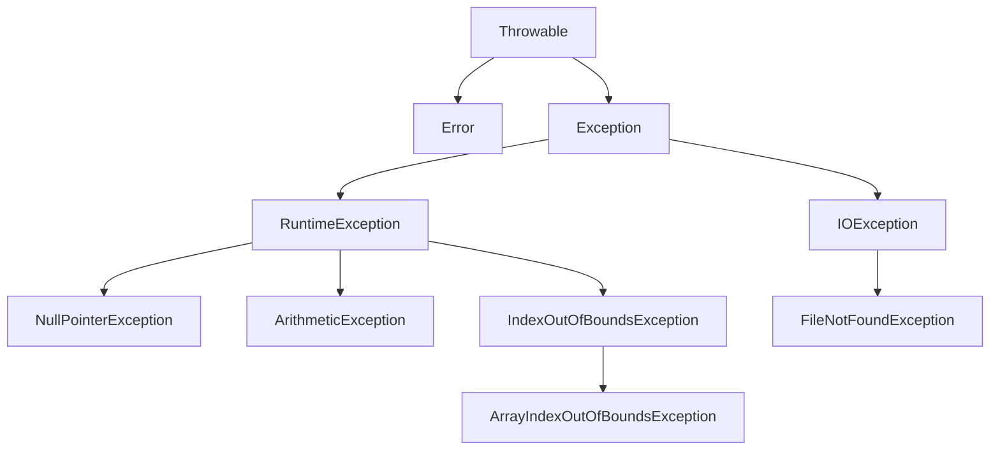

# Java 多重Catch

## 什么是多重Catch？

在Java编程中，异常处理是确保程序稳定性和健壮性的关键部分。当我们编写可能抛出多种不同异常的代码时，我们通常需要针对每种异常类型提供不同的处理方式。这就是多重catch块的用武之地。

多重catch允许我们在单个try块后面跟随多个catch块，每个catch块处理不同类型的异常。这样，我们可以根据出现的异常类型执行相应的错误处理代码。

## 多重Catch的基本语法

```java
try {
    // 可能抛出异常的代码
} catch (ExceptionType1 e1) {
    // 处理ExceptionType1类型的异常
} catch (ExceptionType2 e2) {
    // 处理ExceptionType2类型的异常
} catch (ExceptionType3 e3) {
    // 处理ExceptionType3类型的异常
} finally {
    // 无论是否发生异常都会执行的代码
}
```

## 多重Catch的工作原理

当try块中的代码抛出异常时，Java运行时系统会按照catch块的顺序，从上到下查找匹配的异常处理器。一旦找到能够处理该异常类型的catch块，执行该块中的代码，然后跳过其余的catch块。

:::tip
catch块的顺序很重要！子类异常必须在父类异常之前捕获，否则编译器会报错。
:::

## 示例：基本多重Catch

让我们看一个简单的例子，展示如何使用多重catch块处理不同类型的异常：

```java
public class MultiCatchExample {
    public static void main(String[] args) {
        try {
            int[] numbers = {1, 2, 3};
            System.out.println(numbers[5]); // 数组索引越界
            
            int result = 10 / 0; // 除以零
            
            String str = null;
            System.out.println(str.length()); // 空指针异常
            
        } catch (ArrayIndexOutOfBoundsException e) {
            System.out.println("数组索引越界: " + e.getMessage());
        } catch (ArithmeticException e) {
            System.out.println("算术异常: " + e.getMessage());
        } catch (NullPointerException e) {
            System.out.println("空指针异常: " + e.getMessage());
        } catch (Exception e) {
            System.out.println("其他异常: " + e.getMessage());
        }
        
        System.out.println("程序继续执行...");
    }
}
```

**执行结果：**
```
数组索引越界: Index 5 out of bounds for length 3
程序继续执行...
```

在上面的例子中，程序首先尝试访问数组的第6个元素（索引为5），这会抛出`ArrayIndexOutOfBoundsException`。由于这是第一个匹配的异常处理器，程序会执行该catch块，然后跳过其他catch块。

## 异常的继承层次与多重Catch

在Java中，所有异常类都是`Throwable`类的子类，`Exception`类又是大多数异常的父类。了解异常的继承层次对于正确使用多重catch至关重要。



当使用多重catch块时，必须按照从具体到一般的顺序排列异常类型。这是因为Java会使用第一个匹配的catch块来处理异常。如果将父类异常放在前面，那么子类异常将永远不会被单独处理。

:::caution
以下代码会导致编译错误，因为`Exception`会捕获所有`RuntimeException`，导致后面的catch块永远不会被执行：

```java
try {
    // 可能抛出异常的代码
} catch (Exception e) { // 父类异常
    // 处理所有异常
} catch (NullPointerException e) { // 子类异常 - 编译错误
    // 处理NullPointerException
}
```
:::

## Java 7中的多重捕获语法

从Java 7开始，我们可以在单个catch块中捕获多种异常类型，这简化了代码并减少了重复。

```java
try {
    // 可能抛出异常的代码
} catch (IOException | SQLException e) {
    // 处理IOException或SQLException
} catch (Exception e) {
    // 处理其他所有异常
}
```

### 多重捕获的限制

当使用多重捕获语法时，请注意以下限制：

1. 异常类型之间不能有继承关系
2. 在多重捕获的catch块中，异常参数`e`是隐式final的

## 实际案例：文件处理中的多重异常处理

以下是一个读取文件内容的实际案例，展示了如何处理不同类型的异常：

```java
import java.io.*;

public class FileReaderExample {
    public static void main(String[] args) {
        BufferedReader reader = null;
        
        try {
            reader = new BufferedReader(new FileReader("data.txt"));
            String line;
            int lineNumber = 1;
            
            while ((line = reader.readLine()) != null) {
                // 尝试将每一行解析为整数并计算其平方
                int number = Integer.parseInt(line);
                System.out.println("Line " + lineNumber + ": " + number + "² = " + (number * number));
                lineNumber++;
            }
            
        } catch (FileNotFoundException e) {
            System.err.println("错误：找不到文件！");
            System.err.println("详细信息：" + e.getMessage());
        } catch (IOException e) {
            System.err.println("错误：读取文件时出现IO异常！");
            System.err.println("详细信息：" + e.getMessage());
        } catch (NumberFormatException e) {
            System.err.println("错误：文件包含无效的数字格式！");
            System.err.println("详细信息：" + e.getMessage());
        } catch (Exception e) {
            System.err.println("发生未预期的异常：");
            e.printStackTrace();
        } finally {
            try {
                if (reader != null) {
                    reader.close();
                }
            } catch (IOException e) {
                System.err.println("关闭文件时出错：" + e.getMessage());
            }
        }
        
        System.out.println("程序执行完毕。");
    }
}
```

在这个例子中，我们使用多重catch块处理了四种可能的异常情况：
1. `FileNotFoundException`：文件不存在时抛出
2. `IOException`：读取文件过程中发生I/O错误时抛出
3. `NumberFormatException`：尝试将非数字字符串解析为整数时抛出
4. `Exception`：捕获所有其他未预期的异常

## 使用try-with-resources简化代码

从Java 7开始，我们可以使用try-with-resources语句自动关闭资源，这样就不需要显式的finally块来关闭资源了。

```java
import java.io.*;

public class TryWithResourcesExample {
    public static void main(String[] args) {
        try (BufferedReader reader = new BufferedReader(new FileReader("data.txt"))) {
            String line;
            while ((line = reader.readLine()) != null) {
                System.out.println(line);
            }
        } catch (FileNotFoundException e) {
            System.err.println("文件不存在：" + e.getMessage());
        } catch (IOException e) {
            System.err.println("读取文件时出错：" + e.getMessage());
        }
        
        System.out.println("程序执行完毕。");
    }
}
```

使用try-with-resources，资源会在try块结束时自动关闭，即使发生异常也是如此。

## 多重Catch的最佳实践

1. **从具体到一般排序catch块**：始终将更具体的异常类型（子类）放在更一般的异常类型（父类）之前。

2. **避免空catch块**：不要使用空的catch块，这会隐藏问题而不是解决问题。至少记录异常信息。

3. **只捕获你能处理的异常**：不要盲目捕获所有异常，只捕获那些你知道如何处理的特定异常。

4. **使用多重捕获简化代码**：当多个异常需要相同的处理逻辑时，使用Java 7的多重捕获语法。

5. **优先使用try-with-resources**：处理需要关闭的资源时，优先使用try-with-resources语法。

## 总结

多重catch是Java异常处理机制中的重要工具，它允许我们针对不同类型的异常提供不同的处理逻辑。通过正确使用多重catch，我们可以：

- 提高代码的健壮性，使程序能够优雅地处理各种错误情况
- 提供更精确的错误信息和恢复策略
- 确保资源正确释放，防止资源泄漏
- 编写更干净、更可维护的代码

掌握多重catch的使用将帮助你编写更健壮、更可靠的Java应用程序。

## 练习

1. 编写一个程序，使用多重catch块处理除以零、数组索引越界和空指针三种异常。

2. 修改上面的程序，使用Java 7的多重捕获语法简化代码。

3. 编写一个使用try-with-resources和多重catch的文件读取程序，处理可能发生的各种异常。

:::note
本文介绍的是基本的多重catch机制。在实际开发中，你可能还需要了解更高级的异常处理技术，如自定义异常、异常链和异常重抛等。
:::