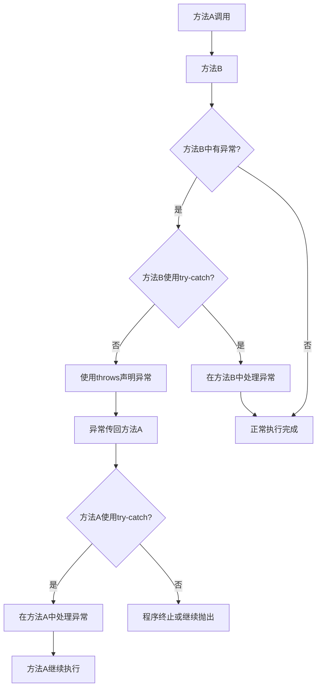

# Java Throws关键字

在Java异常处理体系中，`throws`关键字是一个不可或缺的组成部分。它允许我们声明一个方法可能抛出的异常，从而将异常处理的责任转移到调用该方法的代码中。本文将详细介绍`throws`关键字的用法、语法和最佳实践。

## 什么是throws关键字？

`throws`关键字用于方法声明中，指明该方法可能抛出但不会自行处理的异常类型。当一个方法可能抛出检查性异常（Checked Exception）时，我们必须要么在方法内部使用`try-catch`块处理这些异常，要么使用`throws`关键字将异常传递给调用者处理。

### throws的基本语法

```java
访问修饰符 返回类型 方法名(参数列表) throws 异常类型1, 异常类型2, ... {
    // 方法体
}
```

## throws关键字的作用

1. **声明方法可能抛出的异常**：明确告诉方法的调用者，调用此方法时需要处理或继续传递特定的异常
2. **免除在方法内处理异常的责任**：允许方法将异常处理的责任向上传递
3. **提高代码的可读性**：通过方法签名就能看出可能出现的异常情况

## throws与throw的区别

初学者经常混淆`throws`和`throw`关键字：

- `throws`用在方法声明中，表明该方法可能抛出的异常
- `throw`用在方法内部，用于实际抛出一个异常对象

```java
public void method1() throws IOException {
    // 可能会抛出IOException，但在此方法中不处理
    FileReader file = new FileReader("file.txt");
}

public void method2() {
    // 使用throw主动抛出异常
    throw new NullPointerException("自定义异常消息");
}
```

## 使用throws关键字的情景

### 情景一：处理检查性异常

当方法中使用可能抛出检查性异常的API时，如文件操作、网络通信等：

```java
public void readFile(String fileName) throws FileNotFoundException, IOException {
    FileReader fileReader = new FileReader(fileName);
    BufferedReader reader = new BufferedReader(fileReader);
    
    String line;
    while ((line = reader.readLine()) != null) {
        System.out.println(line);
    }
    
    reader.close();
}
```

### 情景二：自定义异常传递

当我们创建自定义异常并希望在方法调用链中传递时：

```java
public class InsufficientFundsException extends Exception {
    public InsufficientFundsException(String message) {
        super(message);
    }
}

public class BankAccount {
    private double balance;
    
    public void withdraw(double amount) throws InsufficientFundsException {
        if (amount > balance) {
            throw new InsufficientFundsException("余额不足，当前余额: " + balance);
        }
        balance -= amount;
    }
}
```

## throws关键字的示例

### 示例1：基本使用

```java
public class ThrowsExample {
    public static void main(String[] args) {
        try {
            // 调用可能抛出异常的方法
            findFile("missing.txt");
        } catch (IOException e) {
            System.out.println("主方法捕获异常: " + e.getMessage());
        }
    }
    
    // 声明方法可能抛出IOException
    public static void findFile(String fileName) throws IOException {
        File file = new File(fileName);
        if (!file.exists()) {
            throw new FileNotFoundException(fileName + " 文件不存在");
        }
        // 文件处理代码...
    }
}
```

**输出：**
```
主方法捕获异常: missing.txt 文件不存在
```

### 示例2：多个异常的声明

```java
public class MultipleExceptionsExample {
    public static void main(String[] args) {
        try {
            processFile("config.txt");
        } catch (FileNotFoundException e) {
            System.out.println("文件未找到: " + e.getMessage());
        } catch (IOException e) {
            System.out.println("IO错误: " + e.getMessage());
        } catch (ParseException e) {
            System.out.println("解析错误: " + e.getMessage());
        }
    }
    
    // 声明多个可能抛出的异常
    public static void processFile(String fileName) 
            throws FileNotFoundException, IOException, ParseException {
        // 文件打开操作可能抛出FileNotFoundException
        FileReader file = new FileReader(fileName);
        BufferedReader reader = new BufferedReader(file);
        
        String line = reader.readLine(); // 可能抛出IOException
        if (line != null) {
            // 解析操作可能抛出ParseException
            new SimpleDateFormat("yyyy-MM-dd").parse(line);
        }
        
        reader.close();
    }
}
```

## throws关键字与继承

在Java中，当子类覆盖父类的方法时，关于`throws`声明有以下规则：

1. 子类方法可以抛出与父类方法相同的异常
2. 子类方法可以抛出父类方法异常的子类异常
3. 子类方法可以不抛出任何异常
4. 子类方法**不能**抛出父类方法未声明的新检查性异常

```java
class Parent {
    public void method() throws IOException {
        // 方法实现
    }
}

class Child extends Parent {
    // 正确：抛出相同的异常
    @Override
    public void method() throws IOException {
        // 方法实现
    }
}

class AnotherChild extends Parent {
    // 正确：抛出父类方法异常的子类
    @Override
    public void method() throws FileNotFoundException {
        // 方法实现
    }
}

class YetAnotherChild extends Parent {
    // 正确：不抛出任何异常
    @Override
    public void method() {
        // 方法实现
    }
}
```

:::caution 注意
以下代码是**错误**的，因为子类方法抛出了父类方法未声明的检查性异常：

```java
class IncorrectChild extends Parent {
    // 编译错误：父类方法没有声明SQLException
    @Override
    public void method() throws SQLException {
        // 方法实现
    }
}
```
:::

## 实际应用案例

### 案例1：数据库操作

在实际项目中，数据库操作是throws关键字的常见应用场景：

```java
public class UserDAO {
    public User findUserById(int userId) throws SQLException {
        Connection conn = null;
        PreparedStatement stmt = null;
        ResultSet rs = null;
        User user = null;
        
        try {
            conn = DatabaseManager.getConnection();
            stmt = conn.prepareStatement("SELECT * FROM users WHERE id = ?");
            stmt.setInt(1, userId);
            rs = stmt.executeQuery();
            
            if (rs.next()) {
                user = new User();
                user.setId(rs.getInt("id"));
                user.setName(rs.getString("name"));
                user.setEmail(rs.getString("email"));
            }
            
            return user;
        } finally {
            // 关闭资源
            if (rs != null) rs.close();
            if (stmt != null) stmt.close();
            if (conn != null) conn.close();
        }
    }
}

// 调用代码
public class UserService {
    private UserDAO userDAO = new UserDAO();
    
    public void displayUserInfo(int userId) {
        try {
            User user = userDAO.findUserById(userId);
            if (user != null) {
                System.out.println("用户信息: " + user.getName() + ", " + user.getEmail());
            } else {
                System.out.println("未找到用户");
            }
        } catch (SQLException e) {
            System.out.println("数据库操作失败: " + e.getMessage());
            // 可能的日志记录或其他错误处理
        }
    }
}
```

### 案例2：文件导入导出功能

另一个常见场景是文件的导入导出操作：

```java
public class ExportService {
    public void exportDataToFile(List<Product> products, String filePath) throws IOException {
        File file = new File(filePath);
        FileWriter writer = null;
        
        try {
            writer = new FileWriter(file);
            writer.write("ID,Name,Price,Quantity\n");
            
            for (Product product : products) {
                writer.write(String.format("%d,%s,%.2f,%d\n", 
                    product.getId(), 
                    product.getName(), 
                    product.getPrice(), 
                    product.getQuantity()));
            }
        } finally {
            if (writer != null) {
                writer.close();
            }
        }
    }
}

// 调用代码
public class ReportGenerator {
    private ExportService exportService = new ExportService();
    
    public void generateProductReport() {
        List<Product> products = getProductList();
        try {
            exportService.exportDataToFile(products, "products_report.csv");
            System.out.println("报表生成成功！");
        } catch (IOException e) {
            System.out.println("报表生成失败: " + e.getMessage());
        }
    }
    
    private List<Product> getProductList() {
        // 获取产品列表的实现
        return new ArrayList<>();
    }
}
```

## throws关键字的最佳实践

1. **只声明可能抛出的检查性异常**
   - 不要过度声明异常，只声明方法中真正可能发生的异常

2. **使用特定异常代替通用异常**
   - 例如，用`FileNotFoundException`代替通用的`IOException`

3. **适当时使用异常链接**
   - 捕获异常后可以将其包装为更有意义的异常抛出

4. **使用JavaDoc记录异常**
   - 使用`@throws`标签在方法的JavaDoc中记录异常及其发生条件

```java
/**
 * 读取配置文件内容
 * @param configPath 配置文件路径
 * @return 配置内容
 * @throws FileNotFoundException 当配置文件不存在时
 * @throws IOException 当读取配置文件出错时
 */
public Properties loadConfig(String configPath) throws FileNotFoundException, IOException {
    // 方法实现
}
```

## throws与try-catch的选择

当你在编写代码时，面临以下情况考虑使用`throws`：

1. 方法不具备足够信息来处理异常
2. 希望调用者决定如何处理异常
3. 需要传递或转换异常

而在以下情况考虑使用`try-catch`：

1. 方法能够从异常中恢复
2. 需要在出现异常时执行清理操作
3. 不希望异常传播到调用者

## 图解异常处理流程



## 总结

`throws`关键字是Java异常处理机制中的重要组成部分，它使我们能够：

- 声明方法可能抛出的检查性异常
- 将异常处理的责任委托给方法的调用者
- 使代码更加清晰和易于理解

掌握`throws`关键字的正确使用对于编写健壮的Java应用程序至关重要，特别是在处理I/O操作、网络通信和数据库访问等可能产生多种异常的场景中。

## 练习题

1. 编写一个方法，该方法读取指定文件的内容并计算其中整数的总和，使用throws关键字声明可能的异常。

2. 创建一个自定义异常类`InvalidAgeException`，然后编写一个方法检查用户年龄，如果年龄小于0或大于120，则抛出该异常。

3. 编写一个方法链，包含三个方法，每个方法都声明并传递异常，最后在主方法中捕获并处理异常。

## 扩展阅读资源

- Java官方文档中关于异常处理的章节
- 《Effective Java》中关于异常处理的最佳实践
- 《Java编程思想》中的异常处理部分

通过理解和掌握`throws`关键字，你将能够更好地设计和实现Java异常处理机制，使你的程序更加健壮和可维护。