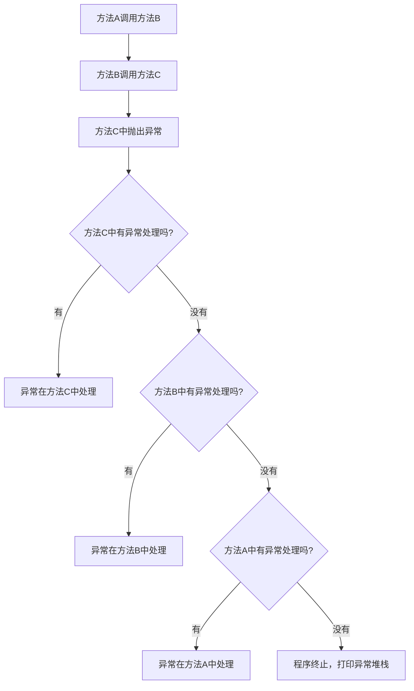

# Java 异常传播

## 什么是异常传播？

异常传播是指在Java程序执行过程中，当一个异常被抛出后，如果没有被立即捕获，它会沿着方法调用栈向上传递，直到被某个方法捕获处理，或者到达主方法（main方法）后导致程序终止。这个过程就像一个烫手的球被从一个人传给另一个人，直到有人能处理它或者到达调用链的顶端。

:::note
异常传播是Java异常处理机制的核心部分，了解它的工作原理对于编写健壮的代码至关重要。
:::

## 异常传播的基本原理

当方法中发生异常时，程序的执行流程会立即中断，并寻找相应的异常处理代码块。如果当前方法内没有找到匹配的处理代码块（即没有合适的`catch`语句），异常会向上传递给调用该方法的方法。以下是异常传播的基本流程：



## 异常传播示例

让我们通过一个简单的例子来理解异常如何在方法调用链中传播：

```java
public class ExceptionPropagationDemo {
    public static void main(String[] args) {
        try {
            method1();
        } catch (Exception e) {
            System.out.println("Exception caught in main: " + e.getMessage());
            System.out.println("异常栈轨迹:");
            e.printStackTrace();
        }
    }
    
    public static void method1() {
        method2();
    }
    
    public static void method2() {
        method3();
    }
    
    public static void method3() {
        throw new RuntimeException("发生异常的地方");
    }
}
```

运行这段代码，输出结果为：

```
Exception caught in main: 发生异常的地方
异常栈轨迹:
java.lang.RuntimeException: 发生异常的地方
	at ExceptionPropagationDemo.method3(ExceptionPropagationDemo.java:20)
	at ExceptionPropagationDemo.method2(ExceptionPropagationDemo.java:16)
	at ExceptionPropagationDemo.method1(ExceptionPropagationDemo.java:12)
	at ExceptionPropagationDemo.main(ExceptionPropagationDemo.java:5)
```

### 分析过程

1. `main`方法调用`method1`
2. `method1`调用`method2`
3. `method2`调用`method3`
4. `method3`中抛出了一个`RuntimeException`
5. 由于`method3`没有处理此异常，异常向上传播到`method2`
6. `method2`也没有处理异常，异常继续向上传播到`method1`
7. `method1`同样没有处理异常，异常再传播到`main`方法
8. `main`方法中的`try-catch`块捕获了这个异常并进行了处理

## 检查型异常与非检查型异常的传播

在Java中，异常分为检查型（checked）和非检查型（unchecked）两种。它们的传播方式有所不同：

### 非检查型异常（Unchecked Exceptions）

非检查型异常（如`RuntimeException`及其子类）会自动向上传播，不需要在方法声明中使用`throws`关键字。

```java
public void method1() {
    method2(); // 可能抛出RuntimeException，但不需要声明
}

public void method2() {
    throw new RuntimeException("运行时异常");
}
```

### 检查型异常（Checked Exceptions）

检查型异常（如`IOException`、`SQLException`等）需要在方法声明中使用`throws`关键字显式声明，或者在方法内部使用`try-catch`处理。

```java
public void method1() throws IOException {
    method2(); // 必须声明throws IOException，或用try-catch处理
}

public void method2() throws IOException {
    throw new IOException("IO异常");
}
```

:::caution
如果一个方法调用了另一个可能抛出检查型异常的方法，而调用方法没有处理这个异常，则调用方法必须在其声明中使用`throws`关键字来传递这个异常。
:::

## 异常传播与调用栈

当异常被抛出时，Java虚拟机会创建一个异常对象，其中包含了详细的调用栈信息，记录了异常从发生到捕获的整个调用路径。这个信息对调试程序非常有价值。

```java
try {
    // 可能抛出异常的代码
} catch (Exception e) {
    e.printStackTrace(); // 打印异常调用栈
}
```

## 多层嵌套的异常传播

异常传播可以经过多层方法调用，让我们看一个更复杂的示例：

```java
public class NestedExceptionDemo {
    public static void main(String[] args) {
        try {
            outerMethod();
        } catch (Exception e) {
            System.out.println("在main方法中捕获: " + e.getMessage());
        }
    }
    
    public static void outerMethod() {
        try {
            middleMethod();
        } catch (NullPointerException e) {
            System.out.println("在outerMethod中捕获NullPointerException");
            throw new IllegalStateException("转换为新的异常", e);
        }
    }
    
    public static void middleMethod() {
        try {
            innerMethod();
        } catch (ArrayIndexOutOfBoundsException e) {
            System.out.println("在middleMethod中捕获ArrayIndexOutOfBoundsException");
        }
    }
    
    public static void innerMethod() {
        String str = null;
        // 引发NullPointerException
        System.out.println(str.length());
    }
}
```

输出结果:

```
在outerMethod中捕获NullPointerException
在main方法中捕获: 转换为新的异常
```

### 分析过程

1. `innerMethod`抛出了`NullPointerException`
2. `middleMethod`中的`catch`块不匹配这个异常类型（它只捕获`ArrayIndexOutOfBoundsException`），所以异常继续向上传播
3. `outerMethod`中的`catch`块捕获了这个`NullPointerException`，并创建了一个新的`IllegalStateException`异常，将原异常作为原因（cause）
4. 新创建的异常被抛出并最终在`main`方法中被捕获

## 实际应用场景

### 1. 分层架构中的异常处理

在典型的三层架构（表示层、业务层、数据层）应用中，异常通常从底层向上传播：

```java
// 数据访问层
public class UserDAO {
    public User findUserById(int id) throws SQLException {
        // 数据库操作，可能抛出SQLException
        if (connectionFailed) {
            throw new SQLException("数据库连接失败");
        }
        return user;
    }
}

// 业务逻辑层
public class UserService {
    private UserDAO userDAO = new UserDAO();
    
    public User getUserById(int id) throws ServiceException {
        try {
            return userDAO.findUserById(id);
        } catch (SQLException e) {
            // 将检查型异常转换为自定义业务异常
            throw new ServiceException("获取用户信息失败", e);
        }
    }
}

// 控制层/表示层
public class UserController {
    private UserService userService = new UserService();
    
    public void displayUserInfo(int id) {
        try {
            User user = userService.getUserById(id);
            // 显示用户信息
        } catch (ServiceException e) {
            // 处理异常，可能是显示错误信息给用户
            System.out.println("抱歉，无法获取用户信息: " + e.getMessage());
        }
    }
}
```

### 2. 资源清理与异常传播

当涉及到需要清理的资源时，异常传播需要特别注意：

```java
public void processFile() {
    FileInputStream fis = null;
    try {
        fis = new FileInputStream("example.txt");
        // 文件处理代码
    } catch (IOException e) {
        System.out.println("文件处理错误: " + e.getMessage());
    } finally {
        // 无论异常是否发生，都要确保文件关闭
        if (fis != null) {
            try {
                fis.close();
            } catch (IOException e) {
                System.out.println("关闭文件失败");
            }
        }
    }
}
```

更现代的方式是使用Java 7引入的try-with-resources语法：

```java
public void processFileModern() {
    try (FileInputStream fis = new FileInputStream("example.txt")) {
        // 文件处理代码
    } catch (IOException e) {
        System.out.println("文件处理错误: " + e.getMessage());
    }
    // 资源会自动关闭，即使异常发生
}
```

## 异常传播的最佳实践

1. **仅在适当的级别处理异常**：不要捕获异常后不做任何处理，也不要在每一层都重复处理同一异常。

2. **保持原始异常信息**：如果需要转换异常类型，请使用异常链接（将原始异常作为新异常的cause）。

3. **只捕获能处理的异常**：不要使用空的catch块或过于通用的异常类型。

4. **在适当的抽象层次转换异常**：将底层实现异常转换为更符合当前上下文的异常。

5. **记录有用的异常信息**：确保异常消息包含足够的信息以便于调试。

```java
try {
    // 可能引发异常的代码
} catch (SpecificException e) {
    // 转换为适合当前上下文的异常
    throw new BusinessException("执行业务操作X失败", e);
} catch (AnotherException e) {
    // 详细记录异常
    logger.error("操作失败，参数: {}", input, e);
    throw e; // 重新抛出或进行其他处理
}
```

:::tip
良好的异常传播处理应该既保留原始异常信息，又提供有用的上下文，同时确保异常被处理在最合适的层级。
:::

## 总结

异常传播是Java异常处理机制中的关键概念，它决定了异常如何在方法调用栈中层层传递。理解异常传播有助于我们设计更健壮的错误处理机制，确保异常在合适的级别被正确处理。

主要要点：

- 异常会沿着调用链向上传播，直到被捕获或导致程序终止
- 检查型异常必须声明或处理，非检查型异常可以不声明
- 异常传播时可以被捕获、重新抛出或转换为新的异常类型
- 调用栈跟踪信息对诊断问题非常有用
- 异常应该在合适的抽象层次上被处理

## 练习

1. 创建一个多层方法调用的程序，故意在最内层方法引发一个异常，并观察它如何传播。
2. 修改上面的程序，在不同层次捕获异常并转换为不同类型的异常。
3. 编写代码演示检查型异常和非检查型异常传播的区别。
4. 实现一个模拟三层架构的程序，演示异常如何从数据层传播到表示层。

## 进一步学习资源

- Java官方文档中关于异常处理的部分
- 《Effective Java》第三版，第10条：优先使用标准的异常
- 《Clean Code》关于异常处理的章节

通过掌握Java异常传播机制，你将能够设计出更加健壮、可维护的应用程序，并且在异常情况下提供更好的用户体验。