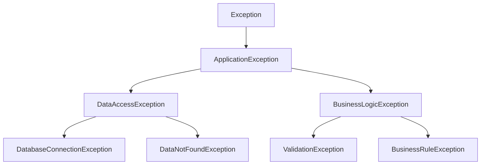

# Java 自定义异常

## 什么是自定义异常？

在Java编程中，异常处理是一个非常重要的概念。Java提供了许多内置的异常类，如`NullPointerException`、`ArrayIndexOutOfBoundsException`等，用于处理各种常见的错误情况。然而，在实际的应用开发中，我们经常会遇到一些特定的业务场景，这时内置的异常类可能无法精确地表达我们的意图。

**自定义异常**就是为了解决这个问题而存在的 - 它允许程序员根据特定的业务需求创建自己的异常类，以便更准确地描述程序中可能出现的错误情况，提高代码的可读性和可维护性。

:::tip
创建自定义异常是Java面向对象编程思想的一种体现，它让错误处理更加灵活和具有针对性。
:::

## 为什么需要自定义异常？

在讨论如何创建自定义异常之前，让我们先了解为什么需要创建自定义异常：

1. **提高代码可读性**：通过命名直观的自定义异常，使错误处理更加清晰明了
2. **区分错误类型**：将业务逻辑错误与系统错误区分开来
3. **提供更多上下文信息**：可以在自定义异常中添加额外的业务信息
4. **更好的异常层次结构**：可以创建特定于应用程序的异常层次结构
5. **统一的错误处理机制**：便于集中处理特定类型的错误

## 如何创建自定义异常？

创建自定义异常非常简单，只需要遵循以下步骤：

1. 创建一个继承自`Exception`或其子类的新类
2. 实现构造函数（通常需要无参构造函数和带错误消息的构造函数）
3. 根据需要添加自定义的方法和字段

### 示例：基本的自定义异常

```java
public class InsufficientFundsException extends Exception {
    // 无参构造函数
    public InsufficientFundsException() {
        super("账户余额不足");
    }
    
    // 带有错误消息的构造函数
    public InsufficientFundsException(String message) {
        super(message);
    }
    
    // 带有错误消息和原因的构造函数
    public InsufficientFundsException(String message, Throwable cause) {
        super(message, cause);
    }
}
```

### 检查型异常 vs 非检查型异常

在创建自定义异常时，你需要决定是创建**检查型异常**还是**非检查型异常**：

- **检查型异常**：继承自`Exception`类（除了`RuntimeException`及其子类），必须在方法签名中声明或进行捕获
- **非检查型异常**：继承自`RuntimeException`类，不需要在方法签名中声明，也不强制捕获

```java
// 检查型异常示例
public class DataFormatException extends Exception {
    public DataFormatException(String message) {
        super(message);
    }
}

// 非检查型异常示例
public class InvalidUserInputException extends RuntimeException {
    public InvalidUserInputException(String message) {
        super(message);
    }
}
```

:::note
选择创建检查型还是非检查型异常取决于你的应用场景：
- 当错误可以被合理地预期并且调用者应该明确处理时，使用检查型异常。
- 当错误是由程序错误引起的，或者调用者不能合理地恢复时，使用非检查型异常。
:::

## 为自定义异常添加额外信息

自定义异常的一个主要优势是可以添加与业务相关的额外信息，以便更好地处理错误：

```java
public class AccountException extends Exception {
    private String accountId;
    private double balance;
    private double requestedAmount;
    
    public AccountException(String message, String accountId, double balance, double requestedAmount) {
        super(message);
        this.accountId = accountId;
        this.balance = balance;
        this.requestedAmount = requestedAmount;
    }
    
    // Getter方法
    public String getAccountId() {
        return accountId;
    }
    
    public double getBalance() {
        return balance;
    }
    
    public double getRequestedAmount() {
        return requestedAmount;
    }
    
    // 提供详细的错误信息方法
    public String getAccountDetails() {
        return "账户ID: " + accountId + ", 当前余额: " + balance + 
               ", 请求金额: " + requestedAmount;
    }
}
```

## 自定义异常的实际应用案例

下面我们将通过一个银行账户管理系统的示例，演示如何使用自定义异常来处理业务逻辑：

```java
// 自定义异常
class InsufficientFundsException extends Exception {
    private double amount;
    
    public InsufficientFundsException(double amount) {
        super("余额不足，还需 " + amount + " 元");
        this.amount = amount;
    }
    
    public double getAmount() {
        return amount;
    }
}

class InvalidAmountException extends Exception {
    public InvalidAmountException(String message) {
        super(message);
    }
}

class AccountBlockedException extends Exception {
    public AccountBlockedException() {
        super("账户已被冻结，请联系客服");
    }
}

// 银行账户类
class BankAccount {
    private String accountNumber;
    private double balance;
    private boolean blocked;
    
    public BankAccount(String accountNumber, double initialBalance) {
        this.accountNumber = accountNumber;
        this.balance = initialBalance;
        this.blocked = false;
    }
    
    public void deposit(double amount) throws InvalidAmountException, AccountBlockedException {
        if (blocked) {
            throw new AccountBlockedException();
        }
        
        if (amount <= 0) {
            throw new InvalidAmountException("存款金额必须大于0");
        }
        
        balance += amount;
        System.out.println("存款成功，当前余额: " + balance);
    }
    
    public void withdraw(double amount) 
            throws InsufficientFundsException, InvalidAmountException, AccountBlockedException {
        if (blocked) {
            throw new AccountBlockedException();
        }
        
        if (amount <= 0) {
            throw new InvalidAmountException("取款金额必须大于0");
        }
        
        if (balance < amount) {
            throw new InsufficientFundsException(amount - balance);
        }
        
        balance -= amount;
        System.out.println("取款成功，当前余额: " + balance);
    }
    
    public void blockAccount() {
        this.blocked = true;
        System.out.println("账户已被冻结");
    }
    
    public void unblockAccount() {
        this.blocked = false;
        System.out.println("账户已解除冻结");
    }
    
    public double getBalance() {
        return balance;
    }
}
```

### 使用示例：

```java
public class BankingDemo {
    public static void main(String[] args) {
        BankAccount account = new BankAccount("12345", 1000);
        
        try {
            account.deposit(500);  // 存款500元
            System.out.println("当前余额: " + account.getBalance());
            
            account.withdraw(2000);  // 尝试取款2000元
        } catch (InsufficientFundsException e) {
            System.out.println("错误: " + e.getMessage());
            System.out.println("还需金额: " + e.getAmount() + " 元");
        } catch (InvalidAmountException e) {
            System.out.println("错误: " + e.getMessage());
        } catch (AccountBlockedException e) {
            System.out.println("错误: " + e.getMessage());
        }
        
        // 冻结账户后尝试操作
        try {
            account.blockAccount();
            account.withdraw(100);
        } catch (Exception e) {
            System.out.println("错误: " + e.getMessage());
        }
    }
}
```

**输出结果：**

```
存款成功，当前余额: 1500.0
当前余额: 1500.0
错误: 余额不足，还需 500.0 元
还需金额: 500.0 元
账户已被冻结
错误: 账户已被冻结，请联系客服
```

## 自定义异常的最佳实践

在创建和使用自定义异常时，以下是一些最佳实践：

1. **有意义的命名**：异常类名应该清晰地表达问题情况，通常以"Exception"结尾。
2. **提供多个构造函数**：至少包括无参构造函数和带错误消息的构造函数。
3. **包含相关上下文信息**：添加与错误相关的数据字段。
4. **正确选择异常类型**：根据情况选择检查型或非检查型异常。
5. **保持异常的粒度**：不要创建过于通用的异常类，也不要为每个错误情况创建一个异常。
6. **维护异常层次结构**：考虑创建一个基础异常类作为应用程序所有异常的父类。
7. **文档化异常**：使用JavaDoc清晰记录异常的目的和何时会抛出该异常。

### 异常层次结构示例

在复杂应用中，创建良好的异常层次结构非常重要：



### 代码实现：

```java
// 应用基础异常
public abstract class ApplicationException extends Exception {
    public ApplicationException(String message) {
        super(message);
    }
    
    public ApplicationException(String message, Throwable cause) {
        super(message, cause);
    }
}

// 数据访问异常
public class DataAccessException extends ApplicationException {
    public DataAccessException(String message) {
        super(message);
    }
    
    public DataAccessException(String message, Throwable cause) {
        super(message, cause);
    }
}

// 业务逻辑异常
public class BusinessLogicException extends ApplicationException {
    public BusinessLogicException(String message) {
        super(message);
    }
    
    public BusinessLogicException(String message, Throwable cause) {
        super(message, cause);
    }
}

// 具体的数据访问异常子类
public class DatabaseConnectionException extends DataAccessException {
    public DatabaseConnectionException(String message) {
        super(message);
    }
    
    public DatabaseConnectionException(String message, Throwable cause) {
        super(message, cause);
    }
}

// 具体的业务逻辑异常子类
public class ValidationException extends BusinessLogicException {
    private Map<String, String> validationErrors;
    
    public ValidationException(String message) {
        super(message);
        validationErrors = new HashMap<>();
    }
    
    public void addValidationError(String field, String error) {
        validationErrors.put(field, error);
    }
    
    public Map<String, String> getValidationErrors() {
        return Collections.unmodifiableMap(validationErrors);
    }
}
```

## 总结

自定义异常是Java异常处理机制中非常重要的一部分，它使得我们能够根据具体的应用场景创建更有表达力的异常类。通过自定义异常，我们可以：

1. 让代码更具可读性和自描述性
2. 提供更多的上下文信息，帮助识别和解决问题
3. 构建适合特定应用领域的异常层次结构
4. 区分业务逻辑错误和系统错误
5. 实现更加统一和一致的错误处理机制

创建自定义异常不应该过于随意，也不应该过于复杂。始终遵循最佳实践，确保异常类的设计能够真正提升代码质量和可维护性。

## 练习与挑战

为了更好地掌握自定义异常的创建和使用，试试以下练习：

1. 创建一个电子商务系统的自定义异常层次结构，包括：订单处理异常、支付异常、库存异常等。
2. 实现一个学生管理系统，使用自定义异常处理各种错误情况，如学生注册、成绩录入等过程中可能出现的问题。
3. 为上述任一系统编写全面的异常处理策略，包括异常捕获、记录和恢复机制。

## 额外资源

- Java官方文档中关于[异常处理](https://docs.oracle.com/javase/tutorial/essential/exceptions/index.html)的部分
- Effective Java（第三版）中关于异常处理的章节
- Clean Code（代码整洁之道）中关于错误处理的最佳实践

通过学习和实践自定义异常，你将能够设计出更健壮、更易于维护的Java应用程序。