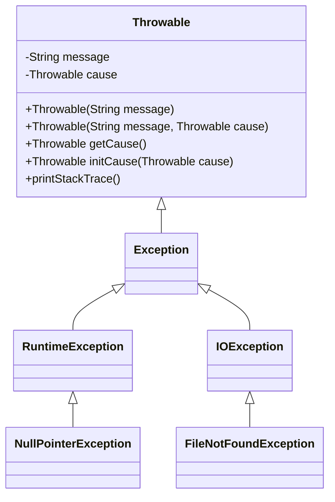

# Java 异常链

## 什么是异常链

在Java程序开发中，当一个异常导致另一个异常发生时，我们通常需要追踪这种"因果关系"。Java的**异常链**（Exception Chaining）机制正是为解决这个问题而设计的，它允许我们在抛出新异常的同时保留原始异常的信息。

异常链使用"原因异常"（cause exception）的概念，让开发者能够：
- 捕获低级别的异常
- 抛出更高级别、更有意义的异常
- 同时保留原始异常信息

这种机制在构建健壮的应用程序时非常重要，因为它提供了完整的错误追踪能力。

## Java 异常链的实现方式

Java提供了几种方式来实现异常链：

### 1. 使用带cause参数的构造函数

从Java 1.4开始，`Throwable`类及其所有子类都提供了接收cause异常作为参数的构造函数：

```java
public Throwable(String message, Throwable cause)
public Throwable(Throwable cause)
```

下面是一个简单的例子：

```java
try {
    // 尝试读取文件
    FileInputStream file = new FileInputStream("不存在的文件.txt");
} catch (FileNotFoundException originalException) {
    // 捕获原始异常，并创建新的业务异常，将原始异常作为cause
    throw new BusinessException("无法加载配置文件", originalException);
}
```

### 2. 使用initCause()方法

另一种创建异常链的方式是使用`initCause()`方法：

```java
try {
    int result = 10 / 0;
} catch (ArithmeticException originalException) {
    IllegalStateException newException = new IllegalStateException("计算过程发生错误");
    newException.initCause(originalException);
    throw newException;
}
```

:::note
`initCause()`方法只能被调用一次。如果cause已经被设置（无论是通过构造函数还是通过之前的`initCause()`调用），再次调用将抛出`IllegalStateException`。
:::

## 异常链的工作原理

当使用异常链时，Java运行时环境会保存完整的异常堆栈跟踪信息。当我们打印异常信息时，会看到类似这样的输出：

```
com.example.BusinessException: 无法加载配置文件
    at com.example.ConfigLoader.loadConfig(ConfigLoader.java:25)
    at com.example.Application.start(Application.java:12)
    at com.example.Main.main(Main.java:8)
Caused by: java.io.FileNotFoundException: 不存在的文件.txt
    at java.base/java.io.FileInputStream.open0(Native Method)
    at java.base/java.io.FileInputStream.open(FileInputStream.java:216)
    at java.base/java.io.FileInputStream.<init>(FileInputStream.java:157)
    at com.example.ConfigLoader.readConfigFile(ConfigLoader.java:18)
    ... 3 more
```

这种输出格式清晰地展示了异常的层级关系，"Caused by"部分显示了原始异常的信息。

## 完整示例

下面是一个更完整的示例，展示了如何在多层方法调用中使用异常链：

```java
public class ExceptionChainingDemo {
    
    public static void main(String[] args) {
        try {
            processBusinessLogic();
        } catch (BusinessException e) {
            System.out.println("业务处理失败：" + e.getMessage());
            System.out.println("完整异常堆栈：");
            e.printStackTrace();
        }
    }
    
    public static void processBusinessLogic() throws BusinessException {
        try {
            readConfiguration();
        } catch (ConfigException e) {
            throw new BusinessException("业务逻辑处理失败，配置问题", e);
        }
    }
    
    public static void readConfiguration() throws ConfigException {
        try {
            loadFile("config.properties");
        } catch (IOException e) {
            throw new ConfigException("无法读取配置文件", e);
        }
    }
    
    public static void loadFile(String filename) throws IOException {
        if (!filename.equals("valid_config.properties")) {
            throw new FileNotFoundException("文件 " + filename + " 不存在");
        }
        // 文件加载逻辑...
    }
    
    // 自定义异常类
    static class BusinessException extends Exception {
        public BusinessException(String message) {
            super(message);
        }
        
        public BusinessException(String message, Throwable cause) {
            super(message, cause);
        }
    }
    
    static class ConfigException extends Exception {
        public ConfigException(String message) {
            super(message);
        }
        
        public ConfigException(String message, Throwable cause) {
            super(message, cause);
        }
    }
}
```

运行结果：

```
业务处理失败：业务逻辑处理失败，配置问题
完整异常堆栈：
BusinessException: 业务逻辑处理失败，配置问题
    at ExceptionChainingDemo.processBusinessLogic(ExceptionChainingDemo.java:16)
    at ExceptionChainingDemo.main(ExceptionChainingDemo.java:6)
Caused by: ConfigException: 无法读取配置文件
    at ExceptionChainingDemo.readConfiguration(ExceptionChainingDemo.java:23)
    at ExceptionChainingDemo.processBusinessLogic(ExceptionChainingDemo.java:14)
    ... 1 more
Caused by: java.io.FileNotFoundException: 文件 config.properties 不存在
    at ExceptionChainingDemo.loadFile(ExceptionChainingDemo.java:29)
    at ExceptionChainingDemo.readConfiguration(ExceptionChainingDemo.java:21)
    ... 2 more
```

## 实际应用场景

### 1. 数据访问层异常处理

在多层架构应用中，数据访问层可能遇到各种低级异常（如SQL异常、连接异常等），但这些异常对上层业务代码没有直接意义。使用异常链可以将这些技术异常转换为业务相关的异常：

```java
public User findUserById(int userId) throws UserNotFoundException {
    try {
        // 数据库操作
        String sql = "SELECT * FROM users WHERE id = ?";
        // ...数据库查询代码...
    } catch (SQLException e) {
        // 将技术异常转换为业务异常
        throw new UserNotFoundException("无法找到ID为" + userId + "的用户", e);
    }
}
```

### 2. 远程服务调用

在调用远程服务时，可能会遇到网络、序列化等底层异常：

```java
public OrderStatus checkOrderStatus(String orderId) throws OrderProcessingException {
    try {
        // 远程服务调用
        return orderService.getStatus(orderId);
    } catch (RemoteException e) {
        throw new OrderProcessingException("无法连接订单服务", e);
    } catch (ServiceUnavailableException e) {
        throw new OrderProcessingException("订单服务当前不可用", e);
    }
}
```

### 3. 资源清理

在需要确保资源被正确关闭的场景中：

```java
public void processDataFile(String filePath) throws DataProcessingException {
    FileInputStream fis = null;
    try {
        fis = new FileInputStream(filePath);
        // 处理文件...
    } catch (IOException e) {
        throw new DataProcessingException("处理数据文件时出错", e);
    } finally {
        if (fis != null) {
            try {
                fis.close();
            } catch (IOException e) {
                // 这里我们可以选择记录日志而不是抛出新异常
                System.err.println("警告：无法关闭文件: " + e.getMessage());
            }
        }
    }
}
```

:::tip
在Java 7及以后的版本中，可以使用try-with-resources语句自动管理资源关闭，简化上述代码。
:::

## 异常链最佳实践

1. **保持原始异常信息**：总是将捕获的异常作为cause传递给新异常，这样可以保留完整的错误上下文。

2. **适当转换异常类型**：将低级技术异常转换为更有意义的业务异常，但保留原始异常作为cause。

3. **提供有意义的错误消息**：在创建新异常时，提供清晰、详细的错误描述，帮助定位问题。

4. **不要过度使用**：不是每个异常都需要链接。只在需要提供额外上下文信息或转换异常类型时使用异常链。

5. **考虑异常层次**：设计良好的异常层次结构，可以使异常处理更加清晰和有条理。

## 异常链的内部实现

从技术角度看，Java的异常链是通过`Throwable`类中的`cause`字段实现的：



当调用`printStackTrace()`或打印异常时，Java会递归地处理并显示整个异常链。

## 总结

Java异常链是一种强大的机制，使我们能够：

1. 在保留原始异常信息的同时转换异常类型
2. 提供更多的上下文信息，使错误更容易理解和调试
3. 构建层次化的异常处理系统
4. 隐藏低级实现细节，同时保留完整的诊断信息

掌握异常链的使用对于编写健壮、可维护的Java应用程序至关重要。通过适当地应用异常链，你可以提高代码的可读性、可维护性和可靠性。

## 练习

1. 创建一个模拟银行转账的程序，使用异常链处理各种可能的错误（如余额不足、账户不存在等）。

2. 实现一个文件处理程序，将各种IO异常包装成自定义的业务异常，并确保异常链正确传播。

3. 修改下面的代码，使用异常链改进错误处理：
   ```java
   public void processOrder(Order order) {
       try {
           validateOrder(order);
           calculateTotal(order);
           saveToDatabase(order);
       } catch (Exception e) {
           System.out.println("处理订单时出错: " + e.getMessage());
       }
   }
   ```

## 进一步学习资源

- Java官方文档中关于[Throwable](https://docs.oracle.com/en/java/javase/11/docs/api/java.base/java/lang/Throwable.html)的说明
- 《Effective Java》第3版，第10条：优先使用异常而非返回码
- 《Java编程思想》中的异常处理章节

通过本文的学习和练习，你应该能够理解Java异常链的概念、实现方式和应用场景，为编写更健壮的Java程序奠定基础。