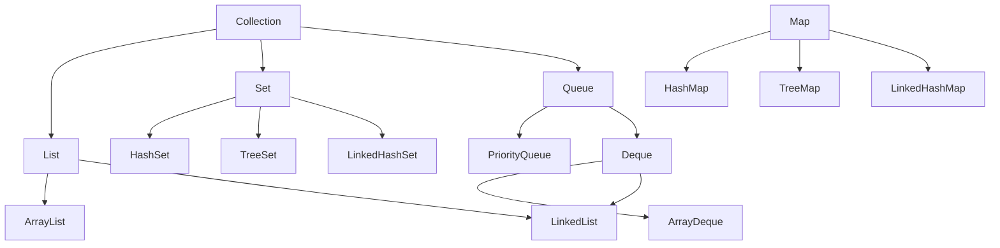

# Java 集合概述

## 什么是Java集合框架

Java集合框架是Java标准库中的一组接口和类，它们提供了用于存储和操作一组对象的架构。集合框架为开发者提供了高性能、高质量的数据结构实现，使我们不必从头开始编写这些数据结构。

:::tip 集合框架的特点
- 减少编程工作量
- 提高程序速度和质量
- 允许不同API之间的互操作
- 支持数据的复用
:::

## Java 集合框架的层次结构

Java集合框架主要包含以下几个核心接口：



### 核心接口

1. **Collection**：集合层次结构的根接口，定义了基本操作
2. **List**：有序集合，允许重复元素，可通过索引访问
3. **Set**：不允许重复元素的集合
4. **Queue**：设计用于在处理前保存元素的集合
5. **Map**：存储键值对的对象，不能包含重复键

## 常用集合类详解

### ArrayList

ArrayList是基于动态数组实现的列表，允许随机访问。

**特点**：
- 随机访问快（O(1)时间复杂度）
- 插入和删除操作较慢
- 容量可动态增长

**示例**：

```java
import java.util.ArrayList;
import java.util.List;

public class ArrayListExample {
    public static void main(String[] args) {
        // 创建ArrayList
        List<String> fruits = new ArrayList<>();
        
        // 添加元素
        fruits.add("苹果");
        fruits.add("香蕉");
        fruits.add("橙子");
        
        // 访问元素
        System.out.println("第二个水果是：" + fruits.get(1));
        
        // 遍历集合
        System.out.println("所有水果：");
        for (String fruit : fruits) {
            System.out.println(fruit);
        }
        
        // 移除元素
        fruits.remove("香蕉");
        System.out.println("移除后的水果列表：" + fruits);
    }
}
```

**输出**：
```
第二个水果是：香蕉
所有水果：
苹果
香蕉
橙子
移除后的水果列表：[苹果, 橙子]
```

### LinkedList

LinkedList是基于双向链表实现的列表，在插入和删除操作时效率很高。

**特点**：
- 插入和删除操作快
- 随机访问慢
- 实现了List和Deque接口

**示例**：

```java
import java.util.LinkedList;

public class LinkedListExample {
    public static void main(String[] args) {
        LinkedList<String> tasks = new LinkedList<>();
        
        // 添加元素
        tasks.add("任务1");
        tasks.addFirst("重要任务");  // 在开头添加
        tasks.addLast("最后任务");   // 在末尾添加
        
        // 输出
        System.out.println("任务列表：" + tasks);
        
        // 访问首尾元素
        System.out.println("第一个任务：" + tasks.getFirst());
        System.out.println("最后一个任务：" + tasks.getLast());
        
        // 移除元素
        tasks.removeFirst();
        System.out.println("移除首个任务后：" + tasks);
    }
}
```

**输出**：
```
任务列表：[重要任务, 任务1, 最后任务]
第一个任务：重要任务
最后一个任务：最后任务
移除首个任务后：[任务1, 最后任务]
```

### HashSet

HashSet实现Set接口，基于HashMap实现，不允许重复元素。

**特点**：
- 不允许重复元素
- 无序集合
- 允许null值
- 查找操作非常快

**示例**：

```java
import java.util.HashSet;
import java.util.Set;

public class HashSetExample {
    public static void main(String[] args) {
        Set<String> uniqueNames = new HashSet<>();
        
        // 添加元素
        uniqueNames.add("张三");
        uniqueNames.add("李四");
        uniqueNames.add("王五");
        uniqueNames.add("张三");  // 重复元素
        
        // 显示元素个数
        System.out.println("集合中元素个数：" + uniqueNames.size());
        
        // 遍历元素
        System.out.println("集合中的名字：");
        for (String name : uniqueNames) {
            System.out.println(name);
        }
        
        // 检查元素
        System.out.println("集合包含'张三'：" + uniqueNames.contains("张三"));
    }
}
```

**输出**：
```
集合中元素个数：3
集合中的名字：
张三
李四
王五
集合包含'张三'：true
```

### HashMap

HashMap实现Map接口，存储键值对，允许null键和null值。

**特点**：
- 基于哈希表实现
- 访问元素的时间复杂度为O(1)
- 允许null键和null值
- 无序集合

**示例**：

```java
import java.util.HashMap;
import java.util.Map;

public class HashMapExample {
    public static void main(String[] args) {
        // 创建HashMap
        Map<String, Integer> studentScores = new HashMap<>();
        
        // 添加键值对
        studentScores.put("张三", 95);
        studentScores.put("李四", 88);
        studentScores.put("王五", 92);
        
        // 访问元素
        System.out.println("张三的分数：" + studentScores.get("张三"));
        
        // 遍历Map
        System.out.println("所有学生分数：");
        for (Map.Entry<String, Integer> entry : studentScores.entrySet()) {
            System.out.println(entry.getKey() + ": " + entry.getValue());
        }
        
        // 检查键是否存在
        System.out.println("包含赵六吗？" + studentScores.containsKey("赵六"));
        
        // 更新值
        studentScores.put("李四", 90);
        System.out.println("李四更新后的分数：" + studentScores.get("李四"));
    }
}
```

**输出**：
```
张三的分数：95
所有学生分数：
张三: 95
李四: 88
王五: 92
包含赵六吗？false
李四更新后的分数：90
```

## 集合框架常用操作

### 迭代器

Iterator接口提供了遍历集合的通用方法，避免了暴露集合内部结构。

```java
import java.util.ArrayList;
import java.util.Iterator;
import java.util.List;

public class IteratorExample {
    public static void main(String[] args) {
        List<String> languages = new ArrayList<>();
        languages.add("Java");
        languages.add("Python");
        languages.add("JavaScript");
        
        // 使用Iterator遍历
        System.out.println("使用Iterator遍历：");
        Iterator<String> it = languages.iterator();
        while (it.hasNext()) {
            String language = it.next();
            System.out.println(language);
            
            // 如果是Python，则移除它
            if (language.equals("Python")) {
                it.remove();  // 安全地删除元素
            }
        }
        
        // 移除后的列表
        System.out.println("移除后的列表：" + languages);
    }
}
```

**输出**：
```
使用Iterator遍历：
Java
Python
JavaScript
移除后的列表：[Java, JavaScript]
```

### 集合排序

Collections类提供了对List进行排序的静态方法，可以使用自然顺序或自定义比较器进行排序。

```java
import java.util.ArrayList;
import java.util.Collections;
import java.util.Comparator;
import java.util.List;

public class SortingExample {
    static class Student {
        String name;
        int age;
        
        Student(String name, int age) {
            this.name = name;
            this.age = age;
        }
        
        @Override
        public String toString() {
            return name + "(" + age + ")";
        }
    }
    
    public static void main(String[] args) {
        // 字符串列表排序
        List<String> names = new ArrayList<>();
        names.add("张三");
        names.add("李四");
        names.add("王五");
        
        // 默认排序（自然顺序）
        Collections.sort(names);
        System.out.println("字符串排序后：" + names);
        
        // 自定义对象排序
        List<Student> students = new ArrayList<>();
        students.add(new Student("张三", 20));
        students.add(new Student("李四", 18));
        students.add(new Student("王五", 22));
        
        // 使用Comparator按年龄排序
        Collections.sort(students, new Comparator<Student>() {
            @Override
            public int compare(Student s1, Student s2) {
                return s1.age - s2.age;
            }
        });
        
        // Java 8 Lambda表达式
        // Collections.sort(students, (s1, s2) -> s1.age - s2.age);
        
        System.out.println("学生按年龄排序后：" + students);
    }
}
```

**输出**：
```
字符串排序后：[李四, 王五, 张三]
学生按年龄排序后：[李四(18), 张三(20), 王五(22)]
```

## 实际应用场景

### 学生信息管理系统

以下是一个简单的学生信息管理系统，展示了如何使用不同集合类：

```java
import java.util.*;

public class StudentManagementSystem {
    static class Student {
        int id;
        String name;
        int age;
        String major;
        
        Student(int id, String name, int age, String major) {
            this.id = id;
            this.name = name;
            this.age = age;
            this.major = major;
        }
        
        @Override
        public String toString() {
            return "学号: " + id + ", 姓名: " + name + ", 年龄: " + age + ", 专业: " + major;
        }
        
        @Override
        public boolean equals(Object o) {
            if (this == o) return true;
            if (o == null || getClass() != o.getClass()) return false;
            Student student = (Student) o;
            return id == student.id;
        }
        
        @Override
        public int hashCode() {
            return Objects.hash(id);
        }
    }
    
    public static void main(String[] args) {
        // 使用ArrayList存储学生列表
        List<Student> studentList = new ArrayList<>();
        studentList.add(new Student(1001, "张三", 20, "计算机科学"));
        studentList.add(new Student(1002, "李四", 21, "数学"));
        studentList.add(new Student(1003, "王五", 19, "物理"));
        
        // 使用HashMap存储学号到学生的映射
        Map<Integer, Student> studentMap = new HashMap<>();
        for (Student student : studentList) {
            studentMap.put(student.id, student);
        }
        
        // 使用TreeSet按年龄排序学生
        TreeSet<Student> studentsByAge = new TreeSet<>(new Comparator<Student>() {
            @Override
            public int compare(Student s1, Student s2) {
                return s1.age - s2.age;
            }
        });
        studentsByAge.addAll(studentList);
        
        // 查找学生
        System.out.println("查找学号为1002的学生：");
        Student foundStudent = studentMap.get(1002);
        if (foundStudent != null) {
            System.out.println(foundStudent);
        }
        
        // 显示所有学生（按添加顺序）
        System.out.println("\n所有学生：");
        for (Student student : studentList) {
            System.out.println(student);
        }
        
        // 显示按年龄排序的学生
        System.out.println("\n按年龄排序的学生：");
        for (Student student : studentsByAge) {
            System.out.println(student);
        }
    }
}
```

**输出**：
```
查找学号为1002的学生：
学号: 1002, 姓名: 李四, 年龄: 21, 专业: 数学

所有学生：
学号: 1001, 姓名: 张三, 年龄: 20, 专业: 计算机科学
学号: 1002, 姓名: 李四, 年龄: 21, 专业: 数学
学号: 1003, 姓名: 王五, 年龄: 19, 专业: 物理

按年龄排序的学生：
学号: 1003, 姓名: 王五, 年龄: 19, 专业: 物理
学号: 1001, 姓名: 张三, 年龄: 20, 专业: 计算机科学
学号: 1002, 姓名: 李四, 年龄: 21, 专业: 数学
```

### 单词频率统计

此示例展示了如何使用Map来统计文本中单词出现的频率：

```java
import java.util.HashMap;
import java.util.Map;
import java.util.TreeMap;

public class WordFrequencyCounter {
    public static void main(String[] args) {
        String text = "Java是一种面向对象的编程语言，Java可以开发各种应用程序，Java也用于Android应用开发";
        
        // 分词
        String[] words = text.split("[，。 ]");
        
        // 使用HashMap统计频率
        Map<String, Integer> wordFrequency = new HashMap<>();
        
        for (String word : words) {
            if (!word.isEmpty()) {
                // 如果单词已存在，则计数加1；否则初始化为1
                wordFrequency.put(word, wordFrequency.getOrDefault(word, 0) + 1);
            }
        }
        
        // 使用TreeMap对结果按键排序
        Map<String, Integer> sortedFrequency = new TreeMap<>(wordFrequency);
        
        // 输出结果
        System.out.println("单词出现频率：");
        for (Map.Entry<String, Integer> entry : sortedFrequency.entrySet()) {
            System.out.println(entry.getKey() + ": " + entry.getValue() + "次");
        }
    }
}
```

**输出**：
```
单词出现频率：
Android: 1次
Java: 3次
也用于: 1次
可以开发各种应用程序: 1次
是一种面向对象的编程语言: 1次
应用开发: 1次
```

## 集合框架选择指南

在实际开发中，选择合适的集合类非常重要。以下是一些选择建议：

1. **需要按照插入顺序保存元素**：使用ArrayList或LinkedList
2. **需要快速随机访问元素**：使用ArrayList
3. **频繁在集合开头或中间插入/删除元素**：使用LinkedList
4. **需要保证元素唯一性**：使用HashSet
5. **需要保证元素唯一且有序**：使用TreeSet
6. **需要键值对映射**：使用HashMap
7. **需要键值对映射且保持插入顺序**：使用LinkedHashMap
8. **需要键值对映射且按键排序**：使用TreeMap
9. **需要先进先出(FIFO)的队列**：使用LinkedList或ArrayDeque
10. **需要优先级队列**：使用PriorityQueue

## 总结

Java集合框架是Java编程中不可或缺的一部分，它提供了一系列用于存储和操作数据的标准化接口和类：

- **ArrayList和LinkedList** 适用于需要按顺序存储元素并需要频繁访问的场景
- **HashSet和TreeSet** 适用于需要唯一元素的场景，后者还提供了排序功能
- **HashMap和TreeMap** 适用于键值对映射，后者提供了键的排序

学习和掌握Java集合框架对于编写高效、简洁的代码至关重要。通过选择适当的集合类，可以显著提高应用程序的性能和可维护性。

## 练习题

1. 创建一个ArrayList，添加10个整数，然后删除所有偶数。
2. 创建一个HashSet和LinkedHashSet，添加相同的元素，比较输出顺序的区别。
3. 使用HashMap实现一个简单的学生成绩管理系统，支持添加、查询和更新成绩。
4. 编写一个程序，使用TreeMap按照字母顺序存储和显示一组单词及其定义。
5. 使用PriorityQueue实现一个简单的任务调度系统，按照任务优先级执行任务。

## 推荐学习资源

1. Java API文档中的[Collections Framework概述](https://docs.oracle.com/en/java/javase/17/docs/api/java.base/java/util/doc-files/coll-overview.html)
2. 《Java编程思想》第11章：集合
3. 《Effective Java》第9项：泛型和集合

:::caution 注意事项
集合使用过程中要注意避免并发修改异常(ConcurrentModificationException)，特别是在遍历过程中修改集合内容时，应当使用Iterator的remove()方法而不是集合自身的remove()方法。
:::