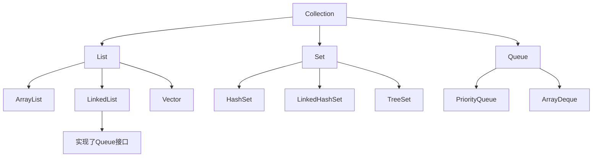

# Java Collection接口

## 什么是Collection接口？

Collection接口是Java集合框架的根接口，位于`java.util`包中。它是Java集合类层次结构的顶层接口（除了Map接口族之外），定义了对一组对象进行操作的标准方法。Collection接口没有直接的实现类，而是通过其子接口如List、Set和Queue来提供具体实现。



## Collection接口的主要功能

Collection接口提供了一组用于操作集合的标准方法，包括添加元素、删除元素、查询元素等基本操作。

### 常用方法

| 方法 | 描述 |
|------|------|
| `boolean add(E e)` | 将指定元素添加到集合中 |
| `boolean remove(Object o)` | 从集合中删除指定元素的单个实例 |
| `boolean contains(Object o)` | 检查集合是否包含指定元素 |
| `int size()` | 返回集合中的元素数量 |
| `boolean isEmpty()` | 检查集合是否为空 |
| `void clear()` | 从集合中移除所有元素 |
| `Iterator<E> iterator()` | 返回集合中元素的迭代器 |
| `boolean addAll(Collection<? extends E> c)` | 将指定集合中的所有元素添加到此集合 |
| `boolean removeAll(Collection<?> c)` | 移除此集合中也包含在指定集合中的所有元素 |
| `boolean retainAll(Collection<?> c)` | 仅保留此集合中也包含在指定集合中的元素 |
| `Object[] toArray()` | 返回包含此集合中所有元素的数组 |

## 使用Collection接口

虽然我们不能直接实例化Collection接口，但可以通过其子接口的实现类来使用它。下面我们将通过一些具体示例来学习如何使用Collection接口。

### 基本操作示例

```java
import java.util.ArrayList;
import java.util.Collection;

public class CollectionDemo {
    public static void main(String[] args) {
        // 创建一个Collection类型的引用，指向ArrayList的实例
        Collection<String> fruits = new ArrayList<>();
        
        // 添加元素
        fruits.add("苹果");
        fruits.add("香蕉");
        fruits.add("橙子");
        
        // 显示集合内容
        System.out.println("水果列表: " + fruits);
        
        // 检查集合是否包含特定元素
        System.out.println("集合包含'香蕉'吗? " + fruits.contains("香蕉"));
        
        // 获取集合大小
        System.out.println("集合大小: " + fruits.size());
        
        // 移除元素
        fruits.remove("香蕉");
        System.out.println("移除香蕉后的水果列表: " + fruits);
        
        // 检查集合是否为空
        System.out.println("集合是否为空? " + fruits.isEmpty());
        
        // 清空集合
        fruits.clear();
        System.out.println("清空后集合是否为空? " + fruits.isEmpty());
    }
}
```

输出结果：
```
水果列表: [苹果, 香蕉, 橙子]
集合包含'香蕉'吗? true
集合大小: 3
移除香蕉后的水果列表: [苹果, 橙子]
集合是否为空? false
清空后集合是否为空? true
```

### 使用迭代器遍历集合

Collection接口提供了`iterator()`方法来获取一个迭代器，用于遍历集合中的元素。

```java
import java.util.ArrayList;
import java.util.Collection;
import java.util.Iterator;

public class CollectionIteratorDemo {
    public static void main(String[] args) {
        Collection<String> languages = new ArrayList<>();
        languages.add("Java");
        languages.add("Python");
        languages.add("JavaScript");
        languages.add("C++");
        
        // 使用迭代器遍历集合
        System.out.println("使用Iterator遍历集合:");
        Iterator<String> iterator = languages.iterator();
        while (iterator.hasNext()) {
            String language = iterator.next();
            System.out.println(language);
            
            // 在迭代过程中可以安全地删除元素
            if (language.equals("JavaScript")) {
                iterator.remove();  // 安全删除当前元素
            }
        }
        
        System.out.println("\n删除JavaScript后的集合: " + languages);
    }
}
```

输出结果：
```
使用Iterator遍历集合:
Java
Python
JavaScript
C++

删除JavaScript后的集合: [Java, Python, C++]
```

### 集合间操作

Collection接口提供了多个方法用于在不同集合之间执行操作：

```java
import java.util.ArrayList;
import java.util.Collection;

public class CollectionOperationsDemo {
    public static void main(String[] args) {
        // 创建第一个集合
        Collection<String> list1 = new ArrayList<>();
        list1.add("A");
        list1.add("B");
        list1.add("C");
        
        // 创建第二个集合
        Collection<String> list2 = new ArrayList<>();
        list2.add("B");
        list2.add("C");
        list2.add("D");
        
        // 显示原始集合
        System.out.println("集合1: " + list1);
        System.out.println("集合2: " + list2);
        
        // 创建集合副本用于演示
        Collection<String> union = new ArrayList<>(list1);
        Collection<String> intersection = new ArrayList<>(list1);
        Collection<String> difference = new ArrayList<>(list1);
        
        // 并集：addAll
        union.addAll(list2);
        System.out.println("并集: " + union);
        
        // 交集：retainAll
        intersection.retainAll(list2);
        System.out.println("交集: " + intersection);
        
        // 差集：removeAll
        difference.removeAll(list2);
        System.out.println("差集: " + difference);
    }
}
```

输出结果：
```
集合1: [A, B, C]
集合2: [B, C, D]
并集: [A, B, C, B, C, D]
交集: [B, C]
差集: [A]
```

:::note
上面的并集操作使用`addAll()`并不会去除重复元素。如果需要去除重复元素，可以使用`Set`类型的集合。
:::

## 实际应用场景

### 场景一：学生管理系统

在一个学生管理系统中，可以使用Collection接口来存储和管理学生信息：

```java
import java.util.ArrayList;
import java.util.Collection;
import java.util.Iterator;

class Student {
    private int id;
    private String name;
    private double gpa;
    
    public Student(int id, String name, double gpa) {
        this.id = id;
        this.name = name;
        this.gpa = gpa;
    }
    
    public int getId() { return id; }
    public String getName() { return name; }
    public double getGpa() { return gpa; }
    
    @Override
    public String toString() {
        return "Student{id=" + id + ", name='" + name + "', gpa=" + gpa + '}';
    }
    
    @Override
    public boolean equals(Object obj) {
        if (this == obj) return true;
        if (obj == null || getClass() != obj.getClass()) return false;
        Student student = (Student) obj;
        return id == student.id;
    }
}

public class StudentManagementSystem {
    public static void main(String[] args) {
        // 创建学生集合
        Collection<Student> students = new ArrayList<>();
        
        // 添加学生
        students.add(new Student(1, "张三", 3.8));
        students.add(new Student(2, "李四", 3.5));
        students.add(new Student(3, "王五", 3.9));
        
        // 显示所有学生
        System.out.println("所有学生:");
        for (Student student : students) {
            System.out.println(student);
        }
        
        // 查找特定学生
        Student searchStudent = new Student(2, "", 0);
        System.out.println("\n学生ID 2 存在于集合中: " + students.contains(searchStudent));
        
        // 移除学生
        students.remove(searchStudent);
        
        // 移除后显示所有学生
        System.out.println("\n移除后的学生列表:");
        for (Student student : students) {
            System.out.println(student);
        }
    }
}
```

输出结果：
```
所有学生:
Student{id=1, name='张三', gpa=3.8}
Student{id=2, name='李四', gpa=3.5}
Student{id=3, name='王五', gpa=3.9}

学生ID 2 存在于集合中: true

移除后的学生列表:
Student{id=1, name='张三', gpa=3.8}
Student{id=3, name='王五', gpa=3.9}
```

### 场景二：简单购物车系统

使用Collection接口实现一个简单的购物车系统：

```java
import java.util.ArrayList;
import java.util.Collection;

class Product {
    private String id;
    private String name;
    private double price;
    
    public Product(String id, String name, double price) {
        this.id = id;
        this.name = name;
        this.price = price;
    }
    
    public String getId() { return id; }
    public String getName() { return name; }
    public double getPrice() { return price; }
    
    @Override
    public String toString() {
        return name + " ¥" + price;
    }
    
    @Override
    public boolean equals(Object obj) {
        if (this == obj) return true;
        if (obj == null || getClass() != obj.getClass()) return false;
        Product product = (Product) obj;
        return id.equals(product.id);
    }
}

public class ShoppingCartDemo {
    public static void main(String[] args) {
        // 创建购物车
        Collection<Product> cart = new ArrayList<>();
        
        // 添加商品到购物车
        cart.add(new Product("p1", "手机", 3999.0));
        cart.add(new Product("p2", "耳机", 499.0));
        cart.add(new Product("p3", "充电器", 99.0));
        
        // 显示购物车内容
        System.out.println("购物车内容:");
        for (Product product : cart) {
            System.out.println(product);
        }
        
        // 计算总价
        double total = 0;
        for (Product product : cart) {
            total += product.getPrice();
        }
        System.out.println("\n总价: ¥" + total);
        
        // 移除商品
        cart.remove(new Product("p2", "", 0));
        
        // 显示更新后的购物车
        System.out.println("\n移除耳机后的购物车:");
        for (Product product : cart) {
            System.out.println(product);
        }
        
        // 计算更新后的总价
        total = 0;
        for (Product product : cart) {
            total += product.getPrice();
        }
        System.out.println("\n更新后的总价: ¥" + total);
    }
}
```

输出结果：
```
购物车内容:
手机 ¥3999.0
耳机 ¥499.0
充电器 ¥99.0

总价: ¥4597.0

移除耳机后的购物车:
手机 ¥3999.0
充电器 ¥99.0

更新后的总价: ¥4098.0
```

## 总结

Collection接口是Java集合框架的核心接口之一，提供了一系列用于操作集合的标准方法。通过学习Collection接口，我们可以：

1. 了解Java集合框架的基础结构
2. 掌握添加、删除、查询集合元素的基本操作
3. 学会使用迭代器遍历集合和动态修改集合
4. 掌握集合间的操作如并集、交集和差集
5. 在实际应用场景中灵活运用集合

虽然我们不能直接实例化Collection接口，但可以使用其具体实现类（如ArrayList、HashSet等）来满足不同的业务需求。在后续学习中，我们将深入了解Collection的各个子接口及其实现类的特性和适用场景。

## 练习

1. 创建一个使用Collection接口的程序，实现一个简单的图书管理系统，要求能够添加图书、删除图书、查询图书和显示所有图书。
2. 编写一个程序，使用Collection接口的方法合并两个集合并去除重复元素。
3. 创建一个使用Collection接口的程序，实现一个简单的待办事项列表，要求能够添加任务、完成任务、显示所有任务和显示未完成任务。

:::tip
在学习Collection接口时，建议同时参考Java官方文档，了解更多方法的详细信息和使用场景。后续学习中，我们将深入探讨List、Set和Queue等子接口的特性和用法。
:::