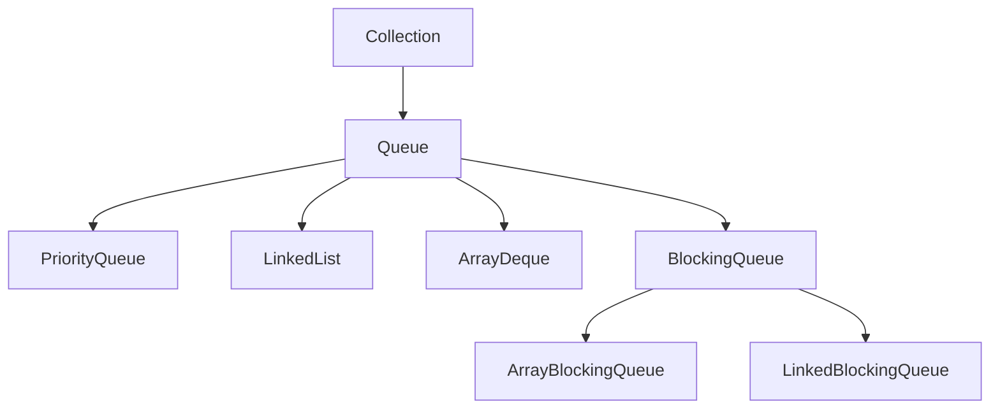

# Java Queue接口

## 队列简介

在Java集合框架中，Queue（队列）是一种特殊的线性集合，它遵循先进先出（FIFO - First-In-First-Out）的原则，即最先添加的元素最先被移除。Queue接口位于`java.util`包中，是Collection接口的子接口，主要用于在处理元素前保存元素。



队列的形象比喻就是现实生活中的排队场景：排在队伍最前面的人最先得到服务，新来的人只能排在队尾。

## Queue接口的核心方法

Queue接口定义了以下几个核心方法，每个方法的行为在出错/失败情况下有两种不同的表现形式：

| 操作类型 | 抛出异常的方法 | 返回特殊值的方法 |
|---------|--------------|---------------|
| 插入    | add(e)      | offer(e)      |
| 移除    | remove()    | poll()        |
| 检查    | element()   | peek()        |

### 方法详解

1. **插入操作**：
   - `boolean add(E e)`: 将元素添加到队列，如果队列已满则抛出`IllegalStateException`
   - `boolean offer(E e)`: 将元素添加到队列，如果成功返回true，队列已满则返回false

2. **移除操作**：
   - `E remove()`: 移除并返回队头元素，如果队列为空则抛出`NoSuchElementException`
   - `E poll()`: 移除并返回队头元素，如果队列为空则返回null

3. **检查操作**：
   - `E element()`: 返回队头元素但不移除，如果队列为空则抛出`NoSuchElementException`
   - `E peek()`: 返回队头元素但不移除，如果队列为空则返回null

:::tip
在选择方法时，建议根据你对错误情况的处理需求来决定使用哪一组方法：
- 如果你希望在操作失败时抛出异常，使用 add/remove/element
- 如果你希望通过返回值判断操作是否成功，使用 offer/poll/peek
:::

## Queue的主要实现类

### LinkedList

`LinkedList`既实现了`List`接口，也实现了`Queue`接口。作为队列使用时，它提供了FIFO的队列操作。

```java
import java.util.LinkedList;
import java.util.Queue;

public class LinkedListQueueExample {
    public static void main(String[] args) {
        Queue<String> queue = new LinkedList<>();
        
        // 添加元素
        queue.offer("Java");
        queue.offer("Python");
        queue.offer("C++");
        
        System.out.println("队列: " + queue);
        
        // 访问队列头部元素
        System.out.println("队头元素: " + queue.peek());
        
        // 移除元素
        String removed = queue.poll();
        System.out.println("移除的元素: " + removed);
        System.out.println("移除后的队列: " + queue);
    }
}
```

输出:
```
队列: [Java, Python, C++]
队头元素: Java
移除的元素: Java
移除后的队列: [Python, C++]
```

### PriorityQueue

`PriorityQueue`是一个基于优先级堆的队列，元素按照自然顺序或者比较器（Comparator）指定的顺序排序。队列头部的元素总是优先级最高（最小）的元素。

```java
import java.util.PriorityQueue;
import java.util.Queue;

public class PriorityQueueExample {
    public static void main(String[] args) {
        // 创建一个优先队列
        Queue<Integer> priorityQueue = new PriorityQueue<>();
        
        // 添加元素
        priorityQueue.offer(5);
        priorityQueue.offer(1);
        priorityQueue.offer(3);
        priorityQueue.offer(2);
        priorityQueue.offer(4);
        
        System.out.println("优先队列: " + priorityQueue);
        
        // 移除元素（按优先级排序）
        while (!priorityQueue.isEmpty()) {
            System.out.println("移除: " + priorityQueue.poll());
        }
    }
}
```

输出:
```
优先队列: [1, 2, 3, 5, 4]
移除: 1
移除: 2
移除: 3
移除: 4
移除: 5
```

:::note
注意在上面的例子中，打印整个优先队列时显示的顺序可能看起来不是有序的，这是因为内部堆结构的表示。但是当我们使用`poll()`方法逐个移除元素时，它们会按照优先级顺序（从小到大）被移除。
:::

### ArrayDeque

`ArrayDeque`是一个基于数组实现的双端队列，它实现了`Deque`接口，可以作为队列或栈来使用。作为队列使用时，它通常比`LinkedList`有更好的性能。

```java
import java.util.ArrayDeque;
import java.util.Queue;

public class ArrayDequeExample {
    public static void main(String[] args) {
        Queue<String> queue = new ArrayDeque<>();
        
        // 添加元素
        queue.offer("红");
        queue.offer("橙");
        queue.offer("黄");
        
        System.out.println("队列: " + queue);
        
        // 移除元素
        String removed = queue.poll();
        System.out.println("移除的元素: " + removed);
        System.out.println("移除后的队列: " + queue);
    }
}
```

输出:
```
队列: [红, 橙, 黄]
移除的元素: 红
移除后的队列: [橙, 黄]
```

## 阻塞队列

Java还提供了`BlockingQueue`接口，它扩展了`Queue`接口，主要用于生产者-消费者模式，提供了阻塞的插入和获取操作。当队列满时，插入操作将阻塞；当队列空时，获取操作将阻塞。

主要的实现类有：`ArrayBlockingQueue`、`LinkedBlockingQueue`、`PriorityBlockingQueue`等。

```java
import java.util.concurrent.ArrayBlockingQueue;
import java.util.concurrent.BlockingQueue;

public class BlockingQueueExample {
    public static void main(String[] args) throws InterruptedException {
        // 创建容量为2的阻塞队列
        BlockingQueue<String> blockingQueue = new ArrayBlockingQueue<>(2);
        
        // 添加元素
        blockingQueue.put("元素1");
        blockingQueue.put("元素2");
        System.out.println("队列已满: " + blockingQueue);
        
        // 启动一个线程消费元素
        new Thread(() -> {
            try {
                Thread.sleep(2000); // 等待2秒
                System.out.println("消费者消费: " + blockingQueue.take());
            } catch (InterruptedException e) {
                e.printStackTrace();
            }
        }).start();
        
        // 这里会阻塞，直到队列有空间
        System.out.println("生产者等待放入元素...");
        blockingQueue.put("元素3");  // 阻塞直到有空间
        System.out.println("元素3已放入队列: " + blockingQueue);
    }
}
```

输出:
```
队列已满: [元素1, 元素2]
生产者等待放入元素...
消费者消费: 元素1
元素3已放入队列: [元素2, 元素3]
```

## 实际应用场景

Queue在Java编程中有广泛的应用，以下是几个常见的场景：

### 1. 任务调度系统

在任务调度系统中，待执行的任务可以放入队列，由执行线程按照先来先执行的顺序处理。

```java
import java.util.LinkedList;
import java.util.Queue;

class Task {
    private String name;
    
    public Task(String name) {
        this.name = name;
    }
    
    public void execute() {
        System.out.println("执行任务: " + name);
    }
    
    @Override
    public String toString() {
        return name;
    }
}

public class TaskScheduler {
    private Queue<Task> taskQueue = new LinkedList<>();
    
    public void addTask(Task task) {
        taskQueue.offer(task);
    }
    
    public void processTasks() {
        while (!taskQueue.isEmpty()) {
            Task task = taskQueue.poll();
            task.execute();
        }
    }
    
    public static void main(String[] args) {
        TaskScheduler scheduler = new TaskScheduler();
        
        // 添加任务
        scheduler.addTask(new Task("发送邮件"));
        scheduler.addTask(new Task("生成报表"));
        scheduler.addTask(new Task("数据备份"));
        
        // 处理所有任务
        scheduler.processTasks();
    }
}
```

输出:
```
执行任务: 发送邮件
执行任务: 生成报表
执行任务: 数据备份
```

### 2. 广度优先搜索 (BFS)

在图或树的广度优先搜索算法中，通常使用队列来存储待访问的节点。

```java
import java.util.*;

class TreeNode {
    int value;
    TreeNode left;
    TreeNode right;
    
    TreeNode(int value) {
        this.value = value;
    }
}

public class BfsExample {
    public static void levelOrderTraversal(TreeNode root) {
        if (root == null) return;
        
        Queue<TreeNode> queue = new LinkedList<>();
        queue.offer(root);
        
        while (!queue.isEmpty()) {
            TreeNode current = queue.poll();
            
            // 处理当前节点
            System.out.print(current.value + " ");
            
            // 将子节点加入队列
            if (current.left != null) {
                queue.offer(current.left);
            }
            if (current.right != null) {
                queue.offer(current.right);
            }
        }
    }
    
    public static void main(String[] args) {
        // 构建一个简单的二叉树
        //      1
        //     / \
        //    2   3
        //   / \
        //  4   5
        
        TreeNode root = new TreeNode(1);
        root.left = new TreeNode(2);
        root.right = new TreeNode(3);
        root.left.left = new TreeNode(4);
        root.left.right = new TreeNode(5);
        
        System.out.println("层序遍历结果:");
        levelOrderTraversal(root);
    }
}
```

输出:
```
层序遍历结果:
1 2 3 4 5
```

### 3. 消息队列/事件处理

队列常用于实现简单的消息或事件处理系统：

```java
import java.util.concurrent.BlockingQueue;
import java.util.concurrent.LinkedBlockingQueue;

class Message {
    private String content;
    
    public Message(String content) {
        this.content = content;
    }
    
    public String getContent() {
        return content;
    }
}

class MessageProducer implements Runnable {
    private BlockingQueue<Message> queue;
    
    public MessageProducer(BlockingQueue<Message> queue) {
        this.queue = queue;
    }
    
    @Override
    public void run() {
        try {
            for (int i = 1; i <= 5; i++) {
                Message msg = new Message("消息-" + i);
                queue.put(msg);
                System.out.println("生产: " + msg.getContent());
                Thread.sleep(100);
            }
        } catch (InterruptedException e) {
            Thread.currentThread().interrupt();
        }
    }
}

class MessageConsumer implements Runnable {
    private BlockingQueue<Message> queue;
    
    public MessageConsumer(BlockingQueue<Message> queue) {
        this.queue = queue;
    }
    
    @Override
    public void run() {
        try {
            while (true) {
                Message msg = queue.take();
                System.out.println("消费: " + msg.getContent());
                Thread.sleep(300);  // 消费速度较慢
            }
        } catch (InterruptedException e) {
            Thread.currentThread().interrupt();
        }
    }
}

public class MessageQueueExample {
    public static void main(String[] args) {
        BlockingQueue<Message> queue = new LinkedBlockingQueue<>();
        
        new Thread(new MessageProducer(queue)).start();
        new Thread(new MessageConsumer(queue)).start();
    }
}
```

输出:
```
生产: 消息-1
消费: 消息-1
生产: 消息-2
生产: 消息-3
消费: 消息-2
生产: 消息-4
生产: 消息-5
消费: 消息-3
消费: 消息-4
消费: 消息-5
```

## 总结

Queue接口是Java集合框架中一个重要的组成部分，它主要用于表示先进先出（FIFO）的数据结构。主要特点如下：

1. **核心方法**：Queue接口定义了插入、移除和检查元素的方法，每种操作都有两个版本（抛出异常和返回特殊值）
   
2. **主要实现类**：
   - `LinkedList`: 实现基本的FIFO队列
   - `PriorityQueue`: 按照元素的优先级出队
   - `ArrayDeque`: 比LinkedList更高效的双端队列实现
   - `BlockingQueue`: 支持生产者-消费者模式的线程安全队列

3. **应用场景**：
   - 任务调度
   - 广度优先搜索算法
   - 消息队列/事件处理
   - 缓冲区管理

在选择具体的队列实现时，需要根据应用场景的特点来决定：
- 需要优先级排序：`PriorityQueue`
- 需要高效的FIFO队列：`ArrayDeque`
- 需要阻塞功能：`BlockingQueue`的实现类
- 需要双端操作：实现`Deque`接口的类

## 练习题

1. 编写一个程序，使用`PriorityQueue`实现一个简单的任务优先级调度器，任务有不同的优先级。

2. 使用`ArrayDeque`实现一个简单的"撤销"功能，存储用户的最近10个操作，允许用户取消这些操作。

3. 使用`BlockingQueue`实现一个多线程的生产者-消费者模式，其中有多个生产者和消费者线程同时运行。

通过这些练习，你可以更好地理解和掌握Java中Queue接口及其各种实现的使用方法和应用场景。

## 额外学习资源

- Java官方文档中关于[Queue接口](https://docs.oracle.com/javase/8/docs/api/java/util/Queue.html)的说明
- Java源码阅读，特别是LinkedList、PriorityQueue和ArrayDeque的实现
- 深入学习并发编程中的BlockingQueue应用