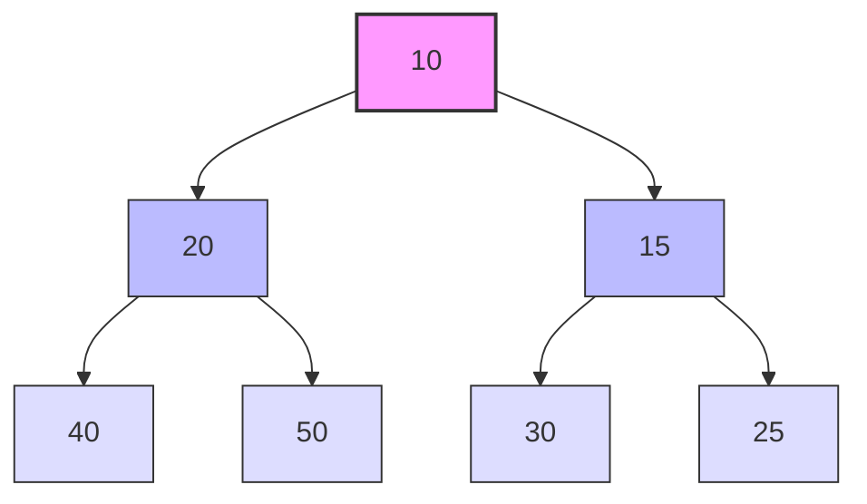

# Java PriorityQueue

## 什么是优先队列？

优先队列（PriorityQueue）是Java集合框架中的一个特殊队列实现，它与普通队列的区别在于：**元素的出队顺序不是先进先出(FIFO)，而是按照元素的优先级决定**。在PriorityQueue中，具有最高优先级的元素最先被移除。

:::note 基本特性
- 基于优先堆实现（通常是最小堆）
- 非阻塞队列
- 不允许存储null元素
- 不保证同等优先级元素的顺序
- 非线程安全
:::

## PriorityQueue的内部结构

PriorityQueue内部使用**堆**这种数据结构实现。默认情况下，Java的PriorityQueue是一个最小堆，意味着队首元素是整个队列中最小的元素。



## 创建PriorityQueue

### 默认构造函数

```java
PriorityQueue<Integer> pq = new PriorityQueue<>();
```
这会创建一个空的优先队列，使用元素的自然顺序（如Integer、String等实现了Comparable接口的类）。

### 指定初始容量

```java
PriorityQueue<Integer> pq = new PriorityQueue<>(10);
```

### 使用自定义比较器

```java
// 创建一个降序优先队列
PriorityQueue<Integer> pq = new PriorityQueue<>(Comparator.reverseOrder());

// 使用Lambda表达式自定义比较逻辑
PriorityQueue<String> pq2 = new PriorityQueue<>((s1, s2) -> s1.length() - s2.length());
```

### 从其他集合创建

```java
List<Integer> list = Arrays.asList(3, 1, 4, 1, 5, 9);
PriorityQueue<Integer> pq = new PriorityQueue<>(list);
```

## 基本操作

### 添加元素

```java
PriorityQueue<Integer> pq = new PriorityQueue<>();

// add方法 - 如果添加失败会抛出异常
pq.add(10);
pq.add(20);
pq.add(5);

// offer方法 - 如果添加失败会返回false
pq.offer(15);
```

### 查看元素

```java
// 查看队首元素但不移除（最小值） - 队列为空时返回null
Integer peek = pq.peek();  // 返回5

// element方法 - 队列为空时抛出异常
Integer element = pq.element();  // 返回5
```

### 移除元素

```java
// poll方法 - 移除并返回队首元素，队列为空时返回null
Integer poll = pq.poll();  // 返回5，队列变为[10, 15, 20]

// remove方法 - 移除并返回队首元素，队列为空时抛出异常
Integer removed = pq.remove();  // 返回10，队列变为[15, 20]
```

### 其他常用方法

```java
// 获取队列大小
int size = pq.size();

// 检查队列是否为空
boolean isEmpty = pq.isEmpty();

// 清空队列
pq.clear();

// 检查队列是否包含某元素
boolean contains = pq.contains(15);
```

## 完整示例

下面是一个简单完整的PriorityQueue使用示例：

```java
import java.util.PriorityQueue;
import java.util.Comparator;

public class PriorityQueueDemo {
    public static void main(String[] args) {
        // 创建一个最小堆优先队列
        PriorityQueue<Integer> minHeap = new PriorityQueue<>();
        minHeap.add(5);
        minHeap.add(2);
        minHeap.add(8);
        minHeap.add(1);
        minHeap.add(10);
        
        System.out.println("最小堆优先队列元素出队顺序：");
        while (!minHeap.isEmpty()) {
            System.out.print(minHeap.poll() + " ");
        }
        System.out.println();
        
        // 创建一个最大堆优先队列
        PriorityQueue<Integer> maxHeap = new PriorityQueue<>(Comparator.reverseOrder());
        maxHeap.add(5);
        maxHeap.add(2);
        maxHeap.add(8);
        maxHeap.add(1);
        maxHeap.add(10);
        
        System.out.println("最大堆优先队列元素出队顺序：");
        while (!maxHeap.isEmpty()) {
            System.out.print(maxHeap.poll() + " ");
        }
    }
}
```

输出结果：
```
最小堆优先队列元素出队顺序：
1 2 5 8 10 
最大堆优先队列元素出队顺序：
10 8 5 2 1 
```

## 使用自定义类型

对于自定义类型，我们需要确保它们是可比较的，有两种方式：

### 1. 实现Comparable接口

```java
import java.util.PriorityQueue;

public class PriorityQueueCustomClass {
    static class Task implements Comparable<Task> {
        private int priority;
        private String name;
        
        public Task(int priority, String name) {
            this.priority = priority;
            this.name = name;
        }
        
        @Override
        public int compareTo(Task other) {
            // 优先级低的排在前面（更高优先级）
            return this.priority - other.priority;
        }
        
        @Override
        public String toString() {
            return name + "(" + priority + ")";
        }
    }
    
    public static void main(String[] args) {
        PriorityQueue<Task> taskQueue = new PriorityQueue<>();
        taskQueue.add(new Task(3, "学习Java"));
        taskQueue.add(new Task(1, "紧急Bug修复"));
        taskQueue.add(new Task(5, "休息"));
        taskQueue.add(new Task(2, "代码审查"));
        
        System.out.println("任务将按优先级执行：");
        while (!taskQueue.isEmpty()) {
            System.out.println(taskQueue.poll());
        }
    }
}
```

输出结果：
```
任务将按优先级执行：
紧急Bug修复(1)
代码审查(2)
学习Java(3)
休息(5)
```

### 2. 提供Comparator比较器

```java
import java.util.PriorityQueue;
import java.util.Comparator;

public class PriorityQueueWithComparator {
    static class Student {
        private String name;
        private double gpa;
        
        public Student(String name, double gpa) {
            this.name = name;
            this.gpa = gpa;
        }
        
        public double getGpa() {
            return gpa;
        }
        
        @Override
        public String toString() {
            return name + "(GPA: " + gpa + ")";
        }
    }
    
    public static void main(String[] args) {
        // 按GPA降序排列的优先队列
        PriorityQueue<Student> studentQueue = new PriorityQueue<>(
            (s1, s2) -> Double.compare(s2.getGpa(), s1.getGpa())
        );
        
        studentQueue.add(new Student("张三", 3.8));
        studentQueue.add(new Student("李四", 3.5));
        studentQueue.add(new Student("王五", 4.0));
        studentQueue.add(new Student("赵六", 3.9));
        
        System.out.println("学生按GPA从高到低排序：");
        while (!studentQueue.isEmpty()) {
            System.out.println(studentQueue.poll());
        }
    }
}
```

输出结果：
```
学生按GPA从高到低排序：
王五(GPA: 4.0)
赵六(GPA: 3.9)
张三(GPA: 3.8)
李四(GPA: 3.5)
```

## 实际应用场景

PriorityQueue在实际开发中有许多应用场景：

### 1. 任务调度系统

在操作系统或任务调度器中，需要根据任务优先级决定执行顺序。

```java
class TaskScheduler {
    private PriorityQueue<Task> taskQueue = new PriorityQueue<>((t1, t2) -> t1.getPriority() - t2.getPriority());
    
    public void addTask(Task task) {
        taskQueue.offer(task);
    }
    
    public Task getNextTask() {
        return taskQueue.poll();
    }
}
```

### 2. 数据流中的Top-K问题

查找数据流中最大或最小的K个元素。

```java
public List<Integer> findTopKElements(int[] nums, int k) {
    // 使用最小堆找最大的K个元素
    PriorityQueue<Integer> heap = new PriorityQueue<>();
    
    for (int num : nums) {
        heap.offer(num);
        if (heap.size() > k) {
            heap.poll(); // 移除最小的元素，保持堆大小为k
        }
    }
    
    List<Integer> result = new ArrayList<>(heap);
    Collections.sort(result, Collections.reverseOrder());
    return result;
}
```

### 3. Dijkstra最短路径算法

在图算法中，Dijkstra算法用于寻找最短路径，需要使用优先队列来选择当前最短距离的节点。

```java
public void dijkstra(Graph graph, int start) {
    Map<Node, Integer> distances = new HashMap<>();
    PriorityQueue<Node> queue = new PriorityQueue<>(
        (n1, n2) -> distances.get(n1) - distances.get(n2)
    );
    
    // 初始化距离
    for (Node node : graph.getNodes()) {
        distances.put(node, Integer.MAX_VALUE);
    }
    distances.put(graph.getNode(start), 0);
    queue.offer(graph.getNode(start));
    
    while (!queue.isEmpty()) {
        Node current = queue.poll();
        // 更新邻居节点的距离
        for (Edge edge : current.getEdges()) {
            // 更新逻辑...
        }
    }
}
```

### 4. 事件驱动系统

在事件驱动的系统中，可能需要根据事件的优先级处理事件。

```java
class EventProcessor {
    private PriorityQueue<Event> eventQueue = new PriorityQueue<>(
        (e1, e2) -> e1.getPriority() - e2.getPriority()
    );
    
    public void addEvent(Event event) {
        eventQueue.offer(event);
    }
    
    public void processNextEvent() {
        Event event = eventQueue.poll();
        if (event != null) {
            event.process();
        }
    }
}
```

## PriorityQueue的性能特点

了解PriorityQueue的性能特点有助于在实际应用中更好地使用它：

| 操作 | 时间复杂度 |
|------|------------|
| 插入元素(offer/add) | O(log n) |
| 删除元素(poll/remove) | O(log n) |
| 查看元素(peek/element) | O(1) |
| contains方法 | O(n) |
| 迭代器遍历 | O(n log n) |

:::caution 注意事项
迭代遍历PriorityQueue不会按照优先级顺序返回元素，如果需要按优先级处理所有元素，应该循环使用poll()方法直到队列为空。
:::

## 常见问题与最佳实践

### 1. 避免使用迭代器遍历

如前所述，迭代器遍历不会按照优先级顺序返回元素。如果需要按优先级处理，应该使用poll()方法：

```java
// 正确方式：按优先级处理元素
PriorityQueue<Integer> pq = new PriorityQueue<>();
// 添加元素...
while (!pq.isEmpty()) {
    Integer element = pq.poll();
    // 处理元素...
}

// 错误方式：不保证按优先级顺序
for (Integer element : pq) {
    // 处理元素...
}
```

### 2. 不允许null元素

PriorityQueue不允许存储null元素，否则会抛出NullPointerException。

### 3. 处理相同优先级的元素

PriorityQueue不保证具有相同优先级的元素的排序。如果需要二级排序，应该在比较器中添加额外的条件：

```java
PriorityQueue<Task> taskQueue = new PriorityQueue<>(
    (t1, t2) -> {
        int priorityCompare = t1.getPriority() - t2.getPriority();
        if (priorityCompare != 0) {
            return priorityCompare;
        }
        // 若优先级相同，按创建时间排序
        return t1.getCreationTime().compareTo(t2.getCreationTime());
    }
);
```

### 4. 线程安全考虑

PriorityQueue不是线程安全的。在多线程环境下，可以使用：

- `PriorityBlockingQueue`：一个基于优先级的无界阻塞队列
- `java.util.concurrent.ConcurrentLinkedQueue`：虽然是FIFO队列，但是线程安全的

```java
import java.util.concurrent.PriorityBlockingQueue;

PriorityBlockingQueue<Integer> pbq = new PriorityBlockingQueue<>();
```

## 总结

Java中的PriorityQueue是一个强大的数据结构，它能够根据预定义的优先级自动组织元素。主要特点包括：

1. 基于堆实现的优先队列，默认为最小堆
2. 可以通过自然顺序或自定义比较器确定元素优先级
3. 提供O(log n)时间复杂度的插入和删除操作
4. 广泛应用于任务调度、Top-K问题、图算法等场景

通过本教程，你应该已经掌握了PriorityQueue的基本用法、内部机制和常见应用场景。在实际开发中，优先队列是处理优先级相关问题的理想选择，掌握它将为你的编程工具箱增添一个强大的工具。

## 练习

1. 实现一个紧急事件处理系统，根据事件的紧急程度（1-10，1最紧急）进行处理
2. 使用PriorityQueue实现一个简单的医院急诊室排队系统
3. 编写代码，从一个大文件中找出出现频率最高的前K个单词
4. 实现一个CPU任务调度器，根据进程优先级和到达时间安排执行顺序
5. 使用PriorityQueue实现Huffman编码算法中的构建树过程

## 额外资源

- Java官方文档: [PriorityQueue](https://docs.oracle.com/en/java/javase/17/docs/api/java.base/java/util/PriorityQueue.html)
- 视频教程: "Java集合框架详解 - 优先队列"
- 学习资源: "数据结构与算法 - 堆与优先队列"
- 练习题: LeetCode上与优先队列相关的问题集

继续学习和实践，你会发现PriorityQueue在解决复杂问题时非常有用！