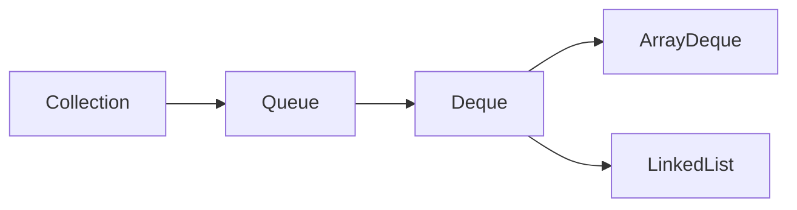

# Java Deque接口

## 什么是Deque？

Deque（发音为"deck"）是"Double Ended Queue"（双端队列）的缩写，代表一种特殊类型的队列，允许在两端进行元素的插入和删除操作。Java中的`Deque`接口继承自`Queue`接口，并提供了更丰富的操作方法。



与传统的队列（Queue）只能在一端添加元素、另一端移除元素不同，Deque可以：

- 在队列头部和尾部都可以添加元素
- 在队列头部和尾部都可以移除元素
- 可以查看队列两端的元素而不移除它们

这种灵活性使得Deque既可以用作队列（FIFO先进先出），也可以用作栈（LIFO后进先出）。

## Deque接口的主要方法

Deque接口包含了丰富的方法，可以分为以下几类：

### 插入操作

| 方法 | 描述 | 特殊情况处理 |
|------|------|------------|
| `addFirst(E e)` | 在队列头部添加元素 | 如果空间不足，抛出异常 |
| `offerFirst(E e)` | 在队列头部添加元素 | 如果空间不足，返回false |
| `addLast(E e)` | 在队列尾部添加元素 | 如果空间不足，抛出异常 |
| `offerLast(E e)` | 在队列尾部添加元素 | 如果空间不足，返回false |

### 移除操作

| 方法 | 描述 | 特殊情况处理 |
|------|------|------------|
| `removeFirst()` | 移除并返回队列头部的元素 | 如果队列为空，抛出异常 |
| `pollFirst()` | 移除并返回队列头部的元素 | 如果队列为空，返回null |
| `removeLast()` | 移除并返回队列尾部的元素 | 如果队列为空，抛出异常 |
| `pollLast()` | 移除并返回队列尾部的元素 | 如果队列为空，返回null |

### 查看操作

| 方法 | 描述 | 特殊情况处理 |
|------|------|------------|
| `getFirst()` | 获取但不移除队列头部的元素 | 如果队列为空，抛出异常 |
| `peekFirst()` | 获取但不移除队列头部的元素 | 如果队列为空，返回null |
| `getLast()` | 获取但不移除队列尾部的元素 | 如果队列为空，抛出异常 |
| `peekLast()` | 获取但不移除队列尾部的元素 | 如果队列为空，返回null |

### 队列/栈操作方法

Deque还提供了标准的队列和栈操作方法：

**队列方法（FIFO）**：
- `add(E e)` - 等同于 `addLast(e)`
- `offer(E e)` - 等同于 `offerLast(e)`
- `remove()` - 等同于 `removeFirst()`
- `poll()` - 等同于 `pollFirst()`
- `element()` - 等同于 `getFirst()`
- `peek()` - 等同于 `peekFirst()`

**栈方法（LIFO）**：
- `push(E e)` - 等同于 `addFirst(e)`
- `pop()` - 等同于 `removeFirst()`
- `peek()` - 等同于 `peekFirst()`

## Deque的主要实现类

Java提供了两个主要的Deque接口实现：

1. **ArrayDeque**：基于可调整大小的数组实现的双端队列，无容量限制。
2. **LinkedList**：基于双向链表实现的双端队列，同时实现了List接口。

### ArrayDeque 特点

- 没有容量限制（会根据需要扩容）
- 不允许null元素
- 非线程安全
- 作为栈使用时比Stack类更快
- 作为队列使用时比LinkedList更快
- 随机访问元素的效率低于ArrayList

### LinkedList 特点

- 同时实现了List和Deque接口
- 允许null元素
- 非线程安全
- 相比ArrayDeque，插入和删除操作有时更高效
- 需要更多的内存空间

## 代码示例

### 创建和基本操作

```java
import java.util.ArrayDeque;
import java.util.Deque;

public class DequeExample {
    public static void main(String[] args) {
        // 创建Deque实例
        Deque<String> deque = new ArrayDeque<>();
        
        // 添加元素到两端
        deque.addFirst("First");
        deque.addLast("Last");
        
        // 在两端之间添加元素
        deque.add("Middle");  // 等同于addLast
        
        System.out.println("Deque内容: " + deque);
        
        // 查看两端元素但不移除
        System.out.println("第一个元素: " + deque.getFirst());
        System.out.println("最后一个元素: " + deque.getLast());
        
        // 移除元素
        String removedFirst = deque.removeFirst();
        String removedLast = deque.removeLast();
        
        System.out.println("移除的第一个元素: " + removedFirst);
        System.out.println("移除的最后一个元素: " + removedLast);
        System.out.println("移除后Deque内容: " + deque);
    }
}
```

输出：
```
Deque内容: [First, Middle, Last]
第一个元素: First
最后一个元素: Last
移除的第一个元素: First
移除的最后一个元素: Last
移除后Deque内容: [Middle]
```

### 作为栈使用

```java
import java.util.ArrayDeque;
import java.util.Deque;

public class DequeAsStackExample {
    public static void main(String[] args) {
        Deque<String> stack = new ArrayDeque<>();
        
        // 压栈操作
        stack.push("底层元素");
        stack.push("中间元素");
        stack.push("顶层元素");
        
        System.out.println("栈内容: " + stack);
        
        // 查看栈顶元素但不移除
        System.out.println("栈顶元素: " + stack.peek());
        
        // 出栈操作
        while (!stack.isEmpty()) {
            System.out.println("弹出: " + stack.pop());
        }
    }
}
```

输出：
```
栈内容: [顶层元素, 中间元素, 底层元素]
栈顶元素: 顶层元素
弹出: 顶层元素
弹出: 中间元素
弹出: 底层元素
```

### 作为队列使用

```java
import java.util.ArrayDeque;
import java.util.Deque;

public class DequeAsQueueExample {
    public static void main(String[] args) {
        Deque<String> queue = new ArrayDeque<>();
        
        // 入队操作
        queue.offer("第一个");
        queue.offer("第二个");
        queue.offer("第三个");
        
        System.out.println("队列内容: " + queue);
        
        // 查看队列头部元素但不移除
        System.out.println("队列头部: " + queue.peek());
        
        // 出队操作
        while (!queue.isEmpty()) {
            System.out.println("出队: " + queue.poll());
        }
    }
}
```

输出：
```
队列内容: [第一个, 第二个, 第三个]
队列头部: 第一个
出队: 第一个
出队: 第二个
出队: 第三个
```

## 实际应用场景

### 1. 浏览器历史记录

Deque可以用来实现浏览器的前进/后退历史记录功能：

```java
import java.util.ArrayDeque;
import java.util.Deque;

public class BrowserHistory {
    private String currentPage;
    private Deque<String> backHistory;
    private Deque<String> forwardHistory;
    
    public BrowserHistory(String homepage) {
        currentPage = homepage;
        backHistory = new ArrayDeque<>();
        forwardHistory = new ArrayDeque<>();
        System.out.println("当前页面: " + currentPage);
    }
    
    public void visit(String url) {
        backHistory.push(currentPage);
        currentPage = url;
        forwardHistory.clear();  // 清除前进历史
        System.out.println("访问页面: " + currentPage);
    }
    
    public void back() {
        if (backHistory.isEmpty()) {
            System.out.println("无法后退，没有更多历史记录");
            return;
        }
        
        forwardHistory.push(currentPage);
        currentPage = backHistory.pop();
        System.out.println("后退到: " + currentPage);
    }
    
    public void forward() {
        if (forwardHistory.isEmpty()) {
            System.out.println("无法前进，没有更多历史记录");
            return;
        }
        
        backHistory.push(currentPage);
        currentPage = forwardHistory.pop();
        System.out.println("前进到: " + currentPage);
    }
    
    public static void main(String[] args) {
        BrowserHistory browser = new BrowserHistory("www.homepage.com");
        
        browser.visit("www.page1.com");
        browser.visit("www.page2.com");
        browser.visit("www.page3.com");
        
        browser.back();  // 回到page2
        browser.back();  // 回到page1
        
        browser.forward();  // 前进到page2
        
        browser.visit("www.newpage.com");  // 访问新页面
        
        browser.forward();  // 尝试前进
        browser.back();     // 回到page2
    }
}
```

输出：
```
当前页面: www.homepage.com
访问页面: www.page1.com
访问页面: www.page2.com
访问页面: www.page3.com
后退到: www.page2.com
后退到: www.page1.com
前进到: www.page2.com
访问页面: www.newpage.com
无法前进，没有更多历史记录
后退到: www.page2.com
```

### 2. 滑动窗口问题

Deque在处理滑动窗口类问题时非常有用：

```java
import java.util.ArrayDeque;
import java.util.Arrays;
import java.util.Deque;

public class SlidingWindowMaximum {
    public static int[] maxSlidingWindow(int[] nums, int k) {
        if (nums == null || nums.length == 0 || k <= 0) return new int[0];
        
        int n = nums.length;
        int[] result = new int[n - k + 1];
        Deque<Integer> deque = new ArrayDeque<>();
        
        for (int i = 0; i < n; i++) {
            // 移除滑出窗口的元素
            if (!deque.isEmpty() && deque.peekFirst() < i - k + 1) {
                deque.pollFirst();
            }
            
            // 移除比当前元素小的所有元素，它们不可能是窗口中的最大值
            while (!deque.isEmpty() && nums[deque.peekLast()] < nums[i]) {
                deque.pollLast();
            }
            
            // 添加当前索引
            deque.offerLast(i);
            
            // 当窗口完全形成后，记录结果
            if (i >= k - 1) {
                result[i - k + 1] = nums[deque.peekFirst()];
            }
        }
        
        return result;
    }
    
    public static void main(String[] args) {
        int[] nums = {1, 3, -1, -3, 5, 3, 6, 7};
        int k = 3;
        int[] result = maxSlidingWindow(nums, k);
        
        System.out.println("原数组: " + Arrays.toString(nums));
        System.out.println("窗口大小: " + k);
        System.out.println("滑动窗口最大值: " + Arrays.toString(result));
    }
}
```

输出：
```
原数组: [1, 3, -1, -3, 5, 3, 6, 7]
窗口大小: 3
滑动窗口最大值: [3, 3, 5, 5, 6, 7]
```

### 3. 任务调度器

```java
import java.util.ArrayDeque;
import java.util.Deque;

public class TaskScheduler {
    private Deque<String> regularTasks;
    private Deque<String> priorityTasks;
    
    public TaskScheduler() {
        regularTasks = new ArrayDeque<>();
        priorityTasks = new ArrayDeque<>();
    }
    
    public void addRegularTask(String task) {
        regularTasks.offerLast(task);
        System.out.println("添加常规任务: " + task);
    }
    
    public void addPriorityTask(String task) {
        priorityTasks.offerFirst(task);
        System.out.println("添加优先任务: " + task);
    }
    
    public String getNextTask() {
        if (!priorityTasks.isEmpty()) {
            return priorityTasks.pollFirst();
        } else if (!regularTasks.isEmpty()) {
            return regularTasks.pollFirst();
        } else {
            return "没有待处理的任务";
        }
    }
    
    public static void main(String[] args) {
        TaskScheduler scheduler = new TaskScheduler();
        
        scheduler.addRegularTask("发送邮件");
        scheduler.addRegularTask("生成报表");
        scheduler.addPriorityTask("系统错误修复");
        scheduler.addRegularTask("数据备份");
        scheduler.addPriorityTask("安全漏洞修补");
        
        System.out.println("\n执行任务顺序:");
        for (int i = 0; i < 6; i++) {
            System.out.println("下一个任务: " + scheduler.getNextTask());
        }
    }
}
```

输出：
```
添加常规任务: 发送邮件
添加常规任务: 生成报表
添加优先任务: 系统错误修复
添加常规任务: 数据备份
添加优先任务: 安全漏洞修补

执行任务顺序:
下一个任务: 安全漏洞修补
下一个任务: 系统错误修复
下一个任务: 发送邮件
下一个任务: 生成报表
下一个任务: 数据备份
下一个任务: 没有待处理的任务
```

## Deque接口的性能考量

:::tip 性能提示
不同的Deque实现在不同操作上性能表现不同：

- **ArrayDeque**：作为栈或队列使用时，通常比Stack和LinkedList性能更好。空间效率较高，但不支持null元素。
- **LinkedList**：如果经常在两端进行插入和删除操作，且需要支持null元素时，可以选择LinkedList。但它占用空间较多。
:::

## 选择合适的Deque实现

选择合适的Deque实现时需要考虑以下因素：

1. **内存使用**：如果内存使用是关键因素，ArrayDeque通常更高效。
2. **null元素支持**：如果需要存储null元素，只能选择LinkedList。
3. **随机访问**：如果需要快速随机访问元素（通过索引），应使用ArrayList而不是任何Deque实现。
4. **并发安全**：ArrayDeque和LinkedList都不是线程安全的。如果需要线程安全，考虑使用`Collections.synchronizedDeque()`或`ConcurrentLinkedDeque`。

## 总结

Java的Deque接口提供了一种强大且灵活的数据结构，能够满足多种不同的应用场景需求：

- **双端队列操作**：同时支持在两端进行添加和删除元素
- **队列操作**：可以作为标准的FIFO队列使用
- **栈操作**：可以作为LIFO栈使用
- **实现选择**：ArrayDeque和LinkedList各有优势，可以根据实际需求选择

通过理解和掌握Deque接口，你可以在Java编程中实现更高效、更灵活的数据处理功能，从简单的数据缓冲到复杂的算法实现，Deque都能提供强大的支持。

## 练习题

1. 使用ArrayDeque实现一个回文检查器，判断给定的字符串是否为回文串。
2. 实现一个简单的文本编辑器，支持撤销（undo）和重做（redo）操作，使用两个Deque来存储操作历史。
3. 使用Deque实现一个约瑟夫环问题的解决方案。
4. 比较ArrayDeque和LinkedList在不同容量和操作类型下的性能差异。
5. 设计一个使用Deque的数据结构，同时支持在O(1)时间内获取最小值和最大值。

## 进一步学习资源

- Java官方文档：[Deque Interface](https://docs.oracle.com/javase/8/docs/api/java/util/Deque.html)
- Java官方文档：[ArrayDeque Class](https://docs.oracle.com/javase/8/docs/api/java/util/ArrayDeque.html)
- Java官方文档：[LinkedList Class](https://docs.oracle.com/javase/8/docs/api/java/util/LinkedList.html)

通过学习和应用Deque接口，你将能够更好地理解Java集合框架，并在实际项目中灵活运用这一强大的数据结构。