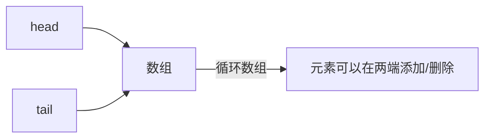

# Java ArrayDeque

ArrayDeque 是 Java 集合框架中的一个重要实现类，它提供了一种基于可调整大小的数组实现的双端队列（deque，全称 double-ended queue）。双端队列允许我们在队列的两端添加或删除元素，这使得它既可以用作栈（Stack），也可以用作队列（Queue）。

## ArrayDeque 的特点

ArrayDeque 具有以下几个重要特点：

1. **不允许 null 元素** - 向 ArrayDeque 中添加 null 元素会导致 NullPointerException。
2. **非线程安全** - ArrayDeque 不是线程安全的，如果需要在多线程环境下使用，需要进行额外的同步。
3. **无容量限制** - ArrayDeque 会在必要时自动扩容，无需担心容量问题。
4. **快速** - 大多数操作（如 add、remove 和 peek）的时间复杂度为 O(1)。
5. **作为栈比 Stack 更快** - 当用作栈时，ArrayDeque 通常比 Stack 类更快。
6. **作为队列比 LinkedList 更快** - 当用作队列时，ArrayDeque 通常比 LinkedList 更快。

## ArrayDeque 的基本操作

### 创建 ArrayDeque

```java
// 创建一个空的 ArrayDeque
ArrayDeque<String> deque1 = new ArrayDeque<>();

// 创建一个指定初始容量的 ArrayDeque
ArrayDeque<String> deque2 = new ArrayDeque<>(20);

// 创建一个包含其他集合元素的 ArrayDeque
Collection<String> collection = Arrays.asList("Java", "Python", "C++");
ArrayDeque<String> deque3 = new ArrayDeque<>(collection);
```

### 作为双端队列使用

ArrayDeque 实现了 Deque 接口，提供了在队列两端添加和移除元素的方法：

```java
ArrayDeque<String> deque = new ArrayDeque<>();

// 在队尾添加元素
deque.add("Java");       // 添加元素，如果失败抛出异常
deque.addLast("Python"); // 在队尾添加元素
deque.offer("C++");      // 添加元素，如果失败返回 false
deque.offerLast("JavaScript"); // 在队尾添加元素

// 在队首添加元素
deque.addFirst("Ruby");  // 在队首添加元素
deque.offerFirst("Go");  // 在队首添加元素

System.out.println(deque); // 输出: [Go, Ruby, Java, Python, C++, JavaScript]

// 获取元素
String first = deque.getFirst(); // 获取队首元素，如果队列为空抛出异常
String last = deque.getLast();   // 获取队尾元素，如果队列为空抛出异常
String peekFirst = deque.peekFirst(); // 获取队首元素，如果队列为空返回 null
String peekLast = deque.peekLast();   // 获取队尾元素，如果队列为空返回 null

// 移除元素
deque.removeFirst(); // 移除并返回队首元素，如果队列为空抛出异常
deque.removeLast();  // 移除并返回队尾元素，如果队列为空抛出异常
deque.pollFirst();   // 移除并返回队首元素，如果队列为空返回 null
deque.pollLast();    // 移除并返回队尾元素，如果队列为空返回 null

System.out.println(deque); // 输出: [Java, Python]
```

### 作为栈使用

ArrayDeque 也可以很方便地用作栈（LIFO, Last-In-First-Out）：

```java
ArrayDeque<String> stack = new ArrayDeque<>();

// 入栈
stack.push("Java");
stack.push("Python");
stack.push("C++");

System.out.println(stack); // 输出: [C++, Python, Java]

// 查看栈顶元素
String top = stack.peek(); // 获取栈顶元素，不移除
System.out.println(top);   // 输出: C++

// 出栈
String popped = stack.pop(); // 移除并返回栈顶元素
System.out.println(popped);  // 输出: C++
System.out.println(stack);   // 输出: [Python, Java]
```

### 作为队列使用

ArrayDeque 还可以用作标准队列（FIFO, First-In-First-Out）：

```java
ArrayDeque<String> queue = new ArrayDeque<>();

// 入队
queue.offer("Java");
queue.offer("Python");
queue.offer("C++");

System.out.println(queue); // 输出: [Java, Python, C++]

// 查看队首元素
String head = queue.peek(); // 获取队首元素，不移除
System.out.println(head);   // 输出: Java

// 出队
String dequeued = queue.poll(); // 移除并返回队首元素
System.out.println(dequeued);   // 输出: Java
System.out.println(queue);      // 输出: [Python, C++]
```

## ArrayDeque 的内部实现

:::note
ArrayDeque 内部使用循环数组实现，这使得它在两端操作元素时都非常高效。
:::

当元素数量接近数组容量时，ArrayDeque 会自动扩容，通常是将容量增加至原来的两倍。



## ArrayDeque 与其他集合的比较

| 集合类型 | 用作栈 | 用作队列 | null 元素 | 线程安全 |
|---------|-------|---------|---------|---------|
| ArrayDeque | 快 | 快 | 不允许 | 否 |
| Stack | 慢 | 不适用 | 允许 | 是 |
| LinkedList | 中等 | 中等 | 允许 | 否 |
| PriorityQueue | 不适用 | 优先级 | 不允许 | 否 |

## 实际应用场景

### 1. 实现撤销/重做功能

ArrayDeque 可以用于实现软件中的撤销/重做功能，通过维护两个栈来跟踪操作历史：

```java
public class UndoRedoManager {
    private ArrayDeque<Action> undoStack = new ArrayDeque<>();
    private ArrayDeque<Action> redoStack = new ArrayDeque<>();
    
    public void doAction(Action action) {
        action.execute();
        undoStack.push(action);
        redoStack.clear(); // 执行新操作后清空重做栈
    }
    
    public void undo() {
        if (!undoStack.isEmpty()) {
            Action action = undoStack.pop();
            action.revert();
            redoStack.push(action);
        }
    }
    
    public void redo() {
        if (!redoStack.isEmpty()) {
            Action action = redoStack.pop();
            action.execute();
            undoStack.push(action);
        }
    }
    
    // Action 接口
    public interface Action {
        void execute();
        void revert();
    }
}
```

### 2. 实现广度优先搜索

在图算法中，ArrayDeque 可以用作队列来实现广度优先搜索（BFS）：

```java
public void breadthFirstSearch(Graph graph, Node start) {
    ArrayDeque<Node> queue = new ArrayDeque<>();
    Set<Node> visited = new HashSet<>();
    
    queue.offer(start);
    visited.add(start);
    
    while (!queue.isEmpty()) {
        Node current = queue.poll();
        System.out.println("Visiting: " + current);
        
        for (Node neighbor : graph.getNeighbors(current)) {
            if (!visited.contains(neighbor)) {
                visited.add(neighbor);
                queue.offer(neighbor);
            }
        }
    }
}
```

### 3. 实现滑动窗口

ArrayDeque 可以用于实现滑动窗口算法，例如计算数组中连续 k 个元素的最大值：

```java
public int[] maxSlidingWindow(int[] nums, int k) {
    if (nums == null || nums.length == 0 || k <= 0) {
        return new int[0];
    }
    
    int n = nums.length;
    int[] result = new int[n - k + 1];
    ArrayDeque<Integer> deque = new ArrayDeque<>();
    
    for (int i = 0; i < n; i++) {
        // 移除超出窗口范围的元素索引
        while (!deque.isEmpty() && deque.peekFirst() < i - k + 1) {
            deque.pollFirst();
        }
        
        // 移除比当前元素小的所有元素索引，因为它们不可能是窗口的最大值
        while (!deque.isEmpty() && nums[deque.peekLast()] < nums[i]) {
            deque.pollLast();
        }
        
        deque.offerLast(i);
        
        // 当窗口形成时，记录最大值
        if (i >= k - 1) {
            result[i - k + 1] = nums[deque.peekFirst()];
        }
    }
    
    return result;
}
```

## ArrayDeque 的性能考虑

:::tip
当需要在集合两端频繁添加或移除元素时，ArrayDeque 通常是最佳选择。
:::

- **时间复杂度**：
  - 在两端添加/移除元素：O(1)
  - 在中间添加/移除元素：不支持直接操作，需要移除部分元素后再添加
  - 随机访问：不支持，需要使用迭代器或将元素移除

- **空间复杂度**：
  - 内部数组会预留一些额外空间，通常比实际存储的元素多一些
  - 当元素数量接近数组容量时，会自动扩容

## 总结

ArrayDeque 是 Java 集合框架中非常实用的一个类，它提供了高效的双端队列实现，可以用作栈、队列或双端队列。它比 Stack 类更快，比 LinkedList 更高效，是很多场景下的理想选择。主要记住以下几点：

1. ArrayDeque 不允许存储 null 元素
2. 它不是线程安全的
3. 它提供了 O(1) 时间复杂度的两端操作
4. 它可以自动扩容，无需担心容量限制
5. 它在作为栈或队列使用时性能都很出色

## 练习

1. 使用 ArrayDeque 实现一个简单的计算器，处理后缀表达式（逆波兰表示法）
2. 实现一个页面浏览历史功能，支持前进和后退操作
3. 编写一个程序，使用 ArrayDeque 检查括号匹配是否正确（例如：`{[()]}` 是正确的，但 `{[(]}` 是错误的）
4. 使用 ArrayDeque 实现一个 LRU（Least Recently Used）缓存
5. 比较 ArrayDeque 和 LinkedList 在用作队列和栈时的性能差异

## 进一步阅读

- Java 官方文档中关于 [ArrayDeque](https://docs.oracle.com/javase/8/docs/api/java/util/ArrayDeque.html) 的部分
- 学习其他队列实现类，如 LinkedList 和 PriorityQueue
- 探索 Java 中的并发队列实现，如 ConcurrentLinkedDeque