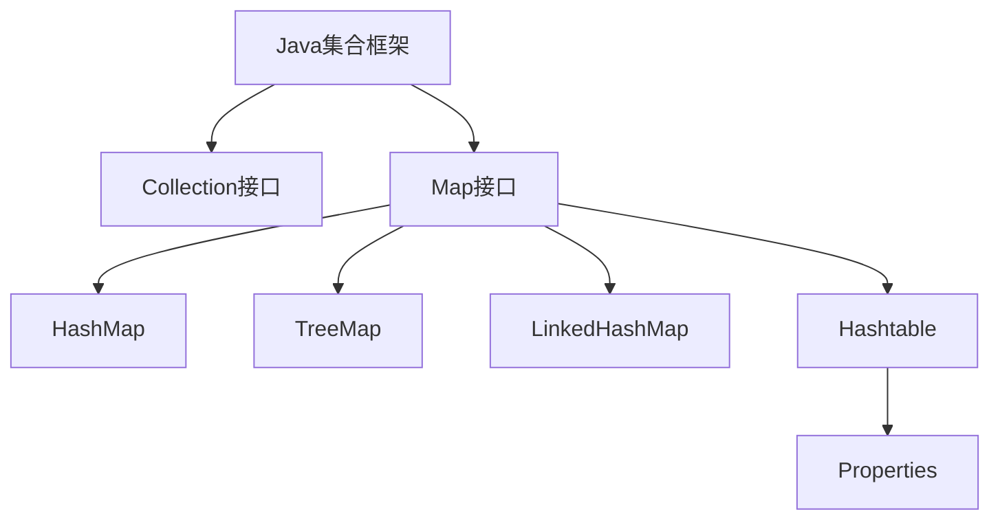

# Java Map接口

## 什么是Map接口？

Map接口是Java集合框架中的一个核心接口，与Collection接口不同，它用于存储键-值对（key-value pairs）形式的元素。Map接口的特点是每个键（key）只能对应一个值（value），且键不能重复，但值可以重复。

Map接口位于`java.util`包中，它提供了一种高效的方式来存储、检索和操作键值对数据。



## Map接口基本特性

- **键值对映射**：每个元素都是一个键值对
- **唯一键**：每个键在Map中只能出现一次
- **值可重复**：不同的键可以映射到相同的值
- **无序集合**：大多数Map实现不保证元素的顺序（LinkedHashMap例外）
- **不允许null键**：某些实现（如Hashtable）不允许null键或null值

## Map接口的主要实现类

### HashMap

HashMap是Map接口最常用的实现类，它基于哈希表实现，具有较高的查询和插入效率。

**特点：**
- 不保证元素的顺序
- 允许null键和null值
- 非线程安全
- O(1)时间复杂度的基本操作（理想情况下）

```java
// 创建HashMap
Map<String, Integer> studentScores = new HashMap<>();

// 添加键值对
studentScores.put("Alice", 95);
studentScores.put("Bob", 87);
studentScores.put("Charlie", 92);

// 获取值
System.out.println("Bob's score: " + studentScores.get("Bob"));  // 输出: Bob's score: 87

// 检查键是否存在
System.out.println("Is David in the map? " + studentScores.containsKey("David"));  // 输出: Is David in the map? false

// 遍历Map
for (Map.Entry<String, Integer> entry : studentScores.entrySet()) {
    System.out.println(entry.getKey() + ": " + entry.getValue());
}
// 输出:
// Alice: 95
// Bob: 87
// Charlie: 92
```

### TreeMap

TreeMap基于红黑树实现，它可以根据键的自然顺序或自定义比较器进行排序。

**特点：**
- 保证元素按键的顺序排序
- 不允许null键（可以有null值）
- 非线程安全
- 基本操作的时间复杂度为O(log n)

```java
// 创建TreeMap
TreeMap<String, Integer> sortedScores = new TreeMap<>();

// 添加键值对
sortedScores.put("Charlie", 92);
sortedScores.put("Alice", 95);
sortedScores.put("Bob", 87);

// 遍历TreeMap (将按照键的字母顺序排序)
for (Map.Entry<String, Integer> entry : sortedScores.entrySet()) {
    System.out.println(entry.getKey() + ": " + entry.getValue());
}
// 输出:
// Alice: 95
// Bob: 87
// Charlie: 92

// TreeMap特有方法
System.out.println("First key: " + sortedScores.firstKey());  // 输出: First key: Alice
System.out.println("Last key: " + sortedScores.lastKey());    // 输出: Last key: Charlie
```

### LinkedHashMap

LinkedHashMap是HashMap的子类，它在保持HashMap高效性能的同时，还维护了元素的插入顺序。

**特点：**
- 保持元素的插入顺序
- 允许null键和null值
- 非线程安全
- 基本操作的时间复杂度为O(1)

```java
// 创建LinkedHashMap
LinkedHashMap<String, Integer> orderedScores = new LinkedHashMap<>();

// 添加键值对
orderedScores.put("Charlie", 92);
orderedScores.put("Alice", 95);
orderedScores.put("Bob", 87);

// 遍历LinkedHashMap (将保持插入顺序)
for (Map.Entry<String, Integer> entry : orderedScores.entrySet()) {
    System.out.println(entry.getKey() + ": " + entry.getValue());
}
// 输出:
// Charlie: 92
// Alice: 95
// Bob: 87
```

### Hashtable

Hashtable是一个线程安全的Map实现，但在现代Java应用中，通常被ConcurrentHashMap替代。

**特点：**
- 线程安全（所有方法都是同步的）
- 不允许null键或null值
- 效率低于HashMap（因为同步开销）

```java
// 创建Hashtable
Hashtable<String, Integer> threadSafeScores = new Hashtable<>();

// 添加键值对
threadSafeScores.put("Alice", 95);
threadSafeScores.put("Bob", 87);
// threadSafeScores.put("David", null);  // 会抛出NullPointerException
```

## Map接口常用方法

| 方法 | 描述 |
|------|------|
| `put(K key, V value)` | 将指定的键值对添加到Map中 |
| `get(Object key)` | 返回指定键所映射的值，如果不存在则返回null |
| `remove(Object key)` | 从Map中移除指定键的映射关系 |
| `containsKey(Object key)` | 检查Map是否包含指定的键 |
| `containsValue(Object value)` | 检查Map是否包含指定的值 |
| `size()` | 返回Map中键值对的数量 |
| `isEmpty()` | 检查Map是否为空 |
| `clear()` | 清空Map中的所有键值对 |
| `keySet()` | 返回Map中所有键的Set集合 |
| `values()` | 返回Map中所有值的Collection集合 |
| `entrySet()` | 返回Map中所有键值对的Set集合 |
| `putAll(Map m)` | 将指定Map中的所有键值对复制到此Map中 |
| `getOrDefault(Object key, V defaultValue)` | 返回指定键所映射的值，如果不存在则返回默认值 |

### 遍历Map的方法

```java
Map<String, Integer> map = new HashMap<>();
map.put("A", 1);
map.put("B", 2);
map.put("C", 3);

// 方法1：使用entrySet()
for (Map.Entry<String, Integer> entry : map.entrySet()) {
    System.out.println(entry.getKey() + ": " + entry.getValue());
}

// 方法2：使用keySet()和get()
for (String key : map.keySet()) {
    System.out.println(key + ": " + map.get(key));
}

// 方法3：使用Java 8 Lambda表达式
map.forEach((key, value) -> System.out.println(key + ": " + value));
```

## 实际应用场景

### 场景1：学生信息管理系统

```java
// 用HashMap存储学生信息
Map<String, Student> studentDatabase = new HashMap<>();

// 添加学生
studentDatabase.put("S001", new Student("Alice", "Computer Science", 3.8));
studentDatabase.put("S002", new Student("Bob", "Electrical Engineering", 3.5));
studentDatabase.put("S003", new Student("Charlie", "Mathematics", 3.9));

// 快速通过学号查找学生
String studentId = "S002";
Student student = studentDatabase.get(studentId);
if (student != null) {
    System.out.println("Found student: " + student.getName() + ", Major: " + student.getMajor());
} else {
    System.out.println("Student not found!");
}
// 输出: Found student: Bob, Major: Electrical Engineering
```

### 场景2：词频统计

使用Map来统计文本中单词出现的频率：

```java
public static Map<String, Integer> countWordFrequency(String text) {
    Map<String, Integer> wordFrequency = new HashMap<>();
    
    // 将文本分割为单词
    String[] words = text.toLowerCase().split("\\W+");
    
    // 统计每个单词的频率
    for (String word : words) {
        if (!word.isEmpty()) {
            // 如果单词已存在，则频率+1；否则设为1
            wordFrequency.put(word, wordFrequency.getOrDefault(word, 0) + 1);
        }
    }
    
    return wordFrequency;
}

// 使用示例
String text = "To be or not to be, that is the question";
Map<String, Integer> frequency = countWordFrequency(text);

// 输出结果
frequency.forEach((word, count) -> System.out.println(word + ": " + count));
// 输出：
// to: 2
// be: 2
// or: 1
// not: 1
// that: 1
// is: 1
// the: 1
// question: 1
```

### 场景3：缓存实现

使用LinkedHashMap实现一个简单的LRU (Least Recently Used) 缓存：

```java
public class LRUCache<K, V> extends LinkedHashMap<K, V> {
    private final int capacity;
    
    public LRUCache(int capacity) {
        // true表示按访问顺序排序（最近访问的元素会移到末尾）
        super(capacity, 0.75f, true);
        this.capacity = capacity;
    }
    
    @Override
    protected boolean removeEldestEntry(Map.Entry<K, V> eldest) {
        // 当大小超过容量时，移除最老的元素
        return size() > capacity;
    }
}

// 使用示例
LRUCache<Integer, String> cache = new LRUCache<>(3);
cache.put(1, "One");
cache.put(2, "Two");
cache.put(3, "Three");
System.out.println(cache);  // 输出: {1=One, 2=Two, 3=Three}

// 访问键1（将移动到末尾）
cache.get(1);
System.out.println(cache);  // 输出: {2=Two, 3=Three, 1=One}

// 添加新元素，将移除最老的元素（此时是2）
cache.put(4, "Four");
System.out.println(cache);  // 输出: {3=Three, 1=One, 4=Four}
```

## 选择合适的Map实现

| Map实现 | 适用场景 |
|---------|---------|
| **HashMap** | 需要高效的查找、插入和删除操作，不关心元素顺序 |
| **TreeMap** | 需要按键的自然顺序或自定义顺序存储元素 |
| **LinkedHashMap** | 需要保持元素插入顺序或访问顺序 |
| **Hashtable** | 需要线程安全的情况（但更推荐ConcurrentHashMap） |
| **ConcurrentHashMap** | 高并发环境下的线程安全Map实现 |
| **EnumMap** | 键是枚举类型 |
| **IdentityHashMap** | 使用引用相等（==）而不是equals()比较键 |
| **WeakHashMap** | 当键不再被引用时，相应的条目会自动被移除 |

## Map接口的常见问题与解决方案

### 1. 哈希冲突

当两个不同的键产生相同的哈希值时，会发生哈希冲突。HashMap通过链表（或在Java 8以后的红黑树）解决这个问题。

:::tip 提示
为了减少哈希冲突，在自定义类作为键时，应正确重写`hashCode()`和`equals()`方法。
:::

### 2. 避免并发修改异常

在遍历Map的同时修改它，可能会抛出`ConcurrentModificationException`：

```java
// 错误方式：在遍历时直接修改Map
Map<String, Integer> scores = new HashMap<>();
scores.put("Alice", 85);
scores.put("Bob", 65);

for (Map.Entry<String, Integer> entry : scores.entrySet()) {
    if (entry.getValue() < 70) {
        scores.remove(entry.getKey());  // 抛出ConcurrentModificationException
    }
}

// 正确方式：使用迭代器的remove方法
Map<String, Integer> scores = new HashMap<>();
scores.put("Alice", 85);
scores.put("Bob", 65);

Iterator<Map.Entry<String, Integer>> iterator = scores.entrySet().iterator();
while (iterator.hasNext()) {
    Map.Entry<String, Integer> entry = iterator.next();
    if (entry.getValue() < 70) {
        iterator.remove();  // 正确的移除方式
    }
}
```

## 总结

Java Map接口提供了一种强大的机制来存储和操作键值对数据。它的主要实现类包括HashMap、TreeMap、LinkedHashMap和Hashtable，每种实现都有其特定的用途和性能特点。通过了解这些特性，你可以为不同的应用场景选择最合适的Map实现。

Map接口在实际开发中应用广泛，从简单的数据存储和检索到复杂的缓存实现和算法应用。掌握Map接口的使用是Java编程的基本技能之一。

## 练习

1. 创建一个HashMap，存储5个国家名称和它们的首都，然后实现以下功能：
   - 添加一个新的国家和首都
   - 检查特定国家是否在Map中
   - 打印所有国家及其首都
   - 移除一个国家

2. 实现一个使用TreeMap的电话簿程序，按姓名字母顺序存储联系人信息。

3. 使用Map实现一个简单的单词计数器，统计一段文本中每个单词出现的次数，并按出现频率从高到低排序输出结果。

## 更多资源

- Java官方文档: [Map接口](https://docs.oracle.com/javase/8/docs/api/java/util/Map.html)
- Java官方文档: [HashMap类](https://docs.oracle.com/javase/8/docs/api/java/util/HashMap.html)
- Java官方文档: [TreeMap类](https://docs.oracle.com/javase/8/docs/api/java/util/TreeMap.html)
- Java官方文档: [LinkedHashMap类](https://docs.oracle.com/javase/8/docs/api/java/util/LinkedHashMap.html)