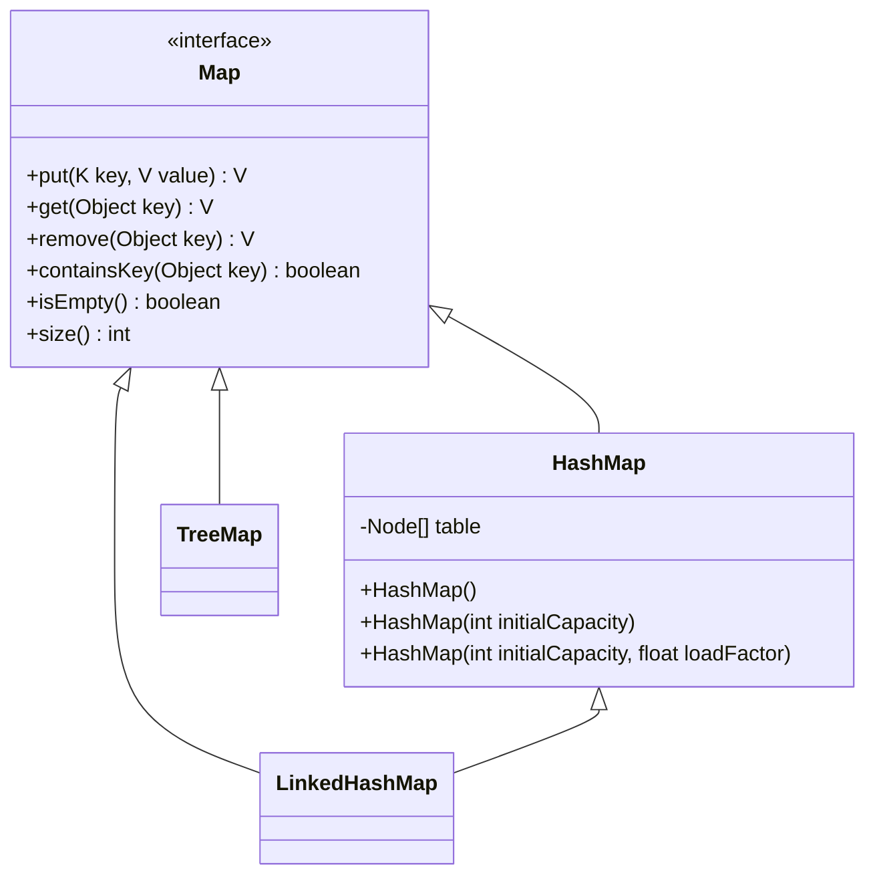
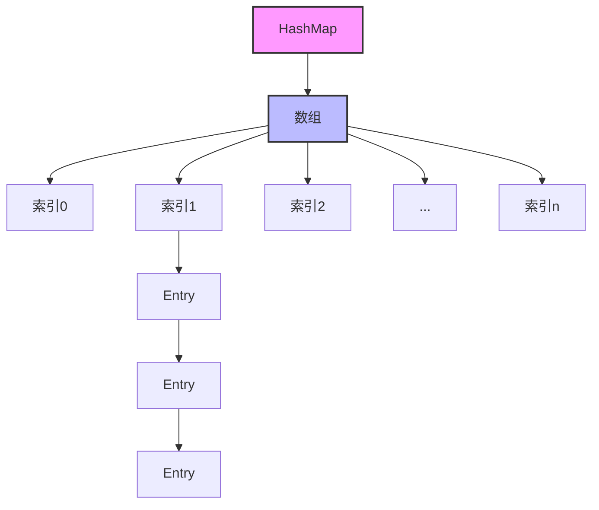

# Java HashMap

HashMap是Java集合框架中最常用的实现类之一，它允许我们存储键值对（key-value pairs），并提供了高效的数据检索机制。本文将从基础开始，全面介绍HashMap的概念、特点、使用方法及实际应用场景。

## 什么是HashMap？

HashMap是基于哈希表实现的Map接口，它存储的内容是键值对(key-value)映射。HashMap特点如下：

- 实现了Map接口
- 允许null键和null值
- 不保证映射的顺序
- 假设哈希函数将元素均匀分布，则HashMap的增删改查操作的时间复杂度接近O(1)
- 非线程安全



## HashMap的基本原理

HashMap内部使用数组+链表（JDK 1.8后加入红黑树）的数据结构实现：

1. 通过hash函数将key映射到数组的某个位置
2. 如果多个key映射到同一位置（称为"碰撞"或"冲突"），则使用链表存储
3. 当链表长度超过阈值（默认为8）时，链表会转换为红黑树以提高性能



## 创建HashMap

可以使用以下几种方式创建HashMap：

```java
// 创建一个空的HashMap
HashMap<String, Integer> map1 = new HashMap<>();

// 创建一个指定初始容量的HashMap
HashMap<String, Integer> map2 = new HashMap<>(16);

// 创建一个指定初始容量和加载因子的HashMap
HashMap<String, Integer> map3 = new HashMap<>(16, 0.75f);

// 从另一个Map创建HashMap
Map<String, Integer> existingMap = new HashMap<>();
existingMap.put("one", 1);
existingMap.put("two", 2);
HashMap<String, Integer> map4 = new HashMap<>(existingMap);
```

## HashMap常用方法

下面是HashMap的常用操作：

### 添加元素

```java
HashMap<String, Integer> scores = new HashMap<>();

// 添加键值对
scores.put("Alice", 95);
scores.put("Bob", 85);
scores.put("Charlie", 90);

System.out.println(scores);
// 输出：{Bob=85, Alice=95, Charlie=90}
```

### 获取元素

```java
// 获取指定键的值
Integer bobScore = scores.get("Bob");
System.out.println("Bob的分数: " + bobScore);
// 输出：Bob的分数: 85

// 获取不存在的键
Integer davidScore = scores.get("David");
System.out.println("David的分数: " + davidScore);
// 输出：David的分数: null

// 获取带默认值
Integer davidScoreWithDefault = scores.getOrDefault("David", 0);
System.out.println("David的分数(默认值): " + davidScoreWithDefault);
// 输出：David的分数(默认值): 0
```

### 检查键或值

```java
// 检查是否包含某个键
boolean hasAlice = scores.containsKey("Alice");
System.out.println("是否包含Alice: " + hasAlice);
// 输出：是否包含Alice: true

// 检查是否包含某个值
boolean has90 = scores.containsValue(90);
System.out.println("是否包含90分: " + has90);
// 输出：是否包含90分: true
```

### 删除元素

```java
// 删除指定键的元素
Integer removedScore = scores.remove("Bob");
System.out.println("被删除的Bob分数: " + removedScore);
// 输出：被删除的Bob分数: 85
System.out.println(scores);
// 输出：{Alice=95, Charlie=90}
```

### 遍历HashMap

有多种方式可以遍历HashMap：

```java
HashMap<String, Integer> fruits = new HashMap<>();
fruits.put("Apple", 10);
fruits.put("Banana", 5);
fruits.put("Orange", 8);

// 方式1: 遍历所有的key
System.out.println("所有水果名称:");
for (String key : fruits.keySet()) {
    System.out.println(key);
}
// 输出：
// 所有水果名称:
// Apple
// Banana
// Orange

// 方式2: 遍历所有的value
System.out.println("所有水果数量:");
for (Integer value : fruits.values()) {
    System.out.println(value);
}
// 输出：
// 所有水果数量:
// 10
// 5
// 8

// 方式3: 遍历所有的键值对
System.out.println("所有水果及数量:");
for (Map.Entry<String, Integer> entry : fruits.entrySet()) {
    System.out.println(entry.getKey() + ": " + entry.getValue());
}
// 输出：
// 所有水果及数量:
// Apple: 10
// Banana: 5
// Orange: 8

// 方式4: 使用forEach和Lambda表达式(Java 8+)
System.out.println("使用Lambda表达式遍历:");
fruits.forEach((k, v) -> System.out.println(k + ": " + v));
// 输出：
// 使用Lambda表达式遍历:
// Apple: 10
// Banana: 5
// Orange: 8
```

### 其他常用方法

```java
// 获取大小
int size = fruits.size();
System.out.println("HashMap大小: " + size);
// 输出：HashMap大小: 3

// 判断是否为空
boolean isEmpty = fruits.isEmpty();
System.out.println("HashMap是否为空: " + isEmpty);
// 输出：HashMap是否为空: false

// 清空HashMap
fruits.clear();
System.out.println("清空后大小: " + fruits.size());
// 输出：清空后大小: 0
```

## HashMap的性能与调优

### 初始容量和加载因子

HashMap有两个影响其性能的重要参数：

1. **初始容量(Initial Capacity)**: 哈希表的初始大小
2. **加载因子(Load Factor)**: 哈希表在其容量自动增加之前可以达到多满的一种尺度

```java
// 创建一个具有更高初始容量的HashMap以减少扩容操作
HashMap<String, String> map = new HashMap<>(64, 0.75f);
```

:::tip 提示
- 较高的初始容量会减少扩容次数，但会占用更多内存
- 默认加载因子(0.75)在时间和空间成本之间提供了很好的平衡
- 加载因子越高，空间利用率越高，但查找成本也会增加
:::

## 实际应用场景

### 场景1: 统计单词出现频率

```java
public class WordFrequencyCounter {
    public static void main(String[] args) {
        String text = "Java is a programming language. Java is widely used. Programming in Java is fun.";
        
        // 将文本分割成单词并转为小写
        String[] words = text.toLowerCase().split("\\W+");
        
        // 创建HashMap来存储单词和它们的频率
        HashMap<String, Integer> wordFrequency = new HashMap<>();
        
        // 统计每个单词的频率
        for (String word : words) {
            if (!word.isEmpty()) {
                // 如果单词已存在，则增加计数，否则设为1
                wordFrequency.put(word, wordFrequency.getOrDefault(word, 0) + 1);
            }
        }
        
        // 打印结果
        System.out.println("单词频率统计:");
        wordFrequency.forEach((word, count) -> 
            System.out.println(word + ": " + count)
        );
    }
}
```

输出：
```
单词频率统计:
programming: 2
java: 3
language: 1
widely: 1
is: 3
used: 1
in: 1
a: 1
fun: 1
```

### 场景2: 实现简单缓存

```java
public class SimpleCache<K, V> {
    private final HashMap<K, V> cache = new HashMap<>();
    private final int capacity;
    
    public SimpleCache(int capacity) {
        this.capacity = capacity;
    }
    
    public V get(K key) {
        return cache.get(key);
    }
    
    public void put(K key, V value) {
        // 如果缓存已满且不包含当前键，则移除任意一个元素
        if (cache.size() >= capacity && !cache.containsKey(key)) {
            K firstKey = cache.keySet().iterator().next();
            cache.remove(firstKey);
        }
        cache.put(key, value);
    }
    
    public int size() {
        return cache.size();
    }
    
    public boolean containsKey(K key) {
        return cache.containsKey(key);
    }
    
    public static void main(String[] args) {
        SimpleCache<String, String> cache = new SimpleCache<>(3);
        
        // 添加元素到缓存
        cache.put("user1", "John Doe");
        cache.put("user2", "Jane Smith");
        cache.put("user3", "Bob Johnson");
        
        System.out.println("缓存大小: " + cache.size()); // 输出: 缓存大小: 3
        System.out.println("user2: " + cache.get("user2")); // 输出: user2: Jane Smith
        
        // 添加第4个元素会导致第1个被移除
        cache.put("user4", "Alice Brown");
        System.out.println("缓存中是否包含user1: " + cache.containsKey("user1")); // 输出: 缓存中是否包含user1: false
        System.out.println("缓存中是否包含user4: " + cache.containsKey("user4")); // 输出: 缓存中是否包含user4: true
    }
}
```

## HashMap vs Hashtable

HashMap和Hashtable都实现了Map接口，但有几个重要区别：

1. **同步性**: Hashtable是同步的，而HashMap不是
2. **null值**: HashMap允许一个null键和多个null值，而Hashtable不允许null键或值
3. **迭代器**: HashMap的迭代器是fail-fast的，而Hashtable的枚举器不是
4. **性能**: 由于同步性，Hashtable通常比HashMap慢

:::caution 注意
在多线程环境中，应该使用ConcurrentHashMap而不是Hashtable，因为ConcurrentHashMap提供了更好的并发性能。
:::

## 常见问题解析

### 1. HashMap的键如何选择？

好的HashMap键应该：
- 在对象的生命周期内拥有不变的哈希码
- 正确实现equals()和hashCode()方法
- 如果是自定义对象，确保这两个方法的实现是合理的

```java
public class Student {
    private int id;
    private String name;
    
    // 构造器、getter和setter省略
    
    @Override
    public boolean equals(Object o) {
        if (this == o) return true;
        if (o == null || getClass() != o.getClass()) return false;
        Student student = (Student) o;
        return id == student.id;
    }
    
    @Override
    public int hashCode() {
        return Objects.hash(id);
    }
}
```

### 2. HashMap是如何解决哈希冲突的？

HashMap使用链表法（链地址法）解决哈希冲突：
1. 当多个键映射到同一个桶时，它们以链表形式存储
2. 在JDK 1.8及以后，当链表长度超过8时，会将链表转换为红黑树，以提高查找效率
3. 当红黑树节点数量低于6时，会恢复为链表

### 3. HashMap的容量总是2的幂次，为什么？

这是为了使用位运算来优化哈希码到数组索引的转换。当容量为2的幂次时，可以使用`(n-1) & hash`替代`hash % n`来计算索引，这样效率更高。

## 总结

通过本文，我们深入了解了Java HashMap的核心概念：

1. HashMap是基于哈希表实现的键值对集合
2. 它提供了接近O(1)的查询和插入性能
3. 内部使用数组+链表+红黑树实现
4. 不保证元素顺序，且允许null键和值
5. 非线程安全的，多线程环境下应考虑ConcurrentHashMap

HashMap是Java开发中不可或缺的工具，掌握它的用法和原理能大大提高你的编程效率和代码质量。

## 练习

1. 创建一个HashMap，存储学生姓名和成绩，然后找出成绩最高的学生。
2. 使用HashMap实现一个简单的通讯录，支持添加、查询和删除联系人。
3. 编写一个方法，统计一个文本文件中每个单词出现的频率，使用HashMap存储结果。
4. 尝试实现一个自定义类作为HashMap的键，确保正确重写equals()和hashCode()方法。
5. 比较HashMap和TreeMap的性能差异，使用大数据量进行测试。

## 进一步学习资源

- [Java官方文档 - HashMap](https://docs.oracle.com/en/java/javase/11/docs/api/java.base/java/util/HashMap.html)
- [Java Collection Framework教程](https://docs.oracle.com/javase/tutorial/collections/index.html)
- 《Effective Java》第3版 - 第42项：优先选择lambda而非匿名类
- 《Java编程思想》中关于集合框架的章节

通过这些资源和练习，你将能更深入地理解HashMap，并在实际项目中熟练应用它。