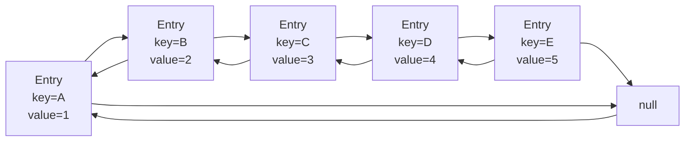

# Java LinkedHashMap

## 介绍

LinkedHashMap是Java集合框架中的一个重要实现，它继承自HashMap，但同时也维护了元素的插入顺序或访问顺序。这使得LinkedHashMap成为一个功能强大的数据结构，既具有HashMap的高效查找特性，又保留了元素的顺序信息。

:::tip
LinkedHashMap = HashMap + LinkedList
:::

在常规的HashMap中，元素的迭代顺序是不确定的，而LinkedHashMap则提供了可预测的迭代顺序。根据构造方法的不同，LinkedHashMap可以维护元素的**插入顺序**或**访问顺序**，这使得它在某些特定场景下非常有用，如实现LRU（最近最少使用）缓存等。

## LinkedHashMap的特性

与HashMap相比，LinkedHashMap具有以下主要特性：

1. **有序性** - 可以按照插入顺序或访问顺序迭代元素
2. **双向链表** - 内部使用双向链表维护元素顺序
3. **性能** - 插入、删除和查找操作的性能与HashMap相似，时间复杂度为O(1)
4. **允许null值** - 可以包含null键和null值
5. **非线程安全** - 多线程环境下需要外部同步

## LinkedHashMap的内部结构

LinkedHashMap在HashMap的基础上，为每个条目增加了前驱和后继指针，形成一个双向链表。



## 创建LinkedHashMap

创建LinkedHashMap的方式有多种：

```java
// 默认构造函数
LinkedHashMap<String, Integer> map1 = new LinkedHashMap<>();

// 指定初始容量
LinkedHashMap<String, Integer> map2 = new LinkedHashMap<>(16);

// 指定初始容量和负载因子
LinkedHashMap<String, Integer> map3 = new LinkedHashMap<>(16, 0.75f);

// 指定初始容量、负载因子和访问顺序
// true表示按访问顺序排序，false表示按插入顺序排序（默认）
LinkedHashMap<String, Integer> map4 = new LinkedHashMap<>(16, 0.75f, true);

// 使用另一个Map创建
Map<String, Integer> originalMap = new HashMap<>();
originalMap.put("one", 1);
originalMap.put("two", 2);
LinkedHashMap<String, Integer> map5 = new LinkedHashMap<>(originalMap);
```

## 基本操作

LinkedHashMap支持所有Map接口的基本操作：

```java
LinkedHashMap<String, Integer> scores = new LinkedHashMap<>();

// 添加元素
scores.put("Alice", 95);
scores.put("Bob", 82);
scores.put("Charlie", 90);
scores.put("David", 78);

// 获取元素
System.out.println("Bob's score: " + scores.get("Bob")); // 输出: Bob's score: 82

// 检查键是否存在
System.out.println("Contains Edward? " + scores.containsKey("Edward")); // 输出: Contains Edward? false

// 检查值是否存在
System.out.println("Contains score 90? " + scores.containsValue(90)); // 输出: Contains score 90? true

// 删除元素
scores.remove("David");

// 遍历元素（按插入顺序）
System.out.println("All scores:");
for (Map.Entry<String, Integer> entry : scores.entrySet()) {
    System.out.println(entry.getKey() + ": " + entry.getValue());
}
// 输出:
// All scores:
// Alice: 95
// Bob: 82
// Charlie: 90

// 清空map
scores.clear();
System.out.println("Size after clearing: " + scores.size()); // 输出: Size after clearing: 0
```

## 按插入顺序与访问顺序

### 插入顺序（默认）

默认情况下，LinkedHashMap按照元素的插入顺序维护链表：

```java
LinkedHashMap<String, String> insertionOrderMap = new LinkedHashMap<>();
insertionOrderMap.put("A", "First");
insertionOrderMap.put("B", "Second");
insertionOrderMap.put("C", "Third");

// 重新插入已存在的键
insertionOrderMap.put("A", "Updated First");

// 添加新元素
insertionOrderMap.put("D", "Fourth");

System.out.println("Insertion Order:");
for (Map.Entry<String, String> entry : insertionOrderMap.entrySet()) {
    System.out.println(entry.getKey() + ": " + entry.getValue());
}
```

输出：
```
Insertion Order:
A: Updated First
B: Second
C: Third
D: Fourth
```

注意：重新插入同一个键不会改变其在链表中的位置。

### 访问顺序

通过将LinkedHashMap的构造函数的最后一个参数设为`true`，可以使LinkedHashMap按照访问顺序（包括get和put操作）维护链表：

```java
LinkedHashMap<String, String> accessOrderMap = new LinkedHashMap<>(16, 0.75f, true);
accessOrderMap.put("A", "First");
accessOrderMap.put("B", "Second");
accessOrderMap.put("C", "Third");

// 访问元素会改变其顺序
accessOrderMap.get("A");
accessOrderMap.get("B");

// 添加新元素
accessOrderMap.put("D", "Fourth");

// 再次访问A
accessOrderMap.get("A");

System.out.println("Access Order:");
for (Map.Entry<String, String> entry : accessOrderMap.entrySet()) {
    System.out.println(entry.getKey() + ": " + entry.getValue());
}
```

输出：
```
Access Order:
C: Third
D: Fourth
B: Second
A: First
```

最近访问的元素会被移到链表末尾，因此最不常访问的元素会出现在链表前面。

## 实现LRU缓存

LinkedHashMap的访问顺序特性使其成为实现LRU（Least Recently Used，最近最少使用）缓存的理想选择。通过继承LinkedHashMap并重写`removeEldestEntry()`方法，我们可以轻松实现一个LRU缓存：

```java
public class LRUCache<K, V> extends LinkedHashMap<K, V> {
    private final int capacity;
    
    public LRUCache(int capacity) {
        // 初始容量、负载因子、访问顺序
        super(capacity, 0.75f, true);
        this.capacity = capacity;
    }
    
    @Override
    protected boolean removeEldestEntry(Map.Entry<K, V> eldest) {
        // 当map大小超过容量时，自动删除最久未使用的元素
        return size() > capacity;
    }
}
```

使用示例：

```java
// 创建容量为3的LRU缓存
LRUCache<Integer, String> cache = new LRUCache<>(3);

cache.put(1, "One");
cache.put(2, "Two");
cache.put(3, "Three");

System.out.println("Cache after adding 3 elements: " + cache);
// 输出: Cache after adding 3 elements: {1=One, 2=Two, 3=Three}

// 访问元素1，使其成为最近使用的
cache.get(1);
System.out.println("Cache after accessing 1: " + cache);
// 输出: Cache after accessing 1: {2=Two, 3=Three, 1=One}

// 添加第4个元素，这会导致最久未使用的元素（2）被删除
cache.put(4, "Four");
System.out.println("Cache after adding 4: " + cache);
// 输出: Cache after adding 4: {3=Three, 1=One, 4=Four}

// 添加第5个元素，这会导致最久未使用的元素（3）被删除
cache.put(5, "Five");
System.out.println("Cache after adding 5: " + cache);
// 输出: Cache after adding 5: {1=One, 4=Four, 5=Five}
```

## 实际应用场景

### 1. 保持插入顺序的映射

当你需要一个映射，但同时希望在迭代时保持元素的插入顺序，LinkedHashMap是理想的选择：

```java
LinkedHashMap<String, Double> productPrices = new LinkedHashMap<>();
productPrices.put("Apple", 1.99);
productPrices.put("Banana", 0.59);
productPrices.put("Orange", 0.89);

// 商品将按照添加的顺序显示
System.out.println("Today's products:");
for (Map.Entry<String, Double> entry : productPrices.entrySet()) {
    System.out.println(entry.getKey() + ": $" + entry.getValue());
}
```

### 2. 简单的网页访问历史

以下是一个使用LinkedHashMap记录最近访问网页的简单示例：

```java
LinkedHashMap<String, Long> browsingHistory = new LinkedHashMap<>(10, 0.75f, true);

// 模拟用户访问网页
browsingHistory.put("https://www.example.com", System.currentTimeMillis());
browsingHistory.put("https://www.google.com", System.currentTimeMillis());
browsingHistory.put("https://www.github.com", System.currentTimeMillis());

// 用户再次访问之前的页面
browsingHistory.get("https://www.example.com");

// 显示浏览历史（最近访问的排在最后）
System.out.println("Browsing history (oldest first):");
for (String url : browsingHistory.keySet()) {
    System.out.println(url);
}
```

### 3. 有序配置存储

当需要保持配置项的特定顺序时：

```java
LinkedHashMap<String, String> configuration = new LinkedHashMap<>();
configuration.put("database.url", "jdbc:mysql://localhost:3306/mydb");
configuration.put("database.username", "admin");
configuration.put("database.password", "secret");
configuration.put("app.name", "MyApplication");
configuration.put("app.version", "1.0.0");

// 配置会按插入顺序保存
try (FileWriter writer = new FileWriter("config.properties")) {
    for (Map.Entry<String, String> entry : configuration.entrySet()) {
        writer.write(entry.getKey() + "=" + entry.getValue() + "\n");
    }
}
```

## LinkedHashMap与其他Map实现的比较

| 特性 | HashMap | LinkedHashMap | TreeMap |
|------|---------|--------------|---------|
| 有序性 | 无序 | 有序（插入顺序或访问顺序） | 有序（自然顺序或比较器顺序） |
| 性能(get/put) | O(1) | O(1) | O(log n) |
| 内存消耗 | 低 | 中（额外的链表引用） | 高 |
| null键 | 允许 | 允许 | 不允许 |
| 实现方式 | 哈希表 | 哈希表 + 双向链表 | 红黑树 |
| 适用场景 | 高效查找 | 有序迭代、LRU缓存 | 排序、范围查询 |

## 性能考虑

虽然LinkedHashMap保留了HashMap的大部分性能特性，但由于维护链表需要额外的操作，所以在某些情况下性能会略低：

- **空间复杂度**：LinkedHashMap相比HashMap需要更多内存，因为每个条目都需要额外的引用来维护双向链表。
- **时间复杂度**：
  - get/put/remove操作仍为O(1)，与HashMap相同
  - 但这些操作的实际性能可能略低，因为需要维护链表
  - 按顺序迭代比HashMap更高效，是O(n)而不是O(n+k)，其中k是桶的数量

## 总结

LinkedHashMap是Java集合框架中一个非常实用的类，它结合了HashMap的高效查找和链表的有序特性：

- 它维护元素的插入顺序或访问顺序
- 支持所有Map接口的操作，时间复杂度为O(1)
- 特别适合需要有序迭代的场景
- 是实现LRU缓存的理想选择
- 非线程安全，多线程环境下需要外部同步

理解LinkedHashMap的特性和使用场景，可以帮助开发者在适当的情况下选择这一数据结构，从而编写出更高效、更优雅的代码。

## 练习

1. 创建一个LinkedHashMap，添加5个键值对，然后按插入顺序打印所有元素。
2. 创建一个按访问顺序排序的LinkedHashMap，添加几个元素后访问其中的某些元素，然后打印所有元素观察顺序变化。
3. 使用LinkedHashMap实现一个简单的最近搜索历史功能，限制最多保存10条搜索记录。
4. 比较HashMap和LinkedHashMap在迭代性能上的差异，分别向两者中添加大量数据，然后测量迭代所有元素所需的时间。

## 附加资源

- [Java官方文档 - LinkedHashMap](https://docs.oracle.com/javase/8/docs/api/java/util/LinkedHashMap.html)
- [Java集合框架概述](https://docs.oracle.com/javase/tutorial/collections/intro/index.html)
- [HashMap与LinkedHashMap性能比较](https://www.baeldung.com/java-linked-hashmap)

:::caution
在多线程环境下使用LinkedHashMap需要外部同步，或者考虑使用Collections.synchronizedMap()包装LinkedHashMap。
:::