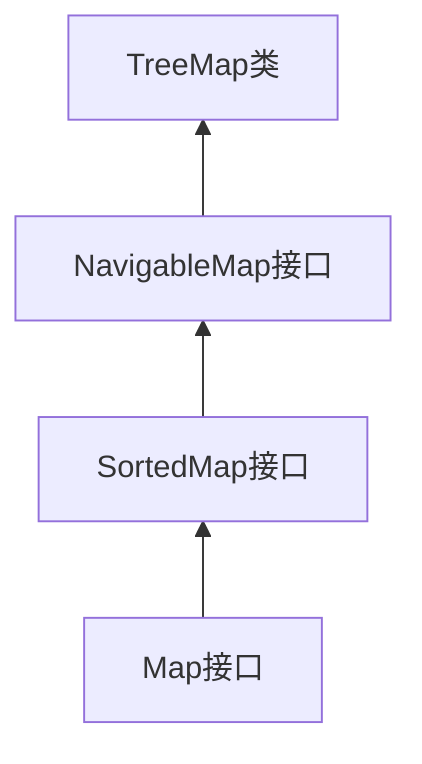

# Java TreeMap

## 什么是TreeMap？

TreeMap是Java集合框架中的一个重要实现，它是`Map`接口的一个具体实现类，基于**红黑树**（一种自平衡的二叉搜索树）数据结构。TreeMap存储的是键值对（key-value pairs），并且它可以保证键（key）按照自然顺序或者自定义的顺序进行排序。

:::note
TreeMap实现了`NavigableMap`接口，而NavigableMap又扩展了`SortedMap`接口，所以TreeMap具有导航和排序的功能。
:::



## TreeMap的主要特点

1. **有序性**：TreeMap中的元素会根据键（key）进行排序
2. **非同步性**：TreeMap不是线程安全的
3. **效率**：基本操作（如get、put、remove）的时间复杂度为O(log n)
4. **不允许null键**：TreeMap不允许使用null作为键，但允许null值
5. **唯一键**：每个键只能对应一个值

## 创建TreeMap

### 基本创建方式

```java
// 创建一个空的TreeMap（将按照键的自然顺序排序）
TreeMap<String, Integer> treeMap = new TreeMap<>();

// 使用现有Map创建TreeMap
Map<String, Integer> map = new HashMap<>();
map.put("apple", 10);
map.put("banana", 5);
TreeMap<String, Integer> treeMapFromMap = new TreeMap<>(map);
```

### 使用自定义比较器

如果要使用自定义的排序规则，可以在创建TreeMap时提供一个`Comparator`：

```java
// 使用自定义比较器（按字符串长度排序）
TreeMap<String, Integer> customTreeMap = new TreeMap<>((s1, s2) -> {
    return s1.length() - s2.length();
});

customTreeMap.put("apple", 10);
customTreeMap.put("banana", 5);
customTreeMap.put("pear", 8);
customTreeMap.put("orange", 7);

System.out.println(customTreeMap);
// 输出: {pear=8, apple=10, orange=7, banana=5} 
// 按键的长度排序：4字符，5字符，6字符
```

## TreeMap的基本操作

### 添加元素

```java
TreeMap<String, Integer> fruitMap = new TreeMap<>();

// 添加元素
fruitMap.put("apple", 10);
fruitMap.put("banana", 5);
fruitMap.put("orange", 15);

System.out.println(fruitMap);
// 输出: {apple=10, banana=5, orange=15}
// 按照字母顺序排列
```

### 获取元素

```java
// 获取特定键的值
Integer appleCount = fruitMap.get("apple");  // 返回10
Integer grapeCount = fruitMap.get("grape");  // 返回null（不存在）

// 检查键是否存在
boolean hasApple = fruitMap.containsKey("apple");  // 返回true
boolean hasValue5 = fruitMap.containsValue(5);     // 返回true
```

### 删除元素

```java
// 删除元素
fruitMap.remove("banana");
System.out.println(fruitMap);
// 输出: {apple=10, orange=15}
```

### 遍历TreeMap

```java
TreeMap<String, Integer> fruitMap = new TreeMap<>();
fruitMap.put("apple", 10);
fruitMap.put("banana", 5);
fruitMap.put("orange", 15);

// 方法1: 使用entrySet遍历
for (Map.Entry<String, Integer> entry : fruitMap.entrySet()) {
    System.out.println(entry.getKey() + ": " + entry.getValue());
}
// 输出:
// apple: 10
// banana: 5
// orange: 15

// 方法2: 分别遍历键和值
for (String key : fruitMap.keySet()) {
    System.out.println("Key: " + key);
}

for (Integer value : fruitMap.values()) {
    System.out.println("Value: " + value);
}
```

## TreeMap的特殊方法

由于TreeMap实现了NavigableMap接口，它提供了许多导航方法：

```java
TreeMap<Integer, String> numMap = new TreeMap<>();
numMap.put(5, "Five");
numMap.put(10, "Ten");
numMap.put(15, "Fifteen");
numMap.put(20, "Twenty");
numMap.put(25, "Twenty Five");

// 获取第一个和最后一个元素
Map.Entry<Integer, String> firstEntry = numMap.firstEntry();  // 返回 5=Five
Map.Entry<Integer, String> lastEntry = numMap.lastEntry();    // 返回 25=Twenty Five

// 返回小于给定键的最大键
Map.Entry<Integer, String> floorEntry = numMap.floorEntry(12);  // 返回 10=Ten

// 返回大于给定键的最小键
Map.Entry<Integer, String> ceilingEntry = numMap.ceilingEntry(12);  // 返回 15=Fifteen

// 返回严格小于给定键的最大键
Map.Entry<Integer, String> lowerEntry = numMap.lowerEntry(15);  // 返回 10=Ten

// 返回严格大于给定键的最小键
Map.Entry<Integer, String> higherEntry = numMap.higherEntry(15);  // 返回 20=Twenty

// 获取子映射
SortedMap<Integer, String> subMap = numMap.subMap(10, 20);  // 返回键在10（含）到20（不含）之间的条目
```

## TreeMap的实际应用场景

### 场景一：按字母顺序存储联系人

```java
public class ContactManager {
    private TreeMap<String, String> contacts = new TreeMap<>();
    
    public void addContact(String name, String phoneNumber) {
        contacts.put(name, phoneNumber);
    }
    
    public void displayContacts() {
        for (Map.Entry<String, String> entry : contacts.entrySet()) {
            System.out.println(entry.getKey() + ": " + entry.getValue());
        }
    }
    
    public static void main(String[] args) {
        ContactManager manager = new ContactManager();
        manager.addContact("张三", "13612345678");
        manager.addContact("李四", "13998765432");
        manager.addContact("王五", "13587654321");
        
        manager.displayContacts();
        // 输出按姓名字母顺序排列的联系人
    }
}
```

### 场景二：成绩管理系统

```java
public class ScoreManager {
    private TreeMap<Integer, List<String>> scoreMap = new TreeMap<>(Collections.reverseOrder());
    
    public void addStudentScore(String studentName, int score) {
        List<String> students = scoreMap.getOrDefault(score, new ArrayList<>());
        students.add(studentName);
        scoreMap.put(score, students);
    }
    
    public void displayTopStudents(int n) {
        System.out.println("Top " + n + " scores:");
        int count = 0;
        for (Map.Entry<Integer, List<String>> entry : scoreMap.entrySet()) {
            for (String student : entry.getValue()) {
                System.out.println(student + ": " + entry.getKey());
                count++;
                if (count >= n) {
                    return;
                }
            }
        }
    }
    
    public static void main(String[] args) {
        ScoreManager manager = new ScoreManager();
        manager.addStudentScore("张三", 85);
        manager.addStudentScore("李四", 92);
        manager.addStudentScore("王五", 78);
        manager.addStudentScore("赵六", 92);
        manager.addStudentScore("钱七", 88);
        
        manager.displayTopStudents(3);
        // 输出前3名学生的成绩（按分数从高到低）
    }
}
```

### 场景三：日程表管理

```java
public class ScheduleManager {
    private TreeMap<LocalDateTime, String> schedule = new TreeMap<>();
    
    public void addEvent(LocalDateTime dateTime, String event) {
        schedule.put(dateTime, event);
    }
    
    public String getNextEvent(LocalDateTime currentTime) {
        Map.Entry<LocalDateTime, String> nextEvent = schedule.ceilingEntry(currentTime);
        if (nextEvent != null) {
            return "Next event: " + nextEvent.getValue() + " at " + 
                   nextEvent.getKey().format(DateTimeFormatter.ofPattern("yyyy-MM-dd HH:mm"));
        } else {
            return "No upcoming events";
        }
    }
    
    public static void main(String[] args) {
        ScheduleManager manager = new ScheduleManager();
        manager.addEvent(
            LocalDateTime.of(2023, 11, 15, 14, 30), 
            "Team Meeting"
        );
        manager.addEvent(
            LocalDateTime.of(2023, 11, 16, 9, 0), 
            "Client Presentation"
        );
        manager.addEvent(
            LocalDateTime.of(2023, 11, 14, 11, 0), 
            "Lunch with Manager"
        );
        
        LocalDateTime now = LocalDateTime.of(2023, 11, 14, 10, 0);
        System.out.println(manager.getNextEvent(now));
        // 输出下一个即将发生的事件
    }
}
```

## TreeMap vs HashMap

| 特性 | TreeMap | HashMap |
|------|---------|---------|
| 顺序 | 根据键排序 | 无序 |
| 性能（时间复杂度）| O(log n) | O(1) |
| null键 | 不允许 | 允许 |
| 实现 | 红黑树 | 哈希表 |
| 内存消耗 | 较高 | 较低 |
| 适用场景 | 需要排序的场景 | 不关心顺序，追求快速查找 |

:::tip
如果需要按照键的顺序遍历Map，选择TreeMap；如果只关心查询速度，选择HashMap。
:::

## 总结

TreeMap是Java集合框架中一个重要的实现类，它提供了一个基于红黑树实现的Map接口。其主要特点是可以保证键按照特定顺序排序，这在需要有序数据的应用场景中非常有用。

TreeMap的关键优势在于它提供了高效的获取、删除和插入操作，以及强大的导航功能，如获取比给定键大或小的键、子树等。然而，与HashMap相比，TreeMap的操作效率稍低，因为它需要维护元素的顺序。

### 学习练习

1. 创建一个TreeMap，将学生姓名作为键，成绩作为值，然后按照姓名的字母顺序打印所有学生的成绩。

2. 实现一个简单的英文单词频率统计程序，使用TreeMap按单词字母顺序显示每个单词出现的次数。

3. 使用TreeMap实现一个简单的日程安排系统，允许添加、删除和查询特定时间范围内的事件。

### 进一步学习资源

- [Java官方文档 - TreeMap](https://docs.oracle.com/javase/8/docs/api/java/util/TreeMap.html)
- 深入学习红黑树数据结构以理解TreeMap的内部工作原理
- 探索TreeMap其他接口如SortedMap、NavigableMap提供的额外功能

通过掌握TreeMap，你将能够在需要有序数据结构的场景中选择合适的工具，从而编写出更高效、更elegant的Java程序。