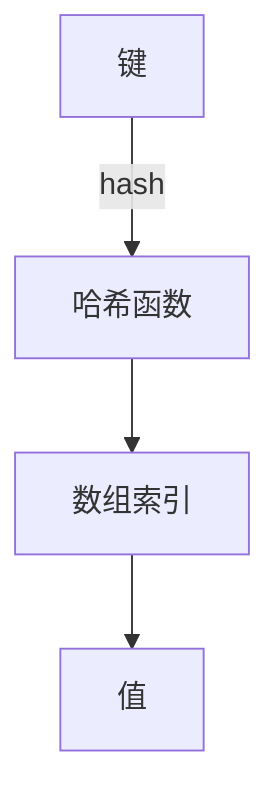

# Java Hashtable

## Hashtable 简介

Hashtable 是 Java 集合框架中的一个经典类，它实现了一个键值对(key-value)映射的哈希表数据结构。作为 Java 最早提供的集合类之一，Hashtable 出现在 JDK 1.0 版本，早于 Java 集合框架的建立。

Hashtable 的主要特点包括：

- **线程安全**：所有方法都是同步的(synchronized)
- **不允许 null 键和 null 值**
- **无序集合**：不保证元素的顺序
- **遗留类**：虽然仍然支持，但在新代码中通常推荐使用 `ConcurrentHashMap` 或 `Collections.synchronizedMap()`

:::note
尽管 Hashtable 是一个历史悠久的类，但理解它对于全面掌握 Java 集合框架以及面试准备仍然很有价值。
:::

## Hashtable 的基本用法

### 创建 Hashtable

```java
// 创建默认的 Hashtable
Hashtable<String, Integer> scores = new Hashtable<>();

// 创建指定初始容量的 Hashtable
Hashtable<String, Integer> scores2 = new Hashtable<>(50);

// 创建指定初始容量和加载因子的 Hashtable
Hashtable<String, Integer> scores3 = new Hashtable<>(50, 0.75f);

// 从已有 Map 创建 Hashtable
Map<String, Integer> existingMap = new HashMap<>();
existingMap.put("Math", 95);
existingMap.put("Science", 88);
Hashtable<String, Integer> scores4 = new Hashtable<>(existingMap);
```

### 基本操作

```java
import java.util.Hashtable;
import java.util.Enumeration;

public class HashtableDemo {
    public static void main(String[] args) {
        // 创建 Hashtable 对象
        Hashtable<String, Integer> studentScores = new Hashtable<>();
        
        // 添加键值对
        studentScores.put("Alice", 95);
        studentScores.put("Bob", 87);
        studentScores.put("Charlie", 91);
        
        // 获取值
        int bobScore = studentScores.get("Bob");
        System.out.println("Bob's score: " + bobScore);
        
        // 检查键是否存在
        boolean containsAlice = studentScores.containsKey("Alice");
        System.out.println("Contains Alice? " + containsAlice);
        
        // 检查值是否存在
        boolean contains90 = studentScores.containsValue(90);
        System.out.println("Contains score 90? " + contains90);
        
        // 移除元素
        studentScores.remove("Charlie");
        
        // 获取大小
        System.out.println("Size: " + studentScores.size());
        
        // 遍历 Hashtable
        System.out.println("\nStudent scores:");
        for (String name : studentScores.keySet()) {
            System.out.println(name + ": " + studentScores.get(name));
        }
        
        // 使用 Enumeration 遍历 (传统方式)
        System.out.println("\nUsing Enumeration:");
        Enumeration<String> keys = studentScores.keys();
        while (keys.hasMoreElements()) {
            String key = keys.nextElement();
            System.out.println(key + ": " + studentScores.get(key));
        }
        
        // 清空 Hashtable
        studentScores.clear();
        System.out.println("After clearing, size: " + studentScores.size());
    }
}
```

输出结果：

```
Bob's score: 87
Contains Alice? true
Contains score 90? false
Size: 2

Student scores:
Alice: 95
Bob: 87

Using Enumeration:
Alice: 95
Bob: 87

After clearing, size: 0
```

## Hashtable 内部工作原理

Hashtable 的内部实现是基于哈希表的数据结构，它存储键值对并通过键的哈希码来快速访问对应的值。



### 主要步骤

1. **哈希计算**：当调用 `put(key, value)` 方法时，Hashtable 计算 key 的 hashCode
2. **确定位置**：使用哈希值确定在内部数组中的位置
3. **处理冲突**：如果发生哈希冲突，使用链表法处理（元素以链表形式存储）
4. **同步处理**：对所有修改操作进行同步，确保线程安全

### 加载因子

加载因子（load factor）决定了 Hashtable 何时需要扩容，默认值为 0.75。

- **较低的加载因子**：空间利用率低，但查找速度快
- **较高的加载因子**：空间利用率高，但可能增加查找时间

## Hashtable vs HashMap

Hashtable 和 HashMap 都是实现 Map 接口的集合类，但它们之间有一些关键区别：

| 特性 | Hashtable | HashMap |
|------|-----------|---------|
| 线程安全 | 是（同步方法） | 否 |
| Null 键和值 | 不允许 | 允许 |
| 性能 | 因同步而较慢 | 较快 |
| 引入时间 | JDK 1.0 | JDK 1.2 |
| 迭代器 | Enumeration（传统） + Iterator | Iterator |
| 继承 | Dictionary 类 | AbstractMap 类 |

:::caution
在多线程环境下，如果需要线程安全的实现，现代 Java 程序通常使用 `ConcurrentHashMap` 而不是 `Hashtable`，因为前者提供了更好的并发性能。
:::

## 何时使用 Hashtable

虽然 Hashtable 是一个遗留类，但在以下情况下可能会考虑使用它：

1. **遗留系统维护**：当维护使用 Hashtable 的旧代码时
2. **简单的多线程环境**：需要线程安全的 Map，且不需要高并发性能
3. **绝对不允许 null**：业务逻辑上不允许键或值为 null

```java
// 多线程环境中选择：
Map<String, Object> map;

// 选项 1: Hashtable (全方法同步，性能较差)
map = new Hashtable<>();

// 选项 2: Collections.synchronizedMap (包装同步，稍好一些)
map = Collections.synchronizedMap(new HashMap<>());

// 选项 3: ConcurrentHashMap (现代推荐方案，性能最好)
map = new ConcurrentHashMap<>();
```

## 实际应用案例

### 用户会话管理系统

假设我们需要开发一个管理在线用户会话的系统，需要保证线程安全且不允许 null 值：

```java
import java.util.Hashtable;
import java.util.Date;

public class SessionManager {
    // 使用 Hashtable 存储会话信息，键为会话ID，值为会话对象
    private static final Hashtable<String, UserSession> activeSessions = new Hashtable<>();
    
    // 添加新会话
    public static void addSession(String sessionId, String username) {
        if (sessionId == null || username == null) {
            throw new IllegalArgumentException("Session ID and username cannot be null");
        }
        UserSession session = new UserSession(username, new Date());
        activeSessions.put(sessionId, session);
    }
    
    // 获取会话
    public static UserSession getSession(String sessionId) {
        return activeSessions.get(sessionId);
    }
    
    // 检查会话是否存在
    public static boolean hasSession(String sessionId) {
        return activeSessions.containsKey(sessionId);
    }
    
    // 移除会话
    public static void removeSession(String sessionId) {
        activeSessions.remove(sessionId);
    }
    
    // 获取活跃会话数量
    public static int getActiveSessionCount() {
        return activeSessions.size();
    }
    
    // 内部类表示用户会话
    static class UserSession {
        private String username;
        private Date loginTime;
        private Date lastAccessTime;
        
        public UserSession(String username, Date loginTime) {
            this.username = username;
            this.loginTime = loginTime;
            this.lastAccessTime = loginTime;
        }
        
        public void access() {
            this.lastAccessTime = new Date();
        }
        
        @Override
        public String toString() {
            return "UserSession{" +
                   "username='" + username + '\'' +
                   ", loginTime=" + loginTime +
                   ", lastAccessTime=" + lastAccessTime +
                   '}';
        }
    }
    
    public static void main(String[] args) {
        // 示例使用
        addSession("session1", "user1");
        addSession("session2", "user2");
        addSession("session3", "user3");
        
        System.out.println("Active sessions: " + getActiveSessionCount());
        System.out.println("Session 2 info: " + getSession("session2"));
        
        removeSession("session3");
        System.out.println("After removing session3, active sessions: " + getActiveSessionCount());
        
        System.out.println("Has session1? " + hasSession("session1"));
        System.out.println("Has session3? " + hasSession("session3"));
    }
}
```

输出结果：

```
Active sessions: 3
Session 2 info: UserSession{username='user2', loginTime=Sun Oct 15 10:30:45 CST 2023, lastAccessTime=Sun Oct 15 10:30:45 CST 2023}
After removing session3, active sessions: 2
Has session1? true
Has session3? false
```

:::tip
在真实项目中，如果是新开发的系统，通常会使用 `ConcurrentHashMap` 代替 `Hashtable` 来获得更好的并发性能。
:::

## Hashtable 性能考量

使用 Hashtable 时需要注意以下性能因素：

1. **同步开销**：所有方法都是同步的，在非多线程环境下会带来不必要的性能损失
2. **初始容量**：合理设置初始容量可减少扩容操作
3. **哈希冲突**：大量哈希冲突会降低性能，选择好的哈希函数和合适的加载因子很重要
4. **迭代效率**：在大数据集上迭代可能较慢

## 总结

Hashtable 是 Java 集合框架中的一个历史悠久的类，提供了线程安全的键值对存储方案。尽管在现代 Java 开发中，它通常被 ConcurrentHashMap 或 Collections.synchronizedMap() 所替代，但了解 Hashtable 的工作原理和用法对于全面掌握 Java 集合框架仍然很有价值。

Hashtable 的主要特点是线程安全、不允许 null 键值、操作方法同步等，这些特点使其在特定场景下仍有其用武之地。然而，在大多数新项目中，考虑使用更现代的替代方案可能会获得更好的性能和更丰富的功能。

## 练习与进一步学习

### 练习题

1. 创建一个 Hashtable，存储学生姓名和对应的成绩，并实现基本的增删改查操作
2. 比较 Hashtable 和 HashMap 在多线程环境下的表现差异
3. 实现一个简单的缓存系统，使用 Hashtable 存储数据并设置过期时间

### 进一步学习资源

- 学习 Java Collections Framework 的其他 Map 实现，如 HashMap、LinkedHashMap、TreeMap 等
- 深入了解 ConcurrentHashMap 的实现原理和使用方法
- 研究哈希表数据结构的工作原理和常见的哈希冲突解决策略

:::note
记住，虽然 Hashtable 在现代 Java 开发中使用较少，但掌握它的知识对于全面理解 Java 集合框架和应对遗留代码维护都很有帮助。
:::