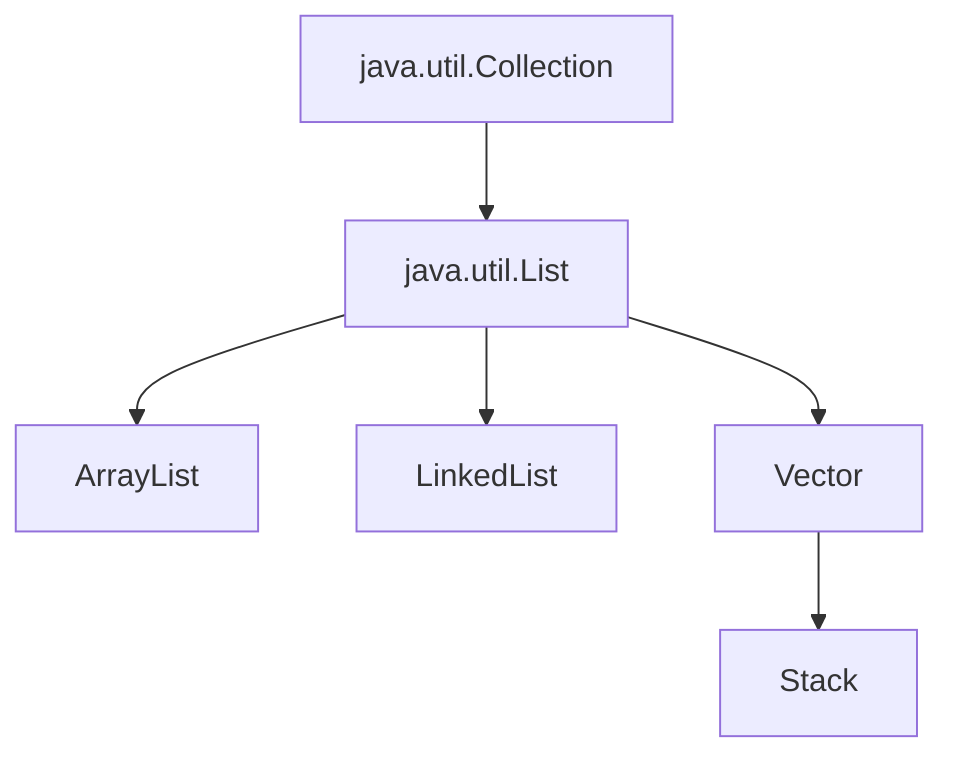

# Java List接口

在Java编程中，集合是存储和操作一组数据的关键工具。List接口是Java集合框架中最常用的接口之一，它提供了一种有序集合，允许存储重复元素，并且可以通过索引访问元素。无论你是开发小型应用还是复杂系统，掌握List接口对Java编程至关重要。

## List接口简介

List接口继承自Collection接口，是一个有序集合（也称为序列）。与Set不同，List允许重复元素，并且元素按照特定的顺序排列。

List接口的主要特点：

1. **有序性**：元素按照插入顺序排列
2. **可重复性**：允许存储重复的元素
3. **索引访问**：可以通过索引访问元素（类似于数组）
4. **动态大小**：大小可以动态增长



## List接口的主要实现类

Java提供了几种List接口的实现，每种实现都有其特定的用途和性能特点：

### ArrayList

ArrayList是List接口最常用的实现，内部使用动态数组存储元素。

**特点**：
- 随机访问效率高（使用索引访问元素）
- 添加/删除元素的效率较低，特别是在列表中间进行操作
- 初始容量为10，当空间不足时会自动扩容

```java
// 创建ArrayList
List<String> fruitList = new ArrayList<>();

// 添加元素
fruitList.add("Apple");
fruitList.add("Banana");
fruitList.add("Orange");

// 通过索引访问元素
System.out.println("第二个水果: " + fruitList.get(1));  // 输出: 第二个水果: Banana

// 遍历列表
for (String fruit : fruitList) {
    System.out.println(fruit);
}
// 输出:
// Apple
// Banana
// Orange
```

### LinkedList

LinkedList使用双向链表实现，每个元素都包含指向前一个和后一个元素的引用。

**特点**：
- 在列表中间添加/删除元素的效率高
- 随机访问效率较低（需要从头或尾遍历到指定位置）
- 实现了List和Deque接口，可以作为队列或栈使用

```java
// 创建LinkedList
List<String> todoList = new LinkedList<>();

// 添加元素
todoList.add("学习Java");
todoList.add("写代码");

// 在开头添加元素
todoList.add(0, "早起");

// 在结尾添加元素
todoList.add("锻炼身体");

// 遍历列表
for (int i = 0; i < todoList.size(); i++) {
    System.out.println((i+1) + ". " + todoList.get(i));
}
// 输出:
// 1. 早起
// 2. 学习Java
// 3. 写代码
// 4. 锻炼身体
```

### Vector

Vector与ArrayList类似，但是线程安全的（同步的）。

**特点**：
- 线程安全，所有方法都是同步的
- 性能比ArrayList稍差
- 初始容量为10，且增长因子为2（每次扩容为当前大小的2倍）

```java
// 创建Vector
List<Integer> scores = new Vector<>();

// 添加元素
scores.add(95);
scores.add(88);
scores.add(72);

// 修改元素
scores.set(1, 90);

System.out.println("分数: " + scores);  // 输出: 分数: [95, 90, 72]
```

### Stack

Stack是Vector的子类，实现了后进先出(LIFO)的栈。

**特点**：
- 继承自Vector，同样是线程安全的
- 提供了push、pop、peek等特定的栈操作方法

```java
// 创建Stack
Stack<String> browserHistory = new Stack<>();

// 入栈
browserHistory.push("www.google.com");
browserHistory.push("www.github.com");
browserHistory.push("www.stackoverflow.com");

// 查看栈顶元素但不移除
System.out.println("当前页面: " + browserHistory.peek());  // 输出: 当前页面: www.stackoverflow.com

// 出栈
String previousPage = browserHistory.pop();
System.out.println("返回上一页: " + previousPage);  // 输出: 返回上一页: www.stackoverflow.com
System.out.println("当前页面: " + browserHistory.peek());  // 输出: 当前页面: www.github.com
```

:::note
尽管Vector和Stack在技术上仍然是List接口的实现，但在现代Java应用程序中，它们已经被不鼓励使用。
- 替代Vector，优先使用ArrayList
- 替代Stack，优先使用ArrayDeque
:::

## List接口的常用方法

List接口继承了Collection接口的方法，并添加了一些特定于List的方法：

### 基本操作
```java
// 添加元素
boolean add(E e);                     // 在列表末尾添加元素
void add(int index, E element);       // 在指定位置添加元素

// 修改元素
E set(int index, E element);          // 替换指定位置的元素

// 删除元素
boolean remove(Object o);             // 删除第一次出现的指定元素
E remove(int index);                  // 删除指定位置的元素
void clear();                         // 删除所有元素

// 查询元素
E get(int index);                     // 获取指定位置的元素
boolean contains(Object o);           // 判断是否包含指定元素
int indexOf(Object o);                // 返回指定元素第一次出现的位置
int lastIndexOf(Object o);            // 返回指定元素最后一次出现的位置
int size();                           // 返回列表中的元素数量
boolean isEmpty();                    // 判断列表是否为空
```

### 列表视图操作
```java
// 获取子列表
List<E> subList(int fromIndex, int toIndex);  // 返回从fromIndex（包括）到toIndex（不包括）的子列表视图
```

### 迭代操作
```java
// 获取迭代器
Iterator<E> iterator();              // 返回按正确顺序遍历列表的迭代器
ListIterator<E> listIterator();      // 返回列表迭代器，支持正向和反向遍历
ListIterator<E> listIterator(int index); // 从指定位置开始的列表迭代器
```

## List的选择原则

在选择哪种List实现时，应考虑以下因素：

1. **操作频率**：
   - 如果主要进行随机访问（通过索引读取），选择ArrayList
   - 如果主要在中间位置添加/删除元素，选择LinkedList

2. **线程安全**：
   - 单线程环境下，优先使用ArrayList或LinkedList
   - 多线程环境下，可以使用Collections.synchronizedList()方法包装现有列表
   - 或者使用CopyOnWriteArrayList（适合读多写少的场景）

3. **内存考虑**：
   - ArrayList比LinkedList更节省内存（除非有大量空闲空间）
   - LinkedList每个元素都需要额外的内存来存储前后引用

## 实际应用案例

### 案例1：待办事项列表管理

一个简单的控制台待办事项应用，展示了List的基本操作：

```java
import java.util.ArrayList;
import java.util.List;
import java.util.Scanner;

public class TodoListManager {
    private List<String> todoItems = new ArrayList<>();
    private Scanner scanner = new Scanner(System.in);
    
    public void addItem() {
        System.out.print("输入新的待办事项: ");
        String item = scanner.nextLine();
        todoItems.add(item);
        System.out.println("添加成功！");
    }
    
    public void displayItems() {
        if (todoItems.isEmpty()) {
            System.out.println("待办事项列表为空");
            return;
        }
        
        System.out.println("== 待办事项列表 ==");
        for (int i = 0; i < todoItems.size(); i++) {
            System.out.println((i + 1) + ". " + todoItems.get(i));
        }
    }
    
    public void removeItem() {
        displayItems();
        if (todoItems.isEmpty()) {
            return;
        }
        
        System.out.print("输入要删除的项目编号: ");
        int index = Integer.parseInt(scanner.nextLine()) - 1;
        
        if (index >= 0 && index < todoItems.size()) {
            String removedItem = todoItems.remove(index);
            System.out.println("已删除: " + removedItem);
        } else {
            System.out.println("无效的编号!");
        }
    }
    
    public static void main(String[] args) {
        TodoListManager manager = new TodoListManager();
        Scanner scanner = new Scanner(System.in);
        boolean running = true;
        
        while (running) {
            System.out.println("\n1. 添加待办事项");
            System.out.println("2. 查看所有待办事项");
            System.out.println("3. 删除待办事项");
            System.out.println("4. 退出");
            System.out.print("选择操作: ");
            
            int choice = Integer.parseInt(scanner.nextLine());
            
            switch (choice) {
                case 1:
                    manager.addItem();
                    break;
                case 2:
                    manager.displayItems();
                    break;
                case 3:
                    manager.removeItem();
                    break;
                case 4:
                    running = false;
                    break;
                default:
                    System.out.println("无效选择！");
            }
        }
        
        System.out.println("程序已退出。");
        scanner.close();
    }
}
```

### 案例2：不同List实现的性能比较

这个例子展示了ArrayList和LinkedList在不同操作下的性能差异：

```java
import java.util.ArrayList;
import java.util.LinkedList;
import java.util.List;

public class ListPerformanceComparison {
    private static final int N = 100000;
    
    public static void main(String[] args) {
        // 创建列表
        List<Integer> arrayList = new ArrayList<>();
        List<Integer> linkedList = new LinkedList<>();
        
        // 测试添加到末尾
        System.out.println("添加 " + N + " 个元素到末尾:");
        measureTime("ArrayList", () -> {
            for (int i = 0; i < N; i++) {
                arrayList.add(i);
            }
        });
        
        measureTime("LinkedList", () -> {
            for (int i = 0; i < N; i++) {
                linkedList.add(i);
            }
        });
        
        // 清空列表
        arrayList.clear();
        linkedList.clear();
        
        // 测试添加到开头
        System.out.println("\n添加 " + N + " 个元素到开头:");
        measureTime("ArrayList", () -> {
            for (int i = 0; i < N; i++) {
                arrayList.add(0, i);
            }
        });
        
        measureTime("LinkedList", () -> {
            for (int i = 0; i < N; i++) {
                linkedList.add(0, i);
            }
        });
        
        // 测试随机访问
        System.out.println("\n随机访问 " + N + " 次:");
        measureTime("ArrayList", () -> {
            for (int i = 0; i < N; i++) {
                int value = arrayList.get(i);
            }
        });
        
        measureTime("LinkedList", () -> {
            for (int i = 0; i < N; i++) {
                int value = linkedList.get(i);
            }
        });
    }
    
    private static void measureTime(String listType, Runnable task) {
        long startTime = System.currentTimeMillis();
        task.run();
        long endTime = System.currentTimeMillis();
        System.out.println(listType + ": " + (endTime - startTime) + "ms");
    }
}
```

运行此程序，你会看到：
- 添加到末尾：ArrayList和LinkedList性能相当
- 添加到开头：LinkedList比ArrayList快很多
- 随机访问：ArrayList比LinkedList快很多

这验证了我们前面讨论的理论知识。

## 总结

Java的List接口是一个强大且灵活的集合框架组件，它提供了有序元素的存储和处理能力：

- **ArrayList**: 基于动态数组，适合随机访问
- **LinkedList**: 基于双向链表，适合频繁插入和删除操作
- **Vector**: 线程安全的ArrayList（较少使用）
- **Stack**: 实现LIFO行为的特殊列表（较少使用）

选择适合你需求的List实现至关重要，需要考虑性能需求、线程安全和内存使用等因素。

## 练习

为了巩固你的知识，尝试以下练习：

1. 创建一个ArrayList存储学生姓名，然后按字母顺序对其排序。
2. 实现一个简单的音乐播放列表，使用LinkedList允许用户添加、删除和重新排序歌曲。
3. 比较ArrayList和LinkedList在不同情况下（例如，添加、删除、搜索）的性能。
4. 使用ListIterator以相反的顺序遍历List。
5. 实现一个购物车系统，允许添加、删除和修改商品数量。

## 进一步阅读

- [Java官方文档 - List接口](https://docs.oracle.com/en/java/javase/17/docs/api/java.base/java/util/List.html)
- [Java官方文档 - ArrayList类](https://docs.oracle.com/en/java/javase/17/docs/api/java.base/java/util/ArrayList.html)
- [Java官方文档 - LinkedList类](https://docs.oracle.com/en/java/javase/17/docs/api/java.base/java/util/LinkedList.html)

了解List接口的工作原理和实现细节将帮助你编写更高效的Java代码，并为处理各种集合问题提供坚实的基础。