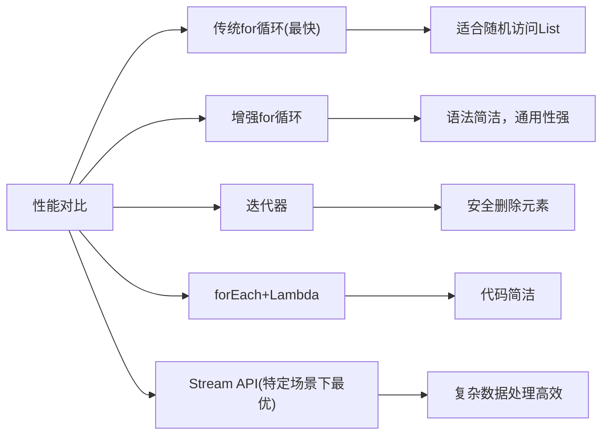

# Java 集合遍历

## 引言

在Java编程中，集合是用来存储和操作一组数据的容器。而集合遍历则是我们日常编程中最常见的操作之一，它允许我们按特定顺序访问集合中的每个元素。掌握各种遍历方式对于有效处理集合数据至关重要。

本文将介绍Java集合框架中的多种遍历方法，从传统的迭代器到现代的Stream API，帮助你选择最适合特定场景的遍历技术。

## 集合遍历的基本方式

### 1. 使用迭代器(Iterator)

迭代器是Java集合框架的核心部分，提供了一种统一的方式来遍历集合。

```java
import java.util.ArrayList;
import java.util.Iterator;
import java.util.List;

public class IteratorExample {
    public static void main(String[] args) {
        List<String> fruits = new ArrayList<>();
        fruits.add("苹果");
        fruits.add("香蕉");
        fruits.add("橙子");
        
        Iterator<String> iterator = fruits.iterator();
        while (iterator.hasNext()) {
            String fruit = iterator.next();
            System.out.println(fruit);
        }
    }
}
```

输出：
```
苹果
香蕉
橙子
```

:::tip
Iterator接口还提供`remove()`方法，可以在遍历过程中安全地删除元素。
:::

### 2. 使用for-each循环

Java 5引入的for-each循环(增强型for循环)提供了一种更简洁的遍历集合的方式：

```java
import java.util.ArrayList;
import java.util.List;

public class ForEachExample {
    public static void main(String[] args) {
        List<String> fruits = new ArrayList<>();
        fruits.add("苹果");
        fruits.add("香蕉");
        fruits.add("橙子");
        
        for (String fruit : fruits) {
            System.out.println(fruit);
        }
    }
}
```

输出：
```
苹果
香蕉
橙子
```

### 3. 使用传统for循环(仅适用于List)

当我们需要索引值时，可以使用传统for循环遍历List集合：

```java
import java.util.ArrayList;
import java.util.List;

public class ForLoopExample {
    public static void main(String[] args) {
        List<String> fruits = new ArrayList<>();
        fruits.add("苹果");
        fruits.add("香蕉");
        fruits.add("橙子");
        
        for (int i = 0; i < fruits.size(); i++) {
            System.out.println("索引 " + i + ": " + fruits.get(i));
        }
    }
}
```

输出：
```
索引 0: 苹果
索引 1: 香蕉
索引 2: 橙子
```

## 现代Java集合遍历方式

### 1. 使用forEach方法与Lambda表达式(Java 8+)

Java 8引入了函数式接口和Lambda表达式，使集合遍历更加简洁：

```java
import java.util.ArrayList;
import java.util.List;

public class ForEachMethodExample {
    public static void main(String[] args) {
        List<String> fruits = new ArrayList<>();
        fruits.add("苹果");
        fruits.add("香蕉");
        fruits.add("橙子");
        
        // 使用Lambda表达式
        fruits.forEach(fruit -> System.out.println(fruit));
        
        // 更简洁的方法引用
        System.out.println("\n使用方法引用:");
        fruits.forEach(System.out::println);
    }
}
```

输出：
```
苹果
香蕉
橙子

使用方法引用:
苹果
香蕉
橙子
```

### 2. 使用Stream API(Java 8+)

Stream API提供了强大的数据处理能力，特别适合复杂的集合操作：

```java
import java.util.ArrayList;
import java.util.List;

public class StreamExample {
    public static void main(String[] args) {
        List<String> fruits = new ArrayList<>();
        fruits.add("苹果");
        fruits.add("香蕉");
        fruits.add("橙子");
        fruits.add("葡萄");
        
        // 筛选并输出长度大于2的水果名
        System.out.println("长度大于2的水果:");
        fruits.stream()
              .filter(fruit -> fruit.length() > 2)
              .forEach(System.out::println);
    }
}
```

输出：
```
长度大于2的水果:
香蕉
橙子
葡萄
```

## 不同集合类型的遍历

### 1. 遍历List

前面我们已经展示了遍历List的多种方式。这里不再重复。

### 2. 遍历Set

Set集合不保证元素顺序，且不能通过索引访问：

```java
import java.util.HashSet;
import java.util.Set;

public class SetTraversalExample {
    public static void main(String[] args) {
        Set<Integer> numbers = new HashSet<>();
        numbers.add(10);
        numbers.add(20);
        numbers.add(30);
        numbers.add(10); // 重复元素不会被添加
        
        System.out.println("使用for-each遍历Set:");
        for (Integer number : numbers) {
            System.out.println(number);
        }
        
        System.out.println("\n使用Iterator遍历Set:");
        java.util.Iterator<Integer> iterator = numbers.iterator();
        while (iterator.hasNext()) {
            System.out.println(iterator.next());
        }
        
        System.out.println("\n使用forEach方法遍历Set:");
        numbers.forEach(System.out::println);
    }
}
```

输出可能如下（Set不保证顺序）：
```
使用for-each遍历Set:
20
10
30

使用Iterator遍历Set:
20
10
30

使用forEach方法遍历Set:
20
10
30
```

### 3. 遍历Map

Map是键值对集合，有多种遍历方式：

```java
import java.util.HashMap;
import java.util.Map;

public class MapTraversalExample {
    public static void main(String[] args) {
        Map<String, Integer> fruitPrices = new HashMap<>();
        fruitPrices.put("苹果", 5);
        fruitPrices.put("香蕉", 3);
        fruitPrices.put("橙子", 4);
        
        // 1. 遍历键值对
        System.out.println("遍历键值对:");
        for (Map.Entry<String, Integer> entry : fruitPrices.entrySet()) {
            System.out.println(entry.getKey() + ": " + entry.getValue() + "元");
        }
        
        // 2. 仅遍历键
        System.out.println("\n遍历键:");
        for (String key : fruitPrices.keySet()) {
            System.out.println(key);
        }
        
        // 3. 仅遍历值
        System.out.println("\n遍历值:");
        for (Integer value : fruitPrices.values()) {
            System.out.println(value + "元");
        }
        
        // 4. 使用forEach和Lambda
        System.out.println("\n使用forEach和Lambda:");
        fruitPrices.forEach((fruit, price) -> 
            System.out.println(fruit + ": " + price + "元"));
    }
}
```

输出：
```
遍历键值对:
苹果: 5元
香蕉: 3元
橙子: 4元

遍历键:
苹果
香蕉
橙子

遍历值:
5元
3元
4元

使用forEach和Lambda:
苹果: 5元
香蕉: 3元
橙子: 4元
```

## 各种遍历方式的性能比较

不同的遍历方式在性能上有所差异：



:::caution
在一般应用中，各遍历方式的性能差异很小。应根据代码可读性和实际需求选择合适的遍历方式。
:::

## 实际应用案例

### 案例1：购物车商品统计

```java
import java.util.ArrayList;
import java.util.HashMap;
import java.util.List;
import java.util.Map;

class Product {
    private String name;
    private double price;
    private int quantity;
    
    public Product(String name, double price, int quantity) {
        this.name = name;
        this.price = price;
        this.quantity = quantity;
    }
    
    public String getName() { return name; }
    public double getPrice() { return price; }
    public int getQuantity() { return quantity; }
}

public class ShoppingCartExample {
    public static void main(String[] args) {
        // 创建购物车
        List<Product> cart = new ArrayList<>();
        cart.add(new Product("笔记本电脑", 5999, 1));
        cart.add(new Product("鼠标", 99, 2));
        cart.add(new Product("键盘", 199, 1));
        cart.add(new Product("显示器", 1299, 1));
        
        // 遍历计算总金额
        double totalAmount = 0;
        System.out.println("购物车商品列表:");
        System.out.println("--------------------------------");
        System.out.printf("%-15s%-10s%-8s%-10s\n", "商品名称", "单价", "数量", "小计");
        
        for (Product product : cart) {
            double itemTotal = product.getPrice() * product.getQuantity();
            totalAmount += itemTotal;
            System.out.printf("%-15s%-10.2f%-8d%-10.2f\n", 
                product.getName(), 
                product.getPrice(), 
                product.getQuantity(), 
                itemTotal);
        }
        
        System.out.println("--------------------------------");
        System.out.printf("总计: %.2f元\n", totalAmount);
        
        // 使用Stream API计算
        double streamTotal = cart.stream()
            .mapToDouble(p -> p.getPrice() * p.getQuantity())
            .sum();
            
        System.out.printf("使用Stream API计算总计: %.2f元\n", streamTotal);
    }
}
```

输出：
```
购物车商品列表:
--------------------------------
商品名称         单价      数量    小计      
笔记本电脑       5999.00  1      5999.00  
鼠标            99.00    2      198.00   
键盘            199.00   1      199.00   
显示器          1299.00  1      1299.00  
--------------------------------
总计: 7695.00元
使用Stream API计算总计: 7695.00元
```

### 案例2：学生成绩统计分析

```java
import java.util.*;
import java.util.stream.Collectors;

class Student {
    private String name;
    private Map<String, Integer> scores; // 课程-分数
    
    public Student(String name) {
        this.name = name;
        this.scores = new HashMap<>();
    }
    
    public void addScore(String course, int score) {
        scores.put(course, score);
    }
    
    public String getName() { return name; }
    public Map<String, Integer> getScores() { return scores; }
    
    public double getAverageScore() {
        if (scores.isEmpty()) return 0;
        int sum = 0;
        for (int score : scores.values()) {
            sum += score;
        }
        return (double) sum / scores.size();
    }
}

public class StudentScoreAnalysisExample {
    public static void main(String[] args) {
        // 创建学生数据
        List<Student> students = new ArrayList<>();
        
        Student s1 = new Student("张三");
        s1.addScore("数学", 90);
        s1.addScore("语文", 85);
        s1.addScore("英语", 78);
        
        Student s2 = new Student("李四");
        s2.addScore("数学", 75);
        s2.addScore("语文", 92);
        s2.addScore("英语", 83);
        
        Student s3 = new Student("王五");
        s3.addScore("数学", 88);
        s3.addScore("语文", 79);
        s3.addScore("英语", 95);
        
        students.add(s1);
        students.add(s2);
        students.add(s3);
        
        // 传统方式计算平均分
        System.out.println("学生平均分统计(传统方式):");
        for (Student student : students) {
            System.out.printf("%-5s: %.2f\n", student.getName(), student.getAverageScore());
        }
        
        // 使用Stream API找出数学成绩最高的学生
        Optional<Student> topMathStudent = students.stream()
            .max(Comparator.comparingInt(s -> s.getScores().getOrDefault("数学", 0)));
            
        topMathStudent.ifPresent(student -> 
            System.out.println("\n数学成绩最高的学生: " + student.getName() + 
                               ", 分数: " + student.getScores().get("数学")));
        
        // 按平均分排序
        System.out.println("\n按平均分排序后的学生名单:");
        students.stream()
            .sorted(Comparator.comparingDouble(Student::getAverageScore).reversed())
            .forEach(s -> System.out.printf("%-5s: %.2f\n", s.getName(), s.getAverageScore()));
    }
}
```

输出：
```
学生平均分统计(传统方式):
张三  : 84.33
李四  : 83.33
王五  : 87.33

数学成绩最高的学生: 张三, 分数: 90

按平均分排序后的学生名单:
王五  : 87.33
张三  : 84.33
李四  : 83.33
```

## 遍历过程中修改集合的注意事项

在遍历集合时修改集合内容需要特别小心：

:::warning
使用for-each循环或迭代器遍历集合时，除了通过迭代器的`remove()`方法外，不应修改集合结构，否则会抛出`ConcurrentModificationException`。
:::

安全删除元素的方法：

```java
import java.util.ArrayList;
import java.util.Iterator;
import java.util.List;

public class SafeRemovalExample {
    public static void main(String[] args) {
        List<String> fruits = new ArrayList<>();
        fruits.add("苹果");
        fruits.add("香蕉");
        fruits.add("橙子");
        fruits.add("西瓜");
        
        System.out.println("原始列表: " + fruits);
        
        // 错误方式：在for-each循环中直接删除
        /*
        for (String fruit : fruits) {
            if (fruit.equals("香蕉")) {
                fruits.remove(fruit); // 会抛出ConcurrentModificationException
            }
        }
        */
        
        // 正确方式1：使用Iterator的remove方法
        System.out.println("\n使用Iterator删除元素:");
        Iterator<String> iterator = fruits.iterator();
        while (iterator.hasNext()) {
            String fruit = iterator.next();
            if (fruit.equals("香蕉")) {
                iterator.remove(); // 安全删除当前元素
            }
        }
        System.out.println("删除后: " + fruits);
        
        // 重置列表
        fruits.clear();
        fruits.add("苹果");
        fruits.add("香蕉");
        fruits.add("橙子");
        fruits.add("西瓜");
        
        // 正确方式2：使用removeIf方法(Java 8+)
        System.out.println("\n使用removeIf删除元素:");
        fruits.removeIf(fruit -> fruit.equals("橙子"));
        System.out.println("删除后: " + fruits);
    }
}
```

输出：
```
原始列表: [苹果, 香蕉, 橙子, 西瓜]

使用Iterator删除元素:
删除后: [苹果, 橙子, 西瓜]

使用removeIf删除元素:
删除后: [苹果, 香蕉, 西瓜]
```

## 总结

本文详细介绍了Java集合遍历的多种方式，从传统的迭代器到现代的Stream API。选择合适的遍历方式取决于具体需求：

1. **迭代器(Iterator)**: 灵活性高，可以在遍历时安全删除元素
2. **For-Each循环**: 语法简洁，适合大多数情况
3. **传统For循环**: 可以获取索引位置，但仅适用于List
4. **Lambda表达式与forEach方法**: 代码更简洁优雅
5. **Stream API**: 适合复杂数据处理和链式操作

不同的集合类型(List、Set、Map)有各自特定的遍历方式。在实际开发中，应根据代码可读性、业务需求和性能考虑选择最合适的遍历方法。

## 练习题

1. 编写程序，使用三种不同方式遍历ArrayList，并比较它们的代码简洁性。
2. 创建一个HashMap存储学生姓名和成绩，然后使用不同方式遍历输出。
3. 使用Stream API筛选出列表中的偶数并计算它们的和。
4. 编写程序，安全地从ArrayList中删除满足特定条件的元素。

## 参考资源

- Java官方文档: [Collections Framework Overview](https://docs.oracle.com/javase/8/docs/technotes/guides/collections/overview.html)
- Stream API: [java.util.stream](https://docs.oracle.com/javase/8/docs/api/java/util/stream/package-summary.html)
- Java Lambda表达式: [Lambda Expressions](https://docs.oracle.com/javase/tutorial/java/javaOO/lambdaexpressions.html)