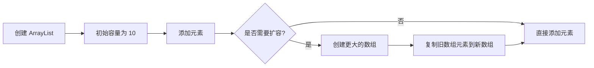
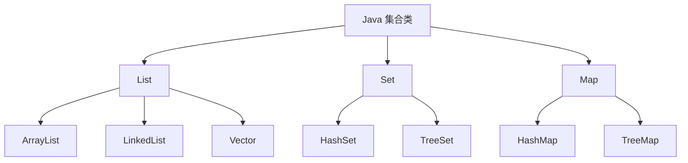

# Java ArrayList

## 介绍

ArrayList 是 Java 集合框架中最常用的类之一，它实现了 List 接口，基于数组实现，提供了动态数组的功能。与传统数组相比，ArrayList 能够自动调整大小，使得添加和删除元素更加灵活方便。

ArrayList 特点：
- 基于数组实现，随机访问效率高
- 容量可动态增长
- 允许存储重复元素和 null 元素
- 线程不安全（非同步）

:::note 基础概念
ArrayList 位于 `java.util` 包中，使用前需要导入：
```java
import java.util.ArrayList;
```
:::

## ArrayList 的创建与初始化

### 创建 ArrayList 对象

```java
// 创建一个空的 ArrayList
ArrayList<String> list1 = new ArrayList<>();

// 创建指定初始容量的 ArrayList
ArrayList<Integer> list2 = new ArrayList<>(20);

// 通过其他集合创建 ArrayList
ArrayList<Double> list3 = new ArrayList<>(anotherCollection);
```

### 添加元素

```java
ArrayList<String> fruits = new ArrayList<>();

// 添加元素到列表末尾
fruits.add("Apple");
fruits.add("Banana");
fruits.add("Orange");

// 在指定位置添加元素
fruits.add(1, "Mango");

System.out.println(fruits);
```

输出:
```
[Apple, Mango, Banana, Orange]
```

## ArrayList 常用方法

### 访问元素

```java
ArrayList<String> fruits = new ArrayList<>();
fruits.add("Apple");
fruits.add("Banana");
fruits.add("Orange");

// 获取指定索引位置的元素
String fruit = fruits.get(1);
System.out.println("索引 1 的元素是: " + fruit);

// 获取列表大小
int size = fruits.size();
System.out.println("列表大小: " + size);

// 检查元素是否存在
boolean containsApple = fruits.contains("Apple");
System.out.println("列表包含 Apple: " + containsApple);

// 查找元素的索引
int index = fruits.indexOf("Orange");
System.out.println("Orange 的索引是: " + index);
```

输出:
```
索引 1 的元素是: Banana
列表大小: 3
列表包含 Apple: true
Orange 的索引是: 2
```

### 修改元素

```java
ArrayList<String> colors = new ArrayList<>();
colors.add("Red");
colors.add("Green");
colors.add("Blue");

System.out.println("修改前: " + colors);

// 修改指定位置的元素
colors.set(1, "Yellow");

System.out.println("修改后: " + colors);
```

输出:
```
修改前: [Red, Green, Blue]
修改后: [Red, Yellow, Blue]
```

### 删除元素

```java
ArrayList<String> languages = new ArrayList<>();
languages.add("Java");
languages.add("Python");
languages.add("C++");
languages.add("JavaScript");

System.out.println("删除前: " + languages);

// 通过索引删除元素
languages.remove(1);
System.out.println("删除索引 1 后: " + languages);

// 通过元素值删除元素
languages.remove("C++");
System.out.println("删除 C++ 后: " + languages);

// 清空列表
languages.clear();
System.out.println("清空后的大小: " + languages.size());
```

输出:
```
删除前: [Java, Python, C++, JavaScript]
删除索引 1 后: [Java, C++, JavaScript]
删除 C++ 后: [Java, JavaScript]
清空后的大小: 0
```

### 遍历 ArrayList

ArrayList 可以通过多种方式进行遍历：

```java
ArrayList<String> cities = new ArrayList<>();
cities.add("New York");
cities.add("London");
cities.add("Tokyo");
cities.add("Paris");

// 1. 使用 for 循环
System.out.println("使用 for 循环:");
for (int i = 0; i < cities.size(); i++) {
    System.out.println(cities.get(i));
}

// 2. 使用增强 for 循环（推荐）
System.out.println("\n使用增强 for 循环:");
for (String city : cities) {
    System.out.println(city);
}

// 3. 使用迭代器
System.out.println("\n使用迭代器:");
Iterator<String> iterator = cities.iterator();
while (iterator.hasNext()) {
    System.out.println(iterator.next());
}

// 4. 使用 forEach 方法（Java 8+）
System.out.println("\n使用 forEach 方法:");
cities.forEach(city -> System.out.println(city));
```

## ArrayList 的内部实现

ArrayList 内部使用数组来存储元素。当元素数量超过内部数组容量时，会自动扩容：



扩容过程会重新分配一个更大的数组（通常是当前容量的 1.5 倍），并将现有元素复制到新数组中，这是一个相对耗时的操作。

:::tip 优化建议
如果预先知道要存储的元素数量，可以在创建 ArrayList 时指定初始容量，避免频繁扩容带来的性能开销。
:::

## ArrayList 与 Array 的区别

| 特性 | ArrayList | Array |
|------|-----------|-------|
| 大小 | 动态可变 | 固定 |
| 类型 | 只能存储对象，不支持基本类型 | 可存储对象或基本类型 |
| 泛型支持 | 支持泛型 | 不支持泛型 |
| API | 提供丰富的方法 | 只提供基本操作 |
| 性能 | 由于装箱/拆箱可能较慢 | 操作基本类型时更快 |

## 实际应用场景

### 场景一：学生管理系统

```java
import java.util.ArrayList;

public class StudentManagementSystem {
    public static void main(String[] args) {
        // 创建学生列表
        ArrayList<Student> students = new ArrayList<>();
        
        // 添加学生
        students.add(new Student(1, "Alice", 85));
        students.add(new Student(2, "Bob", 92));
        students.add(new Student(3, "Charlie", 78));
        students.add(new Student(4, "Diana", 95));
        
        // 显示所有学生
        System.out.println("所有学生:");
        for (Student student : students) {
            System.out.println(student);
        }
        
        // 查找成绩最高的学生
        Student topStudent = findTopStudent(students);
        System.out.println("\n成绩最高的学生:");
        System.out.println(topStudent);
        
        // 移除成绩低于 80 的学生
        removeStudentsWithLowScores(students, 80);
        System.out.println("\n移除后的学生列表:");
        for (Student student : students) {
            System.out.println(student);
        }
    }
    
    // 查找成绩最高的学生
    private static Student findTopStudent(ArrayList<Student> students) {
        if (students.isEmpty()) {
            return null;
        }
        
        Student top = students.get(0);
        for (Student student : students) {
            if (student.getScore() > top.getScore()) {
                top = student;
            }
        }
        return top;
    }
    
    // 移除成绩低于指定分数的学生
    private static void removeStudentsWithLowScores(ArrayList<Student> students, int minScore) {
        // 使用迭代器安全地删除元素
        Iterator<Student> iterator = students.iterator();
        while (iterator.hasNext()) {
            Student student = iterator.next();
            if (student.getScore() < minScore) {
                iterator.remove();
            }
        }
    }
}

class Student {
    private int id;
    private String name;
    private int score;
    
    public Student(int id, String name, int score) {
        this.id = id;
        this.name = name;
        this.score = score;
    }
    
    public int getId() {
        return id;
    }
    
    public String getName() {
        return name;
    }
    
    public int getScore() {
        return score;
    }
    
    @Override
    public String toString() {
        return "Student{id=" + id + ", name='" + name + "', score=" + score + "}";
    }
}
```

### 场景二：购物车系统

```java
import java.util.ArrayList;

public class ShoppingCart {
    private ArrayList<Product> items;
    
    public ShoppingCart() {
        items = new ArrayList<>();
    }
    
    public void addProduct(Product product) {
        items.add(product);
        System.out.println(product.getName() + " 已添加到购物车");
    }
    
    public void removeProduct(int productId) {
        for (int i = 0; i < items.size(); i++) {
            if (items.get(i).getId() == productId) {
                System.out.println(items.get(i).getName() + " 已从购物车移除");
                items.remove(i);
                return;
            }
        }
        System.out.println("产品未找到");
    }
    
    public double calculateTotal() {
        double total = 0;
        for (Product item : items) {
            total += item.getPrice();
        }
        return total;
    }
    
    public void displayCart() {
        if (items.isEmpty()) {
            System.out.println("购物车为空");
            return;
        }
        
        System.out.println("购物车内容:");
        for (Product item : items) {
            System.out.println(item);
        }
        System.out.println("总价: $" + calculateTotal());
    }
    
    public static void main(String[] args) {
        ShoppingCart cart = new ShoppingCart();
        
        // 添加产品到购物车
        cart.addProduct(new Product(101, "笔记本电脑", 999.99));
        cart.addProduct(new Product(102, "手机", 599.99));
        cart.addProduct(new Product(103, "耳机", 89.99));
        
        // 显示购物车
        cart.displayCart();
        
        // 移除产品
        cart.removeProduct(102);
        
        // 再次显示购物车
        cart.displayCart();
    }
}

class Product {
    private int id;
    private String name;
    private double price;
    
    public Product(int id, String name, double price) {
        this.id = id;
        this.name = name;
        this.price = price;
    }
    
    public int getId() {
        return id;
    }
    
    public String getName() {
        return name;
    }
    
    public double getPrice() {
        return price;
    }
    
    @Override
    public String toString() {
        return "Product{id=" + id + ", name='" + name + "', price=$" + price + "}";
    }
}
```

## ArrayList 性能注意事项

1. **插入和删除操作**：在 ArrayList 中间位置插入或删除元素需要移动后续元素，时间复杂度为 O(n)。如果频繁进行此类操作，考虑使用 LinkedList。

2. **容量管理**：ArrayList 扩容会导致性能损失。如果预先知道大致容量，应在创建时指定初始容量。

3. **基本类型**：ArrayList 不能直接存储基本类型，需要使用包装类（如 Integer 代替 int），这会带来额外的装箱/拆箱开销。

4. **遍历方式**：不同遍历方式对性能有影响：
   - 标准 for 循环（带索引）性能较好
   - 增强 for 循环语法简洁但稍慢
   - 迭代器在需要修改列表时更安全

:::warning 注意
当在迭代过程中修改 ArrayList 时，应使用迭代器的 remove() 方法，而不是 ArrayList 的 remove() 方法，否则会抛出 ConcurrentModificationException。
:::

## ArrayList 与其他集合的对比



| 集合类 | 有序性 | 允许重复 | 线程安全 | 随机访问 | 适用场景 |
|-------|-------|---------|---------|---------|---------|
| ArrayList | ✅ | ✅ | ❌ | 高效 O(1) | 频繁读取、较少修改 |
| LinkedList | ✅ | ✅ | ❌ | 低效 O(n) | 频繁插入/删除 |
| Vector | ✅ | ✅ | ✅ | 高效 O(1) | 需要线程安全的场景 |
| HashSet | ❌ | ❌ | ❌ | - | 需要唯一元素 |
| TreeSet | ✅(排序) | ❌ | ❌ | - | 需要排序的唯一元素 |

## 总结

ArrayList 是 Java 集合框架中的核心类，提供了动态数组功能，使得数组操作更加灵活。它适用于需要频繁随机访问元素的场景，但在频繁插入和删除元素（特别是在中间位置）的情况下性能较差。

主要优点：
- 随机访问元素高效
- 动态扩容，无需预先确定大小
- API 丰富，使用方便
- 适合大多数列表操作场景

主要缺点：
- 插入和删除元素效率低（特别是中间位置）
- 线程不安全
- 容量扩展需要复制数组，可能影响性能
- 不能直接存储基本类型

## 练习题

1. **基础操作**：创建一个 ArrayList，添加 5 个整数，然后删除其中的偶数。

2. **学生成绩**：创建一个存储学生成绩的 ArrayList，计算平均分、最高分和最低分。

3. **去重**：编写一个方法，接收一个包含重复元素的 ArrayList，返回一个没有重复元素的新 ArrayList。

4. **性能测试**：比较在 ArrayList 和 LinkedList 的头部、中间和尾部插入 10000 个元素的性能差异。

5. **并发修改**：编写一个程序演示 ConcurrentModificationException，并展示如何正确使用迭代器避免此异常。

## 附加资源

- [Java API Documentation - ArrayList](https://docs.oracle.com/en/java/javase/17/docs/api/java.base/java/util/ArrayList.html)
- [Oracle Java Tutorials - Collections Framework](https://docs.oracle.com/javase/tutorial/collections/)
- [Java Collection Framework Cheat Sheet](https://www.jrebel.com/blog/java-collections-cheat-sheet)

通过理解和熟练使用 ArrayList，你将掌握 Java 集合框架的基础，为学习更高级的数据结构和算法打下基础。