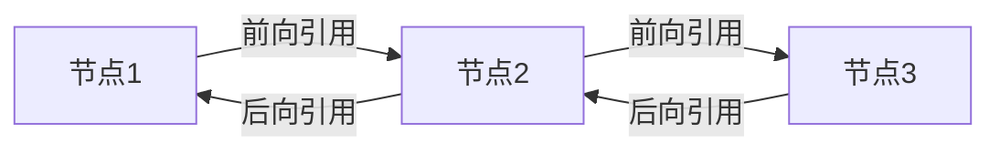

# Java LinkedList

LinkedList 是 Java 集合框架中的一个重要实现类，它实现了 List 和 Deque 接口，提供了链表数据结构的操作能力。对于初学者来说，理解 LinkedList 不仅有助于掌握集合框架，还能加深对数据结构的认识。

## LinkedList 简介

LinkedList 是基于**双向链表**实现的集合类。与 ArrayList 相比，它在某些操作上具有不同的性能特点。

:::note 链表的基本概念
链表是一种线性数据结构，其中的元素通过引用（或指针）连接在一起。每个节点包含数据部分和指向下一个节点的引用。
:::

在 Java 的 LinkedList 中，实现的是双向链表，这意味着每个节点不仅知道下一个节点是谁，还知道上一个节点是谁。



## LinkedList 的主要特点

1. **非连续内存空间**：与数组不同，链表中的元素不是存储在连续的内存位置。
2. **插入和删除高效**：在链表任何位置插入或删除元素都是O(1)的操作（假设已知节点位置）。
3. **随机访问低效**：查找特定元素需要从头（或尾）遍历，是O(n)的操作。
4. **支持快速添加/移除首尾元素**：适合用作队列或栈。
5. **允许存储null值**：可以包含多个null元素。
6. **非线程安全**：多线程环境下需要额外同步。

## 创建 LinkedList

以下是创建 LinkedList 的几种常见方式：

```java
// 创建空的 LinkedList
LinkedList<String> names = new LinkedList<>();

// 使用已有集合创建 LinkedList
ArrayList<String> arrayList = new ArrayList<>();
arrayList.add("John");
arrayList.add("Mary");
LinkedList<String> namesFromArray = new LinkedList<>(arrayList);

// 使用 Arrays.asList() 创建 LinkedList
LinkedList<Integer> numbers = new LinkedList<>(Arrays.asList(1, 2, 3, 4, 5));
```

## LinkedList 的常用方法

LinkedList 提供了丰富的操作方法，下面列出一些最常用的：

### 基本操作

```java
LinkedList<String> fruits = new LinkedList<>();

// 添加元素
fruits.add("Apple");        // 添加到末尾
fruits.addFirst("Banana");  // 添加到开头
fruits.addLast("Cherry");   // 添加到末尾
fruits.add(1, "Orange");    // 在指定位置添加

System.out.println(fruits); // 输出: [Banana, Orange, Apple, Cherry]

// 获取元素
String first = fruits.getFirst();  // 获取第一个元素
String last = fruits.getLast();    // 获取最后一个元素
String middle = fruits.get(1);     // 获取指定位置的元素

System.out.println("First: " + first);   // 输出: First: Banana
System.out.println("Last: " + last);     // 输出: Last: Cherry
System.out.println("Middle: " + middle); // 输出: Middle: Orange

// 删除元素
fruits.removeFirst();           // 删除第一个元素
fruits.removeLast();            // 删除最后一个元素
fruits.remove(0);               // 删除指定位置的元素
fruits.remove("Apple");         // 删除特定元素

System.out.println(fruits);     // 输出: [] (所有元素都被删除了)
```

### 作为栈和队列使用

LinkedList 实现了 Deque 接口，因此可以作为栈或队列使用：

```java
LinkedList<String> stack = new LinkedList<>();

// 作为栈使用
stack.push("First");    // 添加到栈顶（链表头部）
stack.push("Second");
stack.push("Third");

System.out.println(stack);          // 输出: [Third, Second, First]
System.out.println(stack.pop());    // 输出: Third (并从栈中移除)
System.out.println(stack);          // 输出: [Second, First]

LinkedList<String> queue = new LinkedList<>();

// 作为队列使用
queue.offer("First");   // 添加到队尾
queue.offer("Second");
queue.offer("Third");

System.out.println(queue);            // 输出: [First, Second, Third]
System.out.println(queue.poll());     // 输出: First (并从队列中移除)
System.out.println(queue);            // 输出: [Second, Third]
```

## LinkedList 与 ArrayList 比较

了解 LinkedList 和 ArrayList 的区别，有助于在实际应用中选择合适的集合类：

| 特性 | LinkedList | ArrayList |
|------|------------|-----------|
| 内部实现 | 双向链表 | 动态数组 |
| 随机访问 | O(n) | O(1) |
| 插入/删除 | O(1)* | O(n)* |
| 内存消耗 | 较高（需存储前后引用） | 较低 |
| 适用场景 | 频繁插入/删除 | 频繁随机访问 |

*注：这里假设已知节点位置或在头尾操作；如果需要先查找，则 LinkedList 的插入/删除复杂度也会变为 O(n)。

## 实际应用场景

### 场景一：实现历史记录功能

LinkedList 适合用来实现应用程序中的"撤销"和"重做"功能，因为这需要在两端快速添加和删除操作：

```java
public class UndoRedoManager<T> {
    private LinkedList<T> history = new LinkedList<>();
    private int currentPosition = -1;
    
    public void addAction(T action) {
        // 删除当前位置之后的所有历史记录
        while (history.size() > currentPosition + 1) {
            history.removeLast();
        }
        
        // 添加新的动作
        history.add(action);
        currentPosition++;
    }
    
    public T undo() {
        if (currentPosition >= 0) {
            return history.get(currentPosition--);
        }
        return null;
    }
    
    public T redo() {
        if (currentPosition < history.size() - 1) {
            return history.get(++currentPosition);
        }
        return null;
    }
}

// 使用示例
UndoRedoManager<String> textEditor = new UndoRedoManager<>();
textEditor.addAction("写入第一行");
textEditor.addAction("写入第二行");
textEditor.addAction("写入第三行");

System.out.println(textEditor.undo()); // 输出: 写入第三行
System.out.println(textEditor.undo()); // 输出: 写入第二行
System.out.println(textEditor.redo()); // 输出: 写入第三行
```

### 场景二：实现音乐播放队列

LinkedList 非常适合实现音乐播放器中的播放队列功能：

```java
public class MusicPlaylist {
    private LinkedList<String> songs = new LinkedList<>();
    private int currentSongIndex = -1;
    
    public void addSong(String song) {
        songs.add(song);
        if (currentSongIndex == -1) {
            currentSongIndex = 0;
        }
    }
    
    public String getCurrentSong() {
        if (currentSongIndex >= 0 && currentSongIndex < songs.size()) {
            return songs.get(currentSongIndex);
        }
        return null;
    }
    
    public String nextSong() {
        if (songs.isEmpty()) return null;
        
        currentSongIndex = (currentSongIndex + 1) % songs.size();
        return getCurrentSong();
    }
    
    public String previousSong() {
        if (songs.isEmpty()) return null;
        
        currentSongIndex = (currentSongIndex - 1 + songs.size()) % songs.size();
        return getCurrentSong();
    }
    
    public void removeSong(String song) {
        int index = songs.indexOf(song);
        if (index != -1) {
            songs.remove(index);
            if (index < currentSongIndex) {
                currentSongIndex--;
            } else if (index == currentSongIndex) {
                currentSongIndex = currentSongIndex < songs.size() ? currentSongIndex : 0;
            }
        }
    }
}

// 使用示例
MusicPlaylist playlist = new MusicPlaylist();
playlist.addSong("Shape of You");
playlist.addSong("Despacito");
playlist.addSong("Perfect");

System.out.println(playlist.getCurrentSong()); // 输出: Shape of You
System.out.println(playlist.nextSong());       // 输出: Despacito
System.out.println(playlist.nextSong());       // 输出: Perfect
System.out.println(playlist.previousSong());   // 输出: Despacito
```

## LinkedList 的性能注意事项

虽然 LinkedList 在特定场景下非常有用，但我们也需要注意以下几点：

:::caution 性能警告
1. 避免在大型 LinkedList 上使用 `get(int index)` 方法频繁随机访问，这会导致性能下降。
2. 如果需要频繁随机访问，请考虑使用 ArrayList 代替。
3. 对于大量数据，LinkedList 的内存开销会比 ArrayList 更高。
:::

## 总结

LinkedList 是 Java 集合框架中非常有用的一个集合实现，它基于双向链表数据结构，提供了高效的插入和删除操作，特别是在列表两端。它同时实现了 List 和 Deque 接口，因此可以作为列表、栈或队列使用。

虽然 LinkedList 在随机访问性能上不如 ArrayList，但在需要频繁插入删除操作的场景中，它是一个更好的选择。理解 LinkedList 的特性和适用场景，有助于在实际项目中选择最合适的数据结构。

## 练习

1. 创建一个 LinkedList，并实现一个简单的"最近浏览历史"功能，保持最多10项记录。
2. 使用 LinkedList 实现一个简单的计算器，支持撤销上一步操作。
3. 比较 LinkedList 和 ArrayList 在不同操作（添加、删除、随机访问）下的性能差异。

## 进一步学习资源

- 官方文档：[Java LinkedList](https://docs.oracle.com/en/java/javase/11/docs/api/java.base/java/util/LinkedList.html)
- 链表数据结构的更多细节
- Java 集合框架的其他实现类

通过本文的学习，你应该已经对 LinkedList 有了基本的了解，知道它的主要特性、适用场景以及如何在实际应用中使用它。随着你对 Java 集合框架理解的深入，你将能够更加灵活地在不同场景中选择合适的集合类。