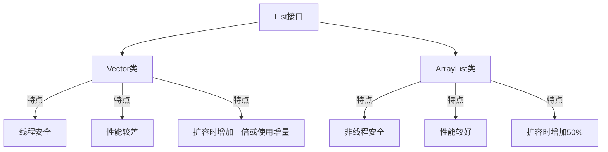

# Java Vector

## 什么是Vector？

Vector是Java集合框架中的一个类，属于`java.util`包。它实现了一个动态数组，可以根据需要自动调整大小。Vector的特点是：**线程安全**，即所有方法都是同步的(synchronized)，这使得多线程环境下使用Vector相对安全，但也导致了性能开销。

:::note 基本特征
- 可以存储不同类型的对象
- 动态调整大小
- 线程安全
- 实现了List接口
- 允许重复元素
- 维护插入顺序
:::

## Vector的基本语法

### 创建Vector

以下是创建Vector对象的几种方法：

```java
// 创建一个空的Vector
Vector<String> vector1 = new Vector<>();

// 创建指定初始容量的Vector
Vector<Integer> vector2 = new Vector<>(20);

// 创建指定初始容量和容量增量的Vector
Vector<Double> vector3 = new Vector<>(10, 5);

// 从已有集合创建Vector
ArrayList<String> list = new ArrayList<>();
list.add("Java");
list.add("Python");
Vector<String> vector4 = new Vector<>(list);
```

### Vector的容量管理

Vector有两个重要的参数：
- **容量(capacity)**: 表示Vector可以存储的元素数量
- **容量增量(capacityIncrement)**: 当Vector需要扩容时增加的容量大小

当Vector满了需要扩容时：
- 如果指定了容量增量，则新容量 = 旧容量 + 容量增量
- 如果没有指定容量增量，则新容量 = 旧容量 * 2

## Vector的常用方法

下面介绍Vector中一些常用的方法：

| 方法 | 描述 |
|------|------|
| `add(E element)` | 将元素添加到Vector末尾 |
| `add(int index, E element)` | 在指定位置插入元素 |
| `addElement(E element)` | 将元素添加到Vector末尾（传统方法） |
| `get(int index)` | 获取指定位置的元素 |
| `elementAt(int index)` | 获取指定位置的元素（传统方法） |
| `set(int index, E element)` | 替换指定位置的元素 |
| `remove(int index)` | 删除指定位置的元素 |
| `removeElement(Object obj)` | 删除首次出现的特定元素 |
| `clear()` | 移除所有元素 |
| `size()` | 返回Vector中元素的数量 |
| `capacity()` | 返回Vector的当前容量 |
| `isEmpty()` | 检查Vector是否为空 |
| `contains(Object element)` | 检查Vector是否包含指定元素 |
| `indexOf(Object element)` | 返回指定元素首次出现的索引 |
| `lastIndexOf(Object element)` | 返回指定元素最后一次出现的索引 |

## Vector使用实例

下面通过一些示例来展示Vector的使用：

### 基本操作示例

```java
import java.util.Vector;

public class VectorExample {
    public static void main(String[] args) {
        // 创建Vector
        Vector<String> languages = new Vector<>();
        
        // 添加元素
        languages.add("Java");
        languages.add("Python");
        languages.add("C++");
        languages.addElement("JavaScript");  // 等同于add方法
        
        // 输出Vector
        System.out.println("Vector内容: " + languages);
        
        // 获取元素
        System.out.println("索引1处的元素: " + languages.get(1));
        System.out.println("使用elementAt方法: " + languages.elementAt(2));
        
        // 修改元素
        languages.set(3, "TypeScript");
        System.out.println("修改后的Vector: " + languages);
        
        // 删除元素
        languages.remove(2);  // 删除索引2的元素
        System.out.println("删除元素后: " + languages);
        
        languages.removeElement("Java");  // 删除特定元素
        System.out.println("删除Java后: " + languages);
        
        // 获取大小和容量
        System.out.println("Vector大小: " + languages.size());
        System.out.println("Vector容量: " + languages.capacity());
    }
}
```

输出结果：
```
Vector内容: [Java, Python, C++, JavaScript]
索引1处的元素: Python
使用elementAt方法: C++
修改后的Vector: [Java, Python, C++, TypeScript]
删除元素后: [Java, Python, TypeScript]
删除Java后: [Python, TypeScript]
Vector大小: 2
Vector容量: 10
```

### 迭代Vector的方法

可以通过多种方式遍历Vector：

```java
import java.util.Enumeration;
import java.util.Iterator;
import java.util.Vector;

public class VectorIterationExample {
    public static void main(String[] args) {
        Vector<String> fruits = new Vector<>();
        fruits.add("苹果");
        fruits.add("香蕉");
        fruits.add("橙子");
        fruits.add("葡萄");
        
        // 方法1: 使用for循环
        System.out.println("使用标准for循环:");
        for (int i = 0; i < fruits.size(); i++) {
            System.out.println(fruits.get(i));
        }
        
        // 方法2: 使用增强for循环
        System.out.println("\n使用增强for循环:");
        for (String fruit : fruits) {
            System.out.println(fruit);
        }
        
        // 方法3: 使用Iterator
        System.out.println("\n使用Iterator:");
        Iterator<String> iterator = fruits.iterator();
        while (iterator.hasNext()) {
            System.out.println(iterator.next());
        }
        
        // 方法4: 使用Enumeration (Vector特有)
        System.out.println("\n使用Enumeration:");
        Enumeration<String> enumeration = fruits.elements();
        while (enumeration.hasMoreElements()) {
            System.out.println(enumeration.nextElement());
        }
    }
}
```

输出结果：
```
使用标准for循环:
苹果
香蕉
橙子
葡萄

使用增强for循环:
苹果
香蕉
橙子
葡萄

使用Iterator:
苹果
香蕉
橙子
葡萄

使用Enumeration:
苹果
香蕉
橙子
葡萄
```

## 实际应用案例：学生管理系统

以下是一个使用Vector实现简单学生管理系统的示例，展示Vector在实际项目中的应用：

```java
import java.util.Scanner;
import java.util.Vector;

class Student {
    private int id;
    private String name;
    private int age;

    public Student(int id, String name, int age) {
        this.id = id;
        this.name = name;
        this.age = age;
    }

    public int getId() {
        return id;
    }

    @Override
    public String toString() {
        return "Student [id=" + id + ", name=" + name + ", age=" + age + "]";
    }
}

public class StudentManagementSystem {
    private Vector<Student> students;
    private Scanner scanner;

    public StudentManagementSystem() {
        students = new Vector<>();
        scanner = new Scanner(System.in);
    }

    // 添加学生
    public void addStudent() {
        System.out.print("输入学生ID: ");
        int id = scanner.nextInt();
        scanner.nextLine(); // 消耗换行符
        
        System.out.print("输入学生姓名: ");
        String name = scanner.nextLine();
        
        System.out.print("输入学生年龄: ");
        int age = scanner.nextInt();
        
        students.add(new Student(id, name, age));
        System.out.println("学生添加成功!");
    }

    // 显示所有学生
    public void displayAllStudents() {
        if (students.isEmpty()) {
            System.out.println("没有学生记录!");
            return;
        }
        
        System.out.println("\n学生列表:");
        for (Student student : students) {
            System.out.println(student);
        }
    }

    // 删除学生
    public void removeStudent() {
        if (students.isEmpty()) {
            System.out.println("没有学生记录可删除!");
            return;
        }
        
        System.out.print("输入要删除学生的ID: ");
        int id = scanner.nextInt();
        
        boolean removed = false;
        for (int i = 0; i < students.size(); i++) {
            if (students.get(i).getId() == id) {
                students.remove(i);
                System.out.println("学生已删除!");
                removed = true;
                break;
            }
        }
        
        if (!removed) {
            System.out.println("未找到ID为 " + id + " 的学生!");
        }
    }

    // 主菜单
    public void showMenu() {
        int choice;
        do {
            System.out.println("\n学生管理系统");
            System.out.println("1. 添加学生");
            System.out.println("2. 显示所有学生");
            System.out.println("3. 删除学生");
            System.out.println("4. 退出");
            System.out.print("请选择操作: ");
            
            choice = scanner.nextInt();
            
            switch (choice) {
                case 1:
                    addStudent();
                    break;
                case 2:
                    displayAllStudents();
                    break;
                case 3:
                    removeStudent();
                    break;
                case 4:
                    System.out.println("谢谢使用，再见!");
                    break;
                default:
                    System.out.println("无效选择，请重试!");
            }
        } while (choice != 4);
    }

    public static void main(String[] args) {
        StudentManagementSystem system = new StudentManagementSystem();
        system.showMenu();
    }
}
```

这个例子展示了如何使用Vector存储学生对象，并提供添加、显示和删除学生的功能。由于Vector是线程安全的，所以即使在多线程环境中，这个系统也可以正常工作。

## Vector与ArrayList的比较

Vector和ArrayList都实现了List接口，但有几个关键区别：



| 特性 | Vector | ArrayList |
|------|--------|-----------|
| 线程安全 | 是（方法同步） | 否 |
| 性能 | 相对较差（同步开销） | 相对更好 |
| 扩容机制 | 默认扩容一倍 | 扩容50% |
| 引入版本 | JDK 1.0 | JDK 1.2 |
| 迭代器 | Enumeration和Iterator | 只有Iterator |

:::warning 注意事项
尽管Vector是线程安全的，在现代Java程序中，通常推荐使用ArrayList配合Collections.synchronizedList()或者使用CopyOnWriteArrayList来获得线程安全的列表，而不是直接使用Vector。这是因为Vector的所有方法都是同步的，这会导致不必要的性能开销。
:::

### 何时使用Vector？

- 在多线程环境下需要线程安全的动态数组，且不想自己处理同步问题
- 维护现有使用Vector的旧代码
- 需要使用Vector特有的方法，如elements()返回的Enumeration

## 小结

本文详细介绍了Java Vector类的主要特点和用法：

- Vector是Java集合框架中的一个**线程安全**的动态数组
- 它可以**自动调整大小**，扩容时默认增加一倍容量
- Vector提供了丰富的方法来操作元素，包括添加、删除、访问和修改等
- 虽然Vector是线程安全的，但在现代Java应用中，通常推荐使用ArrayList配合同步工具类，因为Vector的同步策略可能导致性能问题

## 练习题

1. 创建一个Vector存储10个整数，然后计算它们的平均值。
2. 编写一个程序，使用Vector实现一个简单的待办事项列表，功能包括添加、删除和显示待办事项。
3. 创建两个Vector，分别存储一些字符串，然后找出两个Vector的共同元素。
4. 编写一个方法，接受一个Vector作为参数，并返回该Vector中最大和最小的数字。
5. 实现一个使用Vector的图书管理系统，包括添加、删除、搜索和显示图书信息的功能。

## 更多学习资源

如果你想深入学习Java Vector，可以参考以下资源：

- Java官方文档对[Vector类](https://docs.oracle.com/en/java/javase/11/docs/api/java.base/java/util/Vector.html)的介绍
- 《Java核心技术》或《Effective Java》等书籍中关于集合框架的章节
- Java集合框架的其他类，如ArrayList、HashMap等

通过掌握Vector类，你将能够更好地理解Java集合框架，并在适当的场景中正确选择和使用集合类。