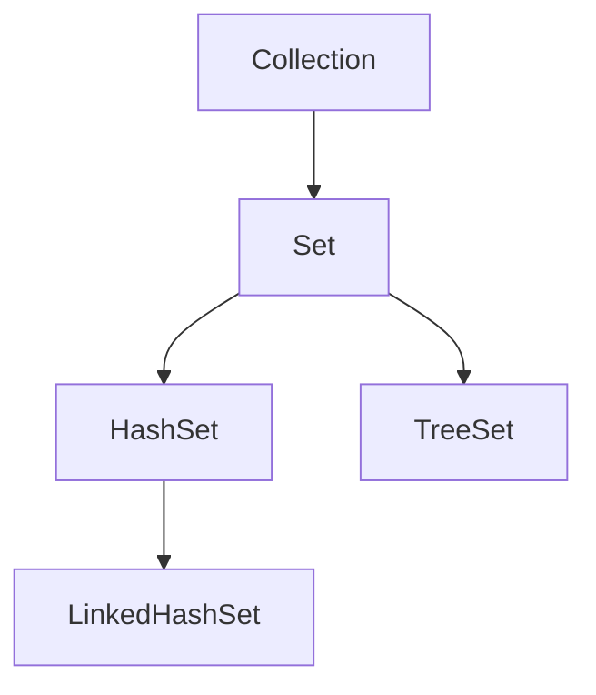

# Java Set接口

## 什么是Set接口？

Set接口是Java集合框架中一个重要的接口，它继承自Collection接口。与List不同，**Set不允许包含重复元素**，也就是说Set中的元素都是唯一的。此外，大多数Set实现类不保证元素的顺序。

Set接口的主要特点：

- 不包含重复元素
- 最多只允许有一个null元素（某些实现可能完全不允许null）
- 通常不保证元素的顺序（TreeSet例外，它维护元素的排序）



## Set接口的主要实现类

### HashSet

HashSet是Set接口最常用的实现类，它使用哈希表存储元素，具有以下特点：

- 不保证元素的顺序
- 允许使用null元素
- 提供常数时间复杂度的基本操作（添加、删除、包含检查）
- 非同步（不是线程安全的）

### LinkedHashSet

LinkedHashSet是HashSet的子类，它在HashSet的基础上维护了一个双向链表，具有以下特点：

- 维护元素的插入顺序
- 与HashSet相比，有略微的性能损失
- 适合需要按插入顺序遍历元素的场景

### TreeSet

TreeSet基于TreeMap实现，它是一个有序的Set，具有以下特点：

- 元素按照自然顺序排序，或者根据创建集合时提供的Comparator排序
- 不允许null元素
- 基本操作的时间复杂度为log(n)
- 适合需要按特定顺序访问元素的场景

## Set接口的常用方法

Set接口继承自Collection接口，因此包含了Collection的所有方法。以下是一些常用方法：

- `boolean add(E e)`: 将指定元素添加到Set中（如果集合中不存在该元素）
- `boolean remove(Object o)`: 从Set中移除指定元素
- `boolean contains(Object o)`: 判断Set是否包含指定元素
- `boolean isEmpty()`: 判断Set是否为空
- `int size()`: 返回Set中元素的数量
- `void clear()`: 移除Set中的所有元素
- `Iterator<E> iterator()`: 返回Set的迭代器

## Set的基本操作示例

让我们通过一些代码示例来了解Set的基本操作：

```java
import java.util.*;

public class SetDemo {
    public static void main(String[] args) {
        // 创建HashSet
        Set<String> fruits = new HashSet<>();
        
        // 添加元素
        fruits.add("Apple");
        fruits.add("Banana");
        fruits.add("Orange");
        fruits.add("Apple"); // 尝试添加重复元素
        
        // 打印Set
        System.out.println("Fruits Set: " + fruits);
        
        // 检查元素是否存在
        System.out.println("Contains Banana? " + fruits.contains("Banana"));
        
        // 删除元素
        fruits.remove("Banana");
        System.out.println("After removing Banana: " + fruits);
        
        // 遍历Set
        System.out.println("\nIterating through Set:");
        for (String fruit : fruits) {
            System.out.println(fruit);
        }
        
        // 清空Set
        fruits.clear();
        System.out.println("After clearing: " + fruits);
    }
}
```

输出结果：

```
Fruits Set: [Apple, Orange, Banana]
Contains Banana? true
After removing Banana: [Apple, Orange]

Iterating through Set:
Apple
Orange
After clearing: []
```

:::note
注意在输出中，"Apple"只出现一次，尽管我们尝试添加了两次。这展示了Set不允许重复元素的特性。
:::

## 不同Set实现类的比较

下面的例子展示了HashSet、LinkedHashSet和TreeSet之间的区别：

```java
import java.util.*;

public class SetComparisonDemo {
    public static void main(String[] args) {
        // 创建三种不同的Set
        Set<String> hashSet = new HashSet<>();
        Set<String> linkedHashSet = new LinkedHashSet<>();
        Set<String> treeSet = new TreeSet<>();
        
        // 向所有Set中添加相同的元素
        String[] elements = {"Banana", "Apple", "Orange", "Grapes", "Mango"};
        for (String element : elements) {
            hashSet.add(element);
            linkedHashSet.add(element);
            treeSet.add(element);
        }
        
        // 打印各Set内容
        System.out.println("HashSet (无序): " + hashSet);
        System.out.println("LinkedHashSet (插入顺序): " + linkedHashSet);
        System.out.println("TreeSet (自然排序): " + treeSet);
    }
}
```

输出结果：

```
HashSet (无序): [Apple, Grapes, Mango, Orange, Banana]
LinkedHashSet (插入顺序): [Banana, Apple, Orange, Grapes, Mango]
TreeSet (自然排序): [Apple, Banana, Grapes, Mango, Orange]
```

从输出可以看出：
- HashSet不保证元素的顺序
- LinkedHashSet保持了元素的插入顺序
- TreeSet按字母顺序（自然顺序）对元素进行了排序

## Set的常见操作

### 集合运算

Set接口非常适合进行数学上的集合操作，如并集、交集和差集：

```java
import java.util.*;

public class SetOperationsDemo {
    public static void main(String[] args) {
        // 创建两个Set
        Set<Integer> set1 = new HashSet<>(Arrays.asList(1, 2, 3, 4, 5));
        Set<Integer> set2 = new HashSet<>(Arrays.asList(3, 4, 5, 6, 7));
        
        System.out.println("Set1: " + set1);
        System.out.println("Set2: " + set2);
        
        // 并集：addAll
        Set<Integer> union = new HashSet<>(set1);
        union.addAll(set2);
        System.out.println("Union: " + union);
        
        // 交集：retainAll
        Set<Integer> intersection = new HashSet<>(set1);
        intersection.retainAll(set2);
        System.out.println("Intersection: " + intersection);
        
        // 差集：removeAll
        Set<Integer> difference1 = new HashSet<>(set1);
        difference1.removeAll(set2);
        System.out.println("Difference (set1 - set2): " + difference1);
        
        Set<Integer> difference2 = new HashSet<>(set2);
        difference2.removeAll(set1);
        System.out.println("Difference (set2 - set1): " + difference2);
    }
}
```

输出结果：

```
Set1: [1, 2, 3, 4, 5]
Set2: [3, 4, 5, 6, 7]
Union: [1, 2, 3, 4, 5, 6, 7]
Intersection: [3, 4, 5]
Difference (set1 - set2): [1, 2]
Difference (set2 - set1): [6, 7]
```

### 使用自定义对象

使用自定义对象时，需要正确实现`equals()`和`hashCode()`方法，以确保Set能正确处理对象的唯一性：

```java
import java.util.*;

class Person {
    private String name;
    private int age;
    
    public Person(String name, int age) {
        this.name = name;
        this.age = age;
    }
    
    @Override
    public boolean equals(Object obj) {
        if (this == obj) return true;
        if (obj == null || getClass() != obj.getClass()) return false;
        Person person = (Person) obj;
        return age == person.age && Objects.equals(name, person.name);
    }
    
    @Override
    public int hashCode() {
        return Objects.hash(name, age);
    }
    
    @Override
    public String toString() {
        return name + " (" + age + ")";
    }
}

public class CustomObjectSetDemo {
    public static void main(String[] args) {
        // 创建并添加Person对象
        Set<Person> persons = new HashSet<>();
        persons.add(new Person("Alice", 25));
        persons.add(new Person("Bob", 30));
        persons.add(new Person("Alice", 25)); // 与第一个对象相同
        
        System.out.println("Persons Set size: " + persons.size());
        System.out.println("Persons Set: " + persons);
    }
}
```

输出结果：

```
Persons Set size: 2
Persons Set: [Alice (25), Bob (30)]
```

## 实际应用场景

### 场景1：去重

Set的最常见用途之一是从集合中去除重复元素：

```java
import java.util.*;

public class DuplicateRemovalDemo {
    public static void main(String[] args) {
        // 包含重复元素的列表
        List<String> listWithDuplicates = Arrays.asList("apple", "banana", "apple", 
                                                       "orange", "banana", "grape");
        System.out.println("Original List: " + listWithDuplicates);
        
        // 使用HashSet去除重复
        Set<String> uniqueItems = new HashSet<>(listWithDuplicates);
        System.out.println("After removing duplicates: " + uniqueItems);
        
        // 如果需要保持原来的顺序，可以使用LinkedHashSet
        Set<String> uniqueItemsOrdered = new LinkedHashSet<>(listWithDuplicates);
        System.out.println("After removing duplicates (maintaining order): " + uniqueItemsOrdered);
    }
}
```

输出结果：

```
Original List: [apple, banana, apple, orange, banana, grape]
After removing duplicates: [banana, orange, apple, grape]
After removing duplicates (maintaining order): [apple, banana, orange, grape]
```

### 场景2：单词频率统计

分析文本中不同单词的出现情况：

```java
import java.util.*;

public class WordFrequencyDemo {
    public static void main(String[] args) {
        String text = "To be or not to be that is the question";
        String[] words = text.toLowerCase().split(" ");
        
        // 使用Set存储所有不同的单词
        Set<String> uniqueWords = new HashSet<>(Arrays.asList(words));
        
        System.out.println("Text: " + text);
        System.out.println("Number of words: " + words.length);
        System.out.println("Number of unique words: " + uniqueWords.size());
        System.out.println("Unique words: " + uniqueWords);
        
        // 计算每个单词的频率
        System.out.println("\nWord frequencies:");
        Map<String, Integer> wordFrequency = new HashMap<>();
        for (String word : words) {
            wordFrequency.put(word, wordFrequency.getOrDefault(word, 0) + 1);
        }
        
        for (Map.Entry<String, Integer> entry : wordFrequency.entrySet()) {
            System.out.println(entry.getKey() + ": " + entry.getValue());
        }
    }
}
```

输出结果：

```
Text: To be or not to be that is the question
Number of words: 10
Number of unique words: 8
Unique words: [question, that, or, is, the, be, to, not]

Word frequencies:
question: 1
that: 1
or: 1
is: 1
the: 1
be: 2
to: 2
not: 1
```

### 场景3：交集找共同爱好

使用Set的交集操作找出共同的爱好：

```java
import java.util.*;

public class CommonInterestsDemo {
    public static void main(String[] args) {
        // 不同人的爱好
        Set<String> aliceInterests = new HashSet<>(Arrays.asList(
                "reading", "music", "hiking", "cooking", "photography"));
        
        Set<String> bobInterests = new HashSet<>(Arrays.asList(
                "gaming", "music", "cooking", "painting", "running"));
        
        Set<String> carolInterests = new HashSet<>(Arrays.asList(
                "photography", "baking", "music", "dancing", "hiking"));
        
        // 找出所有人共同的爱好
        Set<String> commonInterests = new HashSet<>(aliceInterests);
        commonInterests.retainAll(bobInterests);
        commonInterests.retainAll(carolInterests);
        
        System.out.println("Alice's interests: " + aliceInterests);
        System.out.println("Bob's interests: " + bobInterests);
        System.out.println("Carol's interests: " + carolInterests);
        System.out.println("Common interests: " + commonInterests);
        
        // 找出Alice和Bob的共同爱好
        Set<String> aliceBobCommon = new HashSet<>(aliceInterests);
        aliceBobCommon.retainAll(bobInterests);
        System.out.println("Alice and Bob common interests: " + aliceBobCommon);
        
        // 找出Alice和Carol的共同爱好
        Set<String> aliceCarolCommon = new HashSet<>(aliceInterests);
        aliceCarolCommon.retainAll(carolInterests);
        System.out.println("Alice and Carol common interests: " + aliceCarolCommon);
    }
}
```

输出结果：

```
Alice's interests: [photography, cooking, music, reading, hiking]
Bob's interests: [painting, cooking, music, gaming, running]
Carol's interests: [photography, baking, music, dancing, hiking]
Common interests: [music]
Alice and Bob common interests: [cooking, music]
Alice and Carol common interests: [photography, music, hiking]
```

## Set接口性能比较

不同的Set实现类在性能上有差异：

:::caution
这些性能特征是一般趋势，实际性能可能因具体使用场景而异。
:::

| 操作 | HashSet | LinkedHashSet | TreeSet |
|------|---------|---------------|---------|
| 添加/删除/包含 | O(1) | O(1) | O(log n) |
| 遍历 | O(n) | O(n) | O(n) |
| 内存消耗 | 中等 | 较高 | 较高 |
| 有序性 | 无序 | 插入顺序 | 自然顺序或自定义顺序 |

## 小结与最佳实践

### Set接口总结

- Set是一个不允许重复元素的集合
- 主要实现类有HashSet(无序)、LinkedHashSet(保持插入顺序)和TreeSet(排序)
- 适用于需要元素唯一性、执行集合运算或需要特定元素顺序的场景

### 何时使用哪种Set实现？

- **HashSet**: 当不关心元素顺序，只需要最高效的性能时
- **LinkedHashSet**: 当需要记住元素的插入顺序时
- **TreeSet**: 当需要元素保持特定的排序方式时

### 最佳实践

1. 总是为自定义类实现`equals()`和`hashCode()`方法，以确保在Set中正常工作
2. 根据具体需求选择适当的Set实现类
3. 避免在频繁修改的同时进行迭代，以防止并发修改异常
4. 考虑线程安全性需求，必要时使用同步包装器或并发集合类

## 练习题

1. 编写一个程序，使用Set接口找出两个字符串中的共同字符。
2. 实现一个方法，该方法接受一个整数列表，返回一个新列表，其中只包含出现过一次的元素。
3. 创建一个学生类，并使用TreeSet按照学生的成绩对学生进行排序。
4. 编写代码演示如何使用Set实现一个简单的"词典"，能够检查单词是否存在。
5. 实现一个方法，将一组单词按照首字母分组。

## 附加资源

- [Java官方文档 - Set接口](https://docs.oracle.com/javase/8/docs/api/java/util/Set.html)
- [Java官方文档 - HashSet类](https://docs.oracle.com/javase/8/docs/api/java/util/HashSet.html)
- [Java官方文档 - LinkedHashSet类](https://docs.oracle.com/javase/8/docs/api/java/util/LinkedHashSet.html)
- [Java官方文档 - TreeSet类](https://docs.oracle.com/javase/8/docs/api/java/util/TreeSet.html)

通过学习和实践Set接口，你将掌握处理集合数据的强大工具，特别是在需要保证元素唯一性或执行集合运算时。掌握不同Set实现的特性和适用场景，将帮助你在实际开发中做出更合适的集合选择。