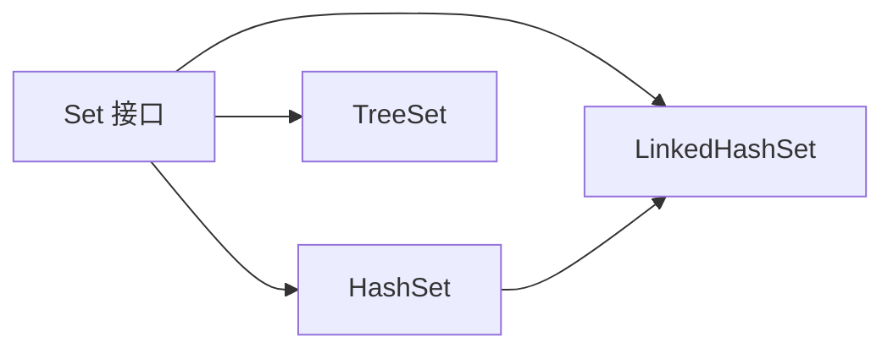

# Java HashSet

HashSet 是 Java 集合框架中的一个重要实现类，它基于哈希表实现，提供了高效的添加、删除和查找操作。作为 Set 接口的实现，HashSet 最显著的特点是它不允许存储重复元素，并且不保证元素的顺序。对于需要频繁判断元素是否存在的应用场景，HashSet 是一个理想的选择。

## HashSet 的特点

HashSet 具有以下关键特性：

- **不允许重复元素**：集合中的元素是唯一的
- **无序集合**：元素在集合中的顺序可能与添加顺序不同
- **允许 null 值**：可以包含一个 null 元素
- **非同步**：不是线程安全的
- **高效的添加、删除和查找操作**：时间复杂度为 O(1)

:::note 内部实现
HashSet 在内部使用 HashMap 实现。当您添加元素到 HashSet 时，这个元素实际上被作为 HashMap 的键存储，而值则是一个固定的对象常量。
:::

## HashSet 的基本用法

### 创建 HashSet

```java
// 创建一个空的 HashSet
HashSet<String> fruits = new HashSet<>();

// 创建指定初始容量的 HashSet
HashSet<Integer> numbers = new HashSet<>(20);

// 使用另一个集合创建 HashSet
ArrayList<String> list = new ArrayList<>();
list.add("苹果");
list.add("香蕉");
HashSet<String> fruitSet = new HashSet<>(list);
```

### 添加和删除元素

```java
HashSet<String> programmingLanguages = new HashSet<>();

// 添加元素
programmingLanguages.add("Java");
programmingLanguages.add("Python");
programmingLanguages.add("C++");
programmingLanguages.add("JavaScript");

// 输出: [Java, C++, Python, JavaScript]
System.out.println(programmingLanguages);

// 添加重复元素
boolean added = programmingLanguages.add("Java"); // 返回 false，添加失败
System.out.println("是否添加成功: " + added);
System.out.println(programmingLanguages); // 集合不变

// 删除元素
programmingLanguages.remove("C++");
System.out.println(programmingLanguages); // 输出: [Java, Python, JavaScript]

// 清空集合
programmingLanguages.clear();
System.out.println(programmingLanguages); // 输出: []
```

### 检查元素是否存在

```java
HashSet<String> colors = new HashSet<>();
colors.add("红色");
colors.add("蓝色");
colors.add("绿色");

// 检查元素是否存在
boolean exists = colors.contains("红色"); // 返回 true
System.out.println("是否包含'红色': " + exists);

exists = colors.contains("黄色"); // 返回 false
System.out.println("是否包含'黄色': " + exists);
```

### 遍历 HashSet

有多种方法可以遍历 HashSet：

```java
HashSet<String> cities = new HashSet<>();
cities.add("北京");
cities.add("上海");
cities.add("广州");
cities.add("深圳");

// 方法 1: 使用 for-each 循环
System.out.println("使用 for-each 循环遍历:");
for (String city : cities) {
    System.out.println(city);
}

// 方法 2: 使用迭代器
System.out.println("\n使用迭代器遍历:");
Iterator<String> iterator = cities.iterator();
while (iterator.hasNext()) {
    System.out.println(iterator.next());
}

// 方法 3: 使用 forEach 方法 (Java 8+)
System.out.println("\n使用 forEach 方法遍历:");
cities.forEach(city -> System.out.println(city));
```

## HashSet 的常用方法

以下是 HashSet 类中一些常用方法：

| 方法 | 描述 |
|------|------|
| `boolean add(E e)` | 如果集合中不存在指定元素，则添加它 |
| `void clear()` | 移除集合中的所有元素 |
| `boolean contains(Object o)` | 如果集合包含指定元素，则返回 true |
| `boolean isEmpty()` | 如果集合不包含元素，则返回 true |
| `boolean remove(Object o)` | 如果存在指定元素，则从集合中移除它 |
| `int size()` | 返回集合中的元素数量 |
| `Object[] toArray()` | 返回包含集合所有元素的数组 |

## HashSet 的性能特性

HashSet 提供了常数时间复杂度的添加、删除和包含操作，这使其在处理大量数据时非常高效。下面是主要操作的时间复杂度：

- **add(E e)**: O(1)
- **remove(Object o)**: O(1)
- **contains(Object o)**: O(1)

:::caution 注意
上述时间复杂度是基于哈希函数良好分布的假设。如果存在大量哈希冲突，性能可能会下降到 O(n)。
:::

## HashSet 与其他 Set 实现的比较



| Set 实现 | 特点 | 适用场景 |
|---------|------|---------|
| HashSet | 无序、不重复、查询快 | 需要快速查找、添加和删除元素 |
| LinkedHashSet | 按插入顺序、不重复 | 需要维护插入顺序且需要快速访问 |
| TreeSet | 有序(自然顺序或比较器)、不重复 | 需要按特定顺序遍历元素 |

## 实际应用案例

### 案例一：去重操作

HashSet 最常见的应用是去除重复项：

```java
public static void main(String[] args) {
    // 原始数据包含重复项
    List<Integer> numberList = Arrays.asList(1, 2, 3, 2, 1, 4, 5, 4, 3);
    System.out.println("原始列表: " + numberList);
    
    // 使用 HashSet 去重
    HashSet<Integer> uniqueNumbers = new HashSet<>(numberList);
    System.out.println("去重后集合: " + uniqueNumbers);
    
    // 如果需要有序的去重结果，可以再转回 List
    List<Integer> uniqueList = new ArrayList<>(uniqueNumbers);
    System.out.println("去重后列表: " + uniqueList);
}
```

输出:
```
原始列表: [1, 2, 3, 2, 1, 4, 5, 4, 3]
去重后集合: [1, 2, 3, 4, 5]
去重后列表: [1, 2, 3, 4, 5]
```

### 案例二：单词频率统计

结合 HashMap 使用 HashSet 进行单词频率统计：

```java
public static void main(String[] args) {
    String text = "Java 是一种广泛使用的编程语言 Java 可以用于网站开发 移动应用程序和大型系统开发";
    String[] words = text.split("\\s+");
    
    // 计算单词频率
    Map<String, Integer> wordFrequency = new HashMap<>();
    for (String word : words) {
        wordFrequency.put(word, wordFrequency.getOrDefault(word, 0) + 1);
    }
    
    // 找出只出现一次的单词
    HashSet<String> uniqueWords = new HashSet<>();
    for (Map.Entry<String, Integer> entry : wordFrequency.entrySet()) {
        if (entry.getValue() == 1) {
            uniqueWords.add(entry.getKey());
        }
    }
    
    System.out.println("所有单词: " + Arrays.toString(words));
    System.out.println("单词频率: " + wordFrequency);
    System.out.println("只出现一次的单词: " + uniqueWords);
}
```

输出:
```
所有单词: [Java, 是一种广泛使用的编程语言, Java, 可以用于网站开发, 移动应用程序和大型系统开发]
单词频率: {Java=2, 可以用于网站开发=1, 是一种广泛使用的编程语言=1, 移动应用程序和大型系统开发=1}
只出现一次的单词: [可以用于网站开发, 是一种广泛使用的编程语言, 移动应用程序和大型系统开发]
```

### 案例三：集合操作

使用 HashSet 实现集合的交集、并集和差集操作：

```java
public static void main(String[] args) {
    HashSet<Character> set1 = new HashSet<>();
    set1.add('A');
    set1.add('B');
    set1.add('C');
    set1.add('D');
    
    HashSet<Character> set2 = new HashSet<>();
    set2.add('C');
    set2.add('D');
    set2.add('E');
    set2.add('F');
    
    System.out.println("集合1: " + set1);
    System.out.println("集合2: " + set2);
    
    // 创建 set1 的副本，用于操作
    HashSet<Character> union = new HashSet<>(set1);
    union.addAll(set2); // 并集
    System.out.println("并集: " + union);
    
    HashSet<Character> intersection = new HashSet<>(set1);
    intersection.retainAll(set2); // 交集
    System.out.println("交集: " + intersection);
    
    HashSet<Character> difference = new HashSet<>(set1);
    difference.removeAll(set2); // 差集 (set1 - set2)
    System.out.println("差集 (set1 - set2): " + difference);
}
```

输出:
```
集合1: [A, B, C, D]
集合2: [C, D, E, F]
并集: [A, B, C, D, E, F]
交集: [C, D]
差集 (set1 - set2): [A, B]
```

## 注意事项和最佳实践

### 1. 重写 equals() 和 hashCode() 方法

当使用自定义类对象作为 HashSet 元素时，必须正确重写 equals() 和 hashCode() 方法：

```java
public class Student {
    private int id;
    private String name;
    
    public Student(int id, String name) {
        this.id = id;
        this.name = name;
    }
    
    @Override
    public boolean equals(Object o) {
        if (this == o) return true;
        if (o == null || getClass() != o.getClass()) return false;
        Student student = (Student) o;
        return id == student.id && Objects.equals(name, student.name);
    }
    
    @Override
    public int hashCode() {
        return Objects.hash(id, name);
    }
    
    @Override
    public String toString() {
        return "Student{id=" + id + ", name='" + name + "'}";
    }
}

// 使用示例
public static void main(String[] args) {
    HashSet<Student> students = new HashSet<>();
    students.add(new Student(1, "张三"));
    students.add(new Student(2, "李四"));
    students.add(new Student(1, "张三")); // 重复，不会被添加
    
    System.out.println(students.size()); // 输出: 2
    System.out.println(students);
}
```

### 2. 性能调优

虽然 HashSet 通常性能良好，但在初始化时考虑容量可能有助于提高性能：

```java
// 当大致知道元素数量时，可以设置初始容量
// 默认加载因子是 0.75
int expectedElements = 10000;
HashSet<Integer> optimizedSet = new HashSet<>(expectedElements / 3 * 4 + 1);
```

### 3. 线程安全

HashSet 不是线程安全的。如果需要线程安全版本，可以使用 Collections.synchronizedSet：

```java
Set<String> synchronizedSet = Collections.synchronizedSet(new HashSet<>());
```

## 总结

HashSet 是 Java 集合框架中用于存储不重复元素的高效实现。它基于哈希表数据结构，提供了接近常数时间的添加、删除和查找操作。由于其不允许重复元素的特性，HashSet 特别适合需要快速确定元素存在性的场景，如去重操作和集合运算。

虽然 HashSet 不维护元素的插入顺序，但如果需要有序的集合，可以考虑使用 LinkedHashSet 或 TreeSet。在使用自定义类作为 HashSet 元素时，记得正确重写 equals() 和 hashCode() 方法以确保正确比较对象。

## 练习

1. 创建一个 HashSet 并添加 10 个整数，然后打印出所有大于 5 的数。
2. 编写一个方法，接受一个字符串参数，返回一个包含该字符串中所有唯一字符的 HashSet。
3. 创建两个 HashSet，分别包含一些元素，然后计算并打印它们的并集、交集和差集。
4. 编写一个程序，读取一个文本文件并创建一个包含该文件中所有唯一单词的 HashSet。

## 延伸资料

若要深入学习 Java HashSet，建议阅读以下资源：
- Java 官方文档中的 HashSet 章节
- 《Java 核心技术》中的集合框架部分
- 《Effective Java》中关于 equals 和 hashCode 的章节

继续学习，你可以进一步探索 Java 集合框架中的其他实现，如 TreeSet 和 LinkedHashSet，以及它们与 HashSet 的区别和各自适用的场景。