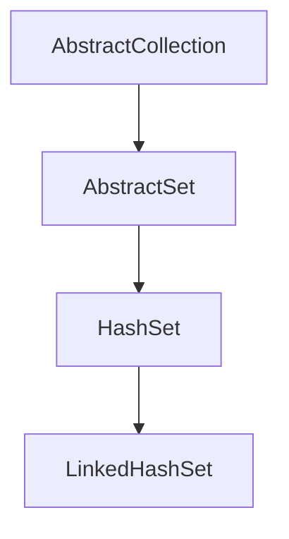

# Java LinkedHashSet

## 简介

`LinkedHashSet` 是 Java 集合框架中的一个重要实现类，它继承自 `HashSet` 类，并在 `HashSet` 的基础上，通过维护一个贯穿所有条目的双向链表，保持了元素的插入顺序。这个特性使得 `LinkedHashSet` 在需要按照元素添加顺序进行遍历的场景中非常有用。

`LinkedHashSet` 结合了 `HashSet` 和 `LinkedList` 的优点：它保持了 `HashSet` 的快速查找特性，同时又像 `LinkedList` 那样保持了元素的插入顺序。

## LinkedHashSet 的特性

- 不允许重复元素
- 维护元素的插入顺序
- 允许 null 元素
- 非同步（线程不安全）
- 性能略低于 `HashSet`，但高于 `TreeSet`
- 初始容量和负载因子会影响其性能



## 创建 LinkedHashSet

### 基本构造方法

```java
// 创建一个空的 LinkedHashSet，默认初始容量为 16，负载因子为 0.75
LinkedHashSet<String> linkedHashSet1 = new LinkedHashSet<>();

// 指定初始容量
LinkedHashSet<String> linkedHashSet2 = new LinkedHashSet<>(20);

// 指定初始容量和负载因子
LinkedHashSet<String> linkedHashSet3 = new LinkedHashSet<>(20, 0.8f);

// 通过集合创建
Collection<String> collection = Arrays.asList("Java", "Python", "JavaScript");
LinkedHashSet<String> linkedHashSet4 = new LinkedHashSet<>(collection);
```

## LinkedHashSet 的基本操作

### 添加元素

```java
LinkedHashSet<String> programmingLanguages = new LinkedHashSet<>();
programmingLanguages.add("Java");
programmingLanguages.add("Python");
programmingLanguages.add("C++");
programmingLanguages.add("JavaScript");
programmingLanguages.add("Java"); // 尝试添加重复元素

System.out.println(programmingLanguages);
```

输出：
```
[Java, Python, C++, JavaScript]
```

:::note
注意到重复的 "Java" 元素没有被添加进去，因为 `LinkedHashSet` 不允许重复元素。
:::

### 移除元素

```java
LinkedHashSet<String> programmingLanguages = new LinkedHashSet<>();
programmingLanguages.add("Java");
programmingLanguages.add("Python");
programmingLanguages.add("C++");
programmingLanguages.add("JavaScript");

// 移除单个元素
boolean isRemoved = programmingLanguages.remove("Python");
System.out.println("Is Python removed? " + isRemoved);
System.out.println(programmingLanguages);
```

输出：
```
Is Python removed? true
[Java, C++, JavaScript]
```

### 检查元素是否存在

```java
LinkedHashSet<String> programmingLanguages = new LinkedHashSet<>();
programmingLanguages.add("Java");
programmingLanguages.add("Python");

boolean containsJava = programmingLanguages.contains("Java");
boolean containsRuby = programmingLanguages.contains("Ruby");

System.out.println("Contains Java? " + containsJava);
System.out.println("Contains Ruby? " + containsRuby);
```

输出：
```
Contains Java? true
Contains Ruby? false
```

### 遍历 LinkedHashSet

```java
LinkedHashSet<String> programmingLanguages = new LinkedHashSet<>();
programmingLanguages.add("Java");
programmingLanguages.add("Python");
programmingLanguages.add("C++");
programmingLanguages.add("JavaScript");

// 使用 for-each 循环
System.out.println("使用 for-each 循环遍历：");
for (String language : programmingLanguages) {
    System.out.println(language);
}

// 使用迭代器
System.out.println("\n使用迭代器遍历：");
Iterator<String> iterator = programmingLanguages.iterator();
while (iterator.hasNext()) {
    System.out.println(iterator.next());
}
```

输出：
```
使用 for-each 循环遍历：
Java
Python
C++
JavaScript

使用迭代器遍历：
Java
Python
C++
JavaScript
```

## LinkedHashSet 与其他 Set 实现的比较

### LinkedHashSet vs HashSet

`LinkedHashSet` 和 `HashSet` 最大的区别在于 `LinkedHashSet` 维护了元素的插入顺序：

```java
System.out.println("--- HashSet vs LinkedHashSet ---");

HashSet<String> hashSet = new HashSet<>();
hashSet.add("Banana");
hashSet.add("Apple");
hashSet.add("Cherry");

LinkedHashSet<String> linkedHashSet = new LinkedHashSet<>();
linkedHashSet.add("Banana");
linkedHashSet.add("Apple");
linkedHashSet.add("Cherry");

System.out.println("HashSet: " + hashSet);
System.out.println("LinkedHashSet: " + linkedHashSet);
```

输出：
```
--- HashSet vs LinkedHashSet ---
HashSet: [Apple, Cherry, Banana]
LinkedHashSet: [Banana, Apple, Cherry]
```

:::tip
可以看到，`HashSet` 并不保证元素的顺序，而 `LinkedHashSet` 则保持了元素的插入顺序。
:::

### LinkedHashSet vs TreeSet

```java
System.out.println("--- LinkedHashSet vs TreeSet ---");

LinkedHashSet<String> linkedHashSet = new LinkedHashSet<>();
linkedHashSet.add("Banana");
linkedHashSet.add("Apple");
linkedHashSet.add("Cherry");

TreeSet<String> treeSet = new TreeSet<>();
treeSet.add("Banana");
treeSet.add("Apple");
treeSet.add("Cherry");

System.out.println("LinkedHashSet: " + linkedHashSet);
System.out.println("TreeSet: " + treeSet);
```

输出：
```
--- LinkedHashSet vs TreeSet ---
LinkedHashSet: [Banana, Apple, Cherry]
TreeSet: [Apple, Banana, Cherry]
```

:::tip
`TreeSet` 按照元素的自然顺序或者比较器顺序排序，而 `LinkedHashSet` 保持元素的插入顺序。
:::

## LinkedHashSet 的实际应用

### 用例1：维护用户访问历史

```java
public class UserHistoryTracker {
    private LinkedHashSet<String> visitedUrls;
    private static final int MAX_HISTORY_SIZE = 10;
    
    public UserHistoryTracker() {
        visitedUrls = new LinkedHashSet<>();
    }
    
    public void trackUrl(String url) {
        // 如果历史记录中已存在该 URL，先移除它（这样可以保证最新访问的排在最后）
        if (visitedUrls.contains(url)) {
            visitedUrls.remove(url);
        }
        
        // 如果历史记录已达到最大容量，移除最早的记录
        if (visitedUrls.size() >= MAX_HISTORY_SIZE) {
            String firstUrl = visitedUrls.iterator().next();
            visitedUrls.remove(firstUrl);
        }
        
        // 添加新访问的 URL
        visitedUrls.add(url);
    }
    
    public void displayHistory() {
        System.out.println("访问历史（从最早到最新）：");
        for (String url : visitedUrls) {
            System.out.println("- " + url);
        }
    }
    
    public static void main(String[] args) {
        UserHistoryTracker tracker = new UserHistoryTracker();
        
        tracker.trackUrl("https://www.example.com/home");
        tracker.trackUrl("https://www.example.com/products");
        tracker.trackUrl("https://www.example.com/about");
        tracker.trackUrl("https://www.example.com/products"); // 重复访问
        
        tracker.displayHistory();
    }
}
```

输出：
```
访问历史（从最早到最新）：
- https://www.example.com/home
- https://www.example.com/about
- https://www.example.com/products
```

### 用例2：菜单项顺序管理

```java
public class OrderedMenu {
    private LinkedHashSet<String> menuItems;
    
    public OrderedMenu() {
        menuItems = new LinkedHashSet<>();
    }
    
    public void addMenuItem(String item) {
        menuItems.add(item);
    }
    
    public void displayMenu() {
        System.out.println("菜单项：");
        int index = 1;
        for (String item : menuItems) {
            System.out.println(index++ + ". " + item);
        }
    }
    
    public static void main(String[] args) {
        OrderedMenu menu = new OrderedMenu();
        
        menu.addMenuItem("首页");
        menu.addMenuItem("产品");
        menu.addMenuItem("关于我们");
        menu.addMenuItem("联系方式");
        menu.addMenuItem("产品"); // 尝试添加重复项
        
        menu.displayMenu();
    }
}
```

输出：
```
菜单项：
1. 首页
2. 产品
3. 关于我们
4. 联系方式
```

## 性能考虑

`LinkedHashSet` 在查找、添加和删除操作上的时间复杂度均为 O(1)，但由于需要维护链表结构，会比 `HashSet` 稍慢。

| 操作      | LinkedHashSet | HashSet  | TreeSet  |
|----------|--------------|----------|----------|
| 添加      | O(1)         | O(1)     | O(log n) |
| 删除      | O(1)         | O(1)     | O(log n) |
| 包含      | O(1)         | O(1)     | O(log n) |
| 遍历      | O(n)         | O(n)     | O(n)     |
| 内存占用   | 高           | 中       | 低        |

:::caution
`LinkedHashSet` 由于维护了双向链表，相比 `HashSet` 需要更多的内存。
:::

## 总结

`LinkedHashSet` 是 Java 集合框架中的一个实用类，它结合了哈希表和链表的优点：

1. 通过哈希表提供了高效的查找、添加和删除操作
2. 通过双向链表维护了元素的插入顺序

主要特点：
- 不允许重复元素
- 允许 null 元素
- 维护元素的插入顺序
- 非同步（线程不安全）

`LinkedHashSet` 特别适用于那些既需要 `Set` 的不重复特性，又需要维护元素插入顺序的场景，如访问历史记录、菜单项排序等。

## 练习题

1. 创建一个 `LinkedHashSet` 并添加 5 个元素，然后通过迭代器遍历并打印这些元素。
2. 编写一个程序，比较 `LinkedHashSet`、`HashSet` 和 `TreeSet` 在添加和遍历相同元素时的性能差异。
3. 使用 `LinkedHashSet` 实现一个简单的购物车功能，要求能够添加商品、移除商品，并按添加顺序显示购物车中的商品。
4. 实现一个最近播放的音乐列表，要求最多保存 20 首最近播放的歌曲，并且按照播放时间顺序排列。

## 扩展阅读

- [Java API 文档 - LinkedHashSet](https://docs.oracle.com/en/java/javase/17/docs/api/java.base/java/util/LinkedHashSet.html)
- [Java Collection Framework - Set Interface](https://docs.oracle.com/en/java/javase/17/docs/api/java.base/java/util/Set.html)
- [Java 集合框架工作原理](https://docs.oracle.com/javase/tutorial/collections/index.html)

通过学习 `LinkedHashSet`，你已经掌握了 Java 集合框架中一个功能强大且常用的数据结构。在实际应用中，当你需要一个既能快速查找又能保持插入顺序的集合时，`LinkedHashSet` 是一个很好的选择。