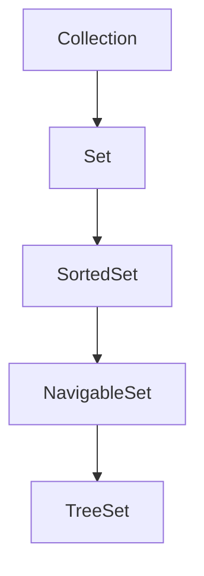
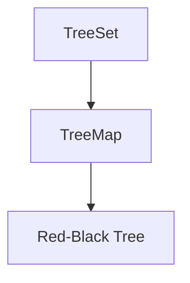

# Java TreeSet

在Java集合框架中，TreeSet是一个非常实用的集合类，它是SortedSet接口的一个实现，基于TreeMap实现。TreeSet提供了一个有序、不包含重复元素的集合，非常适合需要对元素进行排序的场景。

## TreeSet简介

TreeSet是NavigableSet接口的实现类，它具有以下主要特点：

1. **元素有序性**：元素按照自然顺序或者自定义比较器排序
2. **不允许重复**：不包含重复元素
3. **非线程安全**：多线程环境下需要额外同步
4. **基于红黑树**：内部使用红黑树（Red-Black tree）数据结构实现



## TreeSet的创建与基本操作

### 创建TreeSet

TreeSet提供了多种构造方法用于创建实例：

```java
// 创建一个空的TreeSet，元素按照自然顺序排序
TreeSet<String> treeSet1 = new TreeSet<>();

// 创建一个包含指定集合所有元素的TreeSet
Set<String> set = new HashSet<>();
set.add("apple");
set.add("banana");
TreeSet<String> treeSet2 = new TreeSet<>(set);

// 创建一个空的TreeSet，并指定比较器
TreeSet<String> treeSet3 = new TreeSet<>(new Comparator<String>() {
    @Override
    public int compare(String s1, String s2) {
        return s2.compareTo(s1); // 降序排列
    }
});

// 使用Lambda表达式简化比较器定义
TreeSet<String> treeSet4 = new TreeSet<>((s1, s2) -> s2.compareTo(s1));
```

### 基本操作

TreeSet支持常见的集合操作：

```java
TreeSet<String> fruits = new TreeSet<>();

// 添加元素
fruits.add("Apple");
fruits.add("Banana");
fruits.add("Orange");
fruits.add("Apple"); // 重复元素，不会被添加

// 输出集合
System.out.println(fruits); // [Apple, Banana, Orange]

// 检查元素是否存在
boolean containsApple = fruits.contains("Apple"); // true
boolean containsGrape = fruits.contains("Grape"); // false

// 删除元素
fruits.remove("Banana");
System.out.println(fruits); // [Apple, Orange]

// 获取元素个数
int size = fruits.size(); // 2

// 清空集合
fruits.clear();
System.out.println(fruits.isEmpty()); // true
```

## TreeSet的排序

TreeSet中的元素排序有两种方式：

1. **自然排序**：元素实现Comparable接口
2. **自定义排序**：提供Comparator比较器

### 自然排序

如果元素类实现了Comparable接口，TreeSet会使用元素的compareTo方法进行排序：

```java
TreeSet<Integer> numbers = new TreeSet<>();
numbers.add(5);
numbers.add(1);
numbers.add(3);
numbers.add(2);
numbers.add(4);

System.out.println(numbers); // [1, 2, 3, 4, 5]
```

自定义类需要实现Comparable接口：

```java
public class Student implements Comparable<Student> {
    private int id;
    private String name;
    
    public Student(int id, String name) {
        this.id = id;
        this.name = name;
    }
    
    @Override
    public int compareTo(Student other) {
        return this.id - other.id; // 按ID升序排序
    }
    
    @Override
    public String toString() {
        return "Student{id=" + id + ", name='" + name + "'}";
    }
}

TreeSet<Student> students = new TreeSet<>();
students.add(new Student(3, "Charlie"));
students.add(new Student(1, "Alice"));
students.add(new Student(2, "Bob"));

System.out.println(students);
// 输出: [Student{id=1, name='Alice'}, Student{id=2, name='Bob'}, Student{id=3, name='Charlie'}]
```

### 自定义排序

使用Comparator实现自定义排序规则：

```java
TreeSet<String> fruitsDesc = new TreeSet<>((s1, s2) -> s2.compareTo(s1));
fruitsDesc.add("Apple");
fruitsDesc.add("Banana");
fruitsDesc.add("Orange");

System.out.println(fruitsDesc); // [Orange, Banana, Apple]
```

对于自定义类，如果没有实现Comparable接口或想覆盖默认排序：

```java
class Person {
    private String name;
    private int age;
    
    public Person(String name, int age) {
        this.name = name;
        this.age = age;
    }
    
    public String getName() { return name; }
    public int getAge() { return age; }
    
    @Override
    public String toString() {
        return "Person{name='" + name + "', age=" + age + "}";
    }
}

// 按年龄排序
TreeSet<Person> personsByAge = new TreeSet<>((p1, p2) -> p1.getAge() - p2.getAge());
personsByAge.add(new Person("Alice", 25));
personsByAge.add(new Person("Bob", 30));
personsByAge.add(new Person("Charlie", 20));

System.out.println(personsByAge);
// 输出: [Person{name='Charlie', age=20}, Person{name='Alice', age=25}, Person{name='Bob', age=30}]

// 按姓名排序
TreeSet<Person> personsByName = new TreeSet<>((p1, p2) -> p1.getName().compareTo(p2.getName()));
personsByName.add(new Person("Alice", 25));
personsByName.add(new Person("Bob", 30));
personsByName.add(new Person("Charlie", 20));

System.out.println(personsByName);
// 输出: [Person{name='Alice', age=25}, Person{name='Bob', age=30}, Person{name='Charlie', age=20}]
```

:::caution
如果TreeSet中的元素没有实现Comparable接口，且创建TreeSet时没有提供Comparator，将抛出ClassCastException异常。
:::

## TreeSet特有的方法

作为NavigableSet的实现，TreeSet提供了许多用于导航的方法：

```java
TreeSet<Integer> numbers = new TreeSet<>();
numbers.add(10);
numbers.add(20);
numbers.add(30);
numbers.add(40);
numbers.add(50);

// 返回大于或等于给定元素的最小元素
Integer ceiling = numbers.ceiling(15); // 20

// 返回小于或等于给定元素的最大元素
Integer floor = numbers.floor(25); // 20

// 返回严格大于给定元素的最小元素
Integer higher = numbers.higher(30); // 40

// 返回严格小于给定元素的最大元素
Integer lower = numbers.lower(30); // 20

// 获取并移除第一个(最小)元素
Integer first = numbers.pollFirst(); // 10

// 获取并移除最后一个(最大)元素
Integer last = numbers.pollLast(); // 50

// 获取第一个元素(不移除)
Integer firstElement = numbers.first(); // 20

// 获取最后一个元素(不移除)
Integer lastElement = numbers.last(); // 40

// 返回从fromElement(包含)到toElement(不包含)的子集
SortedSet<Integer> subSet = numbers.subSet(20, 40); // [20, 30]

// 返回小于toElement的所有元素组成的子集
SortedSet<Integer> headSet = numbers.headSet(30); // [20]

// 返回大于或等于fromElement的所有元素组成的子集
SortedSet<Integer> tailSet = numbers.tailSet(30); // [30, 40]

// 返回集合的迭代器(降序)
Iterator<Integer> descendingIterator = numbers.descendingIterator();

// 返回集合的降序视图
NavigableSet<Integer> descendingSet = numbers.descendingSet();
System.out.println(descendingSet); // [40, 30, 20]
```

## TreeSet的内部实现

TreeSet内部使用TreeMap实现。TreeSet中的元素实际上是存储在TreeMap中的键，而值则是一个共享的虚拟对象。



TreeMap使用红黑树数据结构，确保了主要操作（如add、remove、contains）的时间复杂度为O(log n)。

## TreeSet的性能分析

以下是TreeSet主要操作的时间复杂度：

| 操作 | 时间复杂度 |
|------|-----------|
| add() | O(log n) |
| remove() | O(log n) |
| contains() | O(log n) |
| size() | O(1) |
| isEmpty() | O(1) |
| floor() | O(log n) |
| ceiling() | O(log n) |

相比于HashSet (O(1)的查找性能)，TreeSet的查找/添加/删除操作较慢，但TreeSet保证了元素的有序性。

## TreeSet的实际应用场景

### 1. 排序去重

当需要对集合元素进行排序并去除重复项时，TreeSet是理想选择：

```java
String[] words = {"apple", "banana", "orange", "banana", "grape", "apple"};
TreeSet<String> uniqueSortedWords = new TreeSet<>();
for (String word : words) {
    uniqueSortedWords.add(word);
}
System.out.println(uniqueSortedWords); // [apple, banana, grape, orange]
```

### 2. 范围查询

TreeSet非常适合进行范围查询操作：

```java
TreeSet<Integer> scores = new TreeSet<>();
scores.add(85);
scores.add(92);
scores.add(78);
scores.add(65);
scores.add(99);

// 获取80分以上的所有成绩
SortedSet<Integer> highScores = scores.tailSet(80);
System.out.println("高分成绩: " + highScores); // [85, 92, 99]

// 获取60-90分之间的成绩
SortedSet<Integer> mediumScores = scores.subSet(60, 91);
System.out.println("中等成绩: " + mediumScores); // [65, 78, 85]
```

### 3. 排行榜系统

TreeSet可以用于实现简单的排行榜系统：

```java
class Player implements Comparable<Player> {
    private String name;
    private int score;
    
    public Player(String name, int score) {
        this.name = name;
        this.score = score;
    }
    
    public String getName() { return name; }
    public int getScore() { return score; }
    
    @Override
    public int compareTo(Player other) {
        // 按分数降序排列
        return other.score - this.score;
    }
    
    @Override
    public String toString() {
        return name + ": " + score;
    }
}

public void leaderboard() {
    TreeSet<Player> leaderboard = new TreeSet<>();
    leaderboard.add(new Player("Alice", 85));
    leaderboard.add(new Player("Bob", 92));
    leaderboard.add(new Player("Charlie", 78));
    leaderboard.add(new Player("David", 99));
    leaderboard.add(new Player("Eva", 65));
    
    System.out.println("===== 排行榜 =====");
    int rank = 1;
    for (Player player : leaderboard) {
        System.out.println(rank++ + ". " + player);
    }
}
```

输出结果：
```
===== 排行榜 =====
1. David: 99
2. Bob: 92
3. Alice: 85
4. Charlie: 78
5. Eva: 65
```

### 4. 日程安排

TreeSet可以用于日程安排系统，按时间顺序管理事件：

```java
class Event implements Comparable<Event> {
    private LocalDateTime startTime;
    private String description;
    
    public Event(LocalDateTime startTime, String description) {
        this.startTime = startTime;
        this.description = description;
    }
    
    @Override
    public int compareTo(Event other) {
        return this.startTime.compareTo(other.startTime);
    }
    
    @Override
    public String toString() {
        return startTime.format(DateTimeFormatter.ofPattern("yyyy-MM-dd HH:mm")) + " - " + description;
    }
}

public void scheduler() {
    TreeSet<Event> schedule = new TreeSet<>();
    schedule.add(new Event(LocalDateTime.of(2023, 9, 15, 9, 0), "团队会议"));
    schedule.add(new Event(LocalDateTime.of(2023, 9, 15, 14, 30), "客户演示"));
    schedule.add(new Event(LocalDateTime.of(2023, 9, 15, 12, 0), "午餐"));
    schedule.add(new Event(LocalDateTime.of(2023, 9, 15, 16, 0), "项目评审"));
    
    System.out.println("今日日程安排：");
    for (Event event : schedule) {
        System.out.println(event);
    }
}
```

输出结果：
```
今日日程安排：
2023-09-15 09:00 - 团队会议
2023-09-15 12:00 - 午餐
2023-09-15 14:30 - 客户演示
2023-09-15 16:00 - 项目评审
```

## 常见问题与注意事项

### 1. TreeSet中的元素必须可比较

使用TreeSet时，必须确保元素是可比较的，要么元素实现了Comparable接口，要么在创建TreeSet时提供Comparator比较器。

:::warning
如果元素不可比较且没有提供比较器，将抛出ClassCastException异常。
:::

### 2. TreeSet对null的处理

在自然排序下，TreeSet不允许插入null元素。在自定义比较器的情况下，只有当比较器可以处理null元素时才能插入。

:::caution
大多数情况下，应避免在TreeSet中使用null元素。
:::

### 3. 比较器的一致性

确保比较器的一致性很重要，即当且仅当 `x.equals(y)` 返回true时，`compare(x, y)` 返回0。否则，集合可能违反Set契约。

### 4. 修改元素时的注意事项

一旦元素添加到TreeSet中，就不应该修改元素中影响排序的字段，否则可能导致不可预期的行为。

```java
TreeSet<StringBuilder> set = new TreeSet<>(Comparator.comparing(StringBuilder::length));
StringBuilder sb = new StringBuilder("abc");
set.add(sb);
sb.append("def"); // 修改了影响排序的字段

// 此时集合可能处于不一致状态
System.out.println(set.contains(sb)); // 可能返回false
```

## 总结

TreeSet是Java集合框架中的重要成员，特别适合需要有序存储且不允许重复元素的场景。其主要优点包括：

1. **自动排序**：元素按照自然顺序或自定义比较器排序
2. **唯一性保证**：不允许重复元素
3. **高效的范围操作**：便于进行范围查询
4. **导航方法**：提供了丰富的导航方法如ceiling、floor、higher、lower等

然而，TreeSet也有一些局限性：

1. **性能**：相比HashSet，TreeSet的添加、删除和查找操作较慢(O(log n) vs O(1))
2. **元素要求**：要求元素可比较或提供比较器
3. **非线程安全**：多线程环境下需要额外同步

根据实际需求选择适合的集合类型是Java开发中的基本能力，希望本文能帮助你更好地理解和使用TreeSet。

## 练习题

1. 创建一个TreeSet，存储10个随机整数，然后按照降序打印出来。
2. 编写程序使用TreeSet存储自定义的Student类，要求按照学生成绩降序排列。
3. 实现一个简单的字典应用，使用TreeSet存储单词并按字母顺序显示。
4. 使用TreeSet的范围查询方法，查找某个数值范围内的所有元素。
5. 编写一个程序，使用TreeSet的ceiling和floor方法来实现近似搜索功能。

## 学习资源

- [Java官方文档: TreeSet](https://docs.oracle.com/en/java/javase/11/docs/api/java.base/java/util/TreeSet.html)
- [Java集合框架概述](https://docs.oracle.com/javase/tutorial/collections/intro/index.html)
- 《Java编程思想》第11章：集合