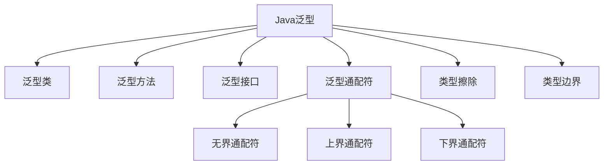

# Java 泛型概述

## 什么是泛型？

泛型是Java 5引入的一个重要特性，允许类、接口和方法在定义时使用类型参数。通过泛型，我们可以创建能够处理不同数据类型的代码，同时又保持类型安全。

泛型的主要优势：
- **类型安全**：在编译时捕获类型错误，而不是运行时
- **消除类型转换**：减少显式类型转换的需要
- **实现通用算法**：无需为不同类型编写重复代码

:::tip 思考方式
将泛型理解为"参数化类型"—就像方法可以接受不同参数一样，泛型类和方法可以操作不同的类型。
:::

## 泛型的基本语法

### 泛型类

创建一个泛型类，我们使用尖括号`<>`来声明类型参数：

```java
// 定义一个泛型类
public class Box<T> {
    private T item;
    
    public void set(T item) {
        this.item = item;
    }
    
    public T get() {
        return item;
    }
}

// 使用泛型类
Box<Integer> integerBox = new Box<>();
integerBox.set(10);
Integer item = integerBox.get();  // 无需类型转换

Box<String> stringBox = new Box<>();
stringBox.set("Hello Generics");
String text = stringBox.get();    // 无需类型转换
```

在上面的例子中，`T`是类型参数，代表在创建`Box`对象时将指定的实际类型。

### 泛型方法

泛型不仅可以应用于整个类，还可以只应用于特定方法：

```java
public class Utilities {
    // 泛型方法
    public static <E> void printArray(E[] array) {
        for (E element : array) {
            System.out.print(element + " ");
        }
        System.out.println();
    }
}

// 使用泛型方法
Integer[] intArray = {1, 2, 3, 4, 5};
String[] stringArray = {"Hello", "World", "Generics"};

Utilities.printArray(intArray);      // 输出: 1 2 3 4 5 
Utilities.printArray(stringArray);   // 输出: Hello World Generics 
```

在这个例子中，`<E>`声明了一个类型参数，使`printArray`方法可以处理任何类型的数组。

## 类型边界

有时我们需要限制泛型可以接受的类型。这可以通过类型边界来实现：

```java
// 使用extends关键字设定上界
public <T extends Number> double sumOfList(List<T> list) {
    double sum = 0.0;
    for (T item : list) {
        sum += item.doubleValue();  // Number类有doubleValue()方法
    }
    return sum;
}

// 使用
List<Integer> intList = Arrays.asList(1, 2, 3);
System.out.println(sumOfList(intList));  // 输出: 6.0

List<Double> doubleList = Arrays.asList(1.1, 2.2, 3.3);
System.out.println(sumOfList(doubleList));  // 输出: 6.6
```

在这个例子中，`<T extends Number>`表明类型参数`T`必须是`Number`类或其子类。这样我们就能在方法内调用`Number`类的方法了。

## 通配符

泛型中的通配符使用`?`表示，主要有三种形式：

1. **无界通配符**：`<?>`
2. **上界通配符**：`<? extends Type>`
3. **下界通配符**：`<? super Type>`

### 无界通配符

```java
public static void printList(List<?> list) {
    for (Object elem : list) {
        System.out.print(elem + " ");
    }
    System.out.println();
}

// 使用
List<Integer> intList = Arrays.asList(1, 2, 3);
List<String> stringList = Arrays.asList("one", "two", "three");
printList(intList);      // 输出: 1 2 3 
printList(stringList);   // 输出: one two three 
```

### 上界通配符

```java
public static double sumOfNumbers(List<? extends Number> list) {
    double sum = 0.0;
    for (Number n : list) {
        sum += n.doubleValue();
    }
    return sum;
}

List<Integer> intList = Arrays.asList(1, 2, 3);
System.out.println(sumOfNumbers(intList));  // 输出: 6.0
```

### 下界通配符

```java
public static void addIntegers(List<? super Integer> list) {
    list.add(1);
    list.add(2);
    list.add(3);
}

List<Number> numberList = new ArrayList<>();
addIntegers(numberList);
System.out.println(numberList);  // 输出: [1, 2, 3]
```

:::caution PECS原则
记住: "Producer Extends, Consumer Super" (PECS)
- 当你需要从集合中**读取**元素时，使用 `<? extends T>`
- 当你需要向集合中**写入**元素时，使用 `<? super T>`
:::

## 类型擦除

Java泛型是通过类型擦除实现的，这意味着在编译后的字节码中，泛型类型信息会被"擦除"。

例如，`Box<Integer>`和`Box<String>`在运行时都会变成普通的`Box`类，类型参数被替换为其边界（如果没有指定边界，则为`Object`）。

```java
Box<Integer> intBox = new Box<>();
Box<String> strBox = new Box<>();

System.out.println(intBox.getClass() == strBox.getClass());  
// 输出: true，因为在运行时都是Box类
```

类型擦除是Java为了向后兼容而采用的设计，但它也带来了一些限制：

- 不能创建参数化类型的数组（如`new T[]`）
- 不能使用`instanceof`检测参数化类型
- 不能创建泛型异常类

## 实际应用案例

### 案例1：通用数据存储

```java
// 一个通用的键值对数据结构
public class Pair<K, V> {
    private K key;
    private V value;
    
    public Pair(K key, V value) {
        this.key = key;
        this.value = value;
    }
    
    public K getKey() { return key; }
    public V getValue() { return value; }
    
    @Override
    public String toString() {
        return "(" + key + ", " + value + ")";
    }
}

// 使用示例
public class StudentRecord {
    public static void main(String[] args) {
        // 存储学生ID和姓名
        Pair<Integer, String> student1 = new Pair<>(1001, "张三");
        System.out.println("学生: " + student1);  // 输出: 学生: (1001, 张三)
        
        // 存储课程名和成绩
        Pair<String, Double> score = new Pair<>("数学", 92.5);
        System.out.println("成绩: " + score);     // 输出: 成绩: (数学, 92.5)
    }
}
```

### 案例2：泛型算法

```java
public class GenericAlgorithms {
    // 泛型搜索方法
    public static <T extends Comparable<T>> int binarySearch(T[] array, T key) {
        int low = 0;
        int high = array.length - 1;
        
        while (low <= high) {
            int mid = (low + high) >>> 1;
            T midVal = array[mid];
            int cmp = midVal.compareTo(key);
            
            if (cmp < 0)
                low = mid + 1;
            else if (cmp > 0)
                high = mid - 1;
            else
                return mid; // 找到元素
        }
        return -1;  // 未找到元素
    }
    
    public static void main(String[] args) {
        // 使用Integer类型
        Integer[] numbers = {1, 2, 3, 5, 8, 13, 21};
        int numIndex = binarySearch(numbers, 8);
        System.out.println("数字8的索引: " + numIndex);  // 输出: 数字8的索引: 4
        
        // 使用String类型
        String[] names = {"Anna", "Bob", "Charlie", "David", "Emma"};
        int nameIndex = binarySearch(names, "David");
        System.out.println("名字David的索引: " + nameIndex);  // 输出: 名字David的索引: 3
    }
}
```

### 案例3：泛型集合

集合框架是Java泛型最常见的应用场景之一：

```java
import java.util.*;

public class GenericCollectionExample {
    public static void main(String[] args) {
        // 泛型List
        List<String> names = new ArrayList<>();
        names.add("Alice");
        names.add("Bob");
        names.add("Charlie");
        
        // 遍历不需要类型转换
        for (String name : names) {
            System.out.println("姓名: " + name);
        }
        
        // 泛型Map
        Map<String, Integer> ageMap = new HashMap<>();
        ageMap.put("Alice", 25);
        ageMap.put("Bob", 30);
        ageMap.put("Charlie", 22);
        
        // 使用Map的Entry接口
        for (Map.Entry<String, Integer> entry : ageMap.entrySet()) {
            System.out.println(entry.getKey() + "的年龄是: " + entry.getValue());
        }
    }
}
```

## 泛型的最佳实践

1. **尽量使用泛型**：将泛型应用到可能的地方，提高代码的类型安全性
2. **使用有意义的命名**：虽然单字母参数如T、E、K、V是常见惯例，但对于复杂情况，应使用更有描述性的名称
3. **遵循PECS原则**：Producer Extends, Consumer Super
4. **避免过度设计**：不要为简单的情况创建过于复杂的泛型结构
5. **警惕类型擦除**：理解Java泛型的限制，在必要时使用其他模式绕过这些限制



## 常见问题及解决方案

### 1. 无法创建泛型数组

由于类型擦除，直接创建泛型类型的数组是不允许的：

```java
// 错误代码
T[] array = new T[10]; // 编译错误
```

解决方案：

```java
// 方案1：使用Object数组然后强制转换
@SuppressWarnings("unchecked")
T[] array = (T[])new Object[10];

// 方案2：通过反射
public static <T> T[] createArray(Class<T> type, int size) {
    @SuppressWarnings("unchecked")
    T[] array = (T[])Array.newInstance(type, size);
    return array;
}

// 使用
Integer[] intArray = createArray(Integer.class, 10);
```

### 2. 使用泛型与基本类型

泛型只能与引用类型一起使用，不能直接使用基本类型：

```java
// 错误代码
List<int> numbers = new ArrayList<>();  // 编译错误
```

解决方案：使用包装类

```java
// 正确代码
List<Integer> numbers = new ArrayList<>();
```

## 总结

Java泛型是一个强大的特性，它提供了类型安全、代码重用和更清晰的API设计。通过本文，我们了解了：

- 泛型的基本概念和语法
- 如何创建和使用泛型类、方法和接口
- 类型边界和通配符的应用
- 类型擦除及其影响
- 泛型在集合和实际场景中的应用

随着对泛型的熟悉，你将能够编写出更加灵活、类型安全且可维护的代码。

## 练习

1. 创建一个泛型类`Stack<T>`，实现基本的栈操作（push、pop、peek）。
2. 编写一个泛型方法，查找并返回数组中的最大元素（提示：使用`<T extends Comparable<T>>`）。
3. 创建一个带有多个类型参数的泛型类`DataStorage<K, V>`，实现类似HashMap的基本功能。
4. 设计一个方法，能够将`List<? extends Number>`中的所有元素相加，并返回结果。

## 进一步学习资源

- Java官方文档中的泛型教程
- 《Effective Java》第三版，Item 26-33部分深入讨论了泛型的最佳实践
- 《Java泛型和集合》by Maurice Naftalin和Philip Wadler
- Oracle的Java教程 - 泛型部分

通过这些资源，你可以进一步深入了解Java泛型的高级特性和应用场景。