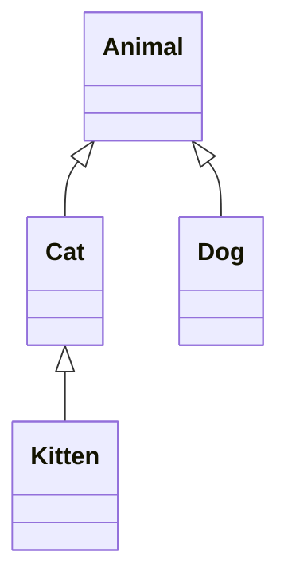

# Java 泛型通配符

## 什么是泛型通配符？

在Java泛型编程中，通配符是一种特殊的类型参数，用问号（`?`）表示。通配符使泛型更加灵活，允许方法接受不同类型参数的集合，是处理类型安全和代码灵活性之间平衡的重要工具。

:::note 通配符的核心
通配符代表"某种未知类型"，而不是所有类型。这种区别非常重要，因为它确保了类型安全。
:::

## 为什么需要通配符？

假设我们有以下继承关系：



如果没有通配符，我们会遇到以下问题：

```java
List<Animal> animals = new ArrayList<Animal>();
List<Cat> cats = new ArrayList<Cat>();

// 这行代码无法编译，即使Cat是Animal的子类
// animals = cats; // 编译错误
```

这是因为Java泛型是不可变的（invariant）。`List<Cat>`不是`List<Animal>`的子类型，即使`Cat`是`Animal`的子类型。通配符就是为了解决这个问题而设计的。

## 通配符的类型

Java中有三种类型的通配符：

1. **无界通配符**：`<?>`
2. **上界通配符**：`<? extends Type>`
3. **下界通配符**：`<? super Type>`

让我们详细了解每一种。

### 1. 无界通配符（`<?>`）

无界通配符表示"某种未知类型"，当你只关心集合中对象的通用方法时使用。

#### 示例：

```java
public static void printCollection(Collection<?> c) {
    for (Object element : c) {
        System.out.println(element);
    }
}
```

使用：

```java
List<String> strings = Arrays.asList("Java", "Python", "C++");
List<Integer> numbers = Arrays.asList(1, 2, 3);

printCollection(strings); // 打印：Java, Python, C++
printCollection(numbers); // 打印：1, 2, 3
```

:::caution 限制
使用无界通配符时，你不能向集合中添加元素（除了null），因为Java编译器无法确保添加的元素类型安全。
:::

```java
public static void addToCollection(Collection<?> c) {
    // 这行代码无法编译
    // c.add("element"); // 编译错误
    
    // 只能添加null
    c.add(null); // 允许
}
```

### 2. 上界通配符（`<? extends Type>`）

上界通配符限制未知类型为指定类型或其子类型。当你需要从集合中读取元素并操作它们时，这非常有用。

#### 示例：

```java
public static double sumOfList(List<? extends Number> list) {
    double sum = 0.0;
    for (Number number : list) {
        sum += number.doubleValue();
    }
    return sum;
}
```

使用：

```java
List<Integer> integers = Arrays.asList(1, 2, 3);
List<Double> doubles = Arrays.asList(1.1, 2.2, 3.3);

System.out.println(sumOfList(integers)); // 输出：6.0
System.out.println(sumOfList(doubles));  // 输出：6.6
```

:::caution PECS原则 - Producer Extends
使用上界通配符时，集合作为"生产者"（只能从中读取元素）。无法向使用上界通配符声明的集合中添加元素（除了null）。
:::

```java
List<? extends Animal> animals = new ArrayList<Cat>();
// 无法添加任何元素，编译错误：
// animals.add(new Cat()); // 编译错误
// animals.add(new Animal()); // 编译错误
```

### 3. 下界通配符（`<? super Type>`）

下界通配符限制未知类型为指定类型或其超类型。当你需要向集合中添加元素时，这非常有用。

#### 示例：

```java
public static void addCats(List<? super Cat> catList) {
    catList.add(new Cat("Whiskers"));
    catList.add(new Kitten("Tiny"));
    // 不能添加Animal，因为它不一定是Cat或其子类
    // catList.add(new Animal("Generic")); // 编译错误
}
```

使用：

```java
List<Animal> animals = new ArrayList<>();
List<Cat> cats = new ArrayList<>();

addCats(animals); // 可以，Animal是Cat的超类
addCats(cats);    // 可以，集合类型匹配
```

:::caution PECS原则 - Consumer Super
使用下界通配符时，集合作为"消费者"（可以向其中添加元素）。从使用下界通配符声明的集合中读取元素时，只能将它们视为Object类型。
:::

```java
List<? super Cat> catList = new ArrayList<Animal>();
catList.add(new Cat("Tom"));
catList.add(new Kitten("Baby"));

// 读取时只能视为Object
Object obj = catList.get(0);
// Cat cat = catList.get(0); // 编译错误
```

## PECS原则：生产者使用Extends，消费者使用Super

PECS（Producer-Extends, Consumer-Super）是一个重要原则，帮助我们决定何时使用哪种通配符：

1. **当你需要从集合中获取（get）元素时，使用`<? extends T>`**
2. **当你需要向集合中添加（put）元素时，使用`<? super T>`**

## 实际应用场景

### 场景1：创建通用拷贝方法

```java
public static <T> void copy(List<? super T> dest, List<? extends T> src) {
    for (int i = 0; i < src.size(); i++) {
        dest.set(i, src.get(i));
    }
}
```

这个方法允许我们将一个列表的内容复制到另一个列表，其中源列表包含的元素类型是目标列表元素类型的子类型。

### 场景2：创建一个通用的比较器

```java
public static <T extends Comparable<? super T>> T max(List<? extends T> list) {
    if (list.isEmpty()) {
        throw new IllegalArgumentException("Empty list");
    }
    
    T max = list.get(0);
    for (int i = 1; i < list.size(); i++) {
        T current = list.get(i);
        if (current.compareTo(max) > 0) {
            max = current;
        }
    }
    return max;
}
```

### 场景3：集合操作

```java
public class CollectionUtils {
    // 将一个集合中的元素添加到另一个集合
    public static <T> void addAll(Collection<? super T> target, Collection<? extends T> source) {
        for (T element : source) {
            target.add(element);
        }
    }
    
    // 查找集合中的最大值
    public static <T extends Comparable<? super T>> T findMax(Collection<? extends T> collection) {
        if (collection.isEmpty()) {
            throw new IllegalArgumentException("Empty collection");
        }
        
        T max = null;
        for (T element : collection) {
            if (max == null || element.compareTo(max) > 0) {
                max = element;
            }
        }
        return max;
    }
}
```

## 完整示例：宠物收养中心

让我们通过一个完整的示例来理解泛型通配符的应用：

```java
// 基础动物类
class Animal {
    private String name;
    
    public Animal(String name) {
        this.name = name;
    }
    
    public String getName() {
        return name;
    }
    
    @Override
    public String toString() {
        return name;
    }
}

// 猫类
class Cat extends Animal {
    public Cat(String name) {
        super(name);
    }
    
    public void meow() {
        System.out.println(getName() + " says: Meow!");
    }
}

// 小猫类
class Kitten extends Cat {
    public Kitten(String name) {
        super(name);
    }
    
    public void purr() {
        System.out.println(getName() + " purrs softly");
    }
}

// 狗类
class Dog extends Animal {
    public Dog(String name) {
        super(name);
    }
    
    public void bark() {
        System.out.println(getName() + " says: Woof!");
    }
}

// 宠物收养中心
class AdoptionCenter {
    // 显示所有动物
    public static void displayAnimals(List<? extends Animal> animals) {
        System.out.println("Available animals: ");
        for (Animal animal : animals) {
            System.out.println("- " + animal);
        }
    }
    
    // 添加猫到列表
    public static void addCats(List<? super Cat> catList, Cat... catsToAdd) {
        for (Cat cat : catsToAdd) {
            catList.add(cat);
            System.out.println("Added " + cat.getName() + " to the list");
        }
    }
    
    // 让所有猫叫
    public static void makeCatsMeow(List<? extends Cat> cats) {
        for (Cat cat : cats) {
            cat.meow();
        }
    }
}

// 主程序
public class PetAdoptionExample {
    public static void main(String[] args) {
        // 动物列表
        List<Animal> animals = new ArrayList<>();
        animals.add(new Dog("Buddy"));
        animals.add(new Dog("Max"));
        
        // 猫列表
        List<Cat> cats = new ArrayList<>();
        cats.add(new Cat("Whiskers"));
        cats.add(new Kitten("Tiny"));
        
        // 小猫列表
        List<Kitten> kittens = new ArrayList<>();
        kittens.add(new Kitten("Fluffy"));
        kittens.add(new Kitten("Mittens"));
        
        System.out.println("Initial animals:");
        AdoptionCenter.displayAnimals(animals);
        
        System.out.println("\nAdding cats to animal list:");
        AdoptionCenter.addCats(animals, new Cat("Luna"), new Kitten("Shadow"));
        
        System.out.println("\nUpdated animals:");
        AdoptionCenter.displayAnimals(animals);
        
        System.out.println("\nMaking cats meow:");
        AdoptionCenter.makeCatsMeow(cats);
        
        System.out.println("\nMaking kittens meow:");
        AdoptionCenter.makeCatsMeow(kittens);
    }
}
```

输出：

```
Initial animals:
Available animals: 
- Buddy
- Max

Adding cats to animal list:
Added Luna to the list
Added Shadow to the list

Updated animals:
Available animals: 
- Buddy
- Max
- Luna
- Shadow

Making cats meow:
Whiskers says: Meow!
Tiny says: Meow!

Making kittens meow:
Fluffy says: Meow!
Mittens says: Meow!
```

## 通配符使用指南

1. **使用`<?>`**：当你不关心集合中元素的类型，只使用与类型无关的方法时。
   
2. **使用`<? extends T>`**：当你需要从集合中读取T类型的元素时。

3. **使用`<? super T>`**：当你需要向集合中写入T类型的元素时。

4. **混合使用**：有时需要同时使用两种通配符，如`copy()`方法同时使用了`<? super T>`和`<? extends T>`。

## 通配符与类型擦除

重要的是要理解泛型通配符是在编译时强制执行的。由于Java的类型擦除机制，运行时所有泛型类型信息都会被删除。

```java
List<String> stringList = new ArrayList<>();
List<Integer> intList = new ArrayList<>();

System.out.println(stringList.getClass() == intList.getClass()); // 输出：true
```

## 通配符的优缺点

### 优点：
- 提高代码的灵活性和可重用性
- 保持类型安全
- 遵循里氏替换原则

### 缺点：
- 增加代码复杂性
- 可能导致过度使用而降低代码可读性
- 类型擦除限制了一些高级用法

## 总结

Java泛型通配符是一种强大的机制，让我们能够创建更灵活、更通用的代码，同时保持类型安全。关键点包括：

1. 无界通配符(`<?>`)用于处理未知类型
2. 上界通配符(`<? extends T>`)用于从集合读取
3. 下界通配符(`<? super T>`)用于向集合写入
4. PECS原则：Producer-Extends, Consumer-Super

正确使用泛型通配符可以显著提高代码的灵活性、复用性和类型安全性。

## 练习

1. 创建一个方法，接受任意类型的列表并打印其长度。
2. 创建一个方法，将一个数字列表的所有元素添加到另一个列表中。
3. 创建一个方法，找出实现了`Comparable`接口的对象集合中的最小值。
4. 扩展宠物收养中心示例，添加一个方法，可以根据动物类型（猫或狗）过滤动物列表。

## 进一步学习资源

- Java官方文档：[通配符和子类型](https://docs.oracle.com/javase/tutorial/extra/generics/wildcards.html)
- 《Effective Java》第三版，第31条：使用有限制通配符来增加API的灵活性
- 《Java核心技术》卷I，第8章：泛型程序设计
- 《Java编程思想》：第15章，泛型

通过深入理解和练习使用泛型通配符，你将能够编写更加灵活、类型安全的Java代码。