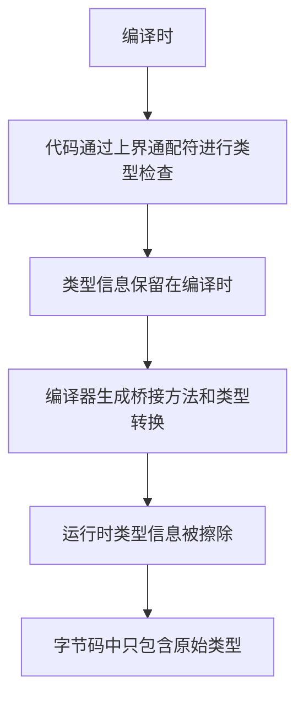

# Java 上界通配符

## 什么是上界通配符？

在Java泛型中，上界通配符（Upper Bounded Wildcards）是一种约束通配符参数的方式，它通过关键字 `extends` 指定类型参数的上界，表示参数化类型可以是指定类型或其子类型。

上界通配符的语法为：`<? extends Type>`，其中 `Type` 是上界类型。

:::note 理解要点
当你看到 `<? extends Type>` 时，可以理解为："某个类型，它是Type或Type的子类型"
:::

## 为什么需要上界通配符？

上界通配符解决了泛型不变性（invariance）的限制，使我们能够安全地读取更多类型的集合，提高代码的灵活性和可复用性。

考虑以下情景：假设有 `Animal` 类和它的子类 `Cat`。如果没有上界通配符，就无法创建一个能同时处理 `Animal` 和 `Cat` 对象列表的方法。

## 上界通配符的语法和基本使用

### 基本语法

```java
// 声明一个使用上界通配符的列表
List<? extends Animal> animals;

// 这个列表可以接收Animal类型或其任何子类型的列表
animals = new ArrayList<Animal>(); // 可以是Animal列表
animals = new ArrayList<Cat>();    // 也可以是Cat列表
```

### 简单示例

让我们看一个简单的例子，展示上界通配符的基本用法：

```java
import java.util.ArrayList;
import java.util.List;

public class UpperBoundedWildcardDemo {
    public static void main(String[] args) {
        // 创建一个Cat列表
        List<Cat> cats = new ArrayList<>();
        cats.add(new Cat("Whiskers"));
        cats.add(new Cat("Fluffy"));
        
        // 创建一个Animal列表
        List<Animal> animals = new ArrayList<>();
        animals.add(new Animal("Generic Animal"));
        animals.add(new Cat("Another Cat"));
        
        // 使用上界通配符调用方法
        System.out.println("展示猫列表：");
        printAnimals(cats);
        
        System.out.println("\n展示动物列表：");
        printAnimals(animals);
    }
    
    // 使用上界通配符，方法可以接收Animal或其子类型的列表
    public static void printAnimals(List<? extends Animal> animals) {
        for (Animal animal : animals) {
            System.out.println(animal.getName());
        }
    }
}

class Animal {
    private String name;
    
    public Animal(String name) {
        this.name = name;
    }
    
    public String getName() {
        return name;
    }
}

class Cat extends Animal {
    public Cat(String name) {
        super(name);
    }
}
```

**输出结果：**
```
展示猫列表：
Whiskers
Fluffy

展示动物列表：
Generic Animal
Another Cat
```

## 上界通配符的特点和限制

上界通配符有一些重要的特点和限制：

1. **只读不写原则**：使用上界通配符的集合基本上是只读的，你不能往其中添加元素（null除外）。

2. **可以从中读取元素**：可以从集合中获取元素，取出的元素类型为上界类型。

### 为什么不能添加元素？

考虑以下代码：

```java
List<? extends Animal> animals = new ArrayList<Cat>();
animals.add(new Animal()); // 编译错误！
animals.add(new Cat());    // 仍然是编译错误！
```

为什么会出错？因为 `animals` 引用的可能是 `ArrayList<Cat>`，也可能是 `ArrayList<Dog>`，或任何其他 `Animal` 的子类列表。Java编译器不能保证添加的元素类型与列表的实际类型匹配，所以它禁止添加任何元素（除了null）。

## 实际应用场景

### 场景1：数据读取和处理

上界通配符特别适合创建处理多种类型数据的方法。比如，读取并处理不同类型的数值列表：

```java
public class MathOperations {
    // 计算数值列表的总和
    public static double sum(List<? extends Number> numbers) {
        double sum = 0.0;
        for (Number number : numbers) {
            sum += number.doubleValue();
        }
        return sum;
    }
    
    public static void main(String[] args) {
        List<Integer> integers = List.of(1, 2, 3, 4, 5);
        List<Double> doubles = List.of(1.1, 2.2, 3.3, 4.4, 5.5);
        
        System.out.println("整数列表的总和: " + sum(integers));
        System.out.println("双精度列表的总和: " + sum(doubles));
    }
}
```

**输出结果：**
```
整数列表的总和: 15.0
双精度列表的总和: 16.5
```

### 场景2：绘图系统

假设我们正在开发一个简单的绘图应用，需要处理不同类型的形状：

```java
import java.util.ArrayList;
import java.util.List;

public class DrawingSystem {
    public static void main(String[] args) {
        List<Circle> circles = new ArrayList<>();
        circles.add(new Circle());
        circles.add(new Circle());
        
        List<Rectangle> rectangles = new ArrayList<>();
        rectangles.add(new Rectangle());
        
        DrawingBoard board = new DrawingBoard();
        board.drawShapes(circles);
        board.drawShapes(rectangles);
    }
}

class Shape {
    public void draw() {
        System.out.println("绘制一个形状");
    }
}

class Circle extends Shape {
    @Override
    public void draw() {
        System.out.println("绘制一个圆形");
    }
}

class Rectangle extends Shape {
    @Override
    public void draw() {
        System.out.println("绘制一个矩形");
    }
}

class DrawingBoard {
    // 使用上界通配符，可以接受任何Shape类型或其子类型
    public void drawShapes(List<? extends Shape> shapes) {
        for (Shape shape : shapes) {
            shape.draw();
        }
    }
}
```

**输出结果：**
```
绘制一个圆形
绘制一个圆形
绘制一个矩形
```

## 上界通配符与类型擦除

理解Java泛型中的类型擦除对于深入理解上界通配符很重要。在运行时，泛型信息会被擦除，上界通配符帮助编译器在编译时进行类型检查。



## 上界通配符与下界通配符的比较

Java泛型中还有下界通配符（`<? super Type>`），它们有不同的用途：

| 通配符 | 语法 | 主要用途 | PECS原则 |
|---|---|---|---|
| 上界通配符 | `<? extends Type>` | 从集合中读取数据 | Producer Extends |
| 下界通配符 | `<? super Type>` | 向集合中写入数据 | Consumer Super |

:::tip PECS原则
按照Joshua Bloch在《Effective Java》中提出的PECS原则（Producer-Extends, Consumer-Super）：
- 当你只需要从集合中获取数据时，使用上界通配符（`? extends T`）
- 当你只需要向集合中添加数据时，使用下界通配符（`? super T`）
:::

## 常见错误和最佳实践

### 常见错误

1. **试图向上界通配符集合中添加元素**

```java
List<? extends Animal> animals = new ArrayList<>();
animals.add(new Cat()); // 编译错误
```

2. **混淆上界通配符和泛型方法**

```java
// 错误示范：不必要地使用通配符
public static <T> void processElements(List<? extends T> list) { 
    // 应该使用：public static <T> void processElements(List<T> list)
}
```

### 最佳实践

1. **遵循PECS原则**：生产者使用extends，消费者使用super。

2. **为只读操作使用上界通配符**：当方法只需读取集合元素而不修改它们时。

3. **适当组合使用不同的通配符**：在复杂的泛型设计中，可能需要同时使用上界和下界通配符。

```java
// 从source复制元素到dest
public static <T> void copy(List<? extends T> source, List<? super T> dest) {
    for (T item : source) {
        dest.add(item);
    }
}
```

## 总结

通过本文，我们学习了Java上界通配符的基本概念、语法和使用方法：

- 上界通配符使用 `<? extends Type>` 语法
- 它允许我们创建能够处理某类型及其所有子类型的方法
- 使用上界通配符的集合主要是"只读的"，不能向其中添加元素
- 上界通配符在处理数据读取和处理时特别有用
- 遵循PECS原则可以帮助我们正确选择上界或下界通配符

掌握上界通配符是深入理解Java泛型的重要一步，它能够帮助你编写更灵活、更类型安全的代码。

## 练习

1. 创建一个方法，计算任意 `Number` 类型列表的平均值。
2. 实现一个 `findMax` 方法，找出实现了 `Comparable` 接口的任意类型列表中的最大元素。
3. 设计一个文件处理系统，使用上界通配符处理不同类型的文件。

:::caution 思考题
在什么情况下，你会选择使用上界通配符而不是泛型方法？反之亦然？
:::

## 进一步阅读

- Java官方文档中关于通配符的部分
- 《Effective Java》中关于泛型的章节，特别是Item 31: "Use bounded wildcards to increase API flexibility"
- 《Java Generics and Collections》一书，深入探讨了Java泛型和集合框架