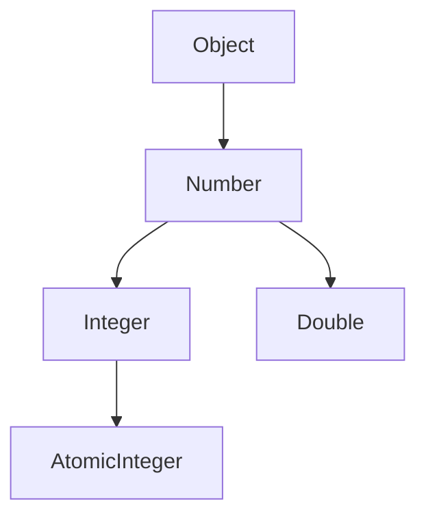

# Java 下界通配符

在学习Java泛型时，我们经常会遇到通配符（Wildcards）这个概念。通配符分为三种：无界通配符（`<?>`）、上界通配符（`<? extends T>`）以及本文要介绍的**下界通配符**（`<? super T>`）。

## 什么是下界通配符

下界通配符使用 `super` 关键字表示，形式为 `<? super T>`，它表示参数化类型可以是指定类型T或者T的任意**父类型**。

简单来说：
- `<? super Integer>` 表示"Integer或Integer的任意父类"
- 参数可以是Integer、Number、Object等类型

:::tip 理解要点
下界通配符指定了泛型类型的"下限"，即泛型参数必须是指定的类型或其父类型。
:::

## 上界通配符与下界通配符的区别

在深入学习下界通配符前，让我们先理解它与上界通配符的区别：

| 通配符 | 语法 | 含义 | 主要用途 |
|-------|------|------|---------|
| 上界通配符 | `<? extends T>` | T及其所有子类型 | 从泛型结构中读取数据 |
| 下界通配符 | `<? super T>` | T及其所有父类型 | 向泛型结构中写入数据 |

## 下界通配符的使用案例

### 基础示例

让我们看一个简单的例子，理解下界通配符的基本用法：

```java
import java.util.ArrayList;
import java.util.List;

public class LowerBoundedWildcardDemo {
    // 接受Integer或Integer父类型的List
    public static void addNumbers(List<? super Integer> list) {
        // 可以添加Integer或Integer的子类型
        list.add(10);
        list.add(20);
        // list.add("test"); // 编译错误：不能添加非Integer类型
    }

    public static void main(String[] args) {
        List<Integer> integerList = new ArrayList<>();
        List<Number> numberList = new ArrayList<>();
        List<Object> objectList = new ArrayList<>();
        
        // 都可以传入addNumbers方法
        addNumbers(integerList);
        addNumbers(numberList);
        addNumbers(objectList);
        
        System.out.println("Integer List: " + integerList);
        System.out.println("Number List: " + numberList);
        System.out.println("Object List: " + objectList);
    }
}
```

输出结果：
```
Integer List: [10, 20]
Number List: [10, 20]
Object List: [10, 20]
```

### 为什么需要下界通配符？

下界通配符主要用于**安全地写入**（生产者模式）数据到泛型集合中。

假设你有一个方法需要向List中添加Integer对象：
- 使用`List<Integer>`太严格，因为它只能接受Integer类型的List
- 使用`List<?>`不行，因为通配符类型不确定，不能向其中添加元素
- 使用`List<? super Integer>`最合适，它可以接受Integer或其父类型的List

## PECS原则：Producer Extends, Consumer Super

在Java泛型编程中，有一个重要的原则叫做PECS（Producer Extends, Consumer Super）：

1. **Producer Extends**: 如果你需要从集合中读取类型T的数据，使用`<? extends T>`
2. **Consumer Super**: 如果你需要向集合中写入类型T的数据，使用`<? super T>`

### 实际案例：Comparator使用下界通配符

Java中`Comparator`接口使用了下界通配符的一个很好例子：

```java
public static <T> void sort(List<T> list, Comparator<? super T> c)
```

这个方法可以对任何类型T的列表进行排序，但比较器可以是T或T的任意父类型的比较器。这样增加了灵活性。

例如：

```java
import java.util.ArrayList;
import java.util.Collections;
import java.util.Comparator;
import java.util.List;

public class ComparatorExample {
    public static void main(String[] args) {
        List<Integer> numbers = new ArrayList<>();
        numbers.add(5);
        numbers.add(2);
        numbers.add(8);
        
        // 使用Number的比较器来比较Integer
        Comparator<Number> numberComparator = (n1, n2) -> 
            Double.compare(n1.doubleValue(), n2.doubleValue());
        
        // 正常工作，因为Integer是Number的子类
        Collections.sort(numbers, numberComparator);
        
        System.out.println("排序后的列表: " + numbers);
    }
}
```

输出结果：
```
排序后的列表: [2, 5, 8]
```

## 下界通配符的局限性

使用下界通配符时，有些局限性需要了解：

1. **读取限制**：从`List<? super T>`中读取时，只能以Object类型读取
   ```java
   List<? super Integer> list = new ArrayList<>();
   list.add(1);
   // 只能读取为Object类型
   Object obj = list.get(0);
   // Integer i = list.get(0); // 编译错误
   ```

2. **类型安全**：编译器无法确定确切类型，所以有时需要显式类型转换

## 实践案例：集合复制

下面是一个使用下界通配符的实际例子，实现了一个集合复制功能：

```java
import java.util.ArrayList;
import java.util.List;

public class CollectionCopyExample {
    // 将源列表中的元素复制到目标列表
    public static <T> void copy(List<? extends T> source, List<? super T> destination) {
        for (T item : source) {
            destination.add(item);
        }
    }
    
    public static void main(String[] args) {
        // 源列表包含Integer元素
        List<Integer> sourceList = new ArrayList<>();
        sourceList.add(1);
        sourceList.add(2);
        sourceList.add(3);
        
        // 目标列表是Number类型，可以接收Integer
        List<Number> destinationList = new ArrayList<>();
        
        // 复制元素
        copy(sourceList, destinationList);
        
        System.out.println("源列表: " + sourceList);
        System.out.println("目标列表: " + destinationList);
    }
}
```

输出结果：
```
源列表: [1, 2, 3]
目标列表: [1, 2, 3]
```

在这个例子中：
- `source`使用上界通配符，允许从中读取元素
- `destination`使用下界通配符，允许向其中写入元素

## 理解下界通配符的工作原理

下界通配符的工作原理可以通过类型层次结构来理解：



当我们使用`List<? super Integer>`时：
- 可以存储Integer及其任何子类型
- 接受Integer、Number或Object类型的List
- 不能存储Number或Object类型，因为它们不是Integer的子类型

## 总结与最佳实践

### 要点总结

1. 下界通配符`<? super T>`表示类型参数必须是T或T的父类型
2. 主要用于安全地向泛型集合中写入数据（消费者模式）
3. 符合PECS原则中的"Consumer Super"部分
4. 使用下界通配符时，读取数据只能作为Object类型

### 最佳实践

- 当你需要向集合**写入**特定类型的元素时，使用下界通配符
- 当同时需要读写时，考虑使用具体类型而不是通配符
- 记住PECS原则：Producer Extends, Consumer Super
- 下界通配符使API更灵活，但也增加了复杂性，适度使用

## 练习题

为了巩固所学知识，尝试完成以下练习：

1. 编写一个方法，接受一个`List<? super Integer>`参数，并添加1到10的数字
2. 创建一个通用的`addAll`方法，将一个集合的元素添加到另一个集合中，正确使用上界和下界通配符
3. 解释为什么`Collections.sort`方法的比较器参数使用下界通配符

:::caution 注意事项
初学者常常混淆上界和下界通配符的使用场景。记住：当你需要向集合中添加元素时，使用下界通配符；当你需要从集合中读取元素时，使用上界通配符。
:::

## 扩展学习资源

- Java官方文档中的泛型通配符章节
- 《Effective Java》书中关于PECS原则的讨论
- Java集合框架中的源代码，特别是Collections类中的方法实现

通过学习下界通配符，你已经迈出了掌握Java高级泛型的重要一步。继续练习和应用这些概念，将使你能够编写更灵活、类型安全的Java代码。