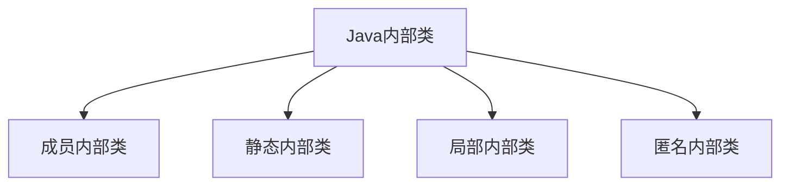

# Java 内部类概述

## 什么是内部类？

内部类(Inner Class)是Java中一个重要的特性，它允许我们在一个类的内部定义另一个类。简单来说，内部类就是定义在另一个类里面的类。

:::note
内部类可以访问外部类的所有成员（包括私有成员），这是它与普通类最大的不同。
:::

内部类提供了一种逻辑上的划分方式，使得一个类可以被分割成更小的、更专注的部分，增强了代码的可读性和可维护性。

## 内部类的类型

Java中的内部类主要分为四种类型：



### 1. 成员内部类

成员内部类就像类的一个成员变量，它可以无条件地访问外部类的所有成员属性和方法，包括私有属性和方法。

```java
public class OuterClass {
    private int outerField = 10;
    
    // 成员内部类
    public class InnerClass {
        public void display() {
            // 可以直接访问外部类的私有成员
            System.out.println("OuterField: " + outerField);
        }
    }
    
    public void createInner() {
        InnerClass inner = new InnerClass();
        inner.display();
    }
}

// 如何在外部实例化内部类
public class Main {
    public static void main(String[] args) {
        OuterClass outer = new OuterClass();
        outer.createInner();  // 输出: OuterField: 10
        
        // 直接实例化内部类的方式
        OuterClass.InnerClass inner = outer.new InnerClass();
        inner.display();  // 输出: OuterField: 10
    }
}
```

:::caution
成员内部类不能有静态声明（静态方法、静态属性），除非这些静态成员是编译时常量。
:::

### 2. 静态内部类

静态内部类是使用`static`关键字修饰的内部类。与成员内部类不同，静态内部类不需要依赖外部类实例，可以独立存在。

```java
public class OuterClass {
    private static int staticOuterField = 10;
    private int instanceOuterField = 20;
    
    // 静态内部类
    public static class StaticInnerClass {
        public void display() {
            // 只能访问外部类的静态成员
            System.out.println("StaticOuterField: " + staticOuterField);
            // 不能直接访问非静态成员
            // System.out.println(instanceOuterField); // 编译错误
        }
    }
}

public class Main {
    public static void main(String[] args) {
        // 不需要外部类实例即可创建静态内部类实例
        OuterClass.StaticInnerClass inner = new OuterClass.StaticInnerClass();
        inner.display();  // 输出: StaticOuterField: 10
    }
}
```

:::tip
静态内部类可以包含静态和非静态成员，是更独立的内部类形式。
:::

### 3. 局部内部类

局部内部类是定义在方法或作用域内的类。它只在定义它的方法或作用域内是可见的。

```java
public class OuterClass {
    private int outerField = 10;
    
    public void method(final int param) {
        final int localVar = 20;
        
        // 局部内部类
        class LocalInnerClass {
            public void display() {
                System.out.println("OuterField: " + outerField);
                System.out.println("Param: " + param);
                System.out.println("LocalVar: " + localVar);
            }
        }
        
        LocalInnerClass inner = new LocalInnerClass();
        inner.display();
    }
}

public class Main {
    public static void main(String[] args) {
        OuterClass outer = new OuterClass();
        outer.method(30);
        // 输出:
        // OuterField: 10
        // Param: 30
        // LocalVar: 20
    }
}
```

:::note
Java 8之前，局部内部类只能访问final修饰的局部变量。Java 8及之后，只要局部变量事实上是final（即值不变），即使没有显式用final修饰，也可以访问。
:::

### 4. 匿名内部类

匿名内部类是没有名字的局部内部类，用于创建一个类的实例，同时定义这个类。匿名内部类通常用于简化代码，特别是在实现事件监听器等场景。

```java
public class ButtonExample {
    public interface ClickListener {
        void onClick();
    }
    
    public void setClickListener(ClickListener listener) {
        listener.onClick();
    }
    
    public static void main(String[] args) {
        ButtonExample button = new ButtonExample();
        
        // 使用匿名内部类实现接口
        button.setClickListener(new ClickListener() {
            @Override
            public void onClick() {
                System.out.println("Button clicked!");
            }
        });
        
        // 使用Java 8 Lambda表达式简化（如果接口只有一个方法）
        button.setClickListener(() -> System.out.println("Button clicked with lambda!"));
    }
}
```

输出：
```
Button clicked!
Button clicked with lambda!
```

## 内部类的优缺点

### 优点：

1. **封装性更强**：内部类可以隐藏在外部类之内，对外部世界完全不可见。
2. **更好的组织结构**：内部类可以将相关类组织在一起，使代码结构更清晰。
3. **访问外部类成员**：内部类可以访问外部类的所有成员，包括私有成员。
4. **适合实现多继承**：Java不支持类的多继承，但通过内部类可以在一定程度上模拟多继承。

### 缺点：

1. **代码结构可能变复杂**：如果过度使用内部类，代码结构可能变得复杂难懂。
2. **编译后会生成多个类文件**：每个内部类都会生成一个单独的`.class`文件。
3. **内存和性能开销**：内部类实例持有外部类实例的引用，可能导致额外的内存开销。

## 实际应用场景

### 1. GUI事件处理

在开发图形用户界面时，经常使用匿名内部类来处理按钮点击等事件：

```java
import javax.swing.*;
import java.awt.event.*;

public class SimpleGUI extends JFrame {
    public SimpleGUI() {
        JButton button = new JButton("Click me");
        button.addActionListener(new ActionListener() {
            @Override
            public void actionPerformed(ActionEvent e) {
                JOptionPane.showMessageDialog(null, "Button clicked!");
            }
        });
        
        this.add(button);
        this.setSize(300, 200);
        this.setDefaultCloseOperation(JFrame.EXIT_ON_CLOSE);
        this.setVisible(true);
    }
    
    public static void main(String[] args) {
        new SimpleGUI();
    }
}
```

### 2. 迭代器模式实现

自定义集合类实现迭代器时，常使用内部类：

```java
import java.util.Iterator;

public class CustomCollection<T> implements Iterable<T> {
    private T[] elements;
    private int size;
    
    @SuppressWarnings("unchecked")
    public CustomCollection(int capacity) {
        elements = (T[]) new Object[capacity];
        size = 0;
    }
    
    public void add(T element) {
        if (size < elements.length) {
            elements[size++] = element;
        }
    }
    
    @Override
    public Iterator<T> iterator() {
        return new CustomIterator();
    }
    
    // 私有内部类实现迭代器
    private class CustomIterator implements Iterator<T> {
        private int currentIndex = 0;
        
        @Override
        public boolean hasNext() {
            return currentIndex < size;
        }
        
        @Override
        public T next() {
            return elements[currentIndex++];
        }
    }
    
    public static void main(String[] args) {
        CustomCollection<String> collection = new CustomCollection<>(3);
        collection.add("Java");
        collection.add("Python");
        collection.add("C++");
        
        for (String language : collection) {
            System.out.println(language);
        }
    }
}
```

输出：
```
Java
Python
C++
```

### 3. 建造者模式

建造者模式中常用内部静态类实现流畅的API：

```java
public class Person {
    private final String name;
    private final int age;
    private final String address;
    private final String phone;
    
    private Person(Builder builder) {
        this.name = builder.name;
        this.age = builder.age;
        this.address = builder.address;
        this.phone = builder.phone;
    }
    
    @Override
    public String toString() {
        return "Person{name='" + name + "', age=" + age + 
               ", address='" + address + "', phone='" + phone + "'}";
    }
    
    // 静态内部类Builder
    public static class Builder {
        private String name;
        private int age;
        private String address;
        private String phone;
        
        public Builder name(String name) {
            this.name = name;
            return this;
        }
        
        public Builder age(int age) {
            this.age = age;
            return this;
        }
        
        public Builder address(String address) {
            this.address = address;
            return this;
        }
        
        public Builder phone(String phone) {
            this.phone = phone;
            return this;
        }
        
        public Person build() {
            return new Person(this);
        }
    }
    
    public static void main(String[] args) {
        Person person = new Person.Builder()
                .name("John")
                .age(30)
                .address("New York")
                .phone("123-456-7890")
                .build();
        
        System.out.println(person);
    }
}
```

输出：
```
Person{name='John', age=30, address='New York', phone='123-456-7890'}
```

## 总结

Java内部类是一种强大的语言特性，它提供了更好的封装性、更灵活的组织结构，并可以访问外部类的所有成员。内部类分为四种主要类型：成员内部类、静态内部类、局部内部类和匿名内部类，每种类型都有其特定的用途和使用场景。

在实际开发中，合理使用内部类可以使代码更加简洁、清晰，特别是在实现UI事件处理、迭代器模式和建造者模式等场景中。但也要注意避免过度使用内部类导致代码结构复杂化。

## 练习与拓展

1. 创建一个包含成员内部类的外部类，并在内部类中访问外部类的私有成员。
2. 实现一个使用静态内部类的单例模式。
3. 使用匿名内部类实现一个简单的Runnable接口。
4. 比较Java内部类与嵌套类（C++中的嵌套类）的区别。
5. 探索内部类在Android开发中的应用（如AsyncTask等）。

## 参考资源

- 《Java核心技术》- 内部类章节
- [Oracle Java文档 - 内部类](https://docs.oracle.com/javase/tutorial/java/javaOO/innerclasses.html)
- [Effective Java](https://www.oreilly.com/library/view/effective-java-3rd/9780134686097/) - 第24条：静态成员类优于非静态成员类

通过本文的学习，相信你已经对Java内部类有了全面的了解。在实际编程中，合理运用内部类可以让你的代码更加优雅和高效。