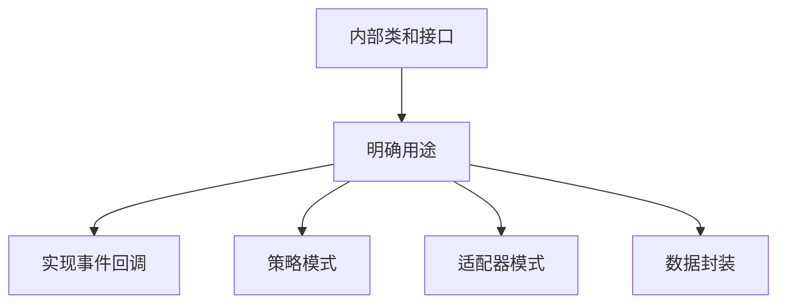

# Java 内部类与接口

## 介绍

在Java编程中，内部类和接口是两个强大的概念，它们的组合使用可以创建更灵活、更模块化的代码。本文将深入探讨Java内部类与接口的交互，帮助你理解如何有效地利用这两个概念来增强代码的结构和功能。

内部类是定义在另一个类中的类，它们可以访问外部类的成员，包括私有成员。而接口则定义了一组方法规范，由类来实现这些方法。当我们将内部类与接口结合使用时，可以实现更加灵活的设计模式和更好的封装。

## 内部类基础回顾

在深入探讨内部类与接口的关系前，让我们首先回顾一下内部类的基本知识：

1. **成员内部类**：定义在类中、方法外的类
2. **局部内部类**：定义在方法中的类
3. **匿名内部类**：没有显式定义的类，常用于实现接口或继承类
4. **静态内部类**：使用static关键字定义的内部类

## 内部类实现接口

内部类可以实现接口，就像普通类一样。这种组合为代码设计提供了更多的可能性。

### 成员内部类实现接口

```java
public class OuterClass {
    private int data = 10;
    
    // 成员内部类实现接口
    public class InnerClass implements Comparable<InnerClass> {
        private int innerData = 5;
        
        @Override
        public int compareTo(InnerClass other) {
            // 可以访问外部类的私有成员
            System.out.println("外部类数据：" + data);
            return this.innerData - other.innerData;
        }
        
        public void display() {
            System.out.println("内部数据：" + innerData);
        }
    }
    
    public void testInnerClass() {
        InnerClass inner1 = new InnerClass();
        InnerClass inner2 = new InnerClass();
        inner2.innerData = 8;
        
        System.out.println("比较结果：" + inner1.compareTo(inner2));
    }
}
```

如何使用：

```java
public class Main {
    public static void main(String[] args) {
        OuterClass outer = new OuterClass();
        outer.testInnerClass(); // 输出：外部类数据：10 比较结果：-3
        
        // 创建内部类实例
        OuterClass.InnerClass inner = outer.new InnerClass();
        inner.display(); // 输出：内部数据：5
    }
}
```

### 匿名内部类实现接口

匿名内部类是实现接口最常用的方式之一，特别是当我们只需要一次性实现时：

```java
public class InterfaceDemo {
    
    // 定义一个简单接口
    interface Clickable {
        void onClick();
        void onLongClick();
    }
    
    public void registerButton() {
        // 使用匿名内部类实现接口
        Clickable button = new Clickable() {
            @Override
            public void onClick() {
                System.out.println("按钮被点击");
            }
            
            @Override
            public void onLongClick() {
                System.out.println("按钮被长按");
            }
        };
        
        // 使用实现了接口的匿名内部类
        button.onClick(); // 输出：按钮被点击
        button.onLongClick(); // 输出：按钮被长按
    }
    
    public static void main(String[] args) {
        new InterfaceDemo().registerButton();
    }
}
```

## 内部类中定义接口

除了实现接口外，我们也可以在内部类中定义接口：

```java
public class Container {
    
    // 在内部类中定义接口
    public class ContentManager {
        
        // 内部接口定义
        public interface ContentProcessor {
            void process(String content);
        }
        
        public void processContent(String content, ContentProcessor processor) {
            // 预处理内容
            String processedContent = "处理: " + content;
            // 使用接口方法
            processor.process(processedContent);
        }
    }
    
    public void demo() {
        ContentManager manager = new ContentManager();
        manager.processContent("Hello World", new ContentManager.ContentProcessor() {
            @Override
            public void process(String content) {
                System.out.println(content);
            }
        });
    }
    
    public static void main(String[] args) {
        new Container().demo(); // 输出：处理: Hello World
    }
}
```

## 内部类与接口的实际应用场景

### 1. 事件处理系统

内部类与接口的组合在事件处理系统中特别有用，比如GUI编程：

```java
public class Button {
    
    // 定义按钮事件监听器接口
    public interface OnClickListener {
        void onClick();
    }
    
    private OnClickListener clickListener;
    
    // 设置点击监听器
    public void setOnClickListener(OnClickListener listener) {
        this.clickListener = listener;
    }
    
    // 模拟按钮点击
    public void click() {
        if (clickListener != null) {
            clickListener.onClick();
        }
    }
}

public class Application {
    private Button loginButton = new Button();
    
    public void initialize() {
        // 使用匿名内部类设置按钮点击事件
        loginButton.setOnClickListener(new Button.OnClickListener() {
            @Override
            public void onClick() {
                System.out.println("登录按钮被点击，执行登录逻辑");
                performLogin();
            }
        });
    }
    
    private void performLogin() {
        // 登录逻辑
        System.out.println("执行登录...");
    }
    
    public void simulateUserAction() {
        loginButton.click();
    }
    
    public static void main(String[] args) {
        Application app = new Application();
        app.initialize();
        app.simulateUserAction();
    }
}
```

输出：
```
登录按钮被点击，执行登录逻辑
执行登录...
```

### 2. 策略模式实现

内部类与接口的组合也适合实现策略模式：

```java
public class PaymentProcessor {

    // 支付策略接口
    public interface PaymentStrategy {
        boolean processPayment(double amount);
    }
    
    // 各种支付策略作为内部类实现
    public class CreditCardPayment implements PaymentStrategy {
        private String cardNumber;
        private String cvv;
        
        public CreditCardPayment(String cardNumber, String cvv) {
            this.cardNumber = cardNumber;
            this.cvv = cvv;
        }
        
        @Override
        public boolean processPayment(double amount) {
            // 信用卡支付处理逻辑
            System.out.println("使用信用卡 " + cardNumber.substring(cardNumber.length() - 4) + " 支付 $" + amount);
            return true;
        }
    }
    
    public class PayPalPayment implements PaymentStrategy {
        private String email;
        
        public PayPalPayment(String email) {
            this.email = email;
        }
        
        @Override
        public boolean processPayment(double amount) {
            // PayPal支付处理逻辑
            System.out.println("使用PayPal账号 " + email + " 支付 $" + amount);
            return true;
        }
    }
    
    // 使用选定的支付策略处理支付
    public boolean processOrder(double amount, PaymentStrategy strategy) {
        // 可能有额外的订单处理逻辑
        System.out.println("正在处理 $" + amount + " 的订单...");
        return strategy.processPayment(amount);
    }
}
```

使用示例：

```java
public class ShoppingCart {
    public static void main(String[] args) {
        double orderAmount = 125.99;
        
        PaymentProcessor processor = new PaymentProcessor();
        
        // 使用信用卡支付
        PaymentProcessor.CreditCardPayment creditCard = 
            processor.new CreditCardPayment("1234567890123456", "123");
        processor.processOrder(orderAmount, creditCard);
        
        // 使用PayPal支付
        PaymentProcessor.PayPalPayment paypal = 
            processor.new PayPalPayment("user@example.com");
        processor.processOrder(orderAmount, paypal);
    }
}
```

输出：
```
正在处理 $125.99 的订单...
使用信用卡 3456 支付 $125.99
正在处理 $125.99 的订单...
使用PayPal账号 user@example.com 支付 $125.99
```

## 静态内部类与接口

静态内部类在实现接口时有一些特殊的特点：

```java
public class DataContainer {
    private static String globalData = "全局数据";
    private String instanceData = "实例数据";
    
    // 静态内部类实现接口
    public static class DataProcessor implements Runnable {
        @Override
        public void run() {
            // 可以访问外部类的静态成员
            System.out.println("处理数据: " + globalData);
            
            // 无法直接访问外部类的实例成员
            // System.out.println(instanceData); // 编译错误
        }
    }
    
    public void startProcessing() {
        Thread processorThread = new Thread(new DataProcessor());
        processorThread.start();
    }
}
```

使用示例：

```java
public class Main {
    public static void main(String[] args) {
        // 不需要外部类实例就可以创建静态内部类的实例
        DataContainer.DataProcessor processor = new DataContainer.DataProcessor();
        processor.run(); // 输出：处理数据: 全局数据
        
        // 通过外部类实例启动处理
        DataContainer container = new DataContainer();
        container.startProcessing();
    }
}
```

:::tip
静态内部类不需要外部类实例就可以创建，这使得它在某些场景下更加实用，如单例模式、工厂方法等。
:::

## Lambda表达式与函数式接口

在Java 8及以后版本中，我们可以使用Lambda表达式来简化单方法接口（也称为函数式接口）的实现，这是对匿名内部类的一种更简洁的替代：

```java
public class LambdaExample {
    
    // 函数式接口（只有一个抽象方法的接口）
    interface Calculator {
        int calculate(int a, int b);
    }
    
    public void performCalculation(int x, int y, Calculator calc) {
        int result = calc.calculate(x, y);
        System.out.println("计算结果: " + result);
    }
    
    public static void main(String[] args) {
        LambdaExample example = new LambdaExample();
        
        // 使用匿名内部类
        example.performCalculation(10, 5, new Calculator() {
            @Override
            public int calculate(int a, int b) {
                return a + b;
            }
        });
        
        // 使用Lambda表达式
        example.performCalculation(10, 5, (a, b) -> a + b);
        
        // 减法操作
        example.performCalculation(10, 5, (a, b) -> a - b);
        
        // 乘法操作
        example.performCalculation(10, 5, (a, b) -> a * b);
    }
}
```

输出：
```
计算结果: 15
计算结果: 15
计算结果: 5
计算结果: 50
```

:::note
Lambda表达式极大地简化了函数式接口的实现代码，使得代码更加简洁、可读性更强。
:::

## 内部类与接口的最佳实践

在使用内部类与接口时，以下是一些最佳实践：

### 1. 用途明确



### 2. 可见性控制

- 尽可能减小内部类和内部接口的可见性
- 只有当内部类/接口需要在外部使用时才设为public

### 3. 避免过度嵌套

过度嵌套的内部类会使代码难以理解和维护：

```java
// 避免这种复杂嵌套
public class TooComplex {
    class Level1 {
        class Level2 {
            class Level3 {
                interface DeepInterface {
                    void deepMethod();
                }
            }
        }
    }
}
```

### 4. 选择合适的内部类类型

- 对于与外部类紧密关联的功能，使用非静态内部类
- 对于不需要访问外部类实例的功能，使用静态内部类
- 对于一次性实现接口，使用匿名内部类
- 从Java 8开始，对于函数式接口，优先使用Lambda表达式

## 总结

内部类与接口的结合为Java程序设计提供了强大而灵活的工具：

1. 内部类可以实现接口，增强代码的模块化和封装性
2. 内部类中可以定义接口，用于特定上下文的行为定义
3. 匿名内部类通常用于快速实现接口，特别适合事件处理
4. 静态内部类实现接口不需要外部类实例，适合特定场景
5. Lambda表达式为函数式接口提供了更简洁的实现方式

掌握内部类与接口的结合使用，可以帮助你设计出更加灵活、模块化和可维护的Java应用程序。

## 练习题

为了巩固所学知识，试着完成以下练习：

1. 创建一个外部类`FileManager`，包含一个内部类`TextFileHandler`，该内部类实现一个`FileHandler`接口，具有读取和写入文件的方法。

2. 设计一个音乐播放器类，使用内部类实现不同的播放模式（如顺序播放、随机播放），每种模式都应实现同一个接口。

3. 尝试使用Lambda表达式简化前面练习中的代码。

## 进一步学习资源

- 《Java核心技术》- 内部类章节
- 《Effective Java》- 第24条：静态成员类优于非静态成员类
- Java官方文档中关于内部类和接口的部分

通过深入理解Java内部类与接口的结合使用，你将能够设计出更加优雅和高效的Java程序。