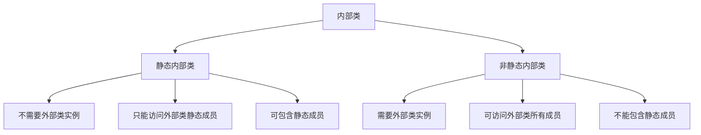

# Java 静态内部类

## 什么是静态内部类？

静态内部类（Static Inner Class）是Java内部类的一种特殊形式，它是用`static`关键字修饰的内部类。与普通内部类不同，静态内部类不依赖于外部类的实例，而是属于外部类本身。

:::note
静态内部类也被称为"嵌套静态类"（Nested Static Class），因为从技术上讲，它不是真正的"内部类"，而是嵌套在另一个类中的独立类。
:::

## 静态内部类的基本语法

```java
public class OuterClass {
    // 静态成员
    private static int staticField = 100;
    
    // 非静态成员
    private int instanceField = 200;
    
    // 静态内部类
    public static class StaticInnerClass {
        public void display() {
            // 可以访问外部类的静态成员
            System.out.println("静态成员变量值: " + staticField);
            
            // 无法直接访问外部类的非静态成员
            // System.out.println(instanceField); // 编译错误
        }
    }
}
```

## 静态内部类的特点

1. **不需要外部类实例**：静态内部类可以不依赖外部类实例而存在。

2. **访问限制**：
   - 可以直接访问外部类的**静态成员**（包括私有静态成员）
   - 不能直接访问外部类的**非静态成员**

3. **实例化方式**：创建静态内部类对象不需要先创建外部类对象。

4. **可以包含静态和非静态成员**：静态内部类可以定义静态变量、静态方法以及常量。

5. **可以被外部访问**：其他类可以直接使用`OuterClass.StaticInnerClass`的形式来访问静态内部类。

## 创建静态内部类的实例

创建静态内部类的实例非常简单，不需要依赖外部类的实例：

```java
public class Main {
    public static void main(String[] args) {
        // 直接实例化静态内部类
        OuterClass.StaticInnerClass innerObj = new OuterClass.StaticInnerClass();
        innerObj.display();
    }
}

// 输出:
// 静态成员变量值: 100
```

## 静态内部类与非静态内部类的区别

为了更好地理解静态内部类，让我们看看它与非静态内部类（普通内部类）的主要区别：



下面通过代码对比展示两者的区别：

```java
public class OuterClass {
    private static int staticVar = 1;
    private int instanceVar = 2;
    
    // 静态内部类
    public static class StaticInner {
        // 可以包含静态成员
        public static int innerStaticVar = 3;
        
        public void accessOuter() {
            System.out.println(staticVar);  // 可以访问外部类静态成员
            // System.out.println(instanceVar);  // 错误! 不能访问外部类实例成员
        }
    }
    
    // 非静态内部类
    public class NonStaticInner {
        // 不能包含静态成员
        // public static int innerVar = 3;  // 错误!
        
        public void accessOuter() {
            System.out.println(staticVar);    // 可以访问外部类静态成员
            System.out.println(instanceVar);  // 也可以访问外部类实例成员
        }
    }
}
```

实例化示例：

```java
public class Main {
    public static void main(String[] args) {
        // 实例化静态内部类
        OuterClass.StaticInner staticInner = new OuterClass.StaticInner();
        
        // 访问静态内部类的静态成员
        System.out.println(OuterClass.StaticInner.innerStaticVar);
        
        // 实例化非静态内部类(需要外部类实例)
        OuterClass outer = new OuterClass();
        OuterClass.NonStaticInner nonStaticInner = outer.new NonStaticInner();
    }
}
```

## 静态内部类的使用场景

### 1. 辅助类和数据容器

静态内部类常常用作辅助类或数据容器，特别是当这些类只对包含它的外部类有用时：

```java
public class Calculator {
    // 静态内部类作为结果容器
    public static class Result {
        private double sum;
        private double product;
        
        public Result(double sum, double product) {
            this.sum = sum;
            this.product = product;
        }
        
        public double getSum() { return sum; }
        public double getProduct() { return product; }
    }
    
    public static Result calculate(double a, double b) {
        return new Result(a + b, a * b);
    }
}

// 使用示例
public class Main {
    public static void main(String[] args) {
        Calculator.Result result = Calculator.calculate(5, 7);
        System.out.println("Sum: " + result.getSum());
        System.out.println("Product: " + result.getProduct());
    }
}

// 输出:
// Sum: 12.0
// Product: 35.0
```

### 2. 实现单例模式

静态内部类是实现懒加载单例模式的推荐方式之一：

```java
public class Singleton {
    // 私有构造函数防止外部实例化
    private Singleton() {}
    
    // 静态内部类持有单例实例
    private static class SingletonHolder {
        // 在类加载时创建实例
        private static final Singleton INSTANCE = new Singleton();
    }
    
    // 提供全局访问点
    public static Singleton getInstance() {
        return SingletonHolder.INSTANCE;
    }
    
    public void doSomething() {
        System.out.println("单例正在工作");
    }
}

// 使用示例
public class Main {
    public static void main(String[] args) {
        Singleton instance1 = Singleton.getInstance();
        Singleton instance2 = Singleton.getInstance();
        
        System.out.println("实例是否相同: " + (instance1 == instance2));
        instance1.doSomething();
    }
}

// 输出:
// 实例是否相同: true
// 单例正在工作
```

:::tip
使用静态内部类实现的单例模式既能实现延迟加载，又能确保线程安全，是一种推荐的实现方式。
:::

### 3. 类型分组和关联

当有多个相关类想放在一起组织时，静态内部类是很好的选择：

```java
public class HttpResponse {
    private int statusCode;
    private String body;
    private Headers headers;
    
    // 使用静态内部类封装相关功能
    public static class Headers {
        private Map<String, String> headerMap = new HashMap<>();
        
        public void add(String name, String value) {
            headerMap.put(name, value);
        }
        
        public String get(String name) {
            return headerMap.get(name);
        }
    }
    
    public HttpResponse(int statusCode, String body) {
        this.statusCode = statusCode;
        this.body = body;
        this.headers = new Headers();
    }
    
    // getter和setter方法
    public Headers getHeaders() {
        return headers;
    }
}

// 使用示例
public class Main {
    public static void main(String[] args) {
        HttpResponse response = new HttpResponse(200, "{'success': true}");
        response.getHeaders().add("Content-Type", "application/json");
        
        System.out.println("Content-Type: " + response.getHeaders().get("Content-Type"));
    }
}

// 输出:
// Content-Type: application/json
```

## 何时选择静态内部类？

以下情况适合使用静态内部类：

1. 该内部类不需要访问外部类的非静态成员
2. 该内部类逻辑上属于外部类，但功能相对独立
3. 需要减少类文件数量，更好地组织代码
4. 实现单例模式或工厂方法模式等设计模式
5. 需要在内部类中定义静态成员

## 最佳实践

- **避免过度嵌套**：虽然Java允许多层嵌套类，但过度嵌套会降低代码可读性。
- **合理访问控制**：只公开需要外部访问的内部类，其他使用private修饰。
- **静态优先**：如果内部类不需要访问外部类的实例成员，优先考虑使用静态内部类。
- **明确命名**：给内部类起一个能反映其与外部类关系的名称。

## 小结

静态内部类是Java中一个非常实用的特性，它允许我们在逻辑上将相关的类组织在一起，同时又保持相对的独立性。相比于非静态内部类，静态内部类不持有对外部类实例的引用，因此内存占用更小，使用更灵活。

- **关键特点**：不需要外部类实例，只能访问外部类静态成员，可以包含静态成员
- **主要用途**：辅助类、数据容器、单例模式实现、相关类组织

## 练习题

1. 编写一个使用静态内部类实现简单计算器功能的程序。外部类名为`MathUtil`，静态内部类名为`Calculator`。

2. 修改下面的代码，使其能够正确编译和运行：
```java
public class Outer {
    private int x = 10;
    
    public class Inner {
        public static void staticMethod() {
            System.out.println(x);
        }
    }
}
```

3. 实现一个货币转换器类，使用静态内部类表示不同的货币和转换规则。

:::caution
记住，静态内部类不能直接访问外部类的实例变量或实例方法。如果需要访问，必须通过外部类的实例才能实现。
:::

## 附加资源

- Java官方文档中关于[嵌套类](https://docs.oracle.com/javase/tutorial/java/javaOO/nested.html)的章节
- 《Effective Java》第24条：优先考虑静态成员类
- 《Java核心技术》卷I第6章：内部类

现在，你已经对Java静态内部类有了全面的了解。通过练习和实际应用，你将更好地掌握这一重要的Java特性！