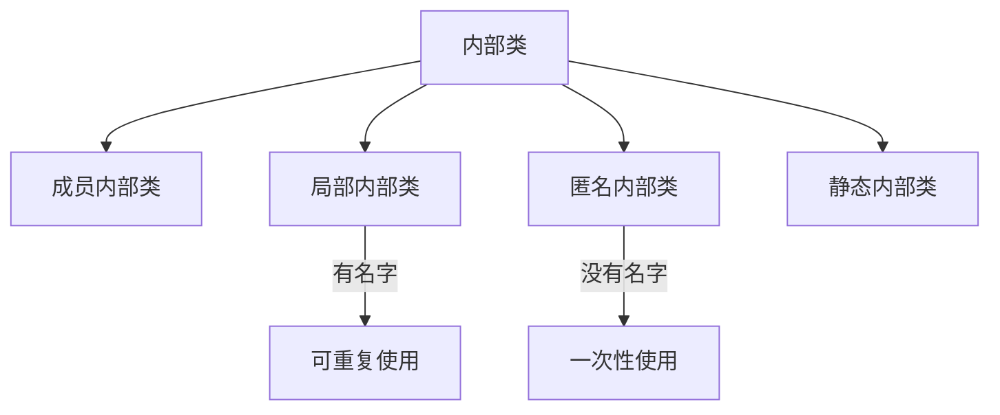

# Java 局部内部类

## 什么是局部内部类？

局部内部类是定义在Java方法或代码块内部的类。与成员内部类不同，它们不是外部类的成员，而是存在于特定方法或代码块的作用域内。这种类型的内部类只能在定义它的方法或代码块内部被使用。

:::note
局部内部类的作用域仅限于声明它的方法或代码块内部，这意味着它在方法或代码块外部是不可见的。
:::

## 局部内部类的基本语法

局部内部类的声明位于方法内部或代码块中，如下所示：

```java
public class OuterClass {
    
    public void someMethod() {
        // 这是一个局部内部类
        class LocalInnerClass {
            // 局部内部类的成员和方法
            private int data;
            
            public LocalInnerClass(int data) {
                this.data = data;
            }
            
            public void display() {
                System.out.println("Data: " + data);
            }
        }
        
        // 使用局部内部类
        LocalInnerClass inner = new LocalInnerClass(100);
        inner.display();
    }
}
```

## 局部内部类的特性

### 1. 访问外部类成员

局部内部类可以访问外部类的所有成员（包括私有成员）：

```java
public class OuterClass {
    private int outerData = 10;
    
    public void someMethod() {
        class LocalInnerClass {
            public void display() {
                // 访问外部类的私有成员
                System.out.println("Outer data: " + outerData);
            }
        }
        
        LocalInnerClass inner = new LocalInnerClass();
        inner.display(); // 输出: Outer data: 10
    }
}
```

### 2. 访问局部变量

局部内部类可以访问所在方法中的局部变量和参数，但这些变量必须是**final**或**事实上的final**（Java 8之后引入）。

```java
public class OuterClass {
    
    public void someMethod(final int param) {
        // 在Java 8及以后，这个变量不需要显式声明为final
        // 但它必须是事实上的final（不能被修改）
        int localVar = 20;
        
        class LocalInnerClass {
            public void display() {
                // 访问方法的参数和局部变量
                System.out.println("Parameter: " + param);
                System.out.println("Local variable: " + localVar);
            }
        }
        
        // localVar = 30; // 如果取消注释这行，编译会失败
        
        LocalInnerClass inner = new LocalInnerClass();
        inner.display(); // 输出: Parameter: [param值], Local variable: 20
    }
}
```

:::caution
局部内部类只能访问所在方法中被声明为final或事实上final的局部变量和参数。这是因为局部变量存储在栈中，当方法结束时会被销毁，而局部内部类的实例可能在方法结束后继续存在。
:::

### 3. 不能有访问修饰符

局部内部类不能使用访问修饰符（public、private、protected），因为它们只在方法内部可见：

```java
public void someMethod() {
    // 错误: 不能使用 public、private 或 protected
    // public class WrongLocalInnerClass {}
    
    // 正确
    class LocalInnerClass {}
}
```

### 4. 可以实现接口或继承类

局部内部类可以像普通类一样实现接口或继承其他类：

```java
public void someMethod() {
    class LocalInnerClass extends SomeClass implements SomeInterface {
        // 实现接口方法
        @Override
        public void interfaceMethod() {
            // 方法实现
        }
    }
}
```

## 局部内部类与匿名内部类的区别

局部内部类和匿名内部类都定义在方法内部，但有几个关键区别：



1. **命名**：局部内部类有名字，匿名内部类没有名字
2. **复用性**：局部内部类可以创建多个实例，匿名内部类只能使用一次
3. **构造器**：局部内部类可以定义构造器，匿名内部类不能定义构造器

## 实际应用场景

### 1. 事件处理

局部内部类可用于处理UI事件，特别是当事件处理逻辑只在特定方法中使用时：

```java
public void setupButton(Button button) {
    class ButtonClickHandler implements ActionListener {
        @Override
        public void actionPerformed(ActionEvent e) {
            System.out.println("Button clicked!");
            // 处理点击事件
        }
    }
    
    button.addActionListener(new ButtonClickHandler());
}
```

### 2. 线程操作

当需要在方法中创建并启动一个线程，且线程逻辑复杂时：

```java
public void processData(final List<String> data) {
    class DataProcessor extends Thread {
        @Override
        public void run() {
            for (String item : data) {
                // 复杂的数据处理逻辑
                System.out.println("Processing: " + item);
                try {
                    Thread.sleep(100);
                } catch (InterruptedException e) {
                    e.printStackTrace();
                }
            }
        }
    }
    
    DataProcessor processor = new DataProcessor();
    processor.start();
}
```

### 3. 策略模式实现

当一个方法需要根据不同情况使用不同算法时：

```java
public int calculate(String operation, int a, int b) {
    class Addition {
        public int calculate() {
            return a + b;
        }
    }
    
    class Subtraction {
        public int calculate() {
            return a - b;
        }
    }
    
    if ("add".equals(operation)) {
        Addition addition = new Addition();
        return addition.calculate();
    } else if ("subtract".equals(operation)) {
        Subtraction subtraction = new Subtraction();
        return subtraction.calculate();
    }
    
    return 0;
}
```

## 局部内部类的优缺点

### 优点

1. **封装性**：将特定逻辑封装在方法内，提高代码组织性
2. **可读性**：如果类名有描述性，可以使代码更具可读性
3. **访问范围**：可以访问外部类的所有成员和方法中的局部变量

### 缺点

1. **有限的可见性**：只能在声明它的方法或块内使用
2. **编译后文件增多**：每个局部内部类都会生成一个单独的类文件
3. **代码复杂度**：过度使用会增加代码复杂度

## 完整示例

下面是一个完整的示例，演示局部内部类的使用：

```java
public class FileProcessor {
    private String directoryPath;
    
    public FileProcessor(String directoryPath) {
        this.directoryPath = directoryPath;
    }
    
    public void processFiles(String extension) {
        // 定义一个局部内部类来处理特定类型的文件
        class FileHandler {
            private String fileExtension;
            
            public FileHandler(String fileExtension) {
                this.fileExtension = fileExtension;
            }
            
            public void process() {
                System.out.println("Processing files with extension " + 
                                   fileExtension + " in directory " + 
                                   directoryPath);
                
                // 这里可以添加实际的文件处理逻辑
                // 例如：遍历目录、读取文件等
            }
        }
        
        // 使用局部内部类
        FileHandler handler = new FileHandler(extension);
        handler.process();
    }
    
    public static void main(String[] args) {
        FileProcessor processor = new FileProcessor("/home/documents");
        processor.processFiles(".txt");
    }
}
```

输出：
```
Processing files with extension .txt in directory /home/documents
```

## 局部内部类的实现原理

当Java编译器编译包含局部内部类的代码时，会将局部内部类转换为常规的类文件。局部内部类的类名通常遵循`外部类名$序号内部类名`的模式。例如，`OuterClass$1LocalInnerClass.class`。

编译器通过以下方式处理局部内部类对局部变量的访问：

1. 创建局部变量的副本（实际上是通过构造函数参数传递）
2. 生成包含这些变量的引用的合成字段
3. 在局部内部类中通过这些字段访问变量

## 总结

局部内部类是Java内部类的一种重要类型，它具有以下特点：

1. 定义在方法或代码块内部
2. 只能在定义它的方法或代码块内访问
3. 可以访问外部类的所有成员
4. 可以访问方法中的final或事实上final的局部变量
5. 不能有访问修饰符

局部内部类适用于需要在方法内部定义一个可多次实例化、具有复杂逻辑的类，但其使用范围仅限于该方法内部的场景。

## 练习题

1. 创建一个外部类`Calculator`，在其方法`performOperation`中定义一个局部内部类`Operation`，该类根据传入的操作符执行不同的算术运算。

2. 编写一个程序，使用局部内部类实现一个简单的文件过滤器，用于列出目录中符合特定条件的文件。

3. 实现一个方法，该方法使用局部内部类来处理字符串列表，将列表中的每个字符串转换为大写并收集到新列表中。

## 附加资源

- Oracle Java官方文档中关于[内部类](https://docs.oracle.com/javase/tutorial/java/javaOO/innerclasses.html)的部分
- Java核心技术卷I：基础知识（第11版）中的内部类章节
- Joshua Bloch的《Effective Java》中关于内部类的最佳实践

:::tip
掌握局部内部类是理解Java内部类机制的重要一步。虽然在日常编程中可能不如匿名内部类使用频繁，但在特定场景下它可以提供更好的代码组织方式和更高的可读性。
:::