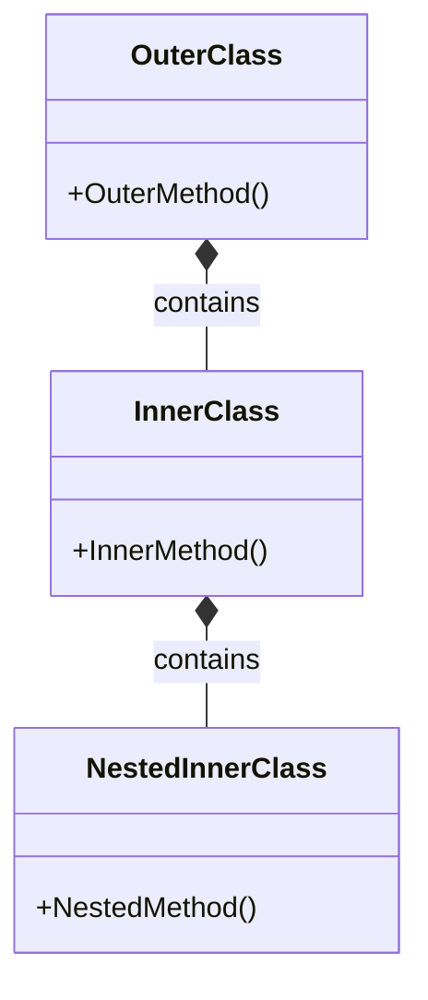

# Java 嵌套内部类

在Java的面向对象编程中，内部类是一个强大而灵活的特性，允许我们在一个类内部定义另一个类。当我们在内部类中再嵌套定义另一个类时，这种结构就被称为"嵌套内部类"。本文将详细介绍Java嵌套内部类的概念、语法及其应用场景，帮助初学者全面理解这一特性。

## 什么是嵌套内部类？

嵌套内部类是指在一个内部类中再定义一个内部类，形成多层嵌套的类结构。在Java中，我们可以无限制地嵌套类，但通常不建议嵌套太多层，以免代码变得难以理解。



## 嵌套内部类的基本语法

以下是定义嵌套内部类的基本语法：

```java
public class OuterClass {
    // 外部类的成员
    
    public class InnerClass {
        // 内部类的成员
        
        public class NestedInnerClass {
            // 嵌套内部类的成员
        }
    }
}
```

## 创建嵌套内部类的实例

要创建嵌套内部类的实例，需要先创建外部类实例，然后创建内部类实例，最后创建嵌套内部类实例：

```java
OuterClass outer = new OuterClass();
OuterClass.InnerClass inner = outer.new InnerClass();
OuterClass.InnerClass.NestedInnerClass nested = inner.new NestedInnerClass();
```

也可以使用链式调用的方式：

```java
OuterClass.InnerClass.NestedInnerClass nested = new OuterClass().new InnerClass().new NestedInnerClass();
```

## 嵌套内部类的特性

### 1. 访问权限

嵌套内部类可以访问其外部类（包括外部类的外部类）的所有成员，包括私有成员：

```java
public class OuterClass {
    private int outerField = 10;
    
    public class InnerClass {
        private int innerField = 20;
        
        public class NestedInnerClass {
            public void display() {
                // 可以访问外部类的私有成员
                System.out.println("OuterField: " + outerField);
                // 可以访问内部类的私有成员
                System.out.println("InnerField: " + innerField);
                // 自己的成员
                System.out.println("We are in NestedInnerClass");
            }
        }
    }
}
```

### 2. 引用外部类实例

嵌套内部类可以使用`OuterClass.this`引用外部类实例，使用`InnerClass.this`引用内部类实例：

```java
public class OuterClass {
    private int value = 10;
    
    public class InnerClass {
        private int value = 20;
        
        public class NestedInnerClass {
            private int value = 30;
            
            public void printValues() {
                System.out.println("NestedInnerClass value: " + value);
                System.out.println("InnerClass value: " + InnerClass.this.value);
                System.out.println("OuterClass value: " + OuterClass.this.value);
            }
        }
    }
}
```

## 嵌套内部类的实际应用示例

### 复杂UI组件的实现

嵌套内部类在GUI编程中非常有用，特别是在构建具有多层组件的复杂UI时：

```java
public class Dialog {
    private String title;
    
    public Dialog(String title) {
        this.title = title;
    }
    
    // 对话框中的表单
    public class Form {
        private String formName;
        
        public Form(String name) {
            this.formName = name;
        }
        
        // 表单中的输入字段
        public class InputField {
            private String fieldName;
            private String value;
            
            public InputField(String fieldName) {
                this.fieldName = fieldName;
            }
            
            public void setValue(String value) {
                this.value = value;
            }
            
            public void display() {
                System.out.println("Dialog: " + title);
                System.out.println("Form: " + formName);
                System.out.println("Field: " + fieldName + ", Value: " + value);
            }
        }
    }
}
```

使用示例：

```java
public class Main {
    public static void main(String[] args) {
        Dialog dialog = new Dialog("User Registration");
        Dialog.Form form = dialog.new Form("Registration Form");
        Dialog.Form.InputField nameField = form.new InputField("Username");
        
        nameField.setValue("JohnDoe");
        nameField.display();
    }
}
```

输出结果：

```
Dialog: User Registration
Form: Registration Form
Field: Username, Value: JohnDoe
```

### 数据结构的实现

嵌套内部类在实现复杂数据结构时也很有用，如链表中的节点类：

```java
public class LinkedList<T> {
    private Node<T> head;
    private int size;
    
    public class Node<E> {
        private E data;
        private Node<E> next;
        
        public Node(E data) {
            this.data = data;
            this.next = null;
        }
        
        public class NodeData {
            public E getValue() {
                return data;
            }
            
            public void setValue(E value) {
                data = value;
            }
        }
        
        public NodeData getNodeData() {
            return new NodeData();
        }
    }
    
    public void add(T data) {
        Node<T> newNode = new Node<>(data);
        if (head == null) {
            head = newNode;
        } else {
            Node<T> current = head;
            while (current.next != null) {
                current = current.next;
            }
            current.next = newNode;
        }
        size++;
    }
    
    public void printList() {
        Node<T> current = head;
        while (current != null) {
            System.out.print(current.data + " -> ");
            current = current.next;
        }
        System.out.println("null");
    }
}
```

使用示例：

```java
public class Main {
    public static void main(String[] args) {
        LinkedList<Integer> list = new LinkedList<>();
        list.add(1);
        list.add(2);
        list.add(3);
        
        list.printList();
        
        // 使用嵌套内部类访问节点数据
        LinkedList<Integer>.Node<Integer> node = list.new Node<>(5);
        LinkedList<Integer>.Node<Integer>.NodeData nodeData = node.getNodeData();
        System.out.println("Node value: " + nodeData.getValue());
        nodeData.setValue(10);
        System.out.println("Updated node value: " + nodeData.getValue());
    }
}
```

输出结果：

```
1 -> 2 -> 3 -> null
Node value: 5
Updated node value: 10
```

## 嵌套内部类的最佳实践

:::tip 最佳实践
1. **避免过度嵌套**：嵌套太多层级会使代码难以阅读和维护，通常不建议超过2-3层嵌套。

2. **合理使用静态类**：如果嵌套的内部类不需要访问外部类的实例成员，可以将其声明为静态的，以提高性能。

3. **适当使用访问修饰符**：根据实际需求设置适当的访问修饰符，避免过度暴露内部实现。

4. **考虑类的命名**：嵌套类应当反映其与外部类的关系，确保命名直观且有意义。
:::

## 嵌套内部类与其他内部类的比较

| 类型 | 特点 | 适用场景 |
|-----|-----|--------|
| 嵌套内部类 | 在内部类中再定义一个类 | 复杂的数据结构、多层次组件设计 |
| 普通内部类 | 直接定义在外部类中 | 与外部类紧密关联的辅助类 |
| 静态内部类 | 使用static修饰，不依赖外部类实例 | 不需要访问外部类实例成员的情况 |
| 局部内部类 | 定义在方法内部 | 仅在方法内使用的临时类 |
| 匿名内部类 | 没有显式类名的内部类 | 实现接口或扩展类的一次性使用 |

## 嵌套内部类的性能考虑

嵌套内部类会创建对其所有外围类实例的引用，这可能会导致内存使用增加，特别是在嵌套层级很深的情况下。如果嵌套内部类不需要访问外部类的实例成员，可以考虑将其声明为静态的，以降低内存占用。

```java
public class OuterClass {
    public static class StaticInnerClass {
        public static class StaticNestedInnerClass {
            // 此类不会持有OuterClass或StaticInnerClass的实例引用
        }
    }
}
```

## 总结

嵌套内部类是Java面向对象编程中的一个强大特性，允许我们创建更复杂的类结构来解决特定问题。它们提供了封装性，允许内层类访问所有外层类的成员，并能很好地组织相关的类。

然而，过度使用嵌套内部类可能会导致代码复杂性增加，因此在实际编程中应当根据具体需求合理使用。在适当的场景中，嵌套内部类可以帮助我们实现更清晰、更模块化的代码设计。

## 练习

1. 创建一个电子商务系统，使用嵌套内部类表示商品目录、商品类别和具体商品。

2. 实现一个文件系统模拟器，使用嵌套内部类表示目录和文件的层次结构。

3. 设计一个图形界面组件，使用嵌套内部类表示面板、按钮和事件监听器。

## 进一步学习资源

- Java官方文档中的内部类章节
- 《Effective Java》第24条：优先考虑静态成员类而不是非静态类
- 《Java编程思想》中关于内部类的深入讨论

:::caution 注意
嵌套内部类会使编译后生成多个class文件，文件名通常以`$`符号连接，例如`OuterClass$InnerClass$NestedInnerClass.class`。这在调试和理解字节码时需要注意。
:::