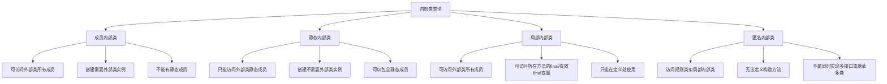

# Java 内部类访问规则

## 引言

在Java编程中，内部类是一个非常强大而灵活的特性，它允许在一个类内部定义另一个类。内部类帮助我们实现更好的封装，提高代码的可读性和维护性。然而，不同类型的内部类有着不同的访问规则，理解这些规则对于正确使用内部类至关重要。

本文将全面讲解Java内部类的各种访问规则，包括成员内部类、静态内部类、局部内部类和匿名内部类的特性和限制，帮助你在实际编程中正确运用这些概念。

## 内部类的基本概念

内部类就是定义在另一个类内部的类。根据定义位置和修饰符的不同，Java内部类可以分为以下四种：

1. 成员内部类（Member Inner Class）
2. 静态内部类（Static Nested Class）
3. 局部内部类（Local Inner Class）
4. 匿名内部类（Anonymous Inner Class）

让我们依次了解这些内部类的访问规则。

## 成员内部类的访问规则

成员内部类是定义在类的成员位置的非静态内部类。

### 基本特性

```java
public class OuterClass {
    private int outerField = 1;
    
    // 成员内部类
    public class InnerClass {
        private int innerField = 2;
        
        public void accessOuterMembers() {
            // 内部类可以直接访问外部类的所有成员，包括私有成员
            System.out.println("Outer field: " + outerField);
            // 调用外部类方法
            outerMethod();
        }
        
        public void showValues() {
            System.out.println("Inner field: " + innerField);
        }
    }
    
    private void outerMethod() {
        System.out.println("This is outer method");
    }
    
    public void createInner() {
        // 外部类可以创建内部类的实例
        InnerClass inner = new InnerClass();
        // 外部类可以访问内部类的公共成员
        inner.showValues();
        // 但不能直接访问内部类的私有成员
        // 下面的代码会编译错误
        // System.out.println(inner.innerField);
    }
}
```

### 访问规则详解

1. **内部类访问外部类**：
   - 成员内部类可以直接访问外部类的所有成员（包括私有成员）
   - 使用`OuterClass.this.member`可以明确指定访问外部类的成员

2. **外部类访问内部类**：
   - 外部类必须先创建内部类的实例，然后才能访问其成员
   - 外部类只能访问内部类的非私有成员

3. **外部其他类访问内部类**：

```java
public class AnotherClass {
    public static void main(String[] args) {
        // 创建外部类对象
        OuterClass outer = new OuterClass();
        
        // 通过外部类对象创建内部类对象
        OuterClass.InnerClass inner = outer.new InnerClass();
        
        // 访问内部类的公共方法
        inner.showValues();
    }
}
```

:::note
成员内部类隐式持有外部类的引用，因此不能在内部类中定义静态成员（除非是编译时常量）。
:::

## 静态内部类的访问规则

静态内部类是使用`static`关键字修饰的内部类。

### 基本特性

```java
public class OuterClass {
    private static int staticOuterField = 1;
    private int instanceOuterField = 2;
    
    // 静态内部类
    public static class StaticNestedClass {
        private int innerField = 3;
        private static int staticInnerField = 4;
        
        public void accessOuterMembers() {
            // 可以访问外部类的静态成员
            System.out.println("Static outer field: " + staticOuterField);
            
            // 不能直接访问外部类的实例成员
            // 下面代码会编译错误
            // System.out.println(instanceOuterField);
        }
        
        public static void staticInnerMethod() {
            // 静态内部类可以有静态方法
            System.out.println("Static inner field: " + staticInnerField);
        }
    }
    
    public void createStaticNested() {
        // 外部类可以创建静态内部类的实例
        StaticNestedClass nested = new StaticNestedClass();
    }
}
```

### 访问规则详解

1. **静态内部类访问外部类**：
   - 只能访问外部类的静态成员
   - 不能访问外部类的实例成员
   - 没有指向外部类对象的引用

2. **外部类访问静态内部类**：
   - 可以直接访问静态内部类的静态成员
   - 需要创建实例才能访问静态内部类的实例成员

3. **外部其他类访问静态内部类**：

```java
public class AnotherClass {
    public static void main(String[] args) {
        // 直接通过外部类名访问静态内部类
        OuterClass.StaticNestedClass nested = new OuterClass.StaticNestedClass();
        
        // 访问静态内部类的实例方法
        nested.accessOuterMembers();
        
        // 访问静态内部类的静态方法
        OuterClass.StaticNestedClass.staticInnerMethod();
    }
}
```

:::tip
静态内部类不持有外部类的引用，因此比成员内部类更加高效，尤其适合作为辅助类使用。
:::

## 局部内部类的访问规则

局部内部类是定义在方法或代码块中的类。

### 基本特性

```java
public class OuterClass {
    private int outerField = 1;
    
    public void outerMethod(final int param) {
        final int localVar = 10;
        int nonFinalVar = 20;  // Java 8之后可以是有效final的
        
        // 局部内部类
        class LocalInnerClass {
            private int innerField = 3;
            
            public void innerMethod() {
                // 可以访问外部类的成员
                System.out.println("Outer field: " + outerField);
                
                // 可以访问方法中的final或有效final变量
                System.out.println("Method parameter: " + param);
                System.out.println("Local variable: " + localVar);
                System.out.println("Non-final but effectively final: " + nonFinalVar);
                
                // 如果nonFinalVar在这之后被修改，那么上面的访问将会编译错误
            }
        }
        
        // 只能在定义局部内部类的方法或块内创建其实例
        LocalInnerClass local = new LocalInnerClass();
        local.innerMethod();
        
        // 尝试修改nonFinalVar会使其不再是有效final
        // nonFinalVar = 30; // 取消注释后，局部内部类将无法访问nonFinalVar
    }
}
```

### 访问规则详解

1. **局部内部类访问外部成员**：
   - 可以访问外部类的所有成员
   - 可以访问所在方法的final或有效final的参数和局部变量

2. **方法内访问局部内部类**：
   - 只能在定义局部内部类的方法或代码块内创建其实例和使用它
   - 方法外部无法访问局部内部类

:::caution
在Java 8之前，局部内部类只能访问方法中声明为final的局部变量。Java 8之后，只要变量是有效final（即初始化后不再被修改），即使不显式声明final，局部内部类也可以访问。
:::

## 匿名内部类的访问规则

匿名内部类是没有显式名称定义的局部内部类，常用于创建接口或抽象类的实例。

### 基本特性

```java
public class OuterClass {
    private int outerField = 1;
    
    public void createAnonymousClass(final int param) {
        final int localVar = 10;
        int effectivelyFinalVar = 20;
        
        // 实现接口的匿名内部类
        Runnable runnable = new Runnable() {
            @Override
            public void run() {
                // 可以访问外部类的成员
                System.out.println("Outer field: " + outerField);
                
                // 可以访问方法的final或有效final参数和变量
                System.out.println("Method parameter: " + param);
                System.out.println("Local variable: " + localVar);
                System.out.println("Effectively final: " + effectivelyFinalVar);
            }
        };
        
        // 使用匿名内部类
        runnable.run();
        
        // 继承类的匿名内部类
        Thread thread = new Thread() {
            @Override
            public void run() {
                System.out.println("Anonymous Thread running");
            }
        };
        thread.start();
    }
}
```

### 访问规则详解

1. **匿名内部类访问外部成员**：
   - 可以访问外部类的所有成员
   - 可以访问所在方法的final或有效final的参数和局部变量
   - 访问规则与局部内部类相似

2. **匿名内部类的限制**：
   - 不能定义构造方法（因为没有类名）
   - 不能同时实现多个接口或同时继承类和实现接口
   - 不能是静态的

## 实际应用场景

### 1. 事件处理

在GUI编程中，匿名内部类常用于事件处理：

```java
button.addActionListener(new ActionListener() {
    @Override
    public void actionPerformed(ActionEvent e) {
        System.out.println("Button clicked");
    }
});
```

### 2. 设计模式实现

成员内部类在实现某些设计模式时非常有用，例如迭代器模式：

```java
public class CustomCollection<T> {
    private T[] elements;
    // 其他字段和方法
    
    // 使用成员内部类实现迭代器
    public class CustomIterator {
        private int currentIndex = 0;
        
        public boolean hasNext() {
            return currentIndex < elements.length;
        }
        
        public T next() {
            if(!hasNext()) {
                throw new NoSuchElementException();
            }
            return elements[currentIndex++];
        }
    }
    
    public CustomIterator iterator() {
        return new CustomIterator();
    }
}
```

### 3. 单例模式

静态内部类用于实现线程安全的延迟初始化单例模式：

```java
public class Singleton {
    // 私有构造函数防止外部实例化
    private Singleton() {}
    
    // 使用静态内部类实现延迟加载
    private static class SingletonHolder {
        private static final Singleton INSTANCE = new Singleton();
    }
    
    public static Singleton getInstance() {
        return SingletonHolder.INSTANCE;
    }
}
```

### 4. 数据封装

在复杂的业务逻辑中封装紧密相关的数据：

```java
public class ShoppingService {
    // 使用静态内部类封装订单结果
    public static class OrderResult {
        private final boolean success;
        private final String orderId;
        private final String error;
        
        public OrderResult(boolean success, String orderId, String error) {
            this.success = success;
            this.orderId = orderId;
            this.error = error;
        }
        
        // getter方法
        public boolean isSuccess() { return success; }
        public String getOrderId() { return orderId; }
        public String getError() { return error; }
    }
    
    public OrderResult placeOrder(Cart cart, PaymentInfo payment) {
        // 处理订单逻辑
        try {
            // 订单处理成功
            return new OrderResult(true, "ORD-12345", null);
        } catch (Exception e) {
            // 订单处理失败
            return new OrderResult(false, null, e.getMessage());
        }
    }
}
```

## 内部类访问规则总结

下面的表格总结了不同类型内部类的主要访问规则：



## 实践练习

为了巩固所学内容，建议完成以下练习：

1. 创建一个外部类，其中包含一个成员内部类。让内部类访问外部类的私有成员，并在main方法中实例化这个内部类。

2. 设计一个使用静态内部类实现的工厂模式，该静态内部类负责创建不同类型的产品。

3. 编写一个方法，该方法包含局部内部类，并演示局部内部类如何访问方法参数和局部变量。

4. 使用匿名内部类实现一个简单的比较器（Comparator），用于按自定义规则排序对象集合。

## 结论

内部类是Java中一个强大的特性，可以提高代码的封装性、可读性和可维护性。不同类型的内部类具有不同的访问规则和适用场景：

- 成员内部类密切关联于外部类的实例，适合表示"has-a"关系
- 静态内部类独立于外部类实例，适合用作辅助类或单例实现
- 局部内部类限定于方法内部使用，适合处理局部且复杂的逻辑
- 匿名内部类适合创建接口或抽象类的一次性实现

理解内部类的各种访问规则，可以帮助我们在适当的场景下选择合适的内部类类型，编写出更加优雅和高效的代码。

## 扩展资源

- Java官方文档中关于[嵌套类](https://docs.oracle.com/javase/tutorial/java/javaOO/nested.html)的章节
- 《Effective Java》第24条：优先使用静态成员类
- 《Java编程思想》关于内部类的章节

通过本文的学习，你应该已经掌握了Java内部类的各种访问规则及其适用场景。在实际编程中多加练习，将能更好地运用这些知识。