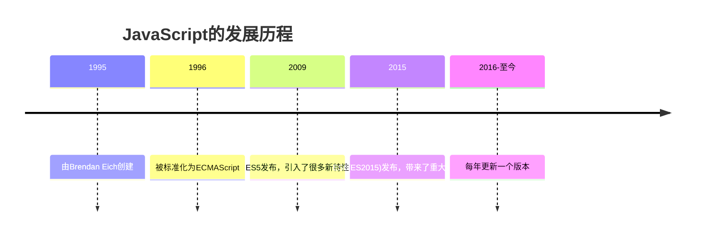

# JavaScript 简介

## 什么是JavaScript？

<div style={{
    "width": "20%",
    "margin": "0 auto",
    "text-align": "center"
}}>
    
</div>


JavaScript是一种轻量级、解释型的编程语言，主要用于Web开发。它是一种脚本语言，可以在网页中实现交互性功能，使静态HTML页面变得动态和响应式。

:::note
JavaScript与Java没有直接关系，虽然它们的名字相似，但它们是两种完全不同的编程语言，有着不同的语法、用途和设计理念。
:::

## JavaScript 的历史

JavaScript由Brendan Eich在1995年开发，最初称为Mocha，后来更名为LiveScript，最终命名为JavaScript。它最初的目的是为了增强网页的交互性，允许开发者在网页上执行客户端脚本。



## JavaScript 的特点

1. **解释型语言**：JavaScript代码不需要编译，直接由浏览器解释执行
2. **动态类型**：变量的类型在运行时确定，而非编译时
3. **面向对象**：支持基于原型的面向对象编程
4. **事件驱动**：可以响应用户操作（如点击、滚动等）
5. **跨平台**：几乎所有现代浏览器都支持JavaScript

## JavaScript 能做什么？

JavaScript最初只在浏览器中使用，但现在它已经扩展到了许多其他环境：

1. **网页交互**：处理用户输入、验证表单、创建动画等
2. **Web应用开发**：构建完整的Web应用程序
3. **服务器端开发**：通过Node.js在服务器端运行JavaScript
4. **移动应用开发**：使用框架如React Native或Ionic开发移动应用
5. **游戏开发**：使用HTML5 Canvas和WebGL创建浏览器游戏
6. **物联网(IoT)**：控制和编程智能设备

## 第一个JavaScript程序

让我们来看一个简单的JavaScript示例：

```html
<!DOCTYPE html>
<html>
<head>
    <title>我的第一个JavaScript</title>
</head>
<body>
    <h1>Hello JavaScript!</h1>
    
    <button onclick="showMessage()">点击我</button>
    
    <script>
        function showMessage() {
            alert('你好，这是我的第一个JavaScript程序！');
        }
    </script>
</body>
</html>
```

在这个例子中，当用户点击按钮时，会弹出一个警告框显示消息。

## 在HTML中使用JavaScript

有三种方式可以在HTML中添加JavaScript：

### 1. 内部脚本

在HTML文档中使用`<script>`标签直接编写JavaScript代码：

```html
<script>
    alert('Hello World!');
</script>
```

### 2. 外部脚本

将JavaScript代码保存在外部文件中（通常以`.js`为扩展名），然后在HTML中引用：

```html
<script src="script.js"></script>
```

### 3. 内联脚本

直接在HTML元素的事件属性中编写JavaScript代码：

```html
<button onclick="alert('Hello!')">点击我</button>
```

:::caution
虽然内联脚本在简单示例中很方便，但在实际开发中应尽量避免使用，因为它混合了HTML和JavaScript代码，不利于维护。
:::

## JavaScript 数据类型

JavaScript有几种基本数据类型：

```javascript
// 数值型
let age = 25;

// 字符串
let name = "John";

// 布尔值
let isStudent = true;

// 未定义
let job;

// 空值
let car = null;

// 输出变量类型
console.log(typeof age);      // 输出: "number"
console.log(typeof name);     // 输出: "string"
console.log(typeof isStudent); // 输出: "boolean"
console.log(typeof job);      // 输出: "undefined"
console.log(typeof car);      // 输出: "object"（这是JavaScript的一个历史错误）
```

## JavaScript 的基本语法

### 变量声明

在JavaScript中，可以使用`var`、`let`或`const`关键字声明变量：

```javascript
// 使用var（旧方式，现在不太推荐）
var x = 10;

// 使用let（可重新赋值）
let y = 20;
y = 30; // 有效

// 使用const（不可重新赋值）
const z = 15;
// z = 25; // 错误：不能给常量重新赋值
```

:::tip
在现代JavaScript中，推荐使用`let`和`const`来声明变量，而不是`var`。
:::

### 操作符

JavaScript支持多种操作符：

```javascript
// 算术操作符
let sum = 5 + 3;     // 加法
let diff = 10 - 4;   // 减法
let product = 6 * 7; // 乘法
let quotient = 8 / 2; // 除法
let remainder = 9 % 2; // 取余

// 比较操作符
console.log(5 == "5");  // true（值相等）
console.log(5 === "5"); // false（值相等但类型不同）
console.log(10 > 5);    // true
console.log(7 <= 7);    // true

// 逻辑操作符
console.log(true && false); // 逻辑与，结果为false
console.log(true || false); // 逻辑或，结果为true
console.log(!true);        // 逻辑非，结果为false
```

### 条件语句

```javascript
let hour = 14;

if (hour < 12) {
    console.log("上午好！");
} else if (hour < 18) {
    console.log("下午好！");
} else {
    console.log("晚上好！");
}

// 输出：下午好！
```

### 循环

```javascript
// for循环
for (let i = 0; i < 3; i++) {
    console.log(`第${i + 1}次循环`);
}

// while循环
let count = 0;
while (count < 3) {
    console.log(`while循环：${count + 1}`);
    count++;
}
```

## 实际案例：简单计算器

这是一个使用JavaScript制作的简单计算器：

```html
<!DOCTYPE html>
<html>
<head>
    <title>简单计算器</title>
    <style>
        .calculator {
            width: 200px;
            padding: 10px;
            border: 1px solid #ccc;
            border-radius: 5px;
            margin: 0 auto;
        }
        input, button {
            margin: 5px 0;
            padding: 5px;
            width: 100%;
            box-sizing: border-box;
        }
    </style>
</head>
<body>
    <div class="calculator">
        <input type="text" id="display" disabled>
        <input type="number" id="num1" placeholder="输入第一个数">
        <input type="number" id="num2" placeholder="输入第二个数">
        <button onclick="add()">加法</button>
        <button onclick="subtract()">减法</button>
        <button onclick="multiply()">乘法</button>
        <button onclick="divide()">除法</button>
    </div>

    <script>
        function add() {
            calculate((a, b) => a + b);
        }
        
        function subtract() {
            calculate((a, b) => a - b);
        }
        
        function multiply() {
            calculate((a, b) => a * b);
        }
        
        function divide() {
            calculate((a, b) => {
                if (b === 0) return "不能除以零";
                return a / b;
            });
        }
        
        function calculate(operation) {
            const num1 = parseFloat(document.getElementById("num1").value);
            const num2 = parseFloat(document.getElementById("num2").value);
            
            if (isNaN(num1) || isNaN(num2)) {
                document.getElementById("display").value = "请输入有效的数字";
                return;
            }
            
            const result = operation(num1, num2);
            document.getElementById("display").value = result;
        }
    </script>
</body>
</html>
```

这个计算器允许用户输入两个数字，然后执行基本的算术运算。这展示了JavaScript如何处理用户输入、执行计算以及更新页面内容。

## JavaScript 框架和库

随着Web开发的复杂性增加，许多JavaScript框架和库被创建出来，使开发更加高效：

1. **React** - 用于构建用户界面的JavaScript库
2. **Angular** - 用于构建单页应用的完整框架
3. **Vue.js** - 渐进式JavaScript框架
4. **jQuery** - 简化DOM操作的库
5. **Node.js** - 服务器端JavaScript运行时环境

## 总结

JavaScript是Web开发中不可或缺的一部分，它使网页具有交互性和动态性。作为一种强大而灵活的语言，JavaScript已经超越了浏览器，扩展到了服务器、移动应用和物联网等多个领域。

学习JavaScript的基础对于任何想要进入Web开发的人来说都是必不可少的。通过掌握变量、操作符、条件语句和循环等基本概念，你已经迈出了成为JavaScript开发者的第一步。

## 练习题

1. 创建一个简单的网页，在点击按钮时改变段落的文本内容。
2. 编写一个程序，计算并显示1到100之间所有偶数的和。
3. 创建一个表单，当用户提交时验证所有字段是否已填写，如果没有，显示错误消息。

## 进一步学习资源

- [MDN Web Docs - JavaScript](https://developer.mozilla.org/zh-CN/docs/Web/JavaScript)
- [JavaScript.info](https://zh.javascript.info/)
- [W3Schools JavaScript 教程](https://www.w3schools.com/js/)

继续努力学习，JavaScript的世界很广阔！