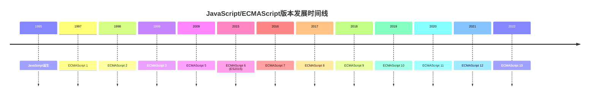

# JavaScript 历史

---
title: JavaScript 历史
description: 本文探讨JavaScript的起源、演变及其在Web开发中的重要地位，帮助初学者理解这门语言的历史背景和发展轨迹。
---

## JavaScript 的诞生

JavaScript诞生于1995年，是由网景通信公司（Netscape Communications）的工程师布兰登·艾奇（Brendan Eich）在仅仅**10天**内创造的。这门语言最初被命名为"Mocha"，后来改名为"LiveScript"，最终在1995年12月被重新命名为"JavaScript"。

:::note 历史趣闻
JavaScript与Java没有直接关系！改名为JavaScript主要是因为当时Java非常流行，网景公司希望借助Java的名气来推广这门新语言。
:::

## 早期发展与标准化

JavaScript最初是作为一种简单的脚本语言，用于增强网页的交互性。然而，随着Web的快速发展，它逐渐成为前端开发的核心技术之一。

### 浏览器大战与ECMAScript

1996年，微软在其Internet Explorer 3.0浏览器中引入了JScript，这是一个JavaScript的兼容实现。为了防止JavaScript成为不同浏览器厂商各自为政的技术，网景公司向欧洲计算机制造商协会（ECMA）提交了JavaScript规范。

1997年，ECMA发布了第一个标准化的JavaScript版本，称为ECMAScript 1（ES1）。此后，ECMAScript成为JavaScript的官方标准，由TC39委员会负责维护和更新。



## JavaScript 的现代化

### ES6：转折点

2015年发布的ECMAScript 6（也称为ES2015）是JavaScript历史上的一个重要里程碑，它引入了许多现代语言特性：

```javascript
// ES5写法
var name = "JavaScript";
var greeting = "Hello " + name + "!";

// ES6写法
const name = "JavaScript";
const greeting = `Hello ${name}!`;

console.log(greeting); // 输出: Hello JavaScript!
```

ES6增加的重要特性包括：

- 箭头函数
- 类
- 模块系统
- Promise
- let/const声明
- 模板字符串
- 解构赋值
- 默认参数
- 展开运算符

### 之后的发展

在ES6之后，JavaScript采用了年度发布模式，每年都会有新的ECMAScript版本发布。每个版本都会添加新的语言特性，但变化相对较小，保持了语言的稳定性和向后兼容性。

## JavaScript 的生态系统

随着时间的推移，JavaScript不再仅限于浏览器环境，其应用范围不断扩大：

### Node.js的出现

2009年，Ryan Dahl创造了Node.js，这是一个基于Chrome V8 JavaScript引擎构建的JavaScript运行时。Node.js使JavaScript能够在服务器端运行，极大地扩展了JavaScript的应用范围。

```javascript
// 一个简单的Node.js服务器
const http = require('http');

const server = http.createServer((req, res) => {
  res.statusCode = 200;
  res.setHeader('Content-Type', 'text/plain');
  res.end('Hello World\n');
});

server.listen(3000, () => {
  console.log('服务器运行在 http://localhost:3000/');
});
```

### 前端框架的兴起

随着Web应用变得越来越复杂，各种JavaScript框架和库应运而生：

- **jQuery**（2006年）：简化了DOM操作和跨浏览器兼容性问题
- **AngularJS**（2010年）：由Google开发的前端框架
- **React**（2013年）：由Facebook开发的用于构建用户界面的库
- **Vue.js**（2014年）：渐进式JavaScript框架
- **Angular**（2016年）：AngularJS的完全重写版

## JavaScript 在现代Web开发中的地位

如今，JavaScript已成为Web开发的三大核心技术之一（其他两个是HTML和CSS）。它不仅用于前端开发，还可以通过Node.js用于后端开发，实现全栈JavaScript开发。

:::tip JavaScript无处不在
JavaScript已经扩展到各种平台：
- 移动应用开发（React Native, Ionic）
- 桌面应用开发（Electron）
- 服务器端开发（Node.js, Deno）
- 游戏开发（Phaser, Three.js）
- 物联网（IoT.js, Johnny-Five）
:::

## JavaScript 引擎

浏览器通过JavaScript引擎执行JavaScript代码。一些主要的JavaScript引擎包括：

- **V8**：由Google开发，用于Chrome浏览器和Node.js
- **SpiderMonkey**：由Mozilla开发，用于Firefox
- **JavaScriptCore**：由Apple开发，用于Safari
- **Chakra**：由Microsoft开发，曾用于Edge（现已转向使用V8）

## 实际案例：JavaScript的演变

让我们看一个简单的例子，展示JavaScript在不同时期如何实现相同的功能：

### 案例：获取和显示用户数据

**ES3时代（2000年左右）**

```javascript
// 获取用户数据并显示在页面上
function fetchUserData() {
  var xhr = new XMLHttpRequest();
  xhr.open('GET', 'https://api.example.com/user/1', true);
  
  xhr.onreadystatechange = function() {
    if (xhr.readyState === 4 && xhr.status === 200) {
      var user = JSON.parse(xhr.responseText);
      var userDiv = document.getElementById('user');
      userDiv.innerHTML = 'Name: ' + user.name + ', Email: ' + user.email;
    }
  };
  
  xhr.send();
}

window.onload = fetchUserData;
```

**jQuery时代（2010年左右）**

```javascript
// jQuery简化了AJAX请求和DOM操作
$(document).ready(function() {
  $.ajax({
    url: 'https://api.example.com/user/1',
    method: 'GET',
    success: function(user) {
      $('#user').html('Name: ' + user.name + ', Email: ' + user.email);
    }
  });
});
```

**现代JavaScript（2020年后）**

```javascript
// 使用现代JavaScript特性
document.addEventListener('DOMContentLoaded', async () => {
  try {
    const response = await fetch('https://api.example.com/user/1');
    const user = await response.json();
    
    document.getElementById('user').textContent = 
      `Name: ${user.name}, Email: ${user.email}`;
  } catch (error) {
    console.error('Failed to fetch user data:', error);
  }
});
```

## 总结

JavaScript从一个简单的脚本语言发展成为一个功能强大、无处不在的编程语言。它的历史反映了Web技术的整体演变：

1. **起源**：作为增强网页交互性的简单脚本语言诞生
2. **标准化**：通过ECMAScript标准确保跨浏览器兼容性
3. **现代化**：ES6及后续版本引入现代编程语言特性
4. **扩展**：Node.js将JavaScript带入服务器端
5. **繁荣**：丰富的框架和库生态系统
6. **无处不在**：扩展到Web之外的各种平台

了解JavaScript的历史有助于初学者理解这门语言的设计决策和某些看似奇怪的特性，这些往往都有其历史原因。

## 附加资源

要深入了解JavaScript的历史和演变：

1. [JavaScript: The First 20 Years](https://dl.acm.org/doi/10.1145/3386327)（学术论文，由JavaScript创造者之一布兰登·艾奇参与撰写）
2. [ECMA-262 规范](https://www.ecma-international.org/publications-and-standards/standards/ecma-262/)（官方ECMAScript标准）
3. [MDN Web Docs: JavaScript](https://developer.mozilla.org/zh-CN/docs/Web/JavaScript)

## 练习

1. 研究并比较ES5和ES6的语法差异，找出至少5个例子。
2. 创建一个简单的网页，使用不同版本的JavaScript语法（ES3、ES5和ES6+）实现相同的功能。
3. 阅读ECMAScript 6规范的一部分，并尝试理解新特性的设计理念。
4. 寻找并分析一个真实的Web应用，观察它如何利用现代JavaScript特性。

---

通过了解JavaScript的历史，你不仅能更好地理解这门语言的现状，还能洞察其未来发展方向。JavaScript的演变史是Web开发历史的重要组成部分，对任何希望在Web开发领域有所建树的开发者来说都是必不可少的知识。