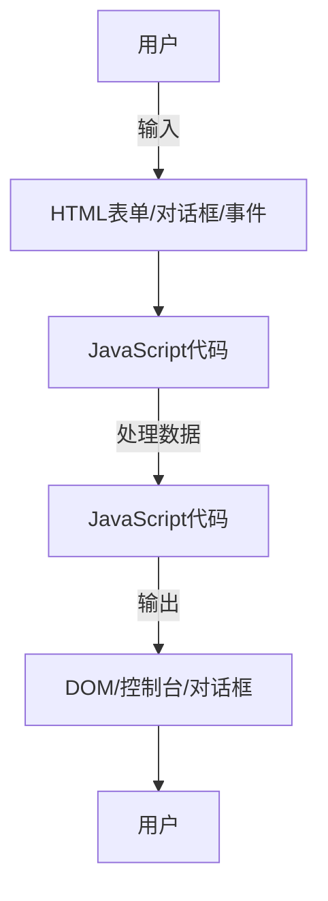

# JavaScript 输入输出

作为一名JavaScript初学者，了解如何处理输入和输出是编程的基础部分。在本教程中，我们将探索JavaScript中各种获取用户输入和展示输出的方法，让您能够创建与用户交互的动态网页。

## 输出方式

JavaScript提供了多种方式来显示或输出数据，下面我们逐一介绍。

### 1. 使用控制台输出

对于开发人员来说，最基本的输出方式是使用浏览器的控制台。

```javascript
console.log("Hello World!");             // 普通信息
console.error("出错了！");               // 错误信息
console.warn("这是一个警告！");          // 警告信息
console.info("这是一条信息。");          // 信息
```

:::tip
使用浏览器开发工具(F12)查看控制台输出，这是调试JavaScript代码的重要手段。
:::

### 2. 浏览器对话框

JavaScript可以通过内置函数显示不同类型的弹出框：

```javascript
// 显示一个警告框
alert("这是一个提示！");

// 显示一个带有确认按钮的对话框，返回布尔值
const result = confirm("您确定要删除这条记录吗？");
console.log(result); // 点击确定返回true，取消返回false

// 显示一个输入框，返回用户输入的内容
const name = prompt("请输入您的名字：", "游客");
console.log("欢迎您，" + name);
```

### 3. 直接操作DOM

最常见的输出方式是修改HTML页面的内容：

```javascript
// 修改HTML元素内容
document.getElementById("demo").innerHTML = "新的内容";

// 修改HTML元素属性
document.getElementById("myImage").src = "landscape.jpg";

// 修改HTML元素样式
document.getElementById("demo").style.color = "red";

// 创建新的HTML元素
const para = document.createElement("p");
const node = document.createTextNode("这是新段落。");
para.appendChild(node);
document.body.appendChild(para);
```

:::note
DOM (Document Object Model) 操作允许JavaScript改变网页的所有元素、属性和样式，详细内容将在DOM操作相关章节中学习。
:::

### 4. 写入HTML文档

可以使用`document.write()`直接向HTML输出流写内容：

```javascript
document.write("<h2>这是一个标题</h2>");
document.write("<p>这是一个段落。</p>");
```

:::caution
只在页面加载过程中使用`document.write()`。如果在页面加载完成后使用，会覆盖整个页面内容！
:::

## 输入方式

JavaScript提供多种获取用户输入的方式，以下是常见方法：

### 1. HTML表单获取输入

最常见的方式是通过HTML表单元素：

```html
<input type="text" id="userName" placeholder="请输入用户名">
<button onclick="getValue()">提交</button>

<script>
function getValue() {
  const userName = document.getElementById("userName").value;
  alert("您输入的用户名是：" + userName);
}
</script>
```

### 2. 对话框获取输入

如前面所示，`prompt()`函数可以显示一个带输入框的对话框：

```javascript
const age = prompt("请输入您的年龄：", "18");

if (age != null && age != "") {
  console.log("您的年龄是：" + age);
}
```

### 3. 事件监听获取输入

用户与网页的交互（点击、键盘输入等）也是输入的形式：

```javascript
// 点击事件
document.getElementById("myButton").addEventListener("click", function() {
  alert("按钮被点击了！");
});

// 键盘事件
document.getElementById("myInput").addEventListener("keyup", function(event) {
  if (event.key === "Enter") {
    alert("您按下了回车键！");
  }
});

// 鼠标移动
document.getElementById("myDiv").addEventListener("mousemove", function(event) {
  console.log("鼠标坐标: " + event.clientX + ", " + event.clientY);
});
```

## 实际案例：简单计算器

下面是一个结合输入和输出的简单计算器实例：

```html
<!DOCTYPE html>
<html>
<head>
  <title>简单计算器</title>
  <style>
    .calculator { margin: 20px; padding: 10px; width: 300px; border: 1px solid #ccc; }
    input { margin: 5px; padding: 5px; }
    button { margin: 5px; padding: 5px 10px; }
  </style>
</head>
<body>
  <div class="calculator">
    <h2>简单计算器</h2>
    <input type="number" id="num1" placeholder="输入第一个数">
    <input type="number" id="num2" placeholder="输入第二个数">
    <div>
      <button onclick="calculate('add')">+</button>
      <button onclick="calculate('subtract')">-</button>
      <button onclick="calculate('multiply')">×</button>
      <button onclick="calculate('divide')">÷</button>
    </div>
    <p>结果: <span id="result">?</span></p>
  </div>

  <script>
    function calculate(operation) {
      // 获取输入值
      const num1 = parseFloat(document.getElementById("num1").value);
      const num2 = parseFloat(document.getElementById("num2").value);
      
      // 验证输入
      if (isNaN(num1) || isNaN(num2)) {
        document.getElementById("result").innerText = "请输入有效的数字";
        return;
      }
      
      // 计算结果
      let result;
      switch(operation) {
        case 'add':
          result = num1 + num2;
          break;
        case 'subtract':
          result = num1 - num2;
          break;
        case 'multiply':
          result = num1 * num2;
          break;
        case 'divide':
          if (num2 === 0) {
            document.getElementById("result").innerText = "除数不能为零";
            return;
          }
          result = num1 / num2;
          break;
      }
      
      // 输出结果
      document.getElementById("result").innerText = result;
    }
  </script>
</body>
</html>
```

这个例子展示了如何：
1. 从HTML输入框获取用户输入
2. 处理输入验证
3. 根据用户点击的按钮执行不同的计算
4. 将结果输出到网页中

## 输入输出流程图



## 总结

JavaScript提供了多种处理输入和输出的方法，让开发者能够创建交互式网页应用程序：

- **输出方式**：控制台日志、浏览器对话框、DOM操作和文档写入
- **输入方式**：HTML表单、浏览器对话框和事件监听

掌握这些基本的输入输出方法是构建交互式网页应用的基础，后续我们会深入学习更多复杂的交互方式。

## 练习

1. 创建一个简单表单，获取用户名和年龄，点击按钮后显示欢迎信息
2. 编写一个程序，使用prompt()获取用户输入的华氏温度，将其转换为摄氏度并使用alert()显示结果
3. 创建一个计数器，包含增加和减少按钮，以及显示当前计数的区域

## 扩展资源

- [MDN Web Docs: console object](https://developer.mozilla.org/zh-CN/docs/Web/API/Console)
- [MDN Web Docs: Window.alert()](https://developer.mozilla.org/zh-CN/docs/Web/API/Window/alert)
- [MDN Web Docs: Document.getElementById()](https://developer.mozilla.org/zh-CN/docs/Web/API/Document/getElementById)