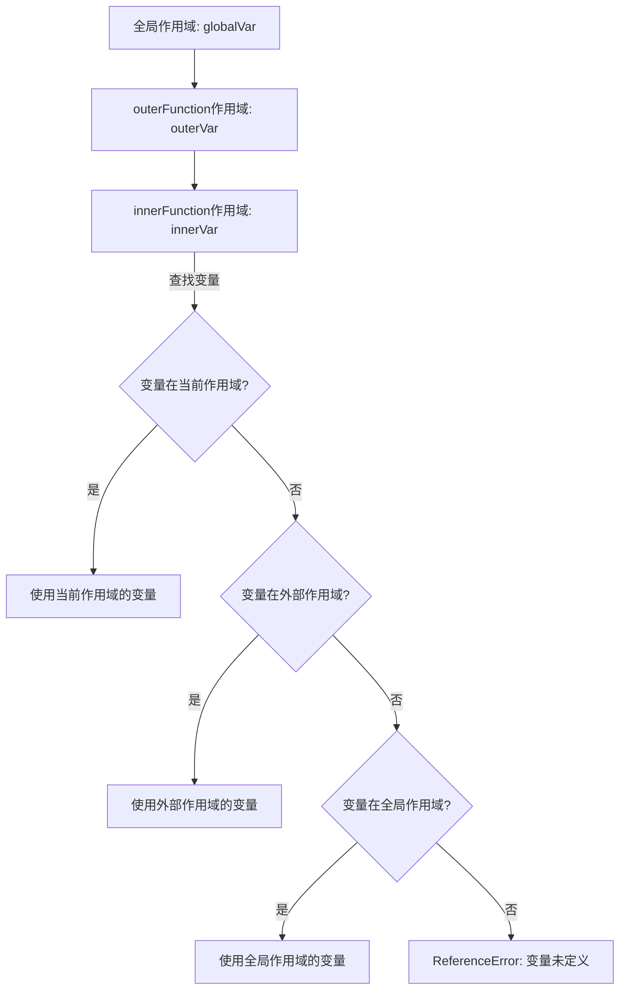

# JavaScript 作用域

## 什么是作用域？

在JavaScript中，作用域是指变量和函数的可访问范围，它决定了变量在何处可以被访问。理解作用域对于编写高质量的JavaScript代码至关重要，它不仅能帮助我们避免变量冲突，还能提高代码的可维护性和性能。

作用域可以简单地理解为"变量的生存空间"。

## JavaScript 中的作用域类型

在JavaScript中，主要有以下几种作用域：

1. 全局作用域（Global Scope）
2. 函数作用域（Function Scope）
3. 块级作用域（Block Scope，ES6引入）

让我们逐一探讨这些作用域类型。

### 全局作用域

在全局作用域中声明的变量可以在代码的任何地方被访问。

```javascript
// 全局作用域中的变量
var globalVariable = "我是全局变量";

function showGlobal() {
  console.log(globalVariable); // 可以访问全局变量
}

showGlobal(); // 输出: "我是全局变量"
console.log(globalVariable); // 输出: "我是全局变量"
```

:::caution 警告
过多使用全局变量可能导致命名冲突和不可预测的行为，应尽量限制全局变量的使用。
:::

### 函数作用域

在函数内部声明的变量只能在该函数内部访问。

```javascript
function showLocal() {
  var localVariable = "我是局部变量";
  console.log(localVariable); // 输出: "我是局部变量"
}

showLocal();
// 下面这行会导致错误，因为localVariable只在showLocal函数内有效
// console.log(localVariable); // ReferenceError: localVariable is not defined
```

### 块级作用域

ES6引入了`let`和`const`关键字，它们声明的变量具有块级作用域，即在最近的一对花括号`{}`内有效。

```javascript
{
  let blockVariable = "我是块级变量";
  const blockConstant = "我是块级常量";
  console.log(blockVariable); // 输出: "我是块级变量"
  console.log(blockConstant); // 输出: "我是块级常量"
}

// 下面这两行会导致错误，因为变量只在块内有效
// console.log(blockVariable); // ReferenceError: blockVariable is not defined
// console.log(blockConstant); // ReferenceError: blockConstant is not defined
```

## 变量声明与作用域

JavaScript中有三种声明变量的方式：`var`、`let`和`const`，它们在作用域方面有不同的表现。

### var的作用域

`var`声明的变量具有函数作用域，或者如果在函数外声明，则具有全局作用域。`var`声明的变量会被提升（hoisting）。

```javascript
function varExample() {
  var x = 1;
  
  if (true) {
    var x = 2; // 同一个变量
    console.log(x); // 输出: 2
  }
  
  console.log(x); // 输出: 2，因为var没有块级作用域
}

varExample();
```

### let和const的作用域

`let`和`const`声明的变量具有块级作用域，不会被提升到作用域顶部。

```javascript
function letExample() {
  let y = 1;
  
  if (true) {
    let y = 2; // 与外部的y是不同的变量
    console.log(y); // 输出: 2
  }
  
  console.log(y); // 输出: 1，因为let具有块级作用域
}

letExample();
```

## 作用域链

当代码尝试访问一个变量时，JavaScript引擎会首先在当前作用域中查找该变量。如果没有找到，它会继续在外部作用域中查找，直到找到该变量或到达全局作用域。这种逐级向上查找的机制被称为"作用域链"。

```javascript
let globalVar = "全局变量";

function outerFunction() {
  let outerVar = "外部函数变量";
  
  function innerFunction() {
    let innerVar = "内部函数变量";
    console.log(innerVar); // 当前作用域变量
    console.log(outerVar); // 来自外部函数的变量
    console.log(globalVar); // 全局变量
  }
  
  innerFunction();
}

outerFunction();
```

作用域链可以用以下图表表示：



## 闭包与作用域

闭包是JavaScript中一个强大的概念，它与作用域密切相关。闭包是指一个函数能够访问并记住其被创建时的词法环境，即使当该函数在其原始词法环境之外执行时也是如此。

```javascript
function createCounter() {
  let count = 0; // 私有变量
  
  return function() {
    count++; // 访问外部函数的变量
    return count;
  };
}

const counter = createCounter();
console.log(counter()); // 输出: 1
console.log(counter()); // 输出: 2
console.log(counter()); // 输出: 3
```

在这个例子中，即使`createCounter`函数已执行完毕，返回的函数仍然可以访问和修改`count`变量。这就是闭包的魔力所在。

:::note
闭包是JavaScript中非常有用的特性，它让我们能够创建私有变量和函数，是实现模块模式和封装的基础。
:::

## 实际应用场景

### 1. 模块模式

作用域和闭包使我们可以创建私有变量和方法，这是模块模式的基础。

```javascript
const calculator = (function() {
  // 私有变量和方法
  let result = 0;
  
  function add(x) {
    result += x;
  }
  
  function subtract(x) {
    result -= x;
  }
  
  // 公共API
  return {
    add: add,
    subtract: subtract,
    getResult: function() {
      return result;
    }
  };
})();

calculator.add(5);
calculator.subtract(2);
console.log(calculator.getResult()); // 输出: 3
// 下面这行会导致错误，因为result是私有变量
// console.log(calculator.result); // undefined
```

### 2. 避免全局变量污染

适当使用作用域可以避免全局命名空间污染，提高代码质量。

```javascript
// 不好的做法
var name = "小明"; // 全局变量

// 更好的做法
(function() {
  var name = "小明"; // 函数作用域内的变量
  // 其他代码...
})();
```

### 3. 事件处理与循环

作用域对理解和修复循环中的事件处理器问题非常重要。

```javascript
// 有问题的代码
for (var i = 1; i <= 3; i++) {
  setTimeout(function() {
    console.log("按钮 " + i + " 被点击了");
  }, 1000);
}
// 输出三次: "按钮 4 被点击了"

// 修复方法1：使用let
for (let i = 1; i <= 3; i++) {
  setTimeout(function() {
    console.log("按钮 " + i + " 被点击了");
  }, 1000);
}
// 输出: "按钮 1 被点击了", "按钮 2 被点击了", "按钮 3 被点击了"

// 修复方法2：使用闭包
for (var i = 1; i <= 3; i++) {
  (function(index) {
    setTimeout(function() {
      console.log("按钮 " + index + " 被点击了");
    }, 1000);
  })(i);
}
// 输出: "按钮 1 被点击了", "按钮 2 被点击了", "按钮 3 被点击了"
```

## 总结

JavaScript中的作用域是变量和函数可访问范围的规则，包括全局作用域、函数作用域和块级作用域（ES6引入）。理解作用域对于编写可维护且无错误的代码至关重要。

关键点回顾：

1. **全局作用域**：在代码的任何地方都可访问的变量
2. **函数作用域**：仅在函数内部可访问的变量
3. **块级作用域**：使用`let`和`const`声明的变量，只在包含它们的块中有效
4. **作用域链**：JavaScript引擎逐级向上查找变量的机制
5. **闭包**：函数能够访问其被创建时的词法环境，即使在其原始环境之外执行

合理使用作用域能让我们的代码更加清晰、安全且高效。

## 练习与资源

为了巩固所学知识，尝试以下练习：

1. 创建一个计数器函数，每次调用时返回一个递增的数字。
2. 编写一个函数，创建多个按钮，每个按钮点击时显示它自己的编号。
3. 实现一个简单的模块模式，封装私有数据和公共API。

### 额外学习资源

- [MDN Web Docs: Scope](https://developer.mozilla.org/en-US/docs/Glossary/Scope)
- [You Don't Know JS: Scope & Closures](https://github.com/getify/You-Dont-Know-JS/blob/2nd-ed/scope-closures/README.md)
- [JavaScript.info: Variable scope, closure](https://javascript.info/closure)

:::tip 小贴士
理解作用域是掌握JavaScript的关键一步。如果感到困惑，尝试绘制变量的作用域图表，可以帮助你更好地理解代码的行为。
:::