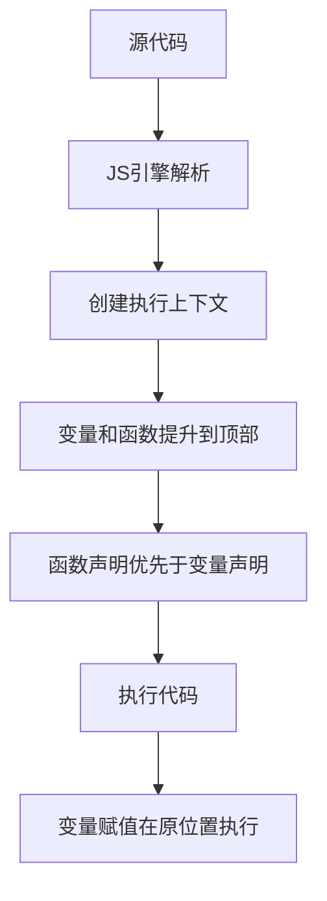

# JavaScript 提升

## 什么是提升(Hoisting)？

在JavaScript中，**提升(Hoisting)** 是一种将变量和函数声明移动到其所在作用域顶部的行为，这是JavaScript引擎在代码执行前的预处理阶段完成的。这使得我们可以在声明之前使用某些变量和函数。

提升是理解JavaScript代码执行顺序的关键概念，对于编写可靠、无bug的代码至关重要。

:::note
提升只会提升声明，而不会提升初始化。这意味着变量会被提升到顶部，但赋值操作仍然在原来的位置执行。
:::

## 变量提升

### var变量的提升

使用`var`声明的变量会被提升到其作用域的顶部，但初始化不会被提升。

```javascript
console.log(message); // 输出: undefined
var message = "Hello World!";
console.log(message); // 输出: Hello World!
```

上面的代码等同于：

```javascript
var message; // 声明提升到顶部
console.log(message); // undefined，因为只有声明提升了，赋值没有
message = "Hello World!"; // 赋值操作保留在原位置
console.log(message); // Hello World!
```

### let和const的提升行为

虽然`let`和`const`变量也会被提升，但它们存在"暂时性死区"(Temporal Dead Zone, TDZ)，即在声明之前不能访问这些变量。

```javascript
// console.log(name); // 报错: Cannot access 'name' before initialization
let name = "Alex";
console.log(name); // 输出: Alex
```

如果尝试在声明前使用`let`或`const`变量，JavaScript会抛出`ReferenceError`而不是返回`undefined`。

## 函数提升

### 函数声明的提升

函数声明会被完整地提升到作用域顶部，包括函数体。

```javascript
sayHello(); // 输出: Hello from JavaScript!

function sayHello() {
  console.log("Hello from JavaScript!");
}
```

### 函数表达式的提升

函数表达式不会被提升，因为它们通常涉及到变量赋值。

```javascript
// sayHi(); // 报错: sayHi is not a function

var sayHi = function() {
  console.log("Hi there!");
};

sayHi(); // 输出: Hi there!
```

在这种情况下，只有变量`sayHi`的声明被提升，而函数赋值仍在原位置进行。

## 提升的优先级

当同名的变量声明和函数声明都存在时，函数声明会优先于变量声明。

```javascript
console.log(typeof example); // 输出: function

var example = "I'm a variable";
function example() {
  return "I'm a function";
}

console.log(typeof example); // 输出: string
```

## 实际案例分析

### 案例1：调试一段包含提升的代码

```javascript
function calculateTotal() {
  console.log("Total: " + total); // undefined
  
  var items = ["book", "pen", "notebook"];
  var total = 0;
  
  for (var i = 0; i < items.length; i++) {
    var price = getPrice(items[i]);
    total += price;
  }
  
  console.log("Final total: " + total); // 正确计算的总价
  
  function getPrice(item) {
    if (item === "book") return 10;
    if (item === "pen") return 5;
    return 7;
  }
}

calculateTotal();
```

实际执行顺序相当于：

```javascript
function calculateTotal() {
  var items; // 变量声明提升
  var total; // 变量声明提升
  var i;     // for循环中的变量声明提升
  var price; // 变量声明提升
  
  // 函数声明提升
  function getPrice(item) {
    if (item === "book") return 10;
    if (item === "pen") return 5;
    return 7;
  }
  
  console.log("Total: " + total); // undefined
  
  items = ["book", "pen", "notebook"];
  total = 0;
  
  for (i = 0; i < items.length; i++) {
    price = getPrice(items[i]);
    total += price;
  }
  
  console.log("Final total: " + total); // 22
}

calculateTotal();
```

### 案例2：提升导致的常见错误

```javascript
function createButtons() {
  for (var i = 0; i < 3; i++) {
    var button = document.createElement("button");
    button.innerText = "Button " + i;
    button.onclick = function() {
      alert("Button " + i + " clicked");
    };
    document.body.appendChild(button);
  }
}

// 所有按钮点击时都会显示 "Button 3 clicked"，因为i的作用域和提升问题
```

修正后的代码（使用`let`或闭包）：

```javascript
function createButtonsFixed() {
  for (let i = 0; i < 3; i++) { // 使用let替代var
    const button = document.createElement("button");
    button.innerText = "Button " + i;
    button.onclick = function() {
      alert("Button " + i + " clicked");
    };
    document.body.appendChild(button);
  }
}

// 或使用闭包解决
function createButtonsFixedWithClosure() {
  for (var i = 0; i < 3; i++) {
    (function(index) {
      var button = document.createElement("button");
      button.innerText = "Button " + index;
      button.onclick = function() {
        alert("Button " + index + " clicked");
      };
      document.body.appendChild(button);
    })(i);
  }
}
```

## 提升的视觉表示

下面的流程图展示了JavaScript引擎如何处理变量和函数的提升：



## 提升的最佳实践

1. **总是在作用域顶部声明变量和函数**：这样可以使代码更清晰，避免因提升导致的意外行为。

2. **使用`let`和`const`代替`var`**：它们有块级作用域，并且存在暂时性死区，可以避免许多提升相关的问题。

3. **避免在条件语句中声明函数**：不同浏览器对于条件语句中的函数声明处理方式可能不同。

4. **理解闭包如何与提升交互**：特别是在循环中创建函数时。

:::caution
变量和函数的提升可能导致难以发现的错误。始终在使用前声明变量和函数是一种良好的编程习惯。
:::

## 总结

JavaScript的提升机制是一个核心概念，理解它对于掌握JavaScript的执行顺序至关重要。记住以下几点：

- 变量声明会被提升，但初始化不会
- 函数声明会被完整提升（包括函数体）
- `let`和`const`变量虽然也被提升，但由于暂时性死区，不能在声明前访问
- 函数声明的优先级高于变量声明
- 为避免提升带来的问题，最好使用`let`和`const`，并在使用前进行声明

## 练习题

1. 预测以下代码的输出，然后运行验证你的答案：

```javascript
console.log(a);
var a = 10;
function a() { return 20; }
console.log(a);
```

2. 修改以下代码，使用`let`或闭包解决循环中的提升问题：

```javascript
for (var i = 0; i < 3; i++) {
  setTimeout(function() {
    console.log(i);
  }, 1000);
}
```

3. 解释以下代码中的提升行为，并预测输出：

```javascript
var foo = 1;
function bar() {
  if (!foo) {
    var foo = 10;
  }
  console.log(foo);
}
bar();
```

## 扩展资源

- [MDN Web Docs: Hoisting](https://developer.mozilla.org/zh-CN/docs/Glossary/Hoisting)
- [JavaScript: The Good Parts](https://www.oreilly.com/library/view/javascript-the-good/9780596517748/) - 深入探讨JavaScript的各种特性，包括提升
- [You Don't Know JS: Scope & Closures](https://github.com/getify/You-Dont-Know-JS/blob/1st-ed/scope%20%26%20closures/README.md) - 详细讲解作用域和闭包，包括变量提升

通过深入理解JavaScript提升，你将能够编写更可预测、更少bug的代码，并更好地理解JavaScript的行为。