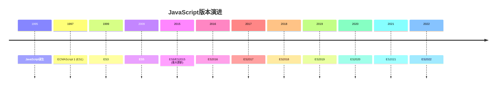

# JavaScript 环境设置

## 介绍

在开始学习JavaScript编程之前，我们需要先搭建一个适合开发的环境。一个良好的开发环境不仅可以提高编码效率，还能帮助我们更好地调试和测试代码。本文将指导你如何设置JavaScript开发环境，包括选择合适的代码编辑器、配置浏览器开发工具以及安装Node.js环境。

## 选择代码编辑器

代码编辑器是开发者的主要工作工具，一个好的编辑器能大幅提升开发效率。以下是几个流行的JavaScript代码编辑器：

### Visual Studio Code (推荐)

Visual Studio Code (VS Code) 是微软开发的免费、开源代码编辑器，具有以下特点：

- 轻量级但功能强大
- 内置丰富的JavaScript支持
- 大量有用的扩展插件
- 集成终端
- 智能代码补全
- 调试工具

**安装步骤：**

1. 访问 [VS Code官网](https://code.visualstudio.com/)
2. 下载适合你操作系统的版本
3. 按照安装向导完成安装

**推荐的JavaScript扩展插件：**

- ESLint：代码质量检查工具
- Prettier：代码格式化工具
- JavaScript (ES6) code snippets：代码片段工具
- Live Server：提供实时预览功能

### 其他选择

- **Sublime Text**：轻量级且响应迅速的编辑器
- **WebStorm**：功能全面的JavaScript IDE，但需要付费
- **Atom**：由GitHub开发的可扩展编辑器

:::tip
无论选择哪种编辑器，熟悉其快捷键和功能可以极大地提高你的开发效率！
:::

## 浏览器开发工具

浏览器开发工具是前端开发的必备工具，它们可以帮助你调试JavaScript代码、检查HTML/CSS元素以及监控网络请求。

### Chrome DevTools

Google Chrome浏览器提供了强大的开发者工具：

**如何打开Chrome DevTools：**

- 在Chrome中按下 `F12` 或 `Ctrl+Shift+I`（Windows/Linux）/ `Cmd+Option+I`（Mac）
- 或者右击网页，选择"检查"

**主要功能：**

1. **Elements**：检查和修改HTML和CSS
2. **Console**：JavaScript控制台，用于执行代码和查看日志
3. **Sources**：查看源代码并进行调试
4. **Network**：监控网络请求
5. **Application**：检查网站存储数据（如Cookies、localStorage等）

**使用Console示例：**

```javascript
// 在浏览器控制台中执行以下代码
console.log("Hello, JavaScript!");
// 输出: Hello, JavaScript!

// 尝试简单的计算
console.log(2 + 3);
// 输出: 5
```

### 其他浏览器的开发工具

- **Firefox**: Firefox Developer Tools
- **Edge**: Microsoft Edge DevTools
- **Safari**: Safari Web Inspector

:::caution
在学习JavaScript时，养成频繁使用控制台(Console)的习惯，它可以帮助你理解代码执行过程和调试错误。
:::

## 安装Node.js

Node.js是一个基于Chrome V8引擎的JavaScript运行环境，它允许你在浏览器外运行JavaScript代码。

### 为什么需要Node.js？

- 在本地环境运行JavaScript代码
- 使用npm (Node Package Manager) 管理项目依赖
- 开发服务器端应用程序
- 使用现代前端开发工具（如webpack、Babel等）

### 安装步骤

1. 访问 [Node.js官网](https://nodejs.org/)
2. 下载LTS（长期支持）版本
3. 按照安装向导完成安装
4. 安装完成后，打开终端/命令提示符，验证安装：

```bash
node -v
# 输出: v16.14.0 (或你安装的版本号)

npm -v
# 输出: 8.3.1 (或对应的npm版本)
```

### 创建第一个Node.js脚本

1. 创建一个名为 `hello.js` 的文件，内容如下：

```javascript
console.log("Hello from Node.js!");
```

2. 打开终端/命令提示符，导航到文件所在目录，运行脚本：

```bash
node hello.js
# 输出: Hello from Node.js!
```

## 设置一个简单的JavaScript项目

让我们创建一个简单的JavaScript项目，整合上面学到的所有内容：

### 项目结构

```
my-first-js-project/
├── index.html
├── js/
│   └── script.js
└── css/
    └── style.css
```

### HTML文件 (index.html)

```html
<!DOCTYPE html>
<html lang="zh-CN">
<head>
    <meta charset="UTF-8">
    <meta name="viewport" content="width=device-width, initial-scale=1.0">
    <title>我的第一个JS项目</title>
    <link rel="stylesheet" href="css/style.css">
</head>
<body>
    <div class="container">
        <h1>JavaScript环境测试</h1>
        <p>请查看控制台输出</p>
        <button id="testButton">点击测试</button>
    </div>
    
    <script src="js/script.js"></script>
</body>
</html>
```

### JavaScript 文件 (js/script.js)

```javascript
// 当页面加载完成后执行
document.addEventListener('DOMContentLoaded', function() {
    console.log("页面已加载完成");
    
    // 获取按钮元素
    const button = document.getElementById('testButton');
    
    // 添加点击事件监听器
    button.addEventListener('click', function() {
        console.log("按钮被点击了!");
        alert("JavaScript环境工作正常!");
    });
});
```

### CSS文件 (css/style.css)

```css
.container {
    max-width: 600px;
    margin: 50px auto;
    text-align: center;
    font-family: Arial, sans-serif;
}

button {
    padding: 10px 20px;
    font-size: 16px;
    cursor: pointer;
    background-color: #4CAF50;
    color: white;
    border: none;
    border-radius: 4px;
}

button:hover {
    background-color: #45a049;
}
```

### 运行项目

1. 使用VS Code打开项目文件夹
2. 安装"Live Server"扩展插件
3. 右击`index.html`文件，选择"Open with Live Server"
4. 浏览器将打开你的项目
5. 打开开发者工具(F12)查看控制台，并点击按钮测试功能

## 在线开发环境

如果你暂时无法在本地设置环境，可以使用在线编码平台：

- **CodePen**: 前端代码在线编辑和分享平台
- **JSFiddle**: 在线测试和分享JavaScript代码
- **CodeSandbox**: 更完整的在线IDE，支持npm包
- **Replit**: 支持多种语言的在线IDE

这些平台非常适合快速测试和学习，但长期开发还是推荐搭建本地环境。

## JavaScript 版本与兼容性

JavaScript语言一直在发展，了解不同版本间的区别很重要：



为了处理浏览器兼容性问题，我们通常使用：

- **Babel**: JavaScript编译器，将新版本JS转换为向后兼容的代码
- **Polyfill**: 为旧浏览器提供新功能支持的代码

:::note
初学阶段，你不需要过于担心这些兼容性问题，专注于学习现代JavaScript (ES6+) 即可。
:::

## 总结

恭喜你！现在你已经成功设置了JavaScript开发环境，包括：

- 安装并配置了代码编辑器
- 了解了如何使用浏览器开发工具
- 安装了Node.js环境
- 创建并运行了第一个JavaScript项目

有了这些基础设施，你已经可以开始JavaScript编程之旅了。记住，编程是一项实践性很强的技能，多练习、多实验是提高的关键。

## 练习与资源

### 练习

1. 尝试修改上面的项目，添加一个新按钮，点击后改变页面中某个元素的颜色
2. 在Node.js环境中创建一个脚本，读取一个文本文件并输出其内容
3. 在浏览器控制台中试验5个不同的JavaScript命令，观察结果

### 进一步学习的资源

- MDN Web文档: [JavaScript指南](https://developer.mozilla.org/zh-CN/docs/Web/JavaScript/Guide)
- VS Code官方文档: [JavaScript in VS Code](https://code.visualstudio.com/docs/languages/javascript)
- Chrome DevTools文档: [Chrome开发者工具](https://developers.google.com/web/tools/chrome-devtools)
- Node.js文档: [Node.js入门指南](https://nodejs.org/zh-cn/docs/guides/)

现在，你已经准备好进入JavaScript的精彩世界了！下一步，我们将开始学习JavaScript的基本语法和概念。