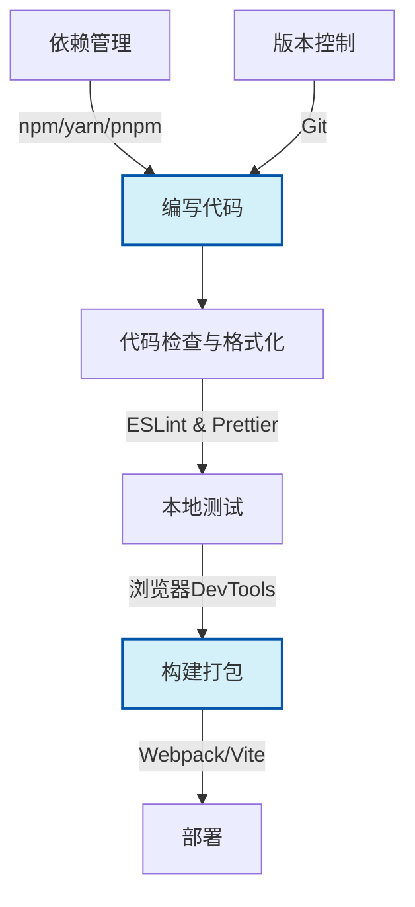

# JavaScript 开发工具

作为JavaScript初学者，选择适合的开发工具可以极大地提升学习效率和编码体验。本文将介绍JavaScript开发中常用的工具和环境，帮助你建立高效的前端开发工作流。

## 代码编辑器

代码编辑器是编写JavaScript代码的主要工具。一个好的编辑器能够提供语法高亮、代码补全、错误提示等功能，大幅提高开发效率。

### Visual Studio Code

Visual Studio Code (VS Code) 是目前最受欢迎的JavaScript编辑器之一，它免费、轻量且功能强大。

**主要特点：**
- 丰富的扩展生态系统
- 集成终端
- Git集成
- 强大的调试功能
- 智能代码补全

**推荐扩展：**
1. **ESLint**: 代码质量检查工具
2. **Prettier**: 代码格式化工具
3. **JavaScript (ES6) code snippets**: JS代码片段集合
4. **Live Server**: 提供实时预览功能

:::tip 提示
安装VS Code后，可以通过快捷键 `Ctrl+Shift+X`(Windows) 或 `Cmd+Shift+X`(Mac) 打开扩展商店搜索安装这些插件。
:::

### 其他编辑器选择

- **WebStorm**: 功能全面的JavaScript IDE，提供更多集成功能，但需付费使用
- **Atom**: 免费、可定制性强的编辑器
- **Sublime Text**: 轻量高速的编辑器，适合小项目使用

## 浏览器开发工具

现代浏览器内置的开发者工具是调试JavaScript的重要工具，可以帮助我们检查HTML/CSS、分析网络请求、调试JavaScript代码等。

### Chrome DevTools

Chrome浏览器的开发者工具是最常用的调试环境之一。

**打开DevTools的方法：**
- 按 `F12` 或 `Ctrl+Shift+I`(Windows) / `Cmd+Option+I`(Mac)
- 右键网页选择"检查"或"Inspect"

**主要功能区域：**

1. **Elements (元素)**: 检查和修改HTML/CSS
2. **Console (控制台)**: 执行JavaScript代码，查看日志输出
3. **Sources (源代码)**: 调试JavaScript代码，设置断点
4. **Network (网络)**: 分析网络请求和响应
5. **Application (应用程序)**: 管理本地存储、Cookie等

**使用控制台调试示例：**

```javascript
// 在控制台中执行代码
console.log("Hello, Developer Tools!");
console.error("这是一个错误信息");
console.table([{name: "John", age: 28}, {name: "Mary", age: 24}]);
```

输出结果：
```
Hello, Developer Tools!
这是一个错误信息  // 以红色显示
// 会显示一个包含数据的表格
```

:::note 小知识
Chrome DevTools支持断点调试。在Sources面板中打开你的JavaScript文件，点击行号可以设置断点，然后刷新页面观察代码执行流程。
:::

### 其他浏览器开发工具

- **Firefox Developer Tools**: 功能与Chrome类似，有一些独特的特性
- **Edge DevTools**: 基于Chromium，与Chrome DevTools类似
- **Safari Web Inspector**: 适用于Safari浏览器的调试工具

## Node.js 环境

Node.js使JavaScript能够在浏览器外运行，是现代前端开发的基础设施。

### 安装Node.js

1. 访问[Node.js官方网站](https://nodejs.org/)
2. 下载LTS(长期支持)版本
3. 安装时保持默认选项
4. 安装完成后，打开终端/命令行工具验证安装：

```bash
node -v  # 显示Node.js版本
npm -v   # 显示npm版本
```

### npm (Node Package Manager)

npm是Node.js的包管理器，用于安装和管理JavaScript库和工具。

**基本npm命令：**

```bash
# 初始化一个新项目
npm init

# 安装包
npm install 包名

# 全局安装
npm install -g 包名

# 安装开发依赖
npm install --save-dev 包名

# 运行脚本
npm run 脚本名称
```

**package.json文件示例：**

```json
{
  "name": "my-js-project",
  "version": "1.0.0",
  "description": "A JavaScript learning project",
  "main": "index.js",
  "scripts": {
    "start": "node index.js",
    "test": "echo \"Error: no test specified\" && exit 1"
  },
  "dependencies": {
    "lodash": "^4.17.21"
  },
  "devDependencies": {
    "eslint": "^8.19.0"
  }
}
```

### yarn和pnpm

除了npm，还有其他流行的包管理器：

- **yarn**: 提供更快的安装速度和更好的依赖锁定
- **pnpm**: 节省磁盘空间和安装时间的包管理器

## 构建工具和打包器

随着项目规模增长，你需要使用构建工具来优化工作流程。

### Webpack

Webpack是最流行的JavaScript模块打包器，可以处理模块依赖并生成静态资源。

**简单的Webpack配置示例：**

```javascript
// webpack.config.js
const path = require('path');

module.exports = {
  entry: './src/index.js',
  output: {
    filename: 'bundle.js',
    path: path.resolve(__dirname, 'dist'),
  },
  mode: 'development'
};
```

### Vite

Vite是新一代前端构建工具，提供更快的开发服务器和构建性能。

**使用Vite创建项目：**

```bash
npm create vite@latest my-project -- --template vanilla
cd my-project
npm install
npm run dev
```

## 代码质量工具

保持代码质量和一致性对于个人和团队开发都非常重要。

### ESLint

ESLint是JavaScript代码检查工具，可以帮助你发现并修复代码中的问题。

**安装ESLint：**

```bash
npm install eslint --save-dev
npx eslint --init  # 初始化配置
```

**.eslintrc.js配置示例：**

```javascript
module.exports = {
    "env": {
        "browser": true,
        "es2021": true
    },
    "extends": "eslint:recommended",
    "parserOptions": {
        "ecmaVersion": 12,
        "sourceType": "module"
    },
    "rules": {
        "semi": ["error", "always"],
        "quotes": ["warn", "single"]
    }
};
```

### Prettier

Prettier是代码格式化工具，可以自动格式化你的代码，保持一致的风格。

**安装Prettier：**

```bash
npm install --save-dev prettier
```

**创建.prettierrc配置文件：**

```json
{
  "semi": true,
  "singleQuote": true,
  "tabWidth": 2,
  "printWidth": 80
}
```

## 实际项目案例：设置开发环境

让我们通过一个实际例子，展示如何为一个简单的JavaScript项目设置开发环境。

### 步骤1: 创建项目结构

```bash
mkdir my-js-project
cd my-js-project
npm init -y
```

### 步骤2: 安装开发依赖

```bash
npm install --save-dev eslint prettier webpack webpack-cli babel-loader @babel/core @babel/preset-env
```

### 步骤3: 配置Webpack

创建`webpack.config.js`：

```javascript
const path = require('path');

module.exports = {
  entry: './src/index.js',
  output: {
    path: path.resolve(__dirname, 'dist'),
    filename: 'bundle.js',
  },
  module: {
    rules: [
      {
        test: /\.js$/,
        exclude: /node_modules/,
        use: {
          loader: 'babel-loader',
          options: {
            presets: ['@babel/preset-env']
          }
        }
      }
    ]
  },
  mode: 'development'
};
```

### 步骤4: 配置ESLint和Prettier

创建`.eslintrc.js`：

```javascript
module.exports = {
  "env": {
    "browser": true,
    "es2021": true
  },
  "extends": "eslint:recommended",
  "parserOptions": {
    "ecmaVersion": 12,
    "sourceType": "module"
  },
  "rules": {}
};
```

创建`.prettierrc`：

```json
{
  "semi": true,
  "singleQuote": true,
  "tabWidth": 2
}
```

### 步骤5: 创建项目文件

创建`src/index.js`：

```javascript
// src/index.js
import { greeting } from './greeting';

document.addEventListener('DOMContentLoaded', () => {
  const app = document.getElementById('app');
  app.textContent = greeting('JavaScript开发者');
});
```

创建`src/greeting.js`：

```javascript
// src/greeting.js
export function greeting(name) {
  return `你好，${name}！欢迎学习JavaScript开发工具！`;
}
```

创建`index.html`：

```html
<!DOCTYPE html>
<html lang="zh-CN">
<head>
  <meta charset="UTF-8">
  <meta name="viewport" content="width=device-width, initial-scale=1.0">
  <title>JS开发工具演示</title>
</head>
<body>
  <div id="app"></div>
  <script src="dist/bundle.js"></script>
</body>
</html>
```

### 步骤6: 添加npm脚本

更新`package.json`中的scripts部分：

```json
"scripts": {
  "build": "webpack",
  "lint": "eslint src/",
  "format": "prettier --write src/",
  "start": "webpack --watch"
}
```

### 步骤7: 运行项目

```bash
npm run build  # 构建项目
npm run start  # 开发模式运行
```

## 开发工具流程图

下面是一个典型的JavaScript开发工作流程图：



## 总结

在JavaScript开发中，合适的工具能够极大提升开发效率和代码质量：

1. **代码编辑器**（如VS Code）提供智能提示和代码补全
2. **浏览器开发工具**用于交互式调试和性能分析
3. **Node.js和包管理器**用于管理依赖和运行脚本
4. **构建工具**如Webpack和Vite用于打包和优化代码
5. **代码质量工具**如ESLint和Prettier确保代码一致性和质量

掌握这些工具将为你的JavaScript学习和开发之旅奠定坚实的基础。随着经验增长，你可以逐步深入了解这些工具的高级用法。

## 学习资源与练习

### 学习资源
- [VS Code官方文档](https://code.visualstudio.com/docs)
- [Chrome DevTools官方文档](https://developers.google.com/web/tools/chrome-devtools)
- [Node.js官方文档](https://nodejs.org/en/docs/)
- [npm官方文档](https://docs.npmjs.com/)
- [Webpack官方文档](https://webpack.js.org/concepts/)

### 练习
1. 安装VS Code并配置推荐的JavaScript开发扩展
2. 使用Chrome DevTools分析一个网站的JavaScript性能
3. 创建一个Node.js项目并使用npm安装和管理依赖
4. 使用Webpack配置一个简单的项目打包流程
5. 为自己的项目设置ESLint和Prettier规则

:::caution 注意事项
选择工具时应考虑项目需求和个人偏好，不必一开始就使用所有工具。随着项目复杂度增加，逐步引入所需工具即可。
:::