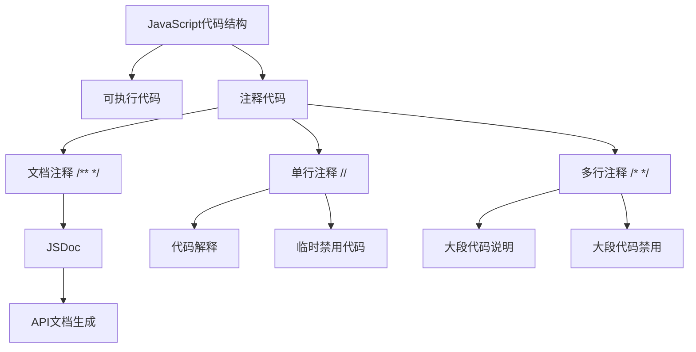

# JavaScript 注释

## 什么是JavaScript注释？

在编程中，注释是代码中被解释器或编译器忽略的文本。JavaScript注释是指在JavaScript代码中添加的、不会被执行但用于解释代码功能或提供信息的文本。注释对于代码的可读性、可维护性和团队协作至关重要。

:::tip
良好的注释习惯能够让你和其他开发者更容易理解和维护代码，即使在复杂的项目或经过很长时间后重新查看代码时也是如此。
:::

## JavaScript 中的注释类型

JavaScript支持两种类型的注释：单行注释和多行注释。

### 单行注释

单行注释以两个正斜杠（`//`）开始，一直延续到该行结束。

```javascript
// 这是一个单行注释
let name = "JavaScript"; // 这也是一个单行注释
```

### 多行注释

多行注释以正斜杠和星号（`/*`）开始，以星号和正斜杠（`*/`）结束。它可以跨越多行。

```javascript
/* 这是一个
   多行注释
   可以跨越多行 */
let age = 25;
```

## 注释的作用

JavaScript注释有以下几个重要作用：

### 1. 解释代码功能

注释可以用来解释代码的功能和目的，使其他开发者（或将来的自己）能够更容易理解代码的意图。

```javascript
// 计算两个数字的和并返回结果
function add(a, b) {
  return a + b;
}
```

### 2. 提供上下文信息

注释可以提供代码的上下文信息，如为什么这样实现、注意事项等。

```javascript
// 使用递归而不是循环来避免栈溢出
function factorial(n) {
  /* 注意：
     当n很大时，这个递归实现可能会导致栈溢出
     在生产环境中应考虑使用尾递归优化或迭代实现 */
  if (n <= 1) return 1;
  return n * factorial(n - 1);
}
```

### 3. 临时禁用代码

在开发过程中，我们经常需要暂时禁用某些代码段进行测试，注释是一种简单的方法。

```javascript
function test() {
  console.log("这行代码会执行");
  // console.log("这行代码被注释掉，不会执行");
  /*
  let unusedVariable = "这整段代码都不会执行";
  console.log(unusedVariable);
  */
}
```

### 4. 生成文档

特定格式的注释（如JSDoc格式）可以用于生成API文档。

```javascript
/**
 * 计算两个数字的和
 * @param {number} a - 第一个数字
 * @param {number} b - 第二个数字
 * @returns {number} 两数之和
 */
function add(a, b) {
  return a + b;
}
```

## 注释的最佳实践

为了写出有效的注释，以下是一些最佳实践：

### 1. 保持注释的相关性和及时更新

确保注释与代码保持同步。当代码更改时，记得更新相关注释，否则过时的注释可能会误导其他开发者。

### 2. 避免过度注释

不需要对每一行代码都进行注释，尤其是那些已经很明显的操作。

```javascript
// 不好的例子
// 将变量x的值增加1
x = x + 1;

// 好的例子（注释解释了"为什么"，而不是"做了什么"）
// 计数器递增，用于跟踪循环迭代次数
x = x + 1;
```

### 3. 使用清晰简洁的语言

注释应该清晰简洁，使用易于理解的语言。避免使用过于技术性的术语，除非在特定的技术环境中是必要的。

### 4. 使用专门的注释标记

在团队协作中，可以使用特定的标记来标识需要特别关注的注释：

```javascript
// TODO: 需要在未来实现这个功能
// FIXME: 这里有一个bug需要修复
// NOTE: 这是一个重要的注意事项
// HACK: 这是一个临时解决方案
```

## 实际应用场景

### 场景一：函数文档

```javascript
/**
 * 验证用户输入的电子邮件地址
 * @param {string} email - 要验证的电子邮件地址
 * @returns {boolean} 如果电子邮件格式有效则返回true，否则返回false
 */
function validateEmail(email) {
  // 使用正则表达式验证电子邮件格式
  const re = /\S+@\S+\.\S+/;
  return re.test(email);
}

// 使用示例
const isValid = validateEmail("user@example.com");
console.log(isValid); // 输出: true
```

### 场景二：复杂算法解释

```javascript
function mergeSort(arr) {
  // 基本情况：如果数组长度为1或更小，则已经排序
  if (arr.length <= 1) {
    return arr;
  }
  
  // 找到数组中间位置
  const middle = Math.floor(arr.length / 2);
  
  // 分别对左半部分和右半部分进行递归排序
  const left = mergeSort(arr.slice(0, middle));
  const right = mergeSort(arr.slice(middle));
  
  // 合并两个已排序的数组
  return merge(left, right);
}

/* 
 * 合并两个已排序的数组
 * 这个函数比较两个数组的元素并按顺序合并它们
 */
function merge(left, right) {
  let result = [];
  let leftIndex = 0;
  let rightIndex = 0;
  
  // 比较左右数组的元素，将较小的元素添加到结果中
  while (leftIndex < left.length && rightIndex < right.length) {
    if (left[leftIndex] < right[rightIndex]) {
      result.push(left[leftIndex]);
      leftIndex++;
    } else {
      result.push(right[rightIndex]);
      rightIndex++;
    }
  }
  
  // 将剩余元素添加到结果中
  return result
    .concat(left.slice(leftIndex))
    .concat(right.slice(rightIndex));
}
```

### 场景三：代码调试

```javascript
function calculateTotal(prices) {
  let total = 0;
  
  for (let i = 0; i < prices.length; i++) {
    // console.log(`处理价格: ${prices[i]}`); // 调试用，生产环境可注释掉
    total += prices[i];
  }
  
  // TODO: 添加税费计算
  
  return total;
}

const prices = [10.99, 5.99, 3.99, 8.99];
const total = calculateTotal(prices);
console.log(`总价为: ${total}`); // 输出: 总价为: 29.96
```

## JavaScript 注释与代码结构关系图



## 总结

JavaScript注释是编写清晰、可维护代码的重要组成部分。通过合理使用单行注释和多行注释，我们可以解释代码功能、提供上下文信息、临时禁用代码以及生成文档。记住遵循注释的最佳实践，如保持注释与代码同步、避免过度注释、使用清晰简洁的语言以及采用专门的注释标记。

良好的注释习惯不仅能帮助其他开发者理解你的代码，也能帮助将来的你更容易维护和修改代码。

## 练习

1. 为以下函数添加适当的注释：
   ```javascript
   function isPalindrome(str) {
     str = str.toLowerCase().replace(/[^a-z0-9]/g, '');
     return str === str.split('').reverse().join('');
   }
   ```

2. 在你的一个项目中，找出至少三处可以通过添加注释来提高可读性的地方。

3. 练习使用JSDoc格式为一个包含多个参数和返回值的复杂函数编写文档注释。

:::caution
记住，注释应该解释"为什么"代码以特定方式实现，而不仅仅是"做了什么"。好的代码应该是自解释的，而注释则提供额外的背景信息和上下文。
:::