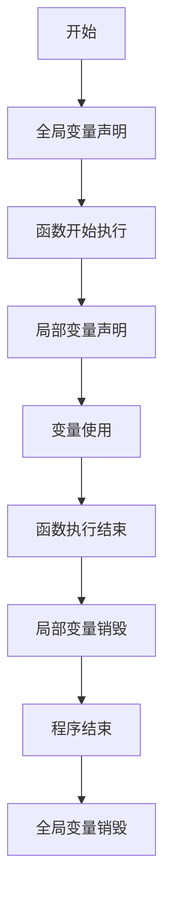

# JavaScript 变量

## 什么是变量？

变量是存储数据值的容器。在JavaScript中，变量就像是一个装有数据的盒子，我们可以随时往里面存入数据、取出数据或者修改数据。

变量是任何编程语言的基础组成部分，它让我们能够暂时存储信息，以便在程序执行过程中使用。

:::tip
想象一下，变量就像是贴了标签的容器，标签就是变量名，而容器里面装的就是变量的值。
:::

## 声明变量

在JavaScript中，有三种声明变量的方式：

1. 使用`var`（较旧的方式）
2. 使用`let`（ES6引入，推荐）
3. 使用`const`（ES6引入，用于常量）

### 使用var声明变量

```javascript
var userName = "小明";
var age = 18;
var isStudent = true;

console.log(userName); // 输出: 小明
```

### 使用let声明变量

```javascript
let userName = "小明";
let age = 18;
let isStudent = true;

console.log(age); // 输出: 18
```

### 使用const声明常量

```javascript
const PI = 3.14159;
const MAX_USERS = 100;

console.log(PI); // 输出: 3.14159
```

:::caution
使用`const`声明的变量不能被重新赋值，否则会报错。
:::

## 变量命名规则

JavaScript变量的命名有以下规则：

1. 变量名可以包含字母、数字、下划线(_)和美元符号($)
2. 变量名必须以字母、下划线或美元符号开头，不能以数字开头
3. 变量名区分大小写（`userName`和`username`是两个不同的变量）
4. 不能使用JavaScript的关键字作为变量名（如`var`、`let`、`const`、`function`等）

```javascript
// 有效的变量名
let userName = "小明";
let $price = 29.99;
let _counter = 0;
let firstName123 = "张";

// 无效的变量名
// let 123name = "错误";  // 不能以数字开头
// let var = "错误";      // 不能使用关键字
```

## 变量数据类型

JavaScript是一种动态类型语言，这意味着我们不需要在声明变量时指定类型。JavaScript中有几种基本的数据类型：

```javascript
// 数字类型
let age = 25;
let price = 99.99;

// 字符串类型
let name = "JavaScript编程";
let greeting = 'Hello World';

// 布尔类型
let isValid = true;
let hasPermission = false;

// 未定义类型
let unknownValue;
console.log(unknownValue); // 输出: undefined

// 空值
let emptyValue = null;

// 对象类型
let person = {
  name: "小明",
  age: 18
};

// 数组类型
let colors = ["red", "green", "blue"];
```

## 变量赋值

我们可以在声明变量时给它赋初始值，也可以先声明后赋值：

```javascript
// 声明并赋值
let count = 10;

// 先声明后赋值
let total;
total = 100;

// 修改变量值
count = 20;
console.log(count); // 输出: 20
```

## let vs var vs const

这三种声明变量的方式有一些重要的区别：

### 作用域

```javascript
// var的作用域是函数作用域
function testVar() {
  var x = 10;
  if (true) {
    var x = 20;  // 同一个变量
    console.log(x); // 输出: 20
  }
  console.log(x); // 输出: 20
}

// let和const的作用域是块作用域
function testLet() {
  let y = 10;
  if (true) {
    let y = 20;  // 不同的变量
    console.log(y); // 输出: 20
  }
  console.log(y); // 输出: 10
}
```

### 重复声明

```javascript
// var允许重复声明
var user = "小明";
var user = "小红"; // 有效，user被覆盖为"小红"

// let和const不允许在同一作用域内重复声明
let age = 25;
// let age = 30; // 错误：不能重新声明块作用域变量'age'
```

### 提升

```javascript
// var存在变量提升
console.log(x); // 输出: undefined (而不是报错)
var x = 5;

// let和const没有变量提升
// console.log(y); // 错误：在初始化之前不能访问'y'
let y = 10;
```

:::warning
推荐使用`let`和`const`而不是`var`，因为它们有更合理的作用域规则，能避免许多常见错误。
:::

## 实际应用案例

### 1. 用户注册表单

```javascript
// 保存用户输入的信息
const USERNAME_MIN_LENGTH = 3; // 常量，不会改变
let username = "coding123";
let email = "user@example.com";
let password = "securepass";
let isFormValid = false;

// 表单验证
if (username.length >= USERNAME_MIN_LENGTH) {
  isFormValid = true;
  console.log("用户名有效");
} else {
  console.log("用户名至少需要" + USERNAME_MIN_LENGTH + "个字符");
}
```

### 2. 购物车计算

```javascript
// 购物车项目
let item1Price = 99.99;
let item2Price = 149.99;
let quantity1 = 2;
let quantity2 = 1;

// 计算总价
let subtotal = (item1Price * quantity1) + (item2Price * quantity2);
const TAX_RATE = 0.08;
let taxAmount = subtotal * TAX_RATE;
let totalPrice = subtotal + taxAmount;

console.log("小计: ¥" + subtotal);
console.log("税额: ¥" + taxAmount);
console.log("总计: ¥" + totalPrice);
```

### 3. 计数器应用

```javascript
let count = 0;
const MAX_COUNT = 10;

// 模拟点击增加按钮
function increment() {
  if (count < MAX_COUNT) {
    count++;
    console.log("当前计数: " + count);
  } else {
    console.log("已达到最大计数!");
  }
}

// 模拟点击减少按钮
function decrement() {
  if (count > 0) {
    count--;
    console.log("当前计数: " + count);
  } else {
    console.log("已达最小计数!");
  }
}

// 测试
increment(); // 当前计数: 1
increment(); // 当前计数: 2
decrement(); // 当前计数: 1
```

## 变量的生命周期

变量的生命周期取决于它的作用域：



## 总结

变量是JavaScript编程的基本构建块。通过正确使用变量，我们可以：
- 存储和操作数据
- 跟踪应用状态
- 在不同代码部分之间共享信息

记住以下关键点：
1. 使用`let`声明可变变量，使用`const`声明常量
2. 遵循命名规范，使用有意义的变量名
3. 了解不同声明方式(`var`, `let`, `const`)的区别
4. 理解变量作用域对程序执行的影响

## 练习

为了巩固所学知识，尝试完成以下练习：

1. 声明三个变量：一个存储你的名字，一个存储你的年龄，一个存储你是否是学生（布尔值）。
2. 创建一个计算器程序，声明两个数字变量和一个运算符变量，然后根据运算符执行相应的计算。
3. 创建一个温度转换程序，声明一个摄氏温度变量，然后计算并输出对应的华氏温度。

## 延伸阅读

- [MDN Web Docs: JavaScript变量](https://developer.mozilla.org/zh-CN/docs/Web/JavaScript/Guide/Grammar_and_Types#%E5%8F%98%E9%87%8F)
- [JavaScript数据类型和数据结构](https://developer.mozilla.org/zh-CN/docs/Web/JavaScript/Data_structures)
- [JavaScript作用域和闭包](https://developer.mozilla.org/zh-CN/docs/Web/JavaScript/Closures)

掌握了变量的基础知识后，你就可以继续学习更复杂的JavaScript概念了！