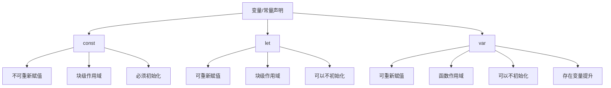

# JavaScript 常量

## 什么是常量？

在 JavaScript 中，常量是一种特殊类型的变量，其值一旦被设置后就不能再被改变或重新分配。常量提供了一种方式来声明那些在程序执行过程中不应该被修改的值，这有助于编写更安全、更可预测的代码。

## 声明常量

在 ES6（ECMAScript 2015）之前，JavaScript 并没有真正的常量概念。开发者通常使用全大写的变量名来表示某个值应该被视为常量，但这只是一种约定，并不能真正防止变量值被修改。

从 ES6 开始，我们可以使用 `const` 关键字来声明常量：

```javascript
const PI = 3.14159;
const MAX_USERS = 100;
const APP_NAME = "我的应用";
```

## 常量的特性

### 1. 声明时必须初始化

使用 `const` 声明常量时，必须同时对其进行初始化（赋值）：

```javascript
// 正确的做法
const API_KEY = "abc123";

// 错误的做法 - 没有初始化
// const DATABASE_URL;  // 这会产生语法错误
```

### 2. 不能重新赋值

一旦常量被声明并初始化，就不能给它重新赋值：

```javascript
const TAX_RATE = 0.08;

// 尝试重新赋值会导致错误
// TAX_RATE = 0.09;  // TypeError: Assignment to constant variable
```

### 3. 块级作用域

与使用 `let` 声明的变量一样，`const` 声明的常量具有块级作用域：

```javascript
if (true) {
  const MESSAGE = "这是块内的常量";
  console.log(MESSAGE);  // 输出: "这是块内的常量"
}

// console.log(MESSAGE);  // ReferenceError: MESSAGE is not defined
```

## 常量与对象

当使用 `const` 声明对象时，需要注意的是，常量的不可变性只适用于常量本身的引用，而不是引用的内容。这意味着：

- 不能重新为常量分配一个新对象
- 但可以修改对象的属性

看下面的例子：

```javascript
// 声明一个对象常量
const user = {
  name: "张三",
  age: 25
};

// 可以修改对象的属性
user.age = 26;
console.log(user);  // 输出: {name: "张三", age: 26}

// 但不能重新分配一个新对象
// user = {name: "李四", age: 30};  // TypeError: Assignment to constant variable
```

### 如何创建真正不可变的对象？

如果你想创建一个完全不可变的对象，可以使用 `Object.freeze()` 方法：

```javascript
const settings = Object.freeze({
  theme: "dark",
  fontSize: 16,
  notifications: true
});

// 尝试修改冻结对象的属性（在严格模式下会抛出错误，否则静默失败）
settings.theme = "light";
console.log(settings.theme);  // 输出: "dark"（修改没有生效）
```

:::caution
`Object.freeze()` 只是浅冻结，对于嵌套对象的属性，仍然可以修改。
:::

## 常量数组

与对象类似，常量数组的引用不能改变，但数组的内容可以修改：

```javascript
const colors = ["红", "绿", "蓝"];

// 可以修改数组元素
colors[0] = "黄";
console.log(colors);  // 输出: ["黄", "绿", "蓝"]

// 可以添加新元素
colors.push("紫");
console.log(colors);  // 输出: ["黄", "绿", "蓝", "紫"]

// 但不能重新分配一个新数组
// colors = ["黑", "白"];  // TypeError: Assignment to constant variable
```

## 常量的命名约定

在 JavaScript 中，常量通常使用全大写字母命名，多个单词之间用下划线分隔：

```javascript
const MAX_LOGIN_ATTEMPTS = 3;
const DEFAULT_SERVER_URL = "https://api.example.com";
const COLOR_PRIMARY = "#3498db";
```

## 实际应用场景

### 1. 配置值

常量适合用来存储应用程序的配置值：

```javascript
const API_BASE_URL = "https://api.myservice.com/v1";
const TIMEOUT_DURATION = 30000;  // 30秒
const MAX_FILE_SIZE = 5 * 1024 * 1024;  // 5MB
```

### 2. 数学常量

```javascript
const PI = 3.14159;
const GOLDEN_RATIO = 1.61803;

function calculateCircleArea(radius) {
  return PI * radius * radius;
}

console.log(calculateCircleArea(5));  // 输出: 78.53975
```

### 3. 应用程序状态

```javascript
const STATUS = {
  PENDING: 'pending',
  SUCCESS: 'success',
  ERROR: 'error',
  LOADING: 'loading'
};

function updateUIBasedOnStatus(currentStatus) {
  switch (currentStatus) {
    case STATUS.LOADING:
      console.log("显示加载动画");
      break;
    case STATUS.SUCCESS:
      console.log("显示成功消息");
      break;
    case STATUS.ERROR:
      console.log("显示错误提示");
      break;
    default:
      console.log("等待操作");
  }
}

updateUIBasedOnStatus(STATUS.LOADING);  // 输出: "显示加载动画"
```

## `const` vs `let` vs `var`

让我们比较一下 JavaScript 中三种声明变量/常量的方式：



## 何时使用常量？

以下情况应该考虑使用常量：

1. 当值在程序执行期间不应该改变时
2. 对于配置值和设置
3. 对于魔术数字（在代码中直接使用的数字字面量）
4. 对于需要在多处使用的固定值

:::tip
养成使用 `const` 作为默认声明方式的习惯，只有当你确定需要重新赋值时才使用 `let`。这有助于减少代码中的错误。
:::

## 总结

常量是 JavaScript 中的一个重要概念，它提供了一种方式来声明那些在程序执行过程中不应该被修改的值。通过使用 `const` 关键字，我们可以创建不能被重新赋值的变量，这有助于编写更安全、更可维护的代码。

记住，对于常量对象和数组，虽然不能改变引用，但可以修改其内容。如果需要创建完全不可变的对象，可以使用 `Object.freeze()`。

## 练习

1. 创建一个名为 `TAX_RATES` 的常量对象，包含不同税率类型及其值。
2. 编写一个函数，使用常量定义一周中的天数，并根据输入的数字（1-7）返回对应的星期几。
3. 尝试创建一个嵌套对象的常量，并使用 `Object.freeze()` 使其完全不可变。
4. 比较使用 `var`、`let` 和 `const` 声明相同变量时的行为差异。

## 进一步阅读

- [MDN Web Docs: const](https://developer.mozilla.org/zh-CN/docs/Web/JavaScript/Reference/Statements/const)
- [MDN Web Docs: Object.freeze()](https://developer.mozilla.org/zh-CN/docs/Web/JavaScript/Reference/Global_Objects/Object/freeze)