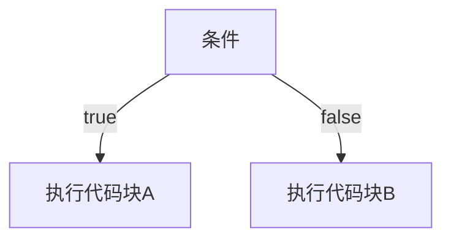

# JavaScript 条件语句

在编程中，我们经常需要根据不同的条件执行不同的代码。JavaScript提供了多种条件语句，让我们能够实现这种逻辑控制。本文将全面介绍JavaScript中的条件语句，帮助你理解如何在代码中做出决策。

## 什么是条件语句？

条件语句允许我们基于特定条件的真假（布尔值）来执行不同的代码块。简单来说，它们是帮助程序"做决定"的工具。



## if 语句

`if` 语句是最基本的条件语句，它的结构如下：

```javascript
if (条件) {
    // 如果条件为真，执行这里的代码
}
```

### 基本示例

```javascript
let hour = 10;

if (hour < 12) {
    console.log("早上好！");
}

// 输出: 早上好！
```

在这个例子中，因为 `hour < 12` 的条件为真（10小于12），所以执行了大括号中的代码，输出了"早上好！"。

## if...else 语句

当我们需要在条件为假时执行另一段代码，可以使用 `if...else` 语句：

```javascript
if (条件) {
    // 如果条件为真，执行这里的代码
} else {
    // 如果条件为假，执行这里的代码
}
```

### 示例

```javascript
let hour = 14;

if (hour < 12) {
    console.log("早上好！");
} else {
    console.log("下午好！");
}

// 输出: 下午好！
```

在这个例子中，因为 `hour < 12` 的条件为假（14不小于12），所以执行了 `else` 代码块中的代码，输出"下午好！"。

## if...else if...else 语句

当我们需要检查多个条件时，可以使用 `if...else if...else` 语句链：

```javascript
if (条件1) {
    // 如果条件1为真，执行这里的代码
} else if (条件2) {
    // 如果条件2为真，执行这里的代码
} else {
    // 如果以上条件都为假，执行这里的代码
}
```

### 示例

```javascript
let hour = 19;

if (hour < 12) {
    console.log("早上好！");
} else if (hour < 18) {
    console.log("下午好！");
} else {
    console.log("晚上好！");
}

// 输出: 晚上好！
```

在这个例子中，系统先检查 `hour < 12`，这是假的；然后检查 `hour < 18`，这也是假的；最后执行 `else` 代码块，输出"晚上好！"。

:::tip
你可以根据需要添加任意数量的 `else if` 代码块，但请记住，过多的条件判断会影响代码的可读性和性能。
:::

## 逻辑运算符与条件语句

在条件语句中，我们经常使用逻辑运算符来组合或修改条件：

- `&&` (与): 两个条件都为真时，结果为真
- `||` (或): 至少有一个条件为真时，结果为真
- `!` (非): 反转条件的真假值

### 示例

```javascript
let age = 25;
let hasLicense = true;

if (age >= 18 && hasLicense) {
    console.log("你可以开车");
}

// 输出: 你可以开车

let isHoliday = false;
let isWeekend = true;

if (isHoliday || isWeekend) {
    console.log("你不用上班");
}

// 输出: 你不用上班

let isRaining = false;

if (!isRaining) {
    console.log("你不需要雨伞");
}

// 输出: 你不需要雨伞
```

## 三元运算符

三元运算符是 `if...else` 语句的简写形式，常用于简单的条件赋值：

```javascript
条件 ? 表达式1 : 表达式2
```

如果条件为真，则返回表达式1的值，否则返回表达式2的值。

### 示例

```javascript
let age = 20;
let status = age >= 18 ? '成年人' : '未成年人';
console.log(status);  // 输出: 成年人
```

这里，因为 `age >= 18` 为真，所以 `status` 被赋值为 '成年人'。

:::caution
虽然三元运算符可以使代码更简洁，但嵌套使用多个三元运算符可能导致代码难以理解，应谨慎使用。
:::

## switch 语句

当有多个可能的条件值时，使用 `switch` 语句通常比使用多个 `if...else if` 语句更清晰：

```javascript
switch (表达式) {
    case 值1:
        // 当表达式的值等于值1时执行的代码
        break;
    case 值2:
        // 当表达式的值等于值2时执行的代码
        break;
    default:
        // 当表达式的值与以上值都不匹配时执行的代码
}
```

### 示例

```javascript
let day = 3;
let dayName;

switch (day) {
    case 1:
        dayName = "星期一";
        break;
    case 2:
        dayName = "星期二";
        break;
    case 3:
        dayName = "星期三";
        break;
    case 4:
        dayName = "星期四";
        break;
    case 5:
        dayName = "星期五";
        break;
    case 6:
        dayName = "星期六";
        break;
    case 0:
        dayName = "星期日";
        break;
    default:
        dayName = "无效的日期";
}

console.log(dayName);  // 输出: 星期三
```

:::note
`break` 语句非常重要！如果省略，代码将继续执行下一个 `case` 中的代码，这通常不是我们想要的结果。这种特性称为"fall-through"。
:::

### 多个 case 共用一个代码块

在某些情况下，你可能希望多个值执行相同的代码，这时可以将它们合并：

```javascript
let day = 6;
let type;

switch (day) {
    case 0:
    case 6:
        type = "周末";
        break;
    case 1:
    case 2:
    case 3:
    case 4:
    case 5:
        type = "工作日";
        break;
    default:
        type = "无效日期";
}

console.log(type);  // 输出: 周末
```

## 实际应用场景

### 场景一：用户验证

以下是一个简单的用户登录验证系统：

```javascript
function validateLogin(username, password) {
    const correctUsername = "admin";
    const correctPassword = "12345";
    
    if (username === "" || password === "") {
        return "用户名和密码不能为空";
    } else if (username !== correctUsername) {
        return "用户名不正确";
    } else if (password !== correctPassword) {
        return "密码不正确";
    } else {
        return "登录成功";
    }
}

console.log(validateLogin("admin", "12345")); // 输出: 登录成功
console.log(validateLogin("", "12345"));     // 输出: 用户名和密码不能为空
console.log(validateLogin("admin", "wrong")); // 输出: 密码不正确
```

### 场景二：电商折扣计算

使用条件语句计算购物折扣：

```javascript
function calculateDiscount(totalAmount, customerType, isHoliday) {
    let discount = 0;
    
    switch(customerType) {
        case "vip":
            discount = 0.2; // VIP客户享受20%折扣
            break;
        case "regular":
            discount = 0.1; // 常规客户享受10%折扣
            break;
        default:
            discount = 0.05; // 新客户享受5%折扣
    }
    
    // 如果是假日，所有折扣减半
    if (isHoliday) {
        discount = discount / 2;
    }
    
    // 如果购物金额超过1000，额外增加5%折扣
    if (totalAmount > 1000) {
        discount += 0.05;
    }
    
    return totalAmount * (1 - discount);
}

let finalPrice = calculateDiscount(1200, "vip", false);
console.log(`最终价格: $${finalPrice}`); // 输出: 最终价格: $900
```

### 场景三：简单计算器

使用 `switch` 语句实现简单计算器：

```javascript
function calculate(num1, operator, num2) {
    let result;
    
    switch(operator) {
        case '+':
            result = num1 + num2;
            break;
        case '-':
            result = num1 - num2;
            break;
        case '*':
            result = num1 * num2;
            break;
        case '/':
            if (num2 === 0) {
                return "错误：除数不能为零";
            }
            result = num1 / num2;
            break;
        default:
            return "错误：无效的运算符";
    }
    
    return `${num1} ${operator} ${num2} = ${result}`;
}

console.log(calculate(10, '+', 5));  // 输出: 10 + 5 = 15
console.log(calculate(10, '-', 5));  // 输出: 10 - 5 = 5
console.log(calculate(10, '*', 5));  // 输出: 10 * 5 = 50
console.log(calculate(10, '/', 0));  // 输出: 错误：除数不能为零
```

## 总结

条件语句是JavaScript编程的基础，它们允许我们根据不同的条件执行不同的代码，实现程序的逻辑控制。在本文中，我们学习了：

1. `if`, `if...else` 和 `if...else if...else` 语句的基本用法
2. 逻辑运算符在条件语句中的应用
3. 三元运算符作为简写形式的条件语句
4. `switch` 语句及其在多条件判断中的优势
5. 条件语句在实际应用场景中的使用方法

掌握这些条件语句，你就能编写更复杂、更智能的JavaScript程序了！

## 练习

为了巩固所学知识，尝试完成以下练习：

1. 编写一个函数，根据学生的分数（0-100）返回对应的等级（A：90-100，B：80-89，C：70-79，D：60-69，F：0-59）。
2. 创建一个简单的天气建议程序，根据温度和天气情况（晴天、下雨、下雪等）给出穿衣建议。
3. 实现一个函数，判断给定年份是否为闰年（闰年规则：能被4整除但不能被100整除，或者能被400整除）。

:::tip
当你解决这些练习时，尝试使用不同类型的条件语句，并思考哪种方式最适合特定的问题。
:::

## 进一步学习资源

- [MDN Web Docs: if...else](https://developer.mozilla.org/zh-CN/docs/Web/JavaScript/Reference/Statements/if...else)
- [MDN Web Docs: switch](https://developer.mozilla.org/zh-CN/docs/Web/JavaScript/Reference/Statements/switch)
- [JavaScript.info: 条件分支](https://zh.javascript.info/ifelse)

掌握条件语句后，你可以继续学习循环语句，它们是JavaScript控制流的另一个重要部分。